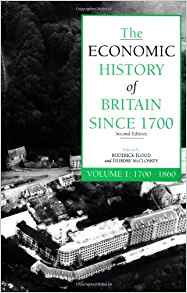
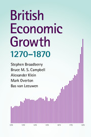
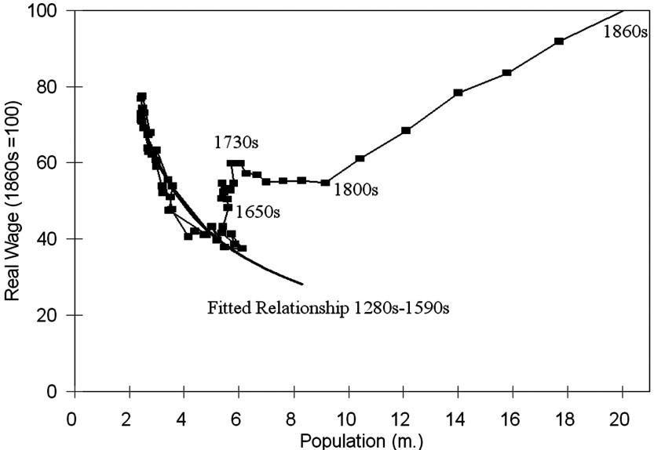
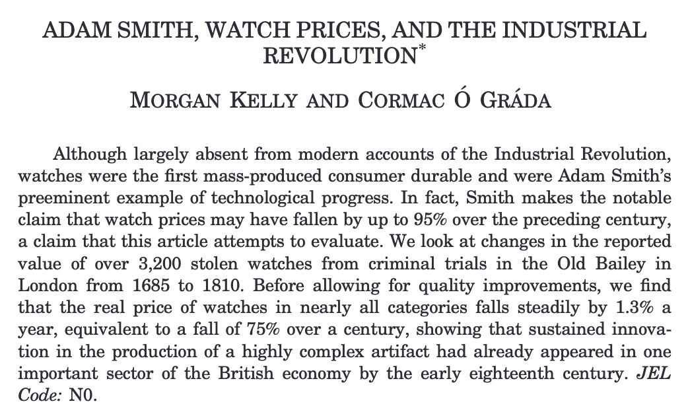
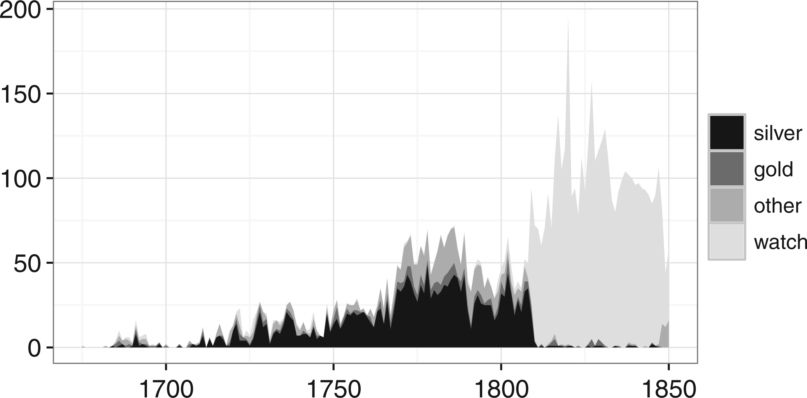
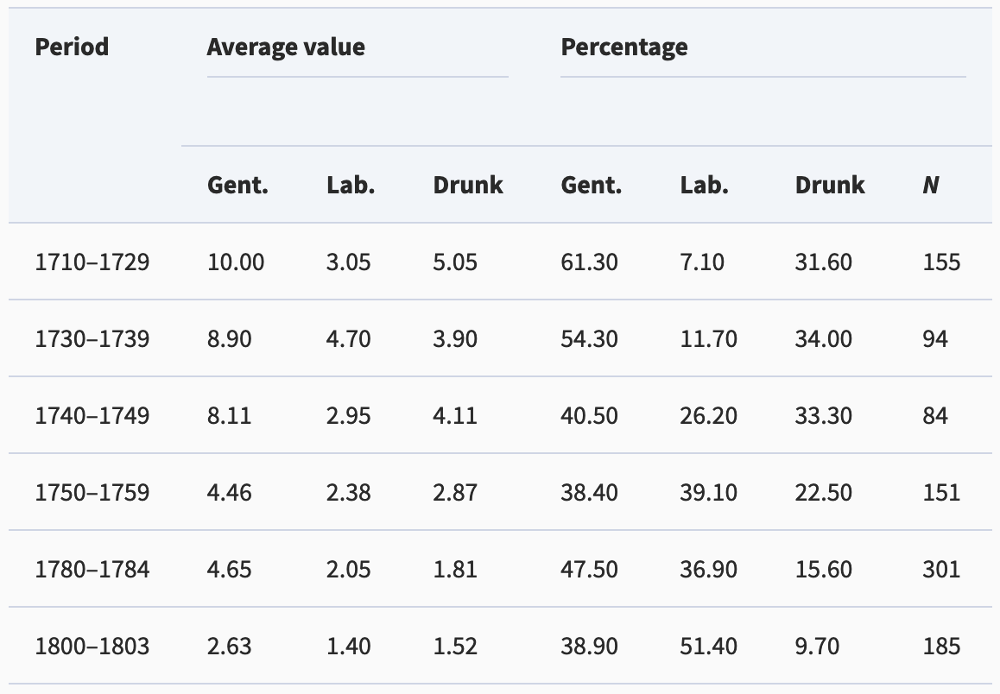
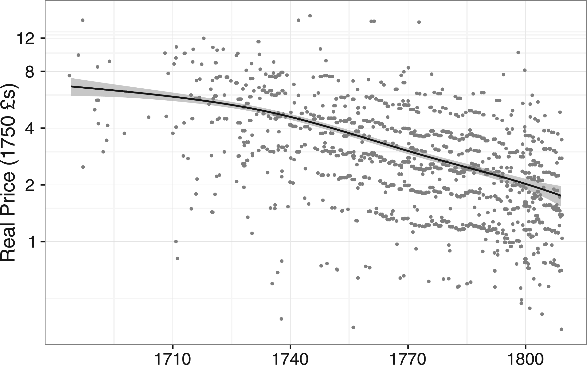
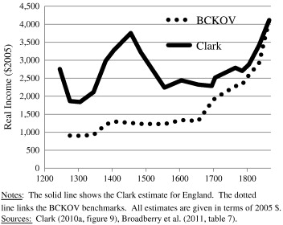

```{r}
source("helper_functions/theme_lecture.R")

```

# Outline

## Today's goals

:::{.smaller}
-   Some preliminary remarks on how classes will work
-   What this course will cover
-   How you will be assessed
-   Part I
    -   A quantitative overview of British economic history
    -   A critical look at GDP
-   Part II
    -   A consideration on the rise in population
    -   Productivity: a worked example
    
:::

## Preliminaries

:::: {.columns}
::: {.column width="50%"}
:::{.r-fit-text}
I want you to...

-   Do the reading
-   Talk!
    -   Active learning is much more effective
-   Engage with numerical evidence

You should take from this...

-   An overview of British economic development, but also...
-   Highly transferable analytic skills!
:::
:::

::: {.column width="50%"}
:::{.r-fit-text}
> "The most basic principle that every teacher should know about teaching ... is that **the brain learns the thinking it practices, but little else**. To have students learn to recognize relevant features and make relevant decisions more like an expert in the field, they must practice doing exactly this." [@wieman2019]

-   I will cold-call
    -   But you can reply that you don't have anything to add!
-   I will try not to lecture excessively
-   I would like you to talk to each other
:::
:::
::::

## Useful references

::::: columns
::: {.column width="50%"}

:::

::: {.column width="50%"}

:::
:::::


## Assessed work

::::{.columns}

:::{.column width="50%" .r-fit-text}
-   An in-class group presentation (25%)
    -   Presentations will occur in the last 6 weeks of semester 1
    -   15-18 minutes followed by Q&A
    -   All members of group must speak
    -   I will allocate groups at the end of week 2
:::

::: {.column width="50%" .r-fit-text}
-   Exam: 75%
    -   Past exams are available on the Keat's page
    -   In person and **written by hand**
-   I will dedicate class time to discussing assignments
:::

::::

# Part I

---

```{r gdp_pc, fig.align='center', fig.retina=3, fig.width=7, fig.height=5, out.width="85%"}
library(tidyverse)
library(readxl)

real_gdp_eng <- read_xlsx(path = "data/a-millennium-of-macroeconomic-data-for-the-uk.xlsx", 
                      sheet = "A21. GDP per capita 1086+", 
                      range = "A5:K859")

names(real_gdp_eng)[1] <- "Year"

real_gdp_eng %>% 
  filter(Year > 1270) %>% 
  ggplot(aes(Year, `Real GDP per capita`)) +
  #geom_point() + 
  geom_line() +
  scale_x_continuous(breaks = seq(1300, 1900, 50)) +
  ggtitle("English Real GDP per capita, 1270-1939", 
          subtitle = "Source: Broadberry et. al. (2015) & Bank of England") +
  ylab("Real GDP per capita") + 
  theme_minimal() 

```

---

```{r gdp_pc_ir, fig.align='center', fig.retina=3, fig.width=7, fig.height=5, out.width="85%"}

real_gdp_eng %>% 
  filter(Year > 1270) %>% 
  ggplot(aes(Year, `Real GDP per capita`)) +
  #geom_point() + 
  geom_line() +
  scale_x_continuous(breaks = seq(1300, 1900, 50)) +
  ggtitle("English Real GDP per capita, 1270-1939", 
          subtitle = "Source: Broadberry et. al. (2015) & Bank of England") +
  ylab("Real GDP per capita") + 
  annotate("rect", xmin=1760, xmax=1820, 
           ymin=500, ymax=6000, fill="coral",
           alpha=.3) +
  annotate("text", x=1670, y=5500, 
           label="Industrial revolution?", color="coral") +
  theme_minimal() 

```

---

```{r, gdp_pc_ag_transition, fig.align='center', fig.retina=3, fig.width=7, fig.height=5, out.width="85%"}
real_gdp_eng %>% 
  filter(Year > 1270) %>% 
  ggplot(aes(Year, `Real GDP per capita`)) +
  #geom_point() + 
  geom_line() +
  scale_x_continuous(breaks = seq(1300, 1900, 50)) +
  ggtitle("English Real GDP per capita, 1270-1939", 
          subtitle = "Source: Broadberry et. al. (2015) & Bank of England") +
  ylab("Real GDP per capita") + 
  annotate("rect", xmin=1760, xmax=1820, 
           ymin=500, ymax=6000, fill="coral",
           alpha=.3) +
  annotate("text", x=1670, y=5500, 
           label="Industrial revolution?", color="coral") +
  annotate("rect", xmin = 1600, xmax=1850, ymin=500, ymax = 4000, 
           fill = 'steelblue', alpha = .3) +
  annotate("text", x=1500, y=4000, 
           label = "Agricultural revolution?", color="steelblue") +
  theme_minimal() 
```

---

```{r, gdp_pc_institutions, fig.align='center', fig.retina=3, fig.width=7, fig.height=5, out.width="85%"}
real_gdp_eng %>% 
  filter(Year > 1270) %>% 
  ggplot(aes(Year, `Real GDP per capita`)) +
  #geom_point() + 
  geom_line() +
  scale_x_continuous(breaks = seq(1300, 1900, 50)) +
  ggtitle("English Real GDP per capita, 1270-1939", 
          subtitle = "Source: Broadberry et. al. (2015) & Bank of England") +
  ylab("Real GDP per capita") + 
  annotate("rect", xmin=1760, xmax=1820, 
           ymin=500, ymax=6000, fill="coral",
           alpha=.3) +
  annotate("text", x=1670, y=5500, 
           label="Industrial revolution?", color="coral") +
  annotate("rect", xmin = 1600, xmax=1850, ymin=500, ymax = 4000, 
           fill = 'steelblue', alpha = .3) +
  annotate("text", x=1500, y=4000, 
           label = "Agricultural revolution?", color="steelblue") +
  annotate("segment", x=1400, xend = 1688, y=2900, 
           yend = real_gdp_eng$`Real GDP per capita`[real_gdp_eng$Year==1688]) +
  annotate("text", x=1400, y=3200, 
           label = "Institutional/Fiscal/\nFinancial revolution?") +
  theme_minimal() 
```

---

```{r, gdp_pc_industrious, fig.align='center', fig.retina=3, fig.width=7, fig.height=5, out.width="85%"}
real_gdp_eng %>% 
  filter(Year > 1270) %>% 
  ggplot(aes(Year, `Real GDP per capita`)) +
  #geom_point() + 
  geom_line() +
  scale_x_continuous(breaks = seq(1300, 1900, 50)) +
  ggtitle("English Real GDP per capita, 1270-1939", 
          subtitle = "Source: Broadberry et. al. (2015) & Bank of England") +
  ylab("Real GDP per capita") + 
  annotate("rect", xmin=1760, xmax=1820, 
           ymin=500, ymax=6000, fill="coral",
           alpha=.3) +
  annotate("text", x=1670, y=5500, 
           label="Industrial revolution?", color="coral") +
  annotate("rect", xmin = 1600, xmax=1850, ymin=500, ymax = 4000, 
           fill = 'steelblue', alpha = .3) +
  annotate("text", x=1500, y=4000, 
           label = "Agricultural revolution?", color="steelblue") +
  annotate("segment", x=1400, xend = 1688, y=2900, 
           yend = real_gdp_eng$`Real GDP per capita`[real_gdp_eng$Year==1688]) +
  annotate("text", x=1400, y=3200, 
           label = "Institutional/Fiscal/\nFinancial revolution?") +
  annotate("segment", x=1475, xend = 1750, y=1800, 
           yend = real_gdp_eng$`Real GDP per capita`[real_gdp_eng$Year==1750]) +
  annotate("text", x=1350, y=1800, 
           label = "Industrious revolution?") +
  theme_minimal() 
```

## Tantamount to asking what caused the industrial revolution

:::{.r-fit-text}
-   An enormous number of theories -- we will survey many but not all!
    -   institutional innovation -\> functional credit/property markets [@north1989]
    -   external trading markets [@findlay2005; @inikori1987]
        -   Slavery & IR sub-debate: for recent reviews see [@oakes2016; @wright2019]
    -   Colonies [@pomeranz2002]
    -   Easy availability of coal/energy supplies [@pomeranz2009; @wrigley2010]
    -   (Relatively) highly educated workforce [@kelly2014; @mokyr2012]
    -   Science/technology [@mokyr2005; @mokyr2012; @landes1998]
    -   (Relatively) highly paid workforce [@allen2009]
    -   Others
:::

---

```{r, comparative_perspective, fig.align='center', fig.retina=3, fig.width=7, fig.height=5, out.width="85%"}
library(ggrepel)

maddison <- read_xlsx(path = "data/mpd2018.xlsx", 
                      sheet = "Full data")

plotdf <- maddison %>% filter(year <= 1851, 
                    year > 1700, 
                    countrycode %in% c("GBR", "FRA", 
                                       "NLD", "AUT", 
                                       "DEU", "CHN",
                                       "IND", "JPN"),
                    !is.na(cgdppc))

plotdf %>% 
  ggplot(aes(year, cgdppc, 
             group = countrycode,
             color=countrycode)) +
  ggtitle("British GDP per capita in a global mirror", 
          subtitle = "Source: Maddison project") +
  geom_line() +
  geom_point() +
  geom_label_repel(data = plotdf %>%
              group_by(countrycode) %>% 
              filter(year == last(year)) %>% 
              ungroup(), 
            aes(label = country, x = year, y=cgdppc, color=countrycode),
            nudge_x = 15) +
  xlim(c(1700,1900)) +
  guides(color = FALSE) +
  scale_color_brewer(type = "qual", palette = 2) +
  ylab("Chained GDP per capita") +
  xlab("") +
  theme_minimal()

```

---

```{r, climacteric, fig.align='center', fig.retina=3, fig.width=7, fig.height=5, out.width="85%"}

plotdf <- maddison %>% filter(year >= 1800, 
                    year <= 1940, 
                    countrycode %in% c("GBR", "FRA",
                                       "DEU", "USA"),
                    !is.na(cgdppc))

plotdf %>% 
  ggplot(aes(year, cgdppc, 
             group = countrycode,
             color=countrycode)) +
  ggtitle("British GDP per capita in a global mirror", 
          subtitle = "Source: Maddison project") +
  geom_line() +
  geom_point() +
  geom_label_repel(data = plotdf %>%
              group_by(countrycode) %>% 
              filter(year == last(year)) %>% 
              ungroup(), 
            aes(label = country, x = year, y=cgdppc, color=countrycode)) +
  guides(color = FALSE) +
  scale_color_brewer(type = "qual", palette = 2) +
  ylab("Chained GDP per capita") +
  xlab("") +
  theme_minimal()

```

## Historical national accounts

-   Historical national income accounting -- attempts to measure GDP [@broadberry2012]
    -   Is GDP a good measure of anything?
    -   Alternatives (HDI)?
    -   What is the 'average' person?

## Reconstructing British national accounts

```{r, broadberry_et_al, fig.align='center', out.width="30%"}

```

## How the sausage gets made: GDP

:::{.smaller}
Three ways to measure GDP:

\begin{align}
  GDP_{Income} &= \begin{aligned}[t]
         &(\text{wages} \times \text{days}) + (\text{return} \times \text{capital}) \\
         &+ (\text{rent} \times \text{land})
       \end{aligned} \\
  GDP_{Expenditure} &= \begin{aligned}[t]
         &\text{consumption} + \text{investment} + \text{govt. spending} \\
         &+ \text{net exports}
       \end{aligned} \\
  GDP_{Output} &= \begin{aligned}[t]
         &\text{ag. value added} + \text{ind. value added} \\
         &+ \text{serv. value added}
       \end{aligned}
\end{align}

@broadberry2012 attempt the *output* approach.
:::

## How the sausage gets made: GDP

:::{.r-fit-text}
-   How hard is output based estimation?
-   To compute output just for agriculture:
    1.  estimate amount of land under different ag. uses
    2.  derive trends in cropped areas
    3.  and trends in crop yields
    4.  derive livestock numbers
    5.  and livestock yields
    6.  aggregate these numbers from farms weighted by spatial area
    7.  convert total outputs to value added using prices and knowledge of cost structure
    8.  convert to real prices
-   Incredibly difficult and incredibly imprecise undertaking!
:::

## How the sausage gets made: GDP

:::{.r-fit-text}
-   Why do it this way?
    -   Existing wage series [@clark2005] did not seem to match other historical evidence! [@broadberry2012]
    -   Macro/micro ways of approaching the problem are in dialogue


### Is sausage healthy?

-   Do we want national accounts? Are they helpful?
    -   GDP during the actual period of the industrial revolution does not seem to move
    -   National accounts can give the illusion of stasis
-   By 1820 only 35% of Brits work in agriculture whereas 60-80% on the continent do:
    -   A big shift in *what* people are doing
:::

---

```{r, ag_share, fig.align='center', fig.retina=3, fig.width=7, fig.height=5, out.width="85%"}
library(ggalt)
ag_share <- tibble(year = c(1780, 1820, 1870, 1913),
                   ag_share = c(45, 35, 22.7, 11.8))

ag_share %>% 
  ggplot(aes(as.factor(year), ag_share, label = paste0(ag_share, "%"))) +
  geom_lollipop(point.colour = "coral", 
                point.size = 5, ) +
  geom_text(nudge_y = 3) +
  ylab("Percent of Workforce in Agriculture") +
  xlab("Date") +
  ggtitle("Changing How People Worked", 
          subtitle = "Agricultural Employment in England, 1780-1913") +
  labs(caption = "Source: Crafts 1998, pp. 195") +
  theme_minimal()
  
```

# Part II

## Overcoming 'Organic'/Malthusian constraints

::::{.columns}

:::{.column width="30%"}
:::{.r-fit-text}
-   Ricardo describes diminishing *marginal* returns from land [@wrigley2004]
    -   What does *marginal* mean?
:::
:::

::: {.column width="70%"}
```{r dimmarg, fig.retina=3, fig.align="center", out.width="100%"}
Input <- 1:100
Output <- Input^.5

df <- tibble(Input, Output)

df %>% 
  ggplot(aes(Input, Output)) + 
  geom_line() +
  geom_segment(aes(x = 25, xend = 100, y = 5, yend = 5), color = "steelblue") + 
  annotate(geom = "text", y = 4.5, x = 75, 
           label = "4 x Input", color = "steelblue") +
  geom_segment(aes(x = 100, xend = 100, y = 5, yend = 10), color = "tomato") +
  annotate(geom = "text", y = 8, x = 90, 
           label = "2 x Output", color = "tomato") +
  ggtitle("Example of Diminishing Marginal Returns") + 
  theme_minimal()
```

**And yet population grows!**
:::
::::

---

```{r population, fig.align='center', fig.retina=3, fig.width=7, fig.height=5, out.width="85%"}
real_gdp_eng %>% 
  #filter(Year > 1700) %>% 
  ggplot(aes(Year, Population)) +
  #geom_point() + 
  geom_line() +
  ggtitle("English population, 1086-1939", 
          subtitle = "Source: Broadberry et. al. (2015) & Bank of England") +
  ylab("population") + 
  scale_x_continuous(breaks = seq(1000, 1940, 100)) +
  annotate('rect', xmin=1325, xmax=1375, ymin=1.5, ymax=7.5, 
           color='black', fill='grey', alpha=.3) +
  annotate('text', x=1250, y=8.5, label='Black Death') +
  annotate("rect", xmin=1450, xmax = 1800, ymin = .5, ymax = 10, 
           fill = "coral", color="black", alpha=.3) +
  annotate('text', x=1600, y=11.5, label='Escape from Malthus?', color="coral") +
  theme_minimal() 

```

## Overcoming 'Organic'/Malthusian constraints



## What accounts for the jump in growth? Productivity

:::{.r-fit-text}
-   *Productivity*: doing more with what you have
-   This does not resolve the problem, merely pushes it back (where does productivity come from?)
-   If you know:
    -   Change in prices of a good
    -   Change in price index
    -   Change in price of inputs
-   You can compute change in productivity [@mccloskey1994]
    -   actually need to additionally assume markups don't change a lot
:::

## Productivity: the evidence from prices

> "The diminution of price has . . . been most remarkable in those manufactures of which the materials are the coarse metals. A better movement of a watch, that about the middle of the last century could have been bought for twenty pounds, may now perhaps be had for twenty shillings." <br> —Adam Smith (1976 , bk. 1, ch. 11, pt. 3) @kelly2016 )

## Productivity: the example from watches

```{r, kelly_ograda_frontpiece, fig.align='center', out.width='70%'}

```

## Productivity: the example from watches

```{r, old_bailey_data, fig.align='center', out.width="85%"}

```

## Productivity: the example from watches

```{r, watch_victims, fig.align='center', out.width="65%"}

```

## Productivity: the example from watches

```{r, watch_prices, fig.align='center', out.width="75%"}

```

## Productivity: the example from watches

-   Average real price in 1710: £6
-   Average real price in 1809: £2
-   Average fall in price: approx. -1.3% per year
    -   Wages were roughly unchanged
    -   adjusting for quality changes productivity gains of roughly 2% a year.

## Division of labor

:::{.r-fit-text}
-   In a mid-eighteenth-century description of London trades, Campbell (1747 , p. 250) described how watches “at their first appearance . . . were began and ended by one man who was called a watchmaker” but “of late years the watchmaker . . . scarce makes anything belonging to a watch. He only deploys the different tradesmen among who the art is divided.” @kelly2016

-   “...if the Demand of Watches shou’d become so very great as to find constant imployment for as many Persons . . . the Maker of the Pins, or Wheels, or Screws, or other Parts, must needs be more perfect and expeditious at his proper work, . . . than if he is also to be imploy’d in all the variety of a Watch.” @kelly2016
:::

# Appendix

---

name: clarkvbroadberry




## Works Cited

