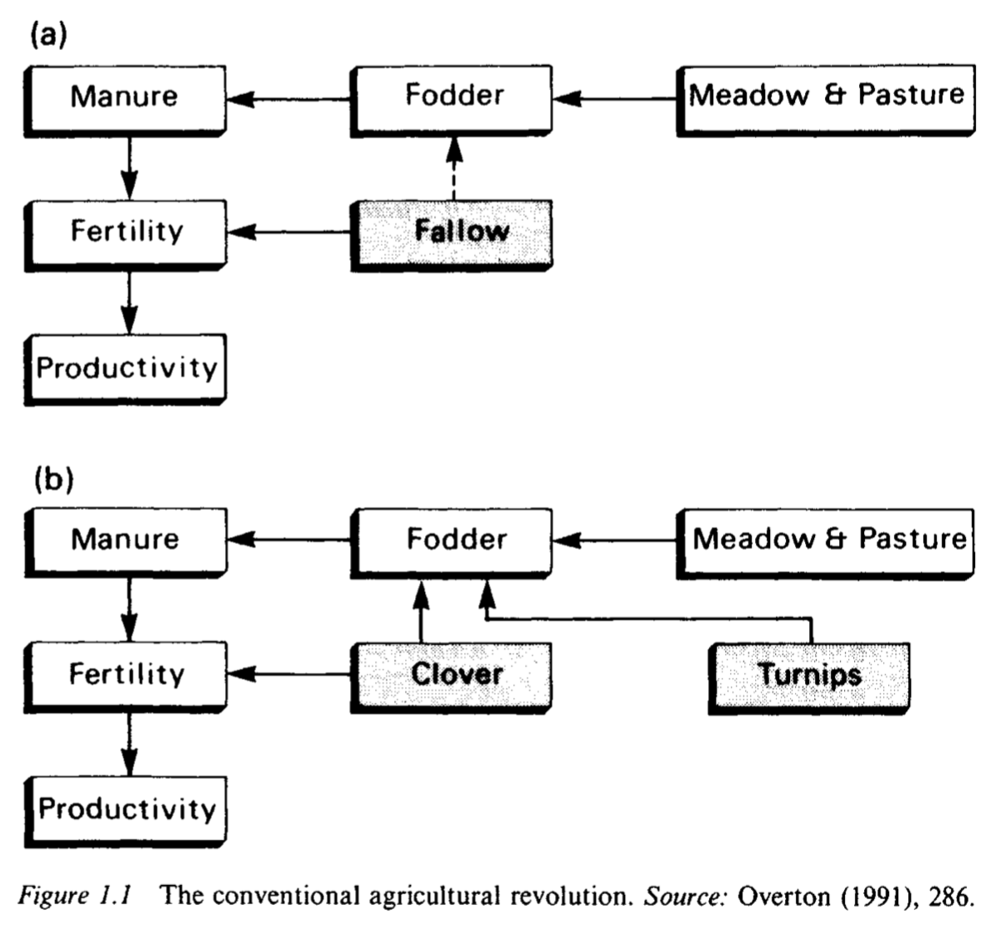
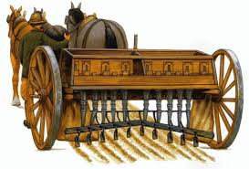
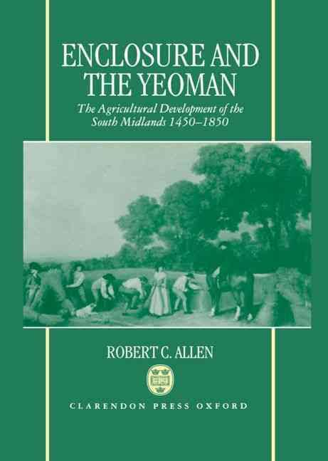
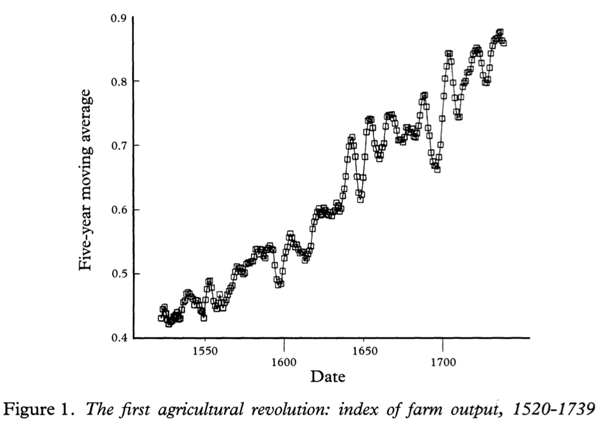
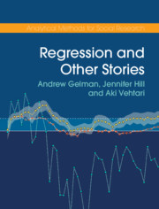
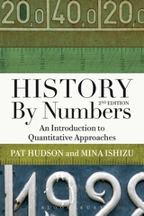

```{r setup, include=FALSE}
knitr::opts_chunk$set(echo = FALSE, warning = FALSE,
                      message = FALSE, fig.align='center', fig.retina=3,
                      out.width="75%")

library(RefManageR)
BibOptions(check.entries = FALSE, 
           bib.style = "authoryear", 
           style = "markdown",
           dashed = TRUE, hyperlink = FALSE)
source("helper_functions/helper_print_bib.R")
bib <- ReadBib("pres.bib")
```

```{r xaringan-themer, include = FALSE}
library(xaringanthemer)
style_solarized_light()
source("helper_functions/theme_lecture.R")
xaringanExtra::use_webcam()
xaringanExtra::use_tile_view()
```

# Outline

### Part 1. Feeding Britain: an overview

### Part 2. The agricultural revolution

### Part 3. Enclosure: a closer look

### Part 4: Preview of next week: reading regressions

---

class: inverse, center, middle

# Part I: Feeding Britain: an overview

---

## A growth-accounting framework

+ Agricultural output is the result of combining
    - Land
    - Labor
    - Capital
+ Productivity is how *well* you combine them
+ Measuring inputs is a good starting point since productivity is poorly understood

---

.pull-left40[
## Feeding Britain: an overview

+ Source: `r AutoCite(bib["kellyNumerareEstErrare2013a"])`.
+ **But remember**: population goes from ~6 m. in 1300 to ~20 m. in 1850!

]

.pull-right60[
```{r, kelly_and_pop, fig.align='center', out.width="100%"}
knitr::include_graphics("figures/kelly_plot.png")
```
]


---

```{r, input_indices}
library(tidyverse)
library(ggalt)
library(ggrepel)

df <- data.frame(date = rep(c(1700,1800,1850), 2),
                 input = rep(c("Land", "Labor"), each=3),
                 index = c(1, 1.35, 1.37, 1, .95, 1.16))

df %>% ggplot(aes(date, index, color=input, label=index)) + 
  geom_line() +
  geom_point(size=4) +
  geom_text(nudge_y = .04, color="black") +
  facet_wrap(~input) +
  scale_color_viridis_d(option = "D") + 
  ggtitle("Index of Land and Labour inputs")+
  theme_minimal() +
  ylab("Index") + xlab("") +
  guides(color=FALSE) +
  xlim(c(1690,1860)) + theme_lecture

```

---

```{r, capital_deepening}
cap <- data.frame(date = rep(c(1700, 1750, 1800, 1850), 2),
                  input = rep(c("Landlord", "Tenant"), each=4),
                  index = c(112, 114, 143, 232, 183, 195, 242, 353))

cap %>% ggplot(aes(date, index, color=input, label=index)) + 
  geom_line() +
  geom_point(size=4) +
  geom_text(nudge_y = 18, color="black") +
  facet_wrap(~input) +
  scale_color_viridis_d(option = "D") + 
  ggtitle("Index of Capital Deepening", subtitle = "Landlords and Tenants")+
  theme_minimal() +
  ylab("Index") + xlab("") +
  guides(color=FALSE)+
  xlim(c(1690,1860)) + theme_lecture

```

---

.right-column[
```{r, change_per_acre, out.width="100%"}

pc <- data.frame(date = unique(df$date),
                 labor_ratio = df$index[df$input=="Labor"]/df$index[df$input=="Land"])

pc <- cbind(pc, cap %>% group_by(date) %>% 
  summarise(tot_cap = sum(index)) %>% 
  ungroup() %>% 
  filter(date != 1750) %>% 
  select(tot_cap))

pc %>% mutate(tot_cap = tot_cap/tot_cap[1]) %>% 
  gather(key = item, value = index, labor_ratio, tot_cap) %>% 
  mutate(item = if_else(item=="tot_cap", "Capital ratio", "Labor ratio")) %>% 
  ggplot(aes(date, index, color=item, label=round(index, 2))) +
  geom_line() + 
  geom_point(size=4) +
  facet_wrap(~item) + 
  geom_text(nudge_y = .1, color="black") +
  scale_color_viridis_d(option = "D") + 
  ggtitle("Index of Labor and Capital per Acre")+
  theme_minimal() +
  ylab("Index") + xlab("") +
  guides(color=FALSE)+
  xlim(c(1690,1860)) +
  theme_lecture

```
]

.left-column[
+ A consequence of increasing farm size
    - Enclosure, more below
]

---

## Feeding Britain: an overview

+ Farms got much bigger
+ The number of people employed in agriculture did not increase a lot
+ But the amount of land used increased substantially!
+ Remaining piece of the puzzle is productivity

---

class: inverse, center, middle

# Part 2: Agricultural revolution

---

## What do we mean when we say revolution?

At least 4 interpretations `r AutoCite(bib["overtonAgriculturalRevolutionEngland1996"])`:

--
1. A transformation in agricultural technique

--
2. Agriculture's ability to feed the growing population

--
3. Productivity increases

--
4. Broader criteria of change (an 'Agrarian Revolution') associated with institutional reform

---

### When was the Agricultural Revolution? Some conflicting interpretations

### Traditional View

+ Late-18th early 19th century

--

### Revisionist views

+ 17th century

--

### More revision

+ Even further into the past (16th century-17th century)
+ Unusual views: mid-19th century!

---

class: inverse, center, middle

# The traditional view of the agricultural revolution

---

## Traditional View of the Agricultural Revolution

**What**:

+ Agricultural technological innovation
    - Broad consensus on aspects of this, dispute is about timing

**How**:

+ Role of 'Great Men' of agriculture in pushing innovation
+ Institutional reform (enclosure)

**When**:

+ Late 18th early 19th century

---

## Traditional View of the Agricultural Revolution

**What**:

+ **Agricultural technological innovation**
    - Broad consensus on aspects of this, dispute is about timing

**How**:

+ Role of 'Great Men' of agriculture in pushing innovation
+ Institutional reform (enclosure)

**When**:

+ Late 18th early 19th century

---

## Agricultural technological innovation

.Large[
+ Crop rotation
+ Husbandry
+ Land improvement
+ Technology
]

---

## Crop rotation

.pull-left40[

+ Core innovations revolved around crop-use
+ Targeted use of crops to improve nitrogen fixation in soil and boost yields
+ Decreases the time that fields need to lie fallow
]

.pull-right60[
```{r, overfig, fig.align='center'}

```
]
---

## Husbandry

> "But, without any improper partiality to our own country, we are fully justified in asserting, that Britain alone exceeds all modern nations in husbandry." <br> -*Encyclopaedia Britannica*, 1797, i 249 cited (and endorsed) in `r AutoCite(bib["allenEnclosureYeomanAgricultural1992"])`

<br>

> "Nowhere is the culture of enrichment through improvement based on experience and experiment better illustrated than in the area of livestock breeding" <br> -`r AutoCite(bib["mokyrEnlightenedEconomyEconomic2012"])`.

<br>

- E.g. Bakewell's New Leicester Sheep: 15 years experimenting for a sheep that is 1.) fleshy, 2.) gains weight early in life, 3.) high muscle to bone ratio. Although "wool was of middling quality" `r AutoCite(bib["mokyrEnlightenedEconomyEconomic2012"])`.
- E.g. due to breeding cost of horses for transport falls 20-30% between 1724 and 1816-21 `r AutoCite(bib["gerholdProductivityChangeRoad1996"])`.

---

## Land improvement

+ Draining

> "The only modern technique that raised yields was hollow draining, and its diffusion was indeed responsible for the growth of yields in the heavy arable district" <br> -`r AutoCite(bib["allenEnclosureYeomanAgricultural1992"])`.

<br>

> "...a revolution on the claylands brought about by tile under-draining which allowed the conventional 'agricultural revolution' to spread from light soils to heavier ones" <br> -`r AutoCite(bib["overtonAgriculturalRevolutionEngland1996", "sturgessAgriculturalRevolutionEnglish1966"])`

---

## Technology

```{r, rotherham_plot, fig.align='center'}
knitr::include_graphics("figures/rotherham_plow.jpg")
```

+ Rotherham Plow
    - two horses instead of four
+ James Small `r AutoCite(bib["bruntMechanicalInnovationIndustrial2003", "mokyrEnlightenedEconomyEconomic2012"])`

---

.pull-right60[
```{r, tull_seed_drill, fig.align='center', out.width="100%"}

```
]

.pull-left40[
## Technology

+ Jethro Tull's Seed Drill
]
---

## Traditional View of the Agricultural Revolution

**What**:

+ Agricultural technological innovation
    - Broad consensus on aspects of this, dispute is about timing

**How**:

+ **Role of 'Great Men' of agriculture in pushing innovation**
+ Institutional reform (enclosure)

**When**:

+ Late 18th early 19th century

---

## The 'Great Men' of the agricultural revolution

.pull-left[
```{r, great_men_young, out.width="60%"}
knitr::include_graphics("figures/arthur_young.jpg")
```

+ Arthur Young
]

.pull-right[
```{r, great_men_tull, out.width="60%"}

```

+ Jethro Tull
]
---

## The 'Great Men' of the agricultural revolution

+ The 'Great Men': Jethro Tull, Lord Townshend, Arthur Young, etc.

> "These men are seen to have triumphed over a conservative mass of country bumpkins and single-handedly transformed English agriculture within a few years from a peasant subsistence economy into a thriving capitalist agricultural system capable of feeding the teaming millions in the new industrial cities" <br> -`r AutoCite(bib["overtonAgriculturalRevolutionEngland1996"], after = ", p. 4")`.

---

## The 'Great Men' critiqued

+ Revision in the timing of improvment
+ Doubts about the *diffusion* of their innovations:

> "All in all, it seems implausible that all this intellectual activity affected more than a small sliver of the agricultural sector, and that its effects on overall output, with some exceptions, were modest and late" <br> -`r AutoCite(bib["mokyrEnlightenedEconomyEconomic2012"], after = ", p. 186")`.

+ Doubts about the *quality* of their innovations
    - e.g. Jethro Tull argued that air was the best fertilizer

---

## Traditional View of the Agricultural Revolution

**What**:

+ Agricultural technological innovation
    - Broad consensus on aspects of this, dispute is about timing

**How**:

+ Role of 'Great Men' of agriculture in pushing innovation
+ **Institutional reform (enclosure)**

**When**:

+ Late 18th early 19th century

---

class: inverse, center, middle

# Part 3: Enclosure

---
.pull-left40[
## Enclosure

+ A reinterpretation of the role of enclosure in the agricultural revolution
]

.pull-right60[
```{r, allen_frontis, out.width="65%"}

```
]

---

## Enclosure: the traditional view

Allen's depiction of what he calls 'Agrarian Fundamentalism':

1. Technical revolution in farming caused by 'modernization' of rural institutions
2. Growth in agricultural productivity boosted early industrialization. 

> "The manufacturing cities were built with savings from the agricultural surplus, they were people with labour freed from farming, and they were fed with the food produced by improved methods." <br> —`r AutoCite(bib["allenEnclosureYeomanAgricultural1992"], after = ", p. 2")`

3. Increase in inequality an inherent feature. 

> "The idea that there is a trade-off between growth and equity is one of the most entrenched ideas of Agrarian Fundamentalism." <br> —`r AutoCite(bib["allenEnclosureYeomanAgricultural1992"], after = ", p. 2")`

---

## Enclosure: the traditional view

Early views quotes from `r AutoCite(bib["allenEnclosureYeomanAgricultural1992"], after = ", p. 3")`:

> "the destruction of the common-field system of cultivation; the enclosure, on a large scale, of commons and waste lands; and the consolidation of small farms into large...wrought, without doubt, distinct improvement from an agricultural point of view. They meant the substitution of scientific for unscientific culture." <br> —Toynbee (1884)

<br> 

> "Small yeomen, openfield farmers, and commoners could never have fed a manufacturing population. They could not have initiated and would not have adopted agricultural improvements." <br> —Ernle (1912)

---

## Enclosure: the traditional view

This view remains influential (quotes from `r AutoCite(bib["allenEnclosureYeomanAgricultural1992"])`):

+ "Enclosure of open fields, engrossing of smaller plots and holdings into larger agricultural units (units of production and tenure rather than units of ownership) established the basis of improvement...The break-up of the peasantry was the price England paid for the increased supplies of corn and meat to feed her growing population" (Mathias, *First Industrial*, 1983)
+ "The full benefits of drainage and root crops were not possible without enclosure...The land must be freed from communal restrictions that held back the numbers of livestock and technical improvements. The purpose of enclosure was to do precisely this...Yields may have been nearly doubled" (Wilson, *England's Apprenticeship*, 1984)

---

## Agrarian Fundamentalism

Allen suggests two flavors of Agrarian Fundamentalism

#### 1. Tory view

+ Enclosure begets more capital intensive agriculture
    - Think employment should *increase* because of profitability but fall as a percentage of population

#### 2. Marxist view

+ Enclosure is labor-shedding: frees workers to go to manufacturing

.large[**Both view it as necessary component of industrialization!**]

#### Allen's view:

+ "We have surely now heard the last of the incompatibility of small properties and small farms with agricultural improvement. (Mill 1848: 154)."

---

## The view from development economics

.pull-left[
#### Contemporary studies of peasant production suggest:
    
1. Production usually exhibits constants returns to scale
2. Small farms are typically more intensively worked 
  + household labor (e.g. grandparents)
3. Some of the additional work actually functions as capital formation 
4. Output per acre tends to be higher on smaller farms because of greater intensity
5. *Purchased* capital goods and fertilizers tend to give large farms an advantage because they borrow at cheaper rates
]

.pull-right[
```{r, boserup, out.width="50%"}
knitr::include_graphics("figures/Ester_Boserup.jpg")
```

+ Boserup as 'anti-Malthus'
+ Productivity increasing in population density
  - Necessity the mother of invention
]
---

## When did enclosure occur?

```{r, enclosure_table}
knitr::include_graphics("figures/clark_clark_table.png")
```

+ Source: `r AutoCite(bib["clarkCommonRightsLand2001"])`.

---

## When did enclosure occur?

```{r, enclosure_graph, out.width="60%"}
knitr::include_graphics("figures/overton_enclosure_acts.png")
```

+ Source: `r AutoCite(bib["overtonAgriculturalRevolutionEngland1996"])`

---

## What Allen argues

> "I argue that there were two agricultural revolutions in English history — the
yeomen's and the much more famous landlords'" <br> —`r AutoCite(bib["allenEnclosureYeomanAgricultural1992"], after = ", p. 13")`.

#### Rise and fall of Yeoman

+ Black Death $\rightarrow$ unrest $\rightarrow$ enclosure $\rightarrow$ provision of property rights c.16th
+ "The real collapse of yeoman agriculture occurred in the eighteenth century" (pp. 14)
    - sold their holdings to large estates where owners, or estates refuse to renew leases

#### **Most growth in output comes from yeomen's revolution**
  - Enclosed estates *do* adopt new tech faster, but aggregate effect is small
  - Landlord's revolution is a transfer of value to landlord

---

## Two revolutions?

.pull-left[
```{r, two_revs_1, out.width="100%"}

```
]

.pull-right[
```{r, two_revs_2, out.width="100%"}
knitr::include_graphics("figures/allen_second_ar.png")
```
]

---

## Yeoman's revolution

+ A product predominantly of crop varieties, and rotations adopted between 1600-1750

> "There was a biological revolution in English agriculture between the middle ages and the nineteenth century — corn yields approximately doubled. That revolution was not the result of large-scale, capital-intensive farming" <br> —`r AutoCite(bib["allenEnclosureYeomanAgricultural1992"])`.

---

.pull-left40[
## Landlord's revolution

#### Rents rose benefitting landowners
  
- prices rise (.red[-consumers])
- rents on farm capital fall (.red[-tenants])
- wages stagnant (.red[-tenants])

]

.pull-right60[
```{r, rental_rate, out.width="100%"}
knitr::include_graphics("figures/allen_real_rent.jpg")
```
]


---

## Conclusion

Labor productivity in agriculture grew for three reasons:

1. More land under cultivation and **increasing** $\texttt{land}/\texttt{labor}$ ratio
2. Increase in capital per worker
3. Increase in growing efficiency: the techniques of the ag revolution

Enclosure

+ Was not hugely important in increasing output
    - although does seem in general to raise efficiency slightly
+ But brought change in social relations
    - The agricultural labor force became predominantly salaried male adults

---

## Conclusion

+ Hard to argue Britons ate much better in 1850 than 1700 `r AutoCite(bib["mokyrEnlightenedEconomyEconomic2012"], after = ", p. 195")`.
+ But also tripled population and did not starve
    - Also did so without serious famine as in Ireland
+ "...Britain may by 1815 have had the most productive and advanced farming sector in the world, but it was *still* in its best interest to abandon all that and specialize in what it was best at, which was manufacturing and services" `r AutoCite(bib["mokyrEnlightenedEconomyEconomic2012"], after = ", p. 197")`.

---

class: inverse, center, middle

# Discussion

---

class: inverse, center, middle

## Questions about Allen, "Tracking"

> "The concept of agricultural revolution does not mean simply an increase in output-it also implies an increase in productivity." Do you agree with this?

--
<br>

> Is Allen pursuasive in his advocacy for an earlier agricultural revolution?

--

## Questions about Kelly and O Grada

> In light of Kelly and O Grada's article, are estimates of agricultural output precise enough to meaningfully interpret trends over time?

--
<br> 

> Kelly and O Grada reference modern estimates from developing countries to try to calibrate the income elasticity of demand. Other economic historians (e.g. `r AutoCite(bib["allenEnclosureYeomanAgricultural1992"])`) also do this. Is this a helpful approach? A meaningful approach?

---

class: inverse, center, middle

## Part 4: Preview of next week: how to read a regression table

---

## What you will see

```{r, reg_examp, out.width="80%"}
knitr::include_graphics("figures/horrell_reg_examp.png")
```

+ Look at each row

---
.left-column[
## A Closer Look

+ The true relationships is:

$$ave(y) = 40 + 1.5 x$$
+ Regressions assume $ave(y) = a + b x$ and estimate $a$ and $b$
+ They estimate $a$ and $b$ by picking values that put the points 'close to' the line
]

.right-column[
```{r, reg_manual, out.width="100%"}
set.seed(42)
x <- rnorm(100)
beta <- 1.5
alpha <- 40
eps <- rnorm(100)

y <- alpha + beta*x + eps

fd <- data.frame(y, x, eps)

reg <- lm(y~x, data = fd)

fd %>% 
  ggplot(aes(x, y)) + 
  geom_point(size = 3, color = "tomato") +
  geom_abline(slope = 1.5, intercept = 40) +
  theme_minimal() +
  geom_label_repel(data = data.frame(x = 0, y = 40,
                                     lab = "The intercept is 40"), 
                   aes(x, y, label = lab), nudge_x = -2, nudge_y = 2) +
  geom_label_repel(data = data.frame(x = -1.5, 
                                     y = 1.5 * -1.5 + 40,
                                     lab = "The slope of\nthis line is 1.5"), 
                   aes(x, y, label = lab), nudge_x = 3, nudge_y = -2) +
  geom_vline(xintercept = 0) +
  ggtitle("A simple regression") +
  geom_segment(aes(x, y, xend = x, yend = fitted(reg)), linetype="dashed") + 
  theme_lecture
  

```
]
---

.left-column[
## A simple regression

+ Regression with 100 observations
+ Close to true values:
  - 1.527 $\approx$ 1.5
  - 39.912 $\approx$ 40
]

.right-column[.Large[
```{r, reg_output, results='asis'}
stargazer::stargazer(reg, header = FALSE, 
                     title = "Example Regression Table",
                     single.row = TRUE,
                     omit.stat = c("rsq", "f", "ser"), type = 'html')
```
]]

---

.left-column[
### **Assumptions**: linearity

+ Here true relationship is $$ave(y) = 40 + 1.5 x^2$$
+ But estimated relationship assumes $$ave(y) = a + b x$$
]

.right-column[
```{r, reg_manual_nl, out.width="100%"}
set.seed(42)
x <- rnorm(100)
beta <- 1.5
alpha <- 40
eps <- rnorm(100)

y <- alpha + beta*x^2 + eps

fd <- data.frame(y, x, eps)

reg2 <- lm(y~x, data = fd)

fd %>% 
  ggplot(aes(x, y)) + 
  geom_point(size = 3, color = "tomato") +
  stat_smooth(method = 'lm', se = FALSE) +
  theme_minimal() +
  ggtitle("A bad fit") +
  geom_segment(aes(x, y, xend = x, yend = fitted(reg2)), linetype="dashed") +
  theme_lecture
  

```
]

---

.left-column[
### **Assumptions**: nothing omitted

+ The relationship between any two variables can change when you introduce a third
+ *correlation $\neq$ causation*
]

.right-column[
```{r, reg_manual_ovb, out.width="100%"}
set.seed(4242)
alpha <- 40
eps <- rnorm(100, mean = 0, sd = 15)
z <- rep(c(10,20), each = 50)
x <- rnorm(100, mean = z, sd = 3)

y1 <- alpha - x[1:50] + eps[1:50] + 5 * z[1:50]
y2 <- alpha - x[51:100] + eps[51:100] + 5 *  z[51:100]

y <- c(y1, y2)

fd <- data.frame(y, x, z, eps)

reg3 <- lm(y~x, data = fd)

p1 <- fd %>% 
  ggplot(aes(x, y)) + 
  geom_point(size = 3) +
  stat_smooth(method = 'lm', se = FALSE) +
  theme_minimal() +
  #ggtitle("Missing variables can change a relationship") +
  geom_segment(aes(x, y, xend = x, yend = fitted(reg3)), linetype="dashed") +
  theme_lecture
  
p2 <- fd %>% 
  ggplot(aes(x, y, color=as.factor(z), group=as.factor(z))) + 
  geom_point(size = 3) +
  stat_smooth(method = 'lm', se = FALSE) +
  theme_minimal() +
  #ggtitle("Missing variables can change a relationship") +
  geom_segment(aes(x, y, xend = x, yend = fitted(reg3)), linetype="dashed") +
  scale_color_viridis_d() +
  guides(color = FALSE) +
  theme_lecture

cowplot::plot_grid(p1, p2)

```
]
---

### Questions to think about when reading a regression

#### Did the authors omit variables that could change the relationship and should be included?

+ Requires researcher to argue for what should be included/excluded
  - This cannot be determined in statistical terms
  - A *qualitative* question about how the world works

#### Is the model appropriate?

- Did they measure things that are relevant?
- Did they measure them well?
- Is the relationship plausibly linear?

#### Is the relationship of a meaningful magnitude?

+ A lot of focus on statistical significance which we can ignore
+ Two key questions:
  - How uncertain are we about the relationship between two variables?
  - Is the size of the relationship big enough to matter?

---
.left-column[
### If you want to learn more...

+ 2 books on regression
+ 2 books on quantification in history
+ Feel free to talk to me about it!
]

.right-column[
.pull-left[

```{r, regression_stories, out.width="50%"}

```

```{r, mastering, out.width="50%"}
knitr::include_graphics("figures/mastering_metrics_frontis.jpg")
```

]

.pull-right[

```{r, history_numbers, out.width="50%"}

```

```{r, quant_humanities, out.width="50%"}
knitr::include_graphics("figures/quant_methods_humanities_frontis.jpg")
```

]
]

---

## References

```{r biblliography, results='asis'}
print_bib_rmd(bib, start = 1, stop = 6)
```

---

## References

```{r biblliography2, results='asis'}
print_bib_rmd(bib, start = 7)
```
