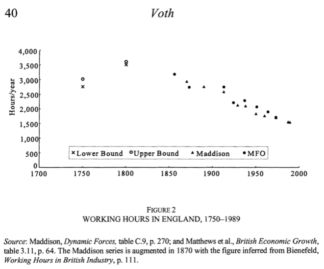

  
```{r setup, include=FALSE}
knitr::opts_chunk$set(echo = FALSE, warning = FALSE,
                      message = FALSE, fig.align='center', fig.retina=3,
                      out.width="75%")

library(RefManageR)
BibOptions(check.entries = FALSE, 
           bib.style = "authoryear", 
           style = "markdown",
           dashed = TRUE, hyperlink = FALSE)
source("helper_functions/helper_print_bib.R")
bib <- ReadBib("pres.bib")
```

```{r xaringan-themer, include = FALSE}
library(xaringanthemer)
style_solarized_light()
source("helper_functions/theme_lecture.R")
xaringanExtra::use_webcam()
xaringanExtra::use_tile_view()
```

# Today's Plan
  
.Large[
1. Consumption goods
2. The industrious revolution hypothesis
3. Backward bending labor supply curves
4. Time use
]
---

class: center, inverse, middle

# Part I: Consumption

---

background-image: url(figures/tea_background.jpg)
background-size: cover

## The rise of consumption

<style type="text/css">
.black { color: black; }
</style>

.pull-left[.black[

Tea & Sugar
+ 1722: 1oz of tea per person per year
+ 1822: 1oz of tea per person per week!

> "During the eighteenth century sugar became the single most important import into the British economy (Koyama, 2012, 516)".

Commodity consumption

> The history of ‘colonial groceries is one of the transformation of exotic luxuries into necessities’ (Berg, 2004, 365 in Koyoma, 2012, 516).
]]


---

## The rise of consumption

+ Probate inventories show consumer durables increasingly common

```{r kent_cornwall_probate, fig.align='center', out.width="60%"}

```


---

## The rise of consumption

```{r glass_shopping, fig.align='center'}
knitr::include_graphics("figures/consumerism-glassware-pellatt-green074523.jpg")
```

+ Shopping for glassware at Messrs. Pellatt and Green's, 1809

---

## The rise of consumption

```{r fabriuc_shopping, fig.align='center', fig.retina=3, out.width="65%"}

```

+ Shopping for fabric, 1809

---

### Contemporary notice

> "The substantial tradesman, who was wont to pass his evening at the ale house for  fourpence  half-penny,  now  spends  three  shillings  at  the  tavern,  while his  wife  keeps  card-tables  at  home;  she  must  likewise  have  fine  clothes,  her chaise  or  pad,  with  country  lodgings,  and  go  three  times  a  week  to  public diversions...  The gayest  places  of  public  entertainment  are  filled  with  fashionable figures; which, upon inquiry, will be found to be journeymen tailors, serving men, and abigails [ladies’ maids], disguised like their betters" (Smollett 1793).

--

### Berg's conclusion

> "Consumer aspirations across class and gender stimulated the rapid and extensive proliferation of new commodities from the later seventeenth century onwards. The supply-side responses to these aspirations were in turn to generate wider and deeper demand for these goods, bought to satisfy desires for fashion, respectability, sociability, or for convenience and comfort. These new consumer goods were generated through technological change, but above all through product innovation" (Berg, 2007, 246).

---

## Measuring and explaining consumption

.center[
]

+ Laborers seemed really poor (see week 8!) **who** was actually consuming?
+ The prices of consumer goods were falling (remember Adam Smith and Watch Prices?)
    - Was it a change in **preferences** that drove consumption?
    - Or was it a change in **prices**?
    - (Clearly its going to be at least in part prices — object is to measure how much.)

---

class: inverse, center, middle

## The source: Old Bailey Thefts

### Key Questions

What do we think about the composition of this sample?

Is it problematic for inferring trends in who owned what?

Is it problematic for inferring when they owned it?

---

## Measuring and explaining consumption

### The approach

+ For each **good** that is stolen (e.g. coins, stockings, etc.)
    - Examine change over time in average occupational status of owner
    - **But!**:
        + Need to net out change owing to price changes
        + Change owing to people getting richer (real wages)
        + And changes in the kind of good itself (improvements in quality)
+ General framework: **multiple regression**
+ Their interpretation: 
    - The relationship between occupational status and price reflects goods getting cheaper
    - The relationship between occupational status and time reflects changing tastes

$$\Big [ \texttt{Intuition: after prices and income you own what you prefer.}\Big ]$$

--

.center[**Is this sensible?**]
        
---

## Measuring and explaining consumption

> "Our findings underline the importance of fashion and tastes, which exerted an independent influence on the ownership of all the items that we examined, but make space too for price and income effects. The relative magnitude of fashion, price, and income varied according to the specific item considered, but none should be omitted in an account of the consumer revolution, which our evidence suggests involved a complex interplay between desires and differentiation, and aspiration and affordability." <br>—Horrell et. al.

--

.center[**What is the role of social competition and status in driving our long working ours?**]

---

class: inverse, center, middle

# Part II: the industrious revolution hypothesis

---

.left-column[
## The puzzle

Probate inventories (and other sources) say consumption rising **but** wage data is flat

**How to reconcile?**]

```{r clark_v_probate, fig.align='center'}
knitr::include_graphics("figures/clark_v_probate.png")
```


---

.left-column[
## The puzzle

Probate inventories say consumption rising **but** wage data is flat

**How to reconcile?**]

.right-column[
> "**Consumer demand grew**, even **in the face of contrary real wage trends**, and the productive achievements of industry and agriculture in the century before the Industrial Revolution could occur **because of reallocations of the productive resources of households.** In England, but in fact through much of Northwestern Europe and Colonial America, a broad range of **households made decisions that increased both the supply of marketed commodities and labor and the demand for goods offered in the marketplace.** This combination of changes in household behavior constituted an "industrious revolution"" (de Vries, 1994, 255)
]

---

## The industrious revolution

.pull-left[
+ If wages were stable...
+ But consumption increased

$\rightarrow$ Implies an increase in **hours worked**

### Why?

+ de Vries argues change in consumer desires leads to increased labor

$\rightarrow$ This implies that **before** this 'industrious revolution' workers had less desire for wages 

$\rightarrow$ they might work **less** if paid **more**

]

.pull-right[]

---

## The Building Blocks of de Vries Industrious Revolution

.pull-left[
#### Contextual factors

**The Revolt of the Early Modernists**: as we saw in the Agricultural revolution lecture the 17th and 18th centuries were far from static.

**The Revisionist Macroeconomics of the British IR**: The newer GDP estimates revised growth rates downwards -- growth rises far more smoothly from the 18th to the 19th century.
]

--

.pull-right[
#### Theoretical building blocks

**The Western European Marriage Pattern**: a critical element in de Vries' theory of a family that is adaptable to the market, but whose behavior is not wholly determined by market forces.

**The 'New' Household Economics**: de Vries will tackle the 'black box' of the family unit by approaching it with microeconomic theory.
]

---

## A model of the family

.pull-left[


+ Families can allocate their time ( $T$ ) towards
    - Leisure ( $T_l$ )
    - House work ( $T_c$ )
    - Wage work ( $T_w$ )
    - And that accounts for all of their time: $T = T_l + T_c + T_w$

<br>

+ Families do not directly consume products, they transform them to consume them using their labor, and they consume them in their leisure
    - **e.g.** Products ( $x_i$ ) might be groceries and what is eaten ( $z_i$ ) is the product of the food and the labor allocated to preparing it
        + Consider shopping and cooking ( $T_c$, $T_w$, $x_i$ ) to eat ( $T_l$, $z_i$ ) as opposed to ordering take-out ( $\downarrow T_c$, $\uparrow T_w$, $x_j$ )

]

--

.pull-right[
+ Family welfare is the sum of what they consume ( $\sum_i z_i \pi_i$ )
+ **But** what we measure of family welfare is the sum of the goods they purchase/the wage they receive ( $\sum_i x_i p_i$ )
+ We are missing
    - The value-added of family labor
    - Changes in the efficiency of family production
]

---

class: center, middle, inverse

# Discussion: de Vries and the Industrious Revolution

> Explain how in de Vries model "full income" of a household could diverge from its measured income?

--

<br>

> "...new commodities by themselves do not possess the utility that they come to acquire once they are bundled with others." Why is this point important to de Vries' argument?

--

<br>

> Is the industrious revolution more than the decline in the prices of consumer durables?

--

<br>

> How strong is the case for a demand-led industrial revolution?

---

class: inverse, center, middle

# Part III: Backward bending labor supply curves

---

### Backward Bending Labor Supply Curves?

+ **Recap**: per De Vries workers might work **less** if paid **more**

***

--

.pull-left[
### Leisure is a superior good 

> On laborers: "if by Fours Days labor in a Week they can maintain themselves, will hardly be persuaded to work the fifth" (Mandeville, 1924, 1723, 509).
]

.pull-right[
> The poor "just work so much and no more, as may maintain them in that mean condition to which they have been accustomed" (Sir Joshua Childs in Koyama 2012)
]

***

--

### Until better goods arrive...

> "it is a violent method and most cases impracticable, to oblige the laborer to toil in order to raise from the land more than what subsists himself and his family. Furnish him with manufactures and commodities and he will do it himself." (David Hume quoted in de Vries, 2008).

---

.left-column[
## Backward Bending Labor Supply Curves?

Implies some wage rate $w^*$ above which higher wages result in less work and more leisure
]

.right-column[

]


---

class: inverse, center, middle

# Part IV: Time use

---

## Economic change and time use


> "Thompson saw the coming of industry as a watershed in the history of time and work. The pre-industrial world, he suggested, was marked by irregular work rhythms. Workers focused on completing certain tasks, rather than working for a set number of hours, and consequently there was little need for an understanding or application of clock time." <br> —Hailwoood, p. 2.

+ Hailwood, on basis of 4,300 rural witness statements, argues that "Thompson was wrong to see clock-time consciousness and regular work rhythms as inventions of the factory."

---

## Voth's approach

.Large[
+ Look at Old Bailey reports
  + What do witnesses say they were doing and **what time do they say they were doing it!**
]

<br>


---

## Why do we work so much?

.pull-left[
```{r working_hours}

work_time <- data.frame(Date = c(1760, 1800, 1830, 1870, 2000),
                        Estimate = c(2576, 3328, 3356, 2755, 1653))

work_time$`Avg. Hours/week` <- round(work_time$Estimate/52, 2)

knitr::kable(work_time, format = "html", caption = "Estimated Annual working hours in England (Koyama, p. 508, Table 1)")
```

+ In 1930, JM Keynes famously predicted that in the future we would have a 15 hour work week.]

.pull-right[


]

---

class: inverse, center, middle

# Questions about time use

> Do we think times as collected by witness statements are a good representation of work patterns?

--

<br>

> Is the increased labor hours Voth finds evidence for De Vries theory?

<br>

> How else might we explain the rise in working hours during the industrial revolution?

---

class: inverse, middle, center

# Open questions?

> Was Keynes roughly correct in his predictions about work?

<br>

> What about the concept of a career? Do we labor for the money or the social distinction?


