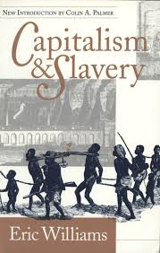
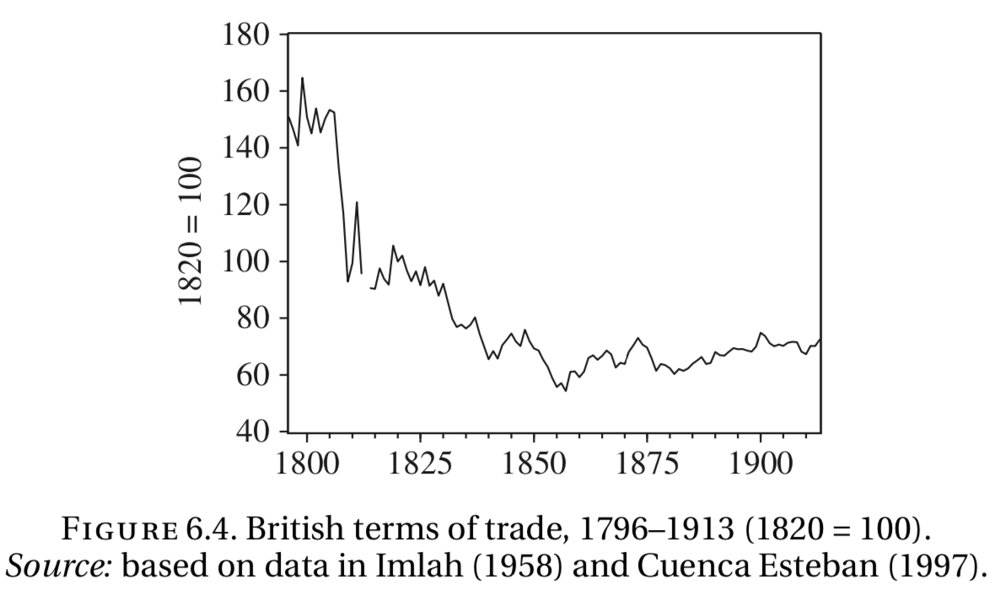

```{r setup, include=FALSE}
knitr::opts_chunk$set(echo = FALSE, warning = FALSE,
                      message = FALSE, fig.align='center', fig.retina=3,
                      out.width="85%")

library(RefManageR)
BibOptions(check.entries = FALSE, 
           bib.style = "authoryear", 
           style = "markdown",
           dashed = TRUE, hyperlink = FALSE)
source("helper_functions/helper_print_bib.R")
bib <- ReadBib("pres.bib")
```

```{r xaringan-themer, include = FALSE}
library(xaringanthemer)
style_solarized_light()
source("helper_functions/theme_lecture.R")
xaringanExtra::use_webcam()
xaringanExtra::use_tile_view()
```

## Today's Plan

.pull-left[
.large[
### Part I

+ Background: trade & the IR
    - The commercial revolution
    - The early case for trade as a cause of the IR
]
]

.pull-right[
.large[

### Part II

+ The case against trade as a cause of the IR

### Part III

+ Rehabilitating trade as a cause: 
    - Inikori
    - Findlay & O'Rourke
]]

---

class: center, middle, inverse

## Part I

---

## Trade & the Industrial Revolution

+ The Commercial Revolution
+ The early case for trade (1880s-1945)
+ The critique of trade
    - Small ratios and losses to autarkey
+ The rehabilitation of trade
    - Inikori
    - Findlay & O'Rourke
+ Conclusion

---

## Why trade could matter

.center.Large[**It usually does!!**]

<br>

> "One of the ways -- the commonest perhaps -- by which an economy can develop from a pre-industrial to an industrial state is to exploit the opportunities open to it from international trade." (Deane, p. 51).


.pull-left[
#### Profits of trade and the IR 
+ Marxist (and other, e.g. Williams) theorists thought profits from trade might have financed IR
    - Mostly financed out of business

]
.pull-right[

]
---

## The Commercial Revolution


---

## The Commercial Revolution

.pull-left[
### Direct Impacts

+ Incomes
+ Ideas

### Indirect Impacts

+ Organizational and Institutional improvements
    + Shipping
    + Finance
    + Insurance
    ]
    
.pull-right[

]

---

.left-column[
## The early case for trade

+ Trade as a share of output and manufacturing output
]

.right-column[

```{r trade_growth, fig.align='center', fig.retina=3, fig.width=6, fig.height=4.5, out.width="100%"}
library(tidyverse)
library(ggthemes)
library(ggrepel)

df <- data.frame(date = c(1700, 1760, 1780, 1801, 1831, 1851),
                 `Share of GDP` = c(8.4, 14.6, 9.4, 15.7, 14.3, 19.6),
                 `Share of Manufacturing` = c(13, 18, 25,40,49,NA))

df %>% gather("indicator", "share", -date) %>% 
  ggplot(aes(date, share, 
             color = indicator, 
             label = paste0(share, "%"))) +
  geom_point() + 
  geom_line()+
  geom_label_repel(color = "black") +
  ggtitle("Industrial growth and trade clearly correlated", subtitle = "Trade as a share of GDP and Manufacturing") +
  scale_color_viridis_d() +
  theme_lecture +
  ylab("Share (%)") +
  xlab("")

```
]
---

## The early case for trade

+ Per Inikori, early writers on the IR (1880-1945) largely favor trade as an explanation
    + Toynbee (1880), Mantoux (1906), Gilboy (1932), Barnes (1937), etc.
    + External **demand** is key
    + Other mechanisms
        - Growth of market orientation (Toynbee)
        - Influx of specie (Cunningham) leading to capital accumulation
        - New *types* of demand
        - Trade as an engine for financial and political development

<br>

> "There can be little doubt that in the historiographical epoch from 1880 to 1945, the development of industrial production in England, ...was explained largely as a function of expanding overseas commerce." (Inikori, p. 101)

---

class: inverse, center, middle

# Part II

---

## Criticisms of Trade as a Cause of the IR

+ Trade is a fraction of an industry which is a fraction of total income
    - A fraction $\times$ a fraction is usually small
    - If external demand disappears resources will be re-allocated
    
--

+ Quick example from Harley
    - What matters is the *terms of trade* -- how much Britain could purchase with its exports vs how much it would cost to produce domestically
    - Hypothetical: 
        + Trade makes grain 10% cheaper
        + Trade is 19% of national income
        + In a world without trade Britain is $10\% \times 19\% = 1.9\%$ poorer

--

> "Self-sufficiency in 1860, then, would have cost Britain only (50 per cent)∗(0.125) or about 6 per cent of national income. ... no trivial sum,to be sure, but measured against the whole rise in output per worker of roughly 80 per cent from 1855 to 1913, only one thirteenth of the story." (Harley, p.194-5).

---

## Criticisms of Trade as a Cause of the IR

--

#### Manufacturing growth as a cause of trade expansion

+ Manufactures are exported
+ Foreign markets buy British manufactures with money earned selling primary commodities to British manufacturers

--

#### General British prosperity as a cause of trade expansion

+ Deane and Cole argue:
    - Agric. Rev. $\rightarrow$ Imports
    - Foreign income from selling to Britain $\rightarrow$ Increase in British exports

<br>

--

**General problem that correlation $\neq$ causation**

---

class: inverse, center, middle

# Part III

---

## Rehabilitating trade: Inikori

.pull-left60[

+ Argues for a *regional* approach
  - Trade can be a big component of a small region (e.g. Lancashire)
  - Argues that regions can be treated as nearly separate economic units (I do not find this claim persuasive)
      + Domestic demand associated with agricultural revolution is in the *South*
      + Manufacturing growth is in the *North* driven by external demand
      + Britain engages in Import Substituting Industrialization (ISI)
          - Manufacture what you formerly imported
]

.pull-right40[

.center[
]
]
---

## Rehabilitating trade: Findlay & O'Rourke

.pull-left[

+ Britain faced continuously deteriorating terms-of-trade
    - Thus supply was outstripping demand
    - Therefore unlikely that external *demand* was key
+ But argue trade key for 2 reasons

<br>
#### Reason 1

+ Trade amplifies income gains from technological innovation

#### Reason 2

+ Extent of technological change depended in part on trade openess
]

.pull-right[

> "Both arguments rely crucially on the well-known fact that **trade systematically raises the elasticities of supply and demand** facing an economy." (Findlay & O'Rourke, p. 339)

]


---

## Rehabilitating trade: Findlay & O'Rourke

.pull-left[

+ The Triangular trade
    + Americas
        - Export primary products
        - Import manufactures and slaves
    + Africa
        - Export slaves
        - Import manufactures
    + Britain
        - Export manufactures
        - Import primary products
 ]
    
.pull-right[
> "On both the supply and the demand sides, trade increased elasticities, meaning that a given domestic impulse (in this case, technological change) propelled the British economy much farther than would otherwise have been the case." (Findlay & O'Rourke, p. 343)

]

.center[

#### Effects 

Given a technological innovation, trade cushions the fall in manufacturing prices
and dampens the rise in primary product/slave prices $\rightarrow$ bigger manufacturing profits and a greater incentive to innovate
]

---

## But...

.center[

### William Clarence-Smith on Inikori

> "...a Scottish jury might well return a verdict of "not proven," if only because of the insignificance attributed to autonomous technical factors as prime movers in the Industrial Revolution. Much recent research stresses that the seventeenth-century Scientific Revolution, unique in the world, was a precondition for the technological break-throughs of the Industrial Revolution, even if the connections were often quite indirect."
]

<br>

+ Does trade explain technological change or the success of technological change?
+ Is it a necessary factor? A necessary and sufficient factor? Merely an accelerant?

---

class: center, middle, inverse

## More questions

> "Taken together with the unsuccessful processes in renaissance Italy and seventeenth-century Holland, what comes out is that sustained expansion of manufactured exports or lack of it could ultimately make the difference between completion and non-completion of the industrialization process." (Inikori)
+ Do you agree with Inikori that without trade the IR would have petered out?

--

<br>

> "Although we still lack a universally accepted theory of technological progress, it seems clear that any sensible model would yield the result that if Britain had been closed to trade, the Industrial Revolution could not have been sustained."
+ Why do Findlay & O'Rourke believe this?