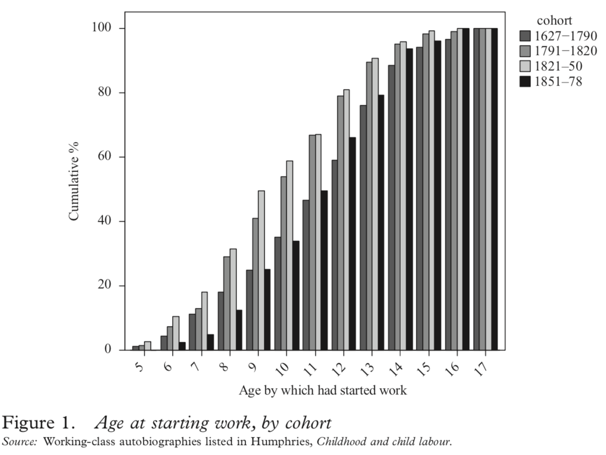
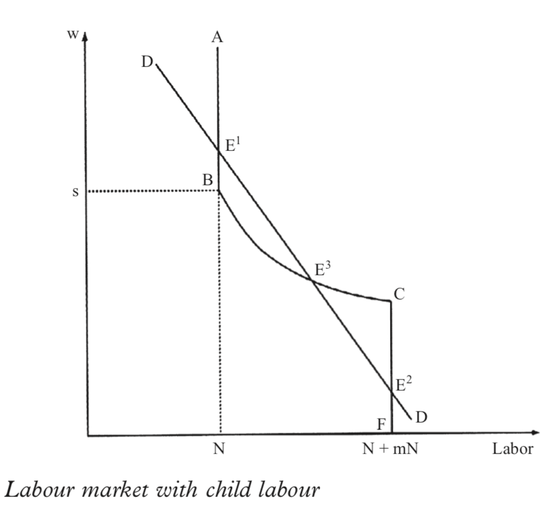

## Lecture Outline

### Welfare in multiple dimensions

.pull-left[
#### .Large[I will cover..].

### Wages

- Changing views of their growth
- Wages vs family income
]

.pull-right[
### Heights?

- The promise and pitfalls of anthropometrics


### Child labor

- Growth or decline in IR?
- Why?
]

```{r setup, include=FALSE}
knitr::opts_chunk$set(echo = FALSE, warning = FALSE,
                      message = FALSE, fig.align='center', fig.retina=3,
                      out.width="75%")

library(RefManageR)
BibOptions(check.entries = FALSE, 
           bib.style = "authoryear", 
           style = "markdown",
           dashed = TRUE, hyperlink = FALSE)
source("helper_functions/helper_print_bib.R")
bib <- ReadBib("pres.bib")
```

```{r xaringan-themer, include = FALSE}
library(xaringanthemer)
style_solarized_light()
source("helper_functions/theme_lecture.R")
xaringanExtra::use_webcam()
xaringanExtra::use_tile_view()
```

---

class: inverse, center, middle

# Part I

---

class: center, inverse, middle

## The standard of living debate

> "What happened to the standard of living of the working class during the British industrialization has probably been the most contentious issue in economic history" (Horrell & Humphries, p. 849).

<br>

> "Very few questions in economic history have been the focus of such prominent and persistent attention as the controversy about the impact of early industrialization and capitalism on the standard of living of the British working class" (Feinstein, p. 625).

---


## The old view on the standard of living

>  And did the Countenance Divine,<br>
Shine forth upon our clouded hills?<br>
And was Jerusalem builded here,<br>
Among these dark Satanic Mills?<br> -William Blake

<br>

> "A feeling very generally exists that the condition and disposition of the Working Classes is a rather ominous matter at present; that something ought to be said, something ought to be done, in regard to it." <br> -Thomas Carlyle, *Chartism*, pp. 1

<br> 

+ Early writers on the IR (Hammond and Hammond, *Town labourer*; Webb and Webb, *Industrial democracy*; Toynbee, *Lectures*) stressed the poverty, inequality and negative externalities of industrialization 

---

.pull-left60[
```{r lw, fig.align='left', fig.retina=3, out.width="100%", fig.height=5, fig.width=5}
library(tidyverse)
library(ggrepel)
library(ggthemes)
library(readxl)

lw_feinstein <- read_xlsx("data/lw_feinstein.xlsx")

lw_feinstein <- lw_feinstein %>% 
  gather("series", "index", -Date) 

lw_feinstein %>% 
  filter(series =="LW") %>% 
  ggplot(aes(Date, index, color = series, label = index)) + 
  geom_point() + 
  geom_line() + 
  geom_text_repel() +
  geom_text(data = lw_feinstein %>% 
               filter(Date == max(Date),
                      series == "LW"),
             aes(Date, index, label = series),
           nudge_x = 10) +
  theme_hc() + 
  scale_color_hc() +
  xlim(c(1780,1865)) +
  guides(color=FALSE) +
  theme_lecture +
  xlab("") +
  ggtitle("Lindert-Williamson (LW) wage series", 
          subtitle = "A sharp rise in real income")

```
]


.pull-right40[

+ LW (*EHR* 1983) computed wages and found an 80% rise in real wages between 1780 and 1850
    - To compute a real wage:
        - Measure wages in all sectors in a year $w_{1,1840}, w_{2, 1840}, ...$ (e.g. agriculture)
        - Measure how big each sector is in a year $s_{1, 1840}, s_{2, 1840}, ...$ (e.g. 30%)
        - Measure how much things cost in a year $p_{1840}$
        - Add it all up and divide by prices
    - Measurement depends on measuring wages, shares and prices!
    
<br> 

\begin{equation}
 \texttt{realwage}_{1840} = [s_{1, 1840} \times w_{1,1840} + \\
 s_{2, 1840} \times w_{2, 1840}+...]/p_{1840}
\end{equation}

]

---

.pull-left60[
```{r humphries_wages_family, fig.align='left', fig.retina=3, out.width="100%", fig.height=5, fig.width=5}

hh_df <- data.frame(years = c(1795, 1800, 1820, 1835, 
                              1840, 1845, 1850, 1865),
                    male_earnings = c(71.1, 78.2, 83.9, 72.7,
                                      104.4, 95.6, 123.0, 122.0),
                    family_earnings = c(66.1, 78.8, 86.9, 89.2,
                                        111.1, 88.9, 100.8, 102.6))

hh_df <- hh_df %>% gather("series", "index", -years) 

hh_df %>% 
  ggplot(aes(years, index, color = series, label = index)) + 
  geom_point() + 
  geom_line() + 
  geom_text_repel() +
  geom_text(data = hh_df %>% 
               filter(years == 1865) %>% 
               mutate(Lab = c("Male Wages", "Family Income")),
             aes(years, index, label = Lab),
           nudge_x = 10) +
  xlim(c(1790, 1880)) +
  theme_hc() + 
  scale_color_hc() +
  guides(color=FALSE) +
  theme_lecture +
  xlab("") +
  ggtitle("Wages grew more than family income", 
          subtitle = "Evidence from family budgets, Horrell & Humphries (1992)")
  

```
]

.pull-right40[
+ Horell and Humphries (HH) point out that wages $\neq$ family income
> "...the standard of living is determined by the household's access to all resources -- including the contributions of other family members and welfare subsidies" (HH, 1992, p. 850).
]

---

.pull-left60[
```{r lw_revised, fig.align='left', fig.retina=3, out.width="100%", fig.height=5, fig.width=5}

lw_feinstein %>% 
  filter(series != "Feinstein_original") %>% 
  ggplot(aes(Date, index, color = series, label = round(index))) + 
  geom_point() + 
  geom_line() + 
  geom_text_repel() +
  geom_text(data = lw_feinstein %>% 
               filter(Date == max(Date),
                      series != "Feinstein_original"),
             aes(Date, index, label = series),
           nudge_x = 10) +
  theme_hc() + 
  xlim(c(1780,1865)) +
  scale_color_hc() +
  guides(color=FALSE) +
  theme_lecture + 
  xlab("") +
  ggtitle("LW revised by Feinstein", 
          subtitle = "A very small rise in real income")

```
]


.pull-right40[

+ Charles Feinstein revisits LW in 1998 "Pessimism Perpetuated"
    + A number of changes: $s$ computed more often, more $w$, new $p$ index 

> "This marked contrast... arises almost entirely from the differences in the underlying cost-of-living indices discussed above. ...it is not the result of the inclusion of the incomes of women and children in a previously patriarchal earnings index" (p. 643)

<br> 

\begin{equation}
 \texttt{realwage}_{1840} = [s_{1, 1840} \times w_{1,1840} + \\
 s_{2, 1840} \times w_{2, 1840}+...]/\underbrace{p_{1840}}_{\texttt{Revised}}
\end{equation}

]

---
.left-column[
## The verdict on wages

+ Mixed: grow, but slowly enough that dis-amenities of urban life could dominate
+ For instance, hard to argue for an 'improved' standard of living with small rise in income and big fall in life-expectancy!
]

.right-column[
```{r life_expec, fig.align='center', fig.retina=3, fig.height=5, fig.width=7, out.width="90%"}

le <- data.frame(year = seq(1800, 1890, 10),
                 le_urban = c(NA, NA, 35, 29, 30, 34, 34, 38, 40, 42),
                 le_national = c(40, 41, 41, 41, 41, 41, 41, 43, 45, 46))

le %>% 
  gather("series", "life_expectancy", -year) %>% 
  ggplot(aes(year, life_expectancy, color = series, label = life_expectancy)) +
  geom_point(size = 3) + 
  geom_line() +
  geom_label_repel(nudge_y = .5) +
  geom_text(data = le %>% 
              gather("series", "life_expectancy", -year) %>% 
              mutate(lab = if_else(series=="le_urban", 
                                   "Avg. Cities > 100,000", 
                                   "Avg. Eng. & Wales")) %>% 
              filter(year == max(year)),
            aes(year, life_expectancy, label = lab), nudge_x = 18) + 
  xlim(c(1800, 1920)) +
  guides(color=F) +
  ggtitle("Life expectancy in Britain", 
          subtitle = "Source: Szreter & Mooney (1998)") +
  ylab("Life Expectancy at Birth (years)") + 
  xlab("") +
  theme_hc() + 
  scale_color_hc() +
  theme_lecture


```
]

---

class: inverse, center, middle

> "The present account of trends in living standards also seems **more plausible in relation to other indicators** of well-being. It accords better with the evidence of a sharp deterioration in infant and child mortality. It eliminates the paradox of the decline in nutritional status indicated by the early nineteenth-century height data occurring at a time of an allegedly swift advance in living standards." <br> -Feinstein, p. 652

---

class: inverse, center, middle

# Part II

---

## Height as a measure of human welfare?

.pull-left[
#### Anthropometrics

+ A *net* measure
+ Lots of historical sources
+ Requires only height and age

#### But...

+ Several problems
  - Bias/truncation
  - Composition effects
  - Separating out the cause of height change
      * Epidemics? Public health works? Child labor
  - When *exactly* do we grow?

]

.pull-right[.center[

The concept of **biological well-being** 


### But how does it work?
]
]

---

.pull-left30[

On **average** height is not genetic

>  "Newcomers to the idea that stature measures important aspects of the standard of living should not be sidetracked by genetic issues. **Genes are important determinants of individual height, but genetic differences approximately cancel in comparisons of averages across most populations**, and in these situations heights accurately reflect health status." <br> —Steckel, "Stature", p. 1903
]

.pull-right70[

*Source*: Clark, *A Farewell to Alms*, 2008.
]

---

## Heights during the IR

.pull-right70.center[
 
*Sources*: Komlos, "Secular Trend" & Nicholas & Steckel, "English Workers"
]

.pull-left30[
> "In some regards the common men and women of the early industrial age were not as well off as their parents. **There was some divergence between their living standard, as conventionally conceived, and their biological well-being**." <br> -Komlos, "Physical Stature"  
]

---

.pull-left40[
## Anthropometrics: a critical regard


+ Why do people join the military?
+ Why does crime rise and fall?

]

.pull-right60[
> "Sample-selection bias is a potential problem for every source that was not produced or collected for the entire population, or for which only non-random sub-samples survive. **Selection bias also affects textual and other non-quantitative sources.**"<br> —Bodenhorn, Guinnane & Mroz, p. 1157

<br>

> "We do question whether parts of the literature add to our understanding of long-term changes in economic well-being because they rely on choice- based samples... Several militaries ... relied on volunteers rather than conscripts drawn randomly from their underlying populations. Selection occurs at every stage of the criminal justice system: prisons house only those alleged to have committed crimes, whom the police choose to catch, states’ attorneys choose to prosecute, and juries choose to convict." <br> —Bodenhorn, Guinnane & Mroz, p. 1155.

]

---

class: inverse, center, middle

# Part III

---

.pull-left[
# Child Labor


]

.pull-right[

+ Professor Jane Humphries<br>CBE, BA, MA, PhD, FBA
+ Draws on 600+ biographies of working men to study child labor
    + Qualitative and quantitative approach
]

---
.left-column[
## Distribution of work-starting ages by cohort

+ "...the sons of miners, factory workers, outworkers, casual workers, and soldiers all on average started work below the age of 10." <br> Humphries, p. 406.
]

.right-column.center[
]

---

.pull-left60[
## A simple model of child labor


]

.pull-right40[
+ Assume parents prefer their children at home
+ Assume all jobs *could* be done by adults or children
+ Assume a standard of living $s$ such that if household income falls below $s$ children are sent to work
    - Good equilibrium $E1$: 
        + Only parents work, low labor supply high wage
    - Bad equilibrium $E2$:
        + Children and parents working leads to high labor supply and low wage
    - Unstable equilibrium $E3:$
        + Labor supply curve is backward bending (if wages rise parents take children home)
]

---

## Children's labor undercuts adult labor: vicious cycle

> "When I was just over seven I went into the boot trade.There was no room for a child my age in the kind of work my father did... But about this time an entirely new method of making shoes came up. It was called riveting ..." <br> William Arnold cited in Humphries, p. 413

--

### A sentimental conclusion

> "These children bore many of the social and economic costs of the industrial revolution but they also contributed to its success and thereby through time to our own comfort and prosperity. Their part in this great historical divide merits remembrance." <br> -Humphries, p. 416

---

class: inverse, middle, center

## Questions

### How would *you* measure a population's "standard of living"?
