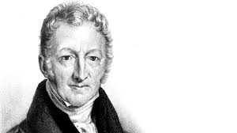
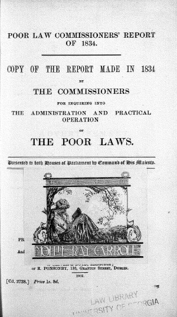
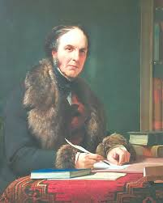
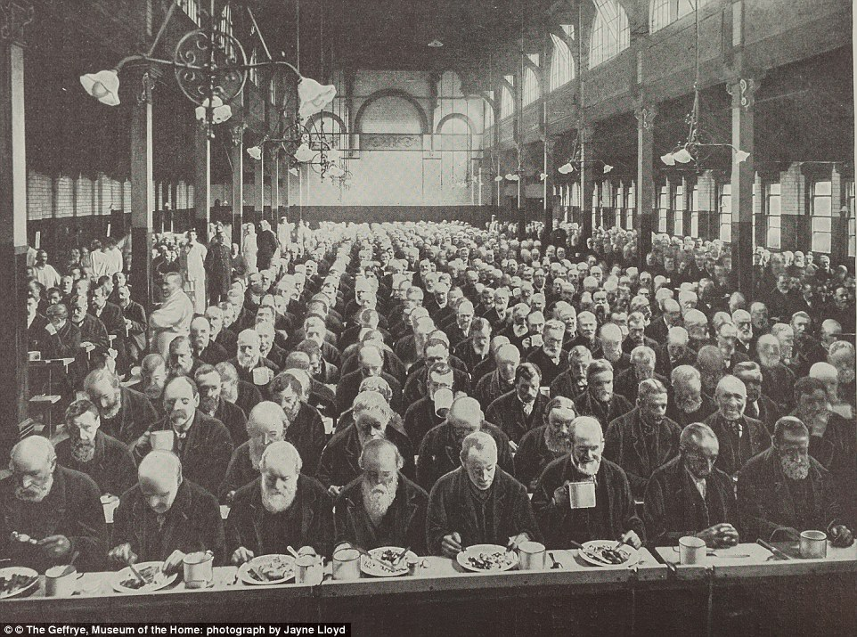
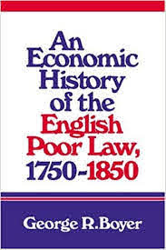
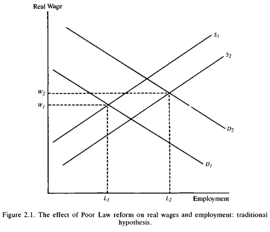
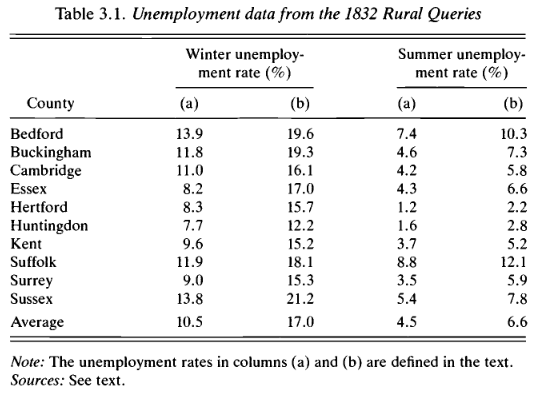
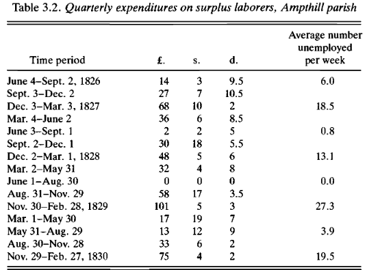

## Lecture Outline

.pull-left[

### Part I: Background

+ The Old Poor Law
+ The New Poor Law

### Part II: Historiography

+ The traditional view of the economics of the Poor Law
+ The neo-traditional view
+ The revisionists
]

.pull-right[
### Part III: The economics of the poor law

+ Boyer's model
+ Solar's ruminations

]

```{r setup, include=FALSE}
knitr::opts_chunk$set(echo = FALSE, warning = FALSE,
                      message = FALSE, fig.align='center', fig.retina=3,
                      out.width="75%")

library(RefManageR)
BibOptions(check.entries = FALSE, 
           bib.style = "authoryear", 
           style = "markdown",
           dashed = TRUE, hyperlink = FALSE)
source("helper_functions/helper_print_bib.R")
bib <- ReadBib("pres.bib")
```

```{r xaringan-themer, include = FALSE}
library(xaringanthemer)
style_solarized_light()
source("helper_functions/theme_lecture.R")
xaringanExtra::use_webcam()
xaringanExtra::use_tile_view()
library(tidyverse)
```

---

class: inverse, center, middle

# Part I: Backgroound

---

### The 'Old Poor Law'

.pull-left[
#### A *relatively* generous system (a low bar!)

> "English poor relief was probably the most generous in Europe in the late eighteenth and the early nineteenth centuries, absorbing around 2 per cent of the national product" <br> —Kidd, p. 10

#### Speenhamland system
+ Outdoor relief (meaning outside of workhouses)
+ Supplements wages in kind — usually with wheat
  - Countercyclical wage subsidy
+ Geographically tethered — relief comes from locality
+ Predominant in wheat growing regions of the south
]

.pull-right[

]

---

.left-column[
### The Critique of the 'Old Poor Law'

<br>
<br>
<br>
<br>
<br>
<br>


]
.right-column[

+ .Large[Malthus]

> "[The] first obvious tendence [of the Poor Laws] is to increase population without increasing the food or its support. A poor man may marry with little or no prospect of being able to support a family without parish assistance. **They may be said, therefore, to create the poor which they maintain.**" <br> —Malthus

+ .Large[But...]

> **To a generation drunk on Malthusian wine, the population argument seemed irrefutable. But nowadays we are inclined to treat this type of reasoning with more skepticism**, particularly if the subsidy is modest in amount, increases less than proportionately with each additional child, and is continuously scaled down year after year; ...all three things were true under the Old Poor Law." <br> —Blaug, p. 153

+ .Large[But but...] 
    - Boyer disagrees ("Malthus was right after all" *JPE*, 1989)
]


---

### The Critique of the 'Old Poor Law'

#### Poverty vs. Pauperism

+ **Poverty** a 'natural' state of those required to labor for subsistence
+ **Pauperism** the condition of those unable to labor (sick, crippled, elderly, etc.)

#### Burke's 'labourers' vs. the 'poor'

> "We have heard many plans for the relief of the 'labouring poor'. This puling jargon is not as innocent as it is foolish .... Hitherto the name of poor (in the sense in which it is used to excite compassion) has not been used for those who can, but for those who cannot labour — for the sick and infirm, for orphan infancy, for languishing and decrepit age; but **when we affect to pity, as poor, those who must labour or the world cannot exist, we are trifling with the condition of mankind.**"<br> —Burke, *Letters on a Regicide Peace*

---


.pull-left40[

]

.pull-right60[

#### Claims the Old Poor Law is...
> "a bounty on indolence and vice"

> "a universal system of pauperism"

+ Expresses view that Old Poor Law encourages able-bodied workers to depend on relief

.pull-left[]

.pull-right[]
]


---

### The New Poor Law

+ Passed in 1834
+ Based on *Royal Commission* of 1832-34
+ Written by Edwin Chadwick (Bentham's secretary) & Nassau Senior

.pull-left[
> "...a narrower and increasingly more punitive approach to adult applicants for relief." <br> —Kidd, p. 8
]

.pull-right[

> "The answer, Chadwick believed, was to deter pauperdom ...deprive the pauper of his liberty, split up his family and incarcerate them in a workhouse." —Porter, p. 116  

]

---

class: inverse
background-image: url(figures/workhouse_men_beds.jpg)
background-size: cover

## The Workhouse

---

## The workhouse

.pull-left[
+ Categorize individuals (age, gender, infirm)
+ Family separation
+ Daily 10 hour labor in summer, 9 hour labor in winter

> "Any pauper may quit the workhouse, upon giving the master three hours notice of his wish to do so." <br> -*First Annual Report of the Poor Law Commissioners*

+ Varied regional implementation
]

.pull-right[

]
---

.left-column[

"Industrial development reduced the relative importance of agriculture in the economy, but **left the burden of poor rates primarily on landed income**. Is it surprising, then, that in the 1830s **a parliament dominated by landowners managed to impose restrictions on relief expenditure?**" <br> —Solar, p. 18.
]
.right-column[
```{r poor_law, fig.align='center', fig.retina=3, fig.width=7, fig.height=5, out.width="85%"}
library(readxl)
pl <- read_xlsx("data/boyer_pl.xlsx")

pl <- gather(pl, "series", "percent", -date)

pl %>% 
  mutate(series = if_else(series=="perc_pl_relief", 
                          "% of Pop. on PL Relief",
                          "PL Expenditure as % of GDP")) %>% 
  ggplot(aes(date, percent, color=series)) +
  geom_point() +
  geom_line() +
  facet_wrap(~series, nrow = 2, scales = "free_y") +
  theme_hc() + 
  scale_color_hc() +
  theme(panel.background = element_rect(fill = "#fdf6e3"),
        plot.background = element_rect(fill = "#fdf6e3")) +
  guides(color = F) +
  xlab("") + ylab("Percent") +
  ggtitle("Poor Law Recipients and Expenditures, 1812-1850", 
          subtitle = "Source: Boyer (2019)")

```
]

---

class: inverse, center, middle

# Part II: Historiography

---

## The economics of the Old Poor Law

.pull-left[

### Boyer's classification

1. The traditionalists
  + E.g. Malthus, authors of the Poor Law Report
2. The 'neo-traditionalists'
  + Accept the traditionalist economics
  + Differ in their politics, interests
  + E.g. the Hammonds, the Webbs, Polanyi
3. The revisionists
  + Blaug, also Baugh, Digby, McCloskey in part
]

.pull-right[
]

---

.pull-left60[

> The Poor Law's "...obvious  tendency  is  to  **increase  population  without  increasing  the  food  for  its support**...  [A]s  the  provisions  of  the  country  must,  in  consequence  of  the increased  population,  be  distributed  to  every  man  in  smaller  proportions,  it  is evident that  the labour  of those who are not supported  by parish assistance, will purchase  a  smaller  quantity  of  provisions  than  before,  and  consequently,  more of them  must be driven  to ask  for  support. <br> —Malthus

<br>

>  The  elimination  of  outdoor  relief  would  not  only  eliminate  unemployment,  it  would  also  cause  laborers  to  become  "more  steady  and  diligent," thereby increasing productivity,  which would make "the return to the  farmers'  capital  larger,  and  the  consequent  increase  of  the  [wages] fund  for  the employment  of labour enables  and  induces the capitalist  togive  better  wages"  (1834:  329). <br> —Boyer, p. 64
]

.pull-right40[
## The traditionalists


]
---

.pull-left70[

### The Fabian interpretation

+ Focused on the *origins* of outdoor relief

>  "the transformation of economic organisation brought about by the progress of the Industrial Revolution — coupled with the rapid enclosure of nearly all the remaining common fields and manorial wastes and the gradual diminution of the independent handicraftsmen" <br> —Webbs (1927: 420-1).


### Polanyi

+ Focused on the *support* for Speenhamland by large farmers
+ Hobsbawm and Rude follow his analysis

> They all "...considered Speenhamland an attempt by landlords and farmers to stop the development of a capitalist labor market" —Boyer, p. 75

]

.pull-right30[
## The Neo-traditionalists

+ Agree with the **diagnoses** of the 1834 report
  - Actually the Webbs provide critique
+ Disagree with the origins
]

---
.pull-left30[
## The Revisionists

+ Starts with Blaug 1963
+ Key points:
  1. Low wage rates are the cause of adoption, not an effect
  2. Increased labor productivity because of caloric deficits
  3. Scale too low to encourage idleness
  4. Allowances-in-aid-of-wages mostly gone by 1830s
  5. Seasonal unemployment explains a lot
  6. Chronic unemployment in the south
  7. Rise in relief expenditures was bad harvests
]

.pull-right70[

.center.Large[Critiquing the Poor Law Report]

>  The Poor Law Commissioners of 1834 ... **selected the facts so as to impeach the existing administration on predetermined lines**. ...what evidence they did present consisted of little more than picturesque anecdotes of maladministration. Even the elaborate questionnaire which they circulated among the parishes was never analyzed..."<br> —Blaug, pp. 177

<br>

> "...as evidence of a social malady [the report] has little value, particularly on the ultimate question of the corrupting influence of lavish relief: in what age would it not be possible to collect complaints from the upper classes about the laziness of workers?"<br> —Blaug, pp. 177

]

---

class: inverse, center, middle

# Part III

---


.pull-left[
## Why the Old Poor Law?

#### Boyer's model: Key features

1. Seasonality
2. The implicit subsidy to agricultural employers

#### The model

+ Farmers could cope with the seasonality problem in 4 ways
    1. Yearlong contract
    2. Really high wages when employed that last through year
    3. Some kind of unemployment insurance (Poor Law)
    4. Some allotment scheme giving land so laborers can grow extra food
+ **3 most efficient because of tax-subsidy!**

]

.pull-right[


<br>


]

---

## Solar's ruminations

> "...this article also speculates on the effects of relief on economic development. Some simple economic reasoning is used to draw out the implications of the essential features of the English system. One line of argument looks at poor relief as a system of insurance and focuses on the behaviour of beneficiaries. The other examines the way in which relief was financed and how this affected the behaviour of the property owners who paid for the system." —Solar, p. 3

.pull-left[
#### Poor Law different from continent in that

1. More uniform and comprehensive
2. Financed out of local property tax (less regressive)
3. Relatively generous

> "Poor relief, the quintessential function of local government in England, is ripe for inclusion in this new political economy of English development in the seventeenth and eighteenth centuries." —Solar, p. 1
]

.pull-right[
#### Effects

+ Larger than those who are recipients (insurance)
+ On recipients
  - Fertility decisions (+/-)
  - waged labor (promotes enclosure)
  - Possibly **boosted** labor mobility
+ On payers
  - subsidized labor demand
  - motivated landowners to limit local fertility
]