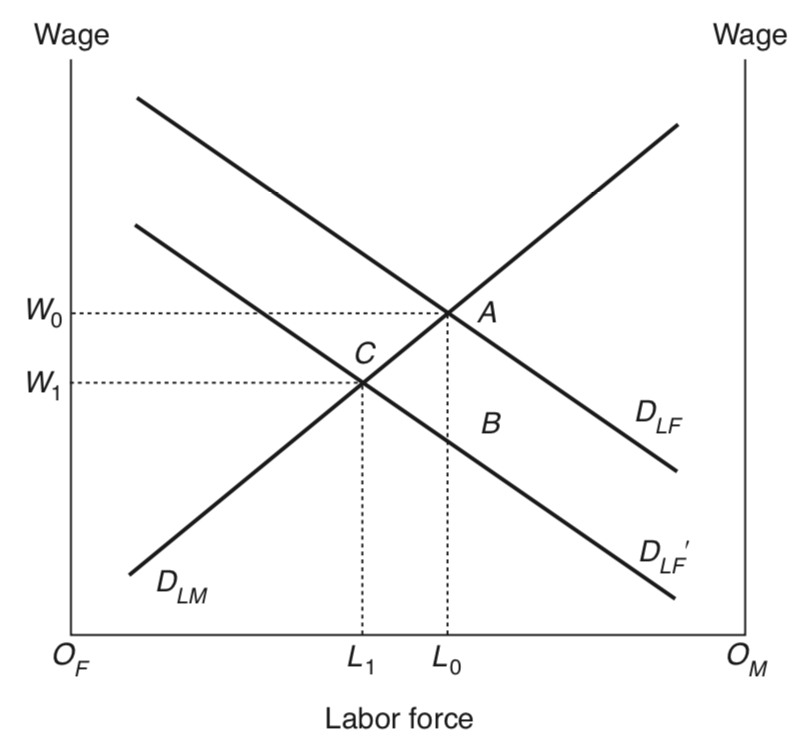
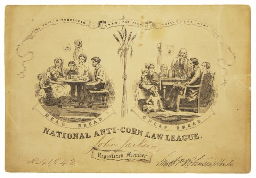
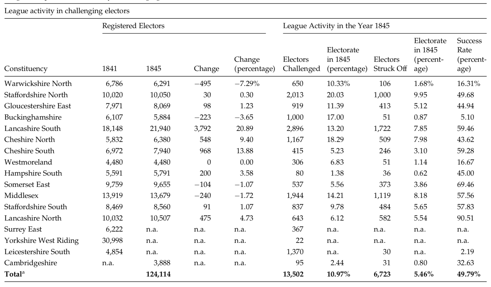
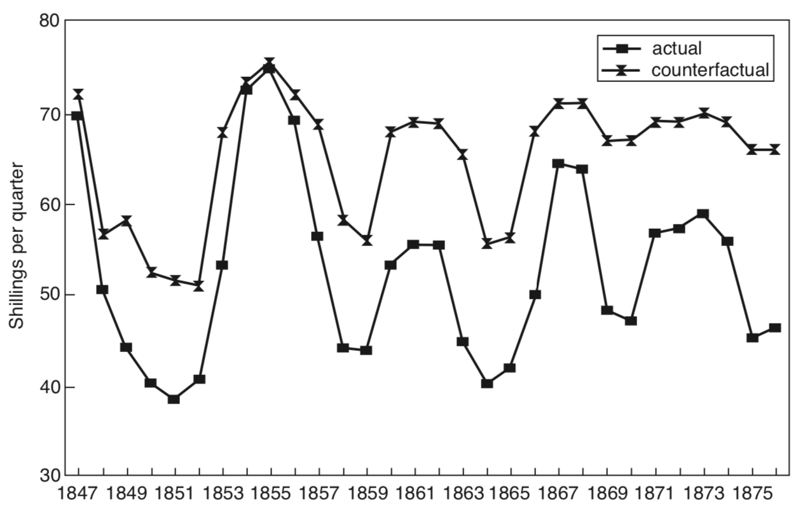
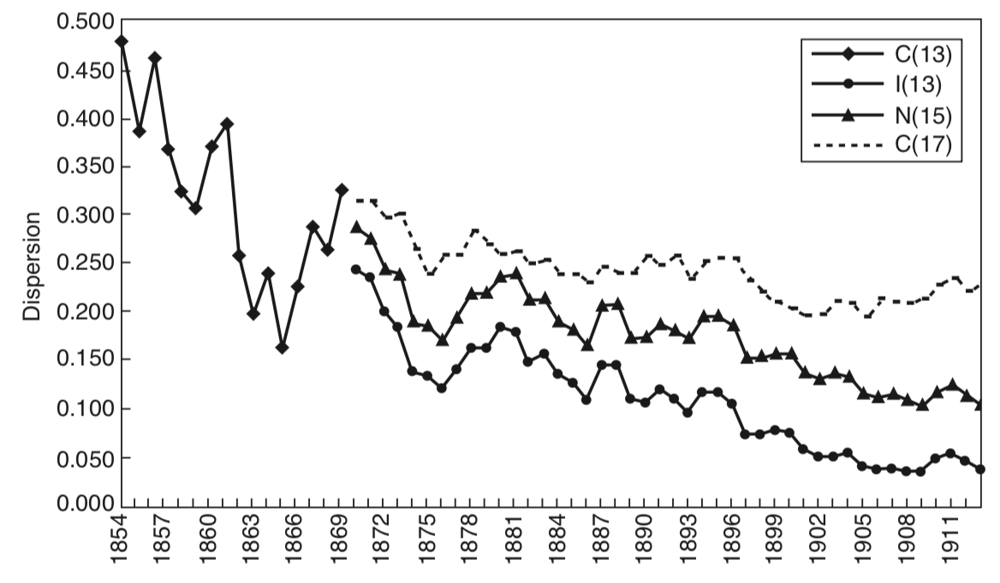
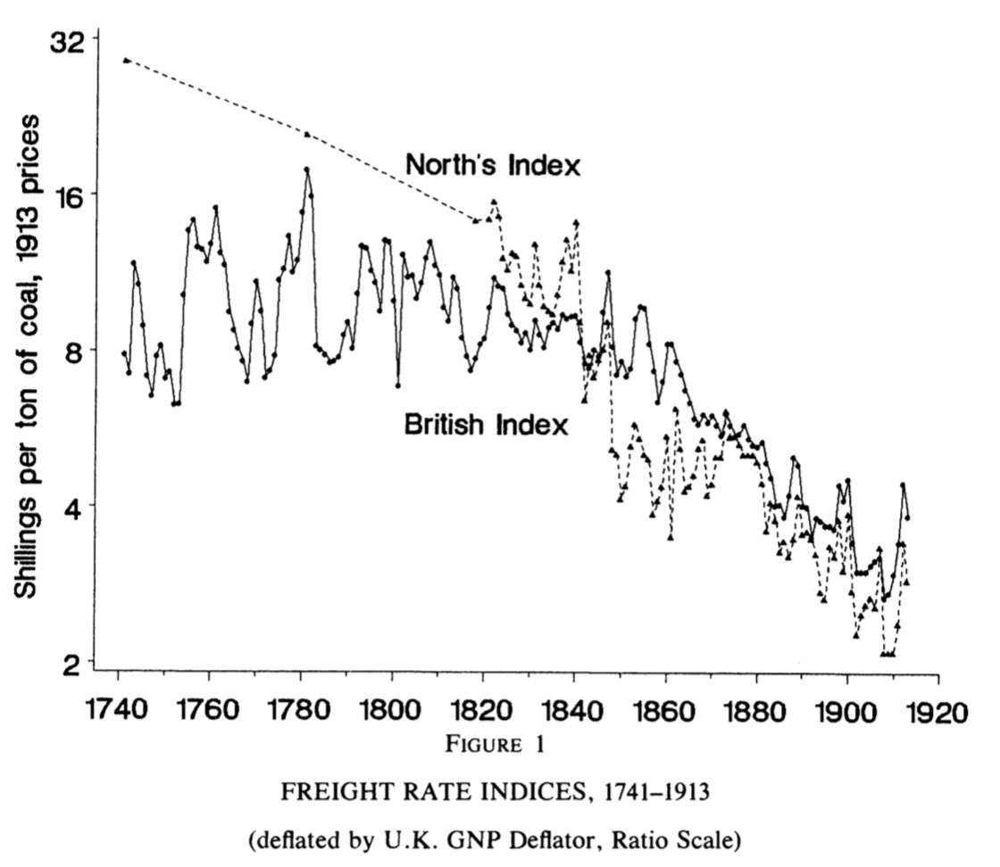
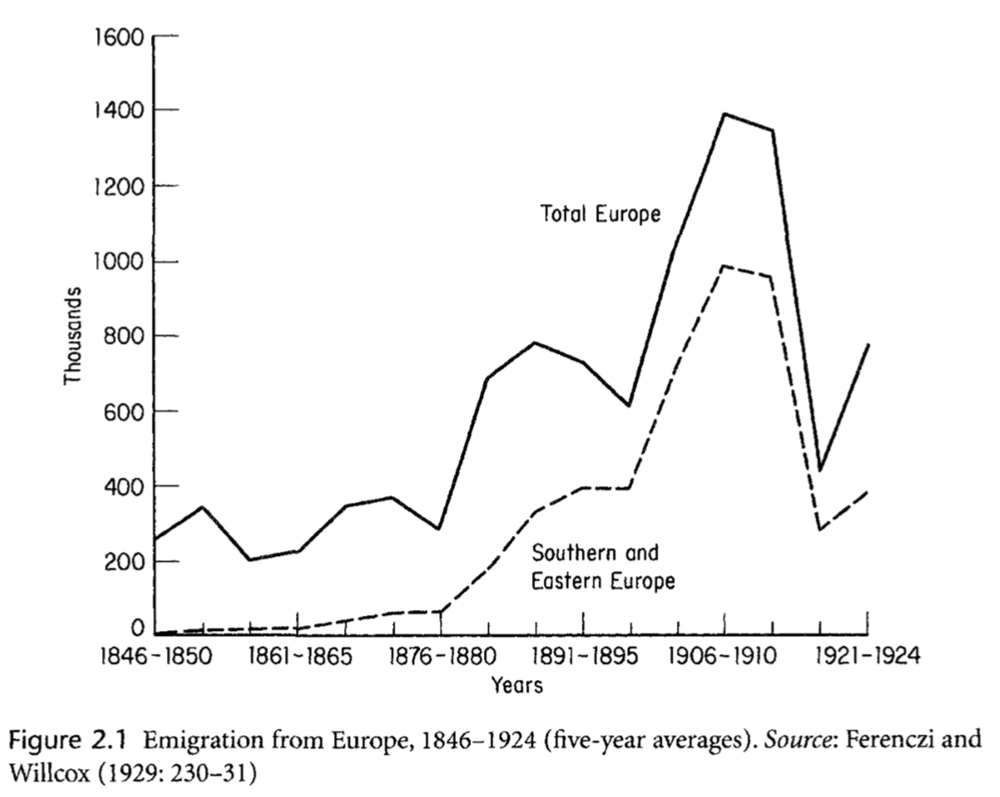
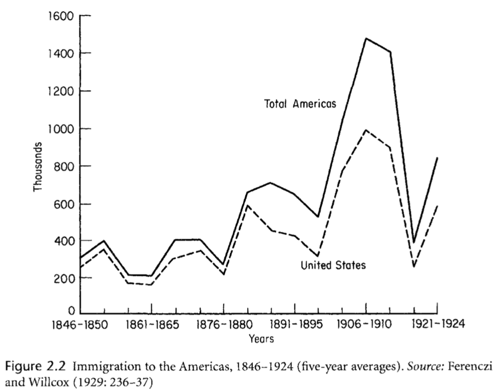

```{r setup, include=FALSE}
knitr::opts_chunk$set(echo = FALSE, warning = FALSE,
                      message = FALSE, fig.align='center', fig.retina=3,
                      out.width="75%")

library(RefManageR)
BibOptions(check.entries = FALSE, 
           bib.style = "authoryear", 
           style = "markdown",
           dashed = TRUE, hyperlink = FALSE)
source("helper_functions/helper_print_bib.R")
bib <- ReadBib("pres.bib")
```

```{r xaringan-themer, include = FALSE}
library(xaringanthemer)
style_solarized_light()
source("helper_functions/theme_lecture.R")
xaringanExtra::use_webcam()
xaringanExtra::use_tile_view()
```


## Today's Plan

.pull-left[
### Part I

+ Globalization and History

### Part II

+ The Corn Laws
+ Political Economy of Free Trade
]

.pull-right[
### Part III

+ Heckscher-Ohlin trade theory
+ factor prices
+ The European grain invasion

]
---
class: inverse, center, middle

# Part I: Globalization and history

---

## Globalization in History

.pull-left[
### When was globalization?

+ The 1500s vs the 1800's
]

.pull-right[
### What should we consider globalization?

+ The existence of trading links?
+ The size of trading links?
]

<br>

.center.Large[**Need to define the term globalization**]

---

.pull-left[
## Plausible globalizations

> "There have been few times in history when the world has been so closely interconnected — not only economically, but also in culture and tradition." <br> - Beatrice Manz cited in Cooper, *Colonialism in Question*, p. 100.

]

.pull-right[

]

### Proponents of earlier globalizations

+ Andre Gunder Frank (before 1500)
+ Janet Abu-Lughod (before 1350)
+ Frank and Gills: "the existence of the same world system in which we live stretches back at least 5,000 years"

.pull.center[**Clearly definitions matter!**]

---

## Plausible globalizations

#### Is connection enough?

> "The discovery of America, and that of a passage to the East Indies by the Cape of Good Hope, are the two greatest and most important events recorded in the history of mankind. ... By uniting, in some measure, the most distant parts of the world, by enabling them to relieve one another's wants, to increase one another's enjoyments, and to encourage one another's industry, their general tendency would seem to be beneficial." <br> 
-Adam Smith, *The Wealth of Nations*, Book 4, ch. 7, part 3.

--

#### Or does scale matter?

> "What remains ... in doubt is the contemporary impact or significance of these new configurations of long-distance trade ... it is far less clear what meaning the new connections had for those who lived in the sixteenth or even the seventeenth century" <br> 
-Tracy, *The Rise of Merchant Empires*, quoted in O'Rourke and Williamson, "When did globalization begin?"

---

## Economic Globalization as price convergence?

> "Thus, *the only irrefutable evidence that globalisation is taking place is a decline in the international dispersion of commodity prices or what might be called commodity price convergence* [Emphasis in original]." <br>
-O'Rourke and Williamson, "When did globalization begin?", p. 26.

--

### Why?

+ A measure of globalization that captures the domestic impact of global forces
+ Changes in trade volumes could just be shifts in supply or demand
+ When trade forces changes in domestic prices it can 'influence things that really matter' like income distribution, living standards, quality of life, etc.

---

## Economic globalization as price convergence?

> "We see no evidence documenting significant pre-nineteenth century global price convergence for the (competing) commodities that really mattered to the economic lives of the vast majority. Nor do we see any evidence of significant commodity price convergence even for those (non-competing) commodities that mattered little to the vast majority. The implications for world history are, we think, revisionist and profound."
<br>
-O'Rourke and Williamson, "When did globalization begin?", p. 28

#### Key questions

+ Why does this occur in 19th century?
+ What drives commodity market integration at scale?
+ What are the forces that produce commodity price convergence?
+ What are the consequences of this kind of globalization?

---

class: inverse, center, middle

# Part II: The Corn Laws and the Political Economy of Free Trade

---


.pull-left[
## What were the corn laws?

### Tariffs on imported grain

1. **French Wars**: the price of grain is high
2. **1815**: wheat imports prohibited if price < 82s. 6d. per quarter
3. **1828**: sliding scale of duties, e.g. 
    + if price > 73, duty = 1 
    + if price = 60, duty = 27
4. **1842**: lower sliding scale
    + if price > 73, duty = 1 
    + if price = 60, duty = 14
5. **1846**: 'repeal', actual mostly flat duty
    + if price > 53, duty = 4 
    + duty + 1 as price falls up to a duty of 10
6. **1849**: duty is 1 shilling

]

.pull-right[

]

---

### The 'repeal' of the corn laws

.pull-left[

]

.pull-right[
+ A symbolic victory because of **who** voted for repeal.
+ Major re-allignment within conservative party
    - Peelites vs Non-Peelites
    - First of many internal party schisms on trade
        + 1903 Chamberlain Tariff debate, EU accession, Brexit
        
> "Britain’s bold move to free trade in 1846... violated the core protectionist ideology of the Conservative party while simultaneously undercutting the economic interests of the ruling landed aristocracy." <br> -Schonhardt-Bailey, p. 1
]

---

## Why?: Two broad categories of explanation

.pull-left[

#### Ideas

+ The benefits of free trade per the political economy of Smith, Ricardo, etc.

> "Writers upon political economy have already said, that the ultimate tendency of wages is to accomodate itself to the price of food. I must say that I do not believe it" <br> -Peel cited in Irwin, 1989, p. 55.

]

.pull-right[

#### Interests

> "Economists exert a minor and scarcely detectable influence on the societies in which they live... If Cobden had spoken only Yiddish, and with a stammer, and Peel had been a narrow, stupid man, England would have moved toward free trade in grain as its agricultural classes declined and its manufacturing and commercial classes grew" <br> -Stigler in Irwin, 1989, p. 41.

]

---

.pull-left[
## The political economy of repeal

|  | group | | |
|--|-------|-|--
|Outcome| Land. | Man. | Lab.| 
|No Tariff| - | **+** | **+**/- |
|Tariff| **+** | - | -/**+** |

<br>

+ Tariffs raise (**+**) the price of grain benefitting landowners
+ Tariffs reduce the purchasing power of labour (-) as food is more expensive
+ The high price of grain hurts manufacturers (-) by forcing them to pay higher wages

]
.pull-right[


> "The impact of repeal on worker... depends on the ability of manufacturing to absorb the rural emigrants... They will **gain** if food is a large component of the consumption basket, but they **could lose** otherwise." <br> -O'Rourke & Williamson, p. 80
]

---

### What explains repeal? Schonhardt-Bailey

> "The findings of this book tell a simple but compelling story: **economic interests accounted for the momentum behind repeal**, a momentum that overshadowed almost all else. ...these same interests, left unsatisfied, could have snowballed into revolution — as Peel and others feared... Interests account for most of the dynamics of repeal, **but they do not on their own explain why reform rather than revolution emerged**... To understand that last (quite important) fraction of the whole, we require an understanding of how **the engine of interests was shaped by the forces of ideas and institutions**."<br> -SB, p. 2


.pull-left[
### Schonhardt-Bailey's Argument

+ Anti-Corn Law League
+ Chartism
+ Weakening opposition (aristocratic portfolio diversification)
]

.pull-right[

> "Peel characterized repeal as a means to preserve the traditional institutions of the British government — and, in particular, the aristocracy."<br> -SB, p. 41
]

---

.pull-left60[
## The Anti-Corn Law League Campaign

+ First modern single-issue pressure group
+ Two-fold strategy:
    - Get electors struck-off
    - Get voters qualified

]

.pull-right40[


]

.center[

]

---

## Peel's appeal to a 'territorial democracy'

.pull-left[
+ Anti-Corn Law League threatened marginal MPs
+ Shift some Cons toward repeal
+ Peel offers argument in conservative terms: 

> "Peel characterized repeal as a means to **preserve the traditional institutions of the British government** — and, in particular, the aristocracy." (SB, 41)
]

.pull-right[

]
********

> ‘‘this [French Revolution of 1848] comes of trying to govern the country through a narrow representation in Parliament, without regarding the wishes of those outside. It is what this party behind me wanted me to do in the matter of the Corn Laws, and I would not do it’’ <br> -Peel in SB, p. 39.

---

### The effect of repeal

.pull-left[

#### If Britain is a 'small' economy

+ 'Small' here means the world price of manufactured goods **is not** set by Britain
    - If this is true, Ricardo's analysis holds:
    - A fall in the price of grain pushes labor out of agriculture
    - Lowers the effective cost of labor
    - Increases manufacturing employment and profits

]

.pull-right[

#### If Britain is a 'large' economy

+ 'Large' here means the world price of manufactured goods **is** set by Britain
    - If this is true, Torrens (1844) analysis holds:
    - Agricultural profits would decline
    - Real wages would rise
    - But manufacturing profits would **decline** as terms-of-trade deteriorate

]

********

> "The big difference between the "small" country and the "large" country view of Britain... is that in the former case, British capitalists paid most of the subsidy to British landlords under the Corn Laws, while in the latter case foreigners paid most of the subsidy." <br> -O'Rourke & Williamson, p. 86.

---

### The immediate effect on prices

> "the Laws appear to have made little difference to British grain prices; the ability of contemporaries to understand their own affairs is discredited, and the whole Corn Law controversy is made to seem pointless and 'much ado about nothing'"<br> -Fairly in O'Rourke and Williamson, p. 81.

.pull-left[
+ But this does not interrogate the counter-factual
    - What would prices have been in the absence of repeal?
    - Crimean War, American Civil War
+ Williamson (1990) finds correlation of Prussian-GB grain prices
+ O'Rourke (1994) simulates counterfactual
]

.pull-right[

]

---

## The Impact of Repeal
.pull-left[
+ The big effects of repeal seem to emerge after the 1870s
+ Repeal appears to shift the composition of agricultural output
    - Farms move increasingly into non-tradables
    - 1870 grains = 25% of farm output
    - 1904 grains = 13% of farm output
+ More extreme shift in Ireland
]

.pull-right[
> "The Emerald Isle was a lot greener in the second half of the nineteenth century" <br> OW, p. 89
]

<br> 

> "this event [repeal] alone was sufficient to give great impulse to the conversion of Irish arable land into pasture, to the concentration of farms, and to the eviction of small-scale cultivators... The Irishman, banished by the sheep and the ox, reappears on the other side of the ocean as a Fenian" <br> -Marx in OW, p. 90

---

class: inverse, center, middle

# Part III: Heckscher-Ohlin and Factor Prices

---

## Heckscher-Ohlin

.pull-left[

+ Eli Heckscher
+ Bertil Ohlin
]

.pull-right[

]

---

## Heckscher-Ohlin: Determinants of Trade

> "Australia has a small population and an abundant supply of land, much of it not very fertile. Land is consequently cheap and wages high, in relation to most other countries. It would therefore seem profitable to produce goods requiring large areas of less fertile land but relatively little labour. Such is the case, for example, in wool production. . . . Similarly, regions well endowed with technically trained labor and capital will specialize in industrial production. . . . Exports from one region to the other will on the whole consist of goods that are intensive in those factors with which this region is abundantly endowed and the prices of which are therefore low. . . . In short, commodities that embody large quantities of particularly scarce factors are imported, and commodities intensive in relatively abundant factors are exported. . . . **Australia exchanges wool and wheat for industrial products since the former embody much land and little labour while the opposite is true of industrial products. Australian land is thus exchanged for European labor.**"<br> -Ohlin, 1924 

---

## Heckscher-Ohlin: Determinants of Factor Prices

> "If, for example, Australia produced its own industrial products rather than importing them from Europe and America in exchange for agricultural products, then, on the one hand, the demand for labor would be greater and wages consequently higher, and on the other the demand for land, and therefore rent, lower than at present. At the same time, in Europe the scarcity of land would be greater and that of labor less than at present if the countries of Europe were constrained to produce for themselves all their agricultural products instead of importing some of them from abroad. **Thus trade increases the price of land in Australia and lowers it in Europe, while tending to keep wages down in Australia and up in Europe. The tendency, in other words, is to approach an equalization of the prices of productive factors**."<br> -Ohlin, 1924

---

.pull-left[
### Land Abundant Exporters

Factors   |  Technology  |  Exports
```{r ho_mermaid}
library(DiagrammeR)

mermaid("
graph LR
A((Abundant Land)) --> D[Production<br>Process]
B((Labor)) --> D
C((Capital)) --> D
D --> E((Food))")

```
]

.pull-right[
### Labor Abundant Exporters
Factors   |  Technology  |  Exports
```{r ho_mermaid_2}
library(DiagrammeR)

mermaid("
graph LR
A((Land)) --> D[Production<br>Process]
B((Abundant Labor)) --> D
C((Capital)) --> D
D --> E((Manuf.<br>goods))")

```
]
---

## Convergence in Factor Markets: The Evidence

.pull-left[
+ OW compute a measure of how 'spread out' the data is


+ Divergence in the early 19th c. as New World wages ran ahead

]

.pull-right[
\begin{equation}
C(N) = \frac{\sum_{i=1}^N(x_i - \bar{x})^2}{\bar{x}^2}, \ \bar{x} = \frac{\sum_{i=1}^N x_i}{N}
\end{equation}

+ The late 19th c. saw pronounced convergence.
+ Even more so if you trim outliers


]

---

```{r uk_factors, fig.align='center', fig.retina=3, out.width="90%", fig.height=4, fig.width=6}
library(tidyverse)
library(ggthemes)

fp <- data.frame(date = seq(1877, 1912, 5),
                 real_wage = c(100, 104,
                               113.9, 118.8,
                               127.6, 121.6,
                               128.8, 125.9),
                 real_land = c(100, 77.3, 76.1, 
                               76.7, 82.2, 69.8,
                               68.3, 58.2))

fp <- fp %>%
  gather("factor", "index", -date) 

fp %>% 
  ggplot(aes(date, index, color=factor)) +
  geom_line() + 
  geom_point()+
  theme_hc() +
  scale_color_hc() +
  guides(color = FALSE) +
  geom_label(data = fp %>% filter(date==1912),
             aes(date, index, color=factor, 
                 label = c("Real Wage", "Real Land Prices"))) +
  xlim(c(1875, 1915)) +
  theme_lecture  +
  ggtitle("Hekscher-Ohlin at Work?", 
          subtitle = "Index of British Land and Labor Prices")

```

---

```{r wage_rent_ratios, fig.align='center',fig.retina=3, out.width="100%", fig.width=6, fig.height=4}
library(readxl)
library(ggrepel)

wr <- read_xlsx("data/wage_rent_ratios.xlsx")

wr <- wr %>% gather("Country", "Index", - Year) %>% 
  mutate(Continent = ifelse(Country %in% c("Australia", "US"), 
                            "New World", "Old World"),
         Policy = ifelse(Country %in% c("France", "Germany"),
                                 "Protectionist", "Open"))

wr %>% 
  ggplot(aes(Year, Index, 
             group = Country, 
             color = Continent, linetype = Policy)) +
  geom_line() + 
  geom_point()+
  theme_hc() +
  scale_color_hc() +
  guides(color = FALSE) +
  geom_label_repel(data = wr %>% filter(Year==1912),
             aes(Year, Index, color=Continent, 
                 label = Country)) +
  xlim(c(1875, 1915)) +
  theme_lecture  +
  ggtitle("Evidence of Convergence in Wage-Rental Ratios?", 
          subtitle = "1877 to 1912")

```

---
.right-column[
]

.left-column[
### Price of Wheat Convergence
+ Factor price convergence implies commodity market integration
+ The **European Grain Invasion**
]

---

.right-column[

]

.left-column[
### What accounts for convergence?

+ Transport costs fall so quickly tariffs are almost insufficient!
]

---

## Transport Revolution

### Canals

+ Earliest major transport improvement, e.g. 1750-1820 in UK
    - In 1817 took 52 days to move freight from Cincinnati to NYC
    - in 1852 took 6 days

### Steamship

+ Series of improvements after 1860s make them more efficient
+ **Suez Canal** interacts with steam ships -- can refuel on trips east

### Railroads

+ Link internal markets, particularly in US
+ Critical for pioneering financial and managerial capitalism

---

### Consequences: The Age of Mass Migration

.pull-left[


]

.pull-right[

]

+ About 60 million Europeans emigrate between 1820 and 1920
+ Relatively higher wages in New World drove immigrants abroad
+ Also displacement from disappearing agricultural jobs

---

## Consequences: The Collapse of Agricultural Income

+ The discovery and colonization of the 'New World' raised the amount of land per European capita 6-fold!

> "Less frequently remarked upon, but equally obvious, are the long-run implications for European income distribution. Such an increase in land endowments would inevitably spell disaster for European landowners. Over-all living standards might increase, but in the long run European rents would decline, with European labor or capital benefitting." <br> -O'Rourke, "European Grain Invasion", p. 775


### Backlash to globalization

+ Several political consequences flow from 19th century globalization
    1. Tariffs on the continent (an 'Iron & Rye' alliance) 
    2. Free trade in Britain (a labor & capital alliance)
    3. Escalating immigration restriction in the New World
    4. New world tariffs to defend manufactures

---
## Key take-aways

### Heckscher-Ohlin

- What you trade is driven by factor ratios
- Trade drives factor price convergence

### Commodity prices converged over the 19th century

- especially in primary agricultural products


### Technology as a driving force for globalization

- This is in contrast to e.g. post-WWII where the creation of GATT/WTO is predominantly a political project.

---

background-image: url(figures/questions_large.png)
background-size: contain


