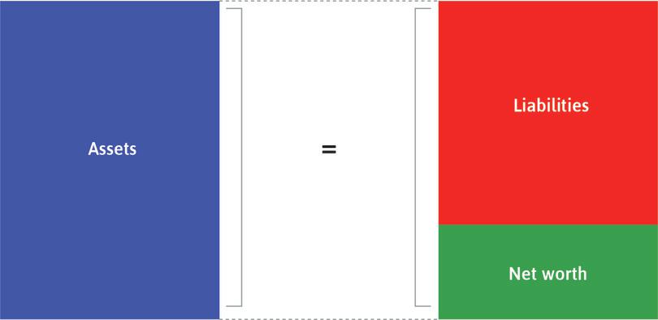
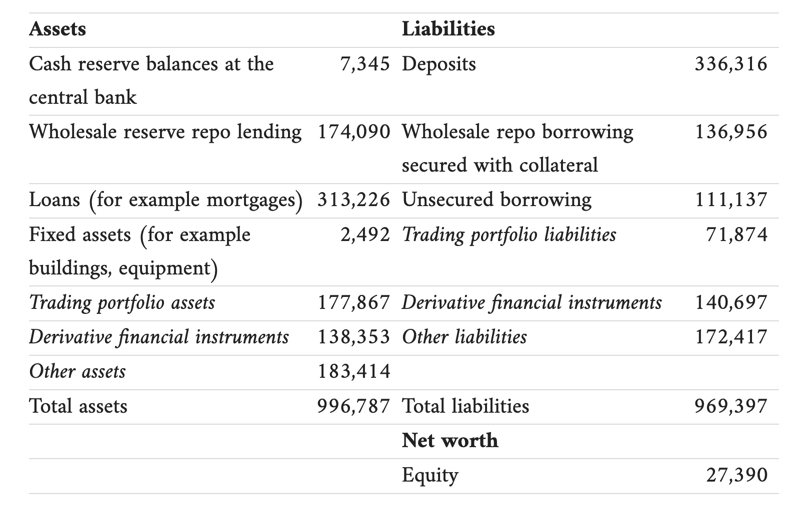
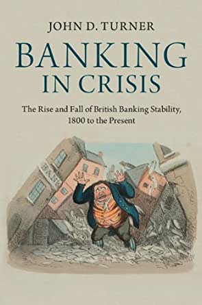
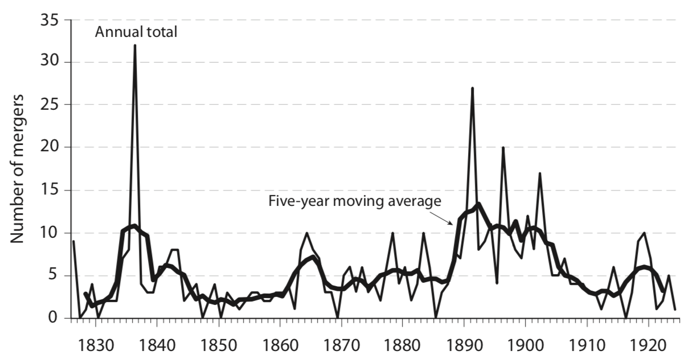
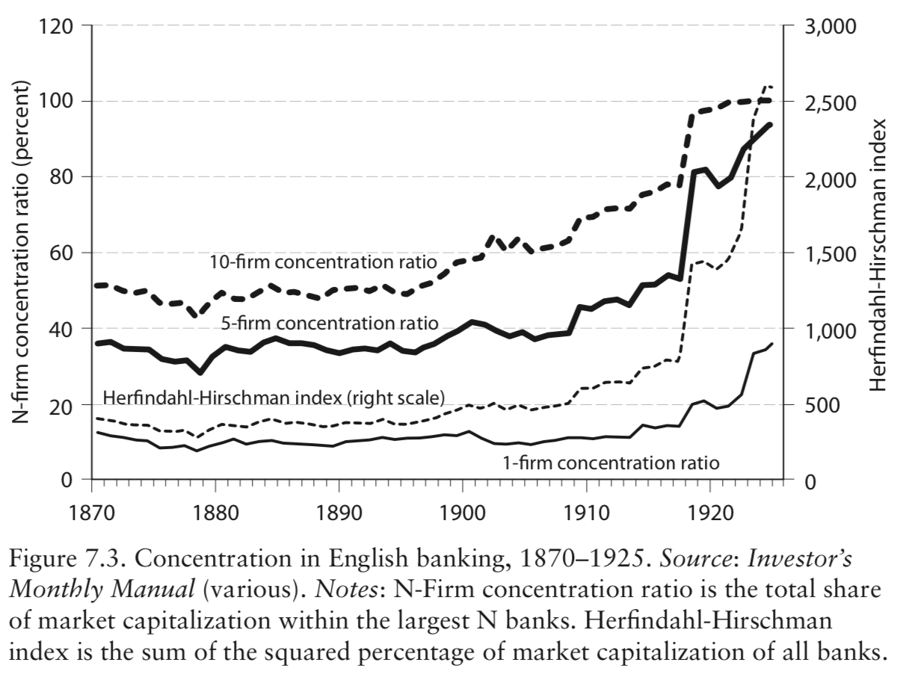
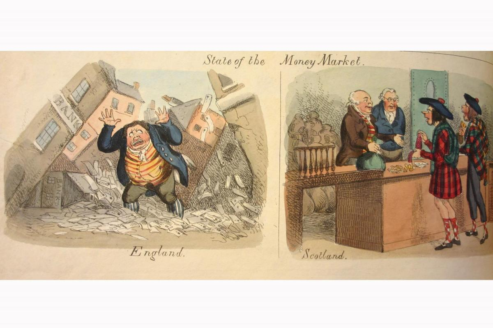
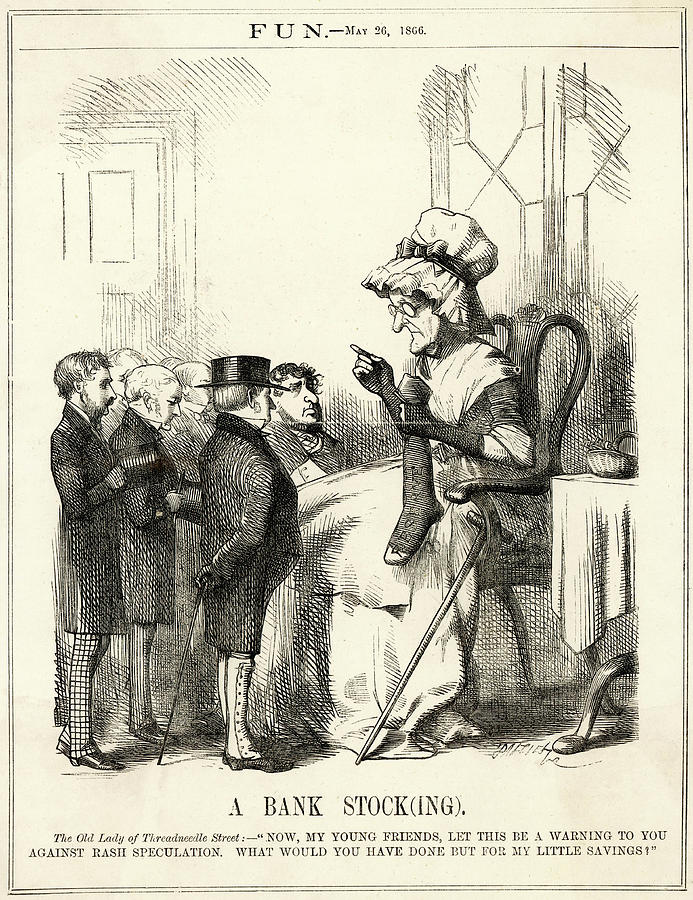
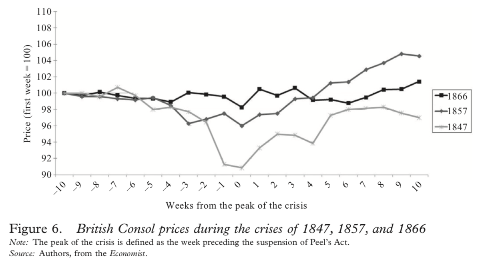

```{r setup, include=FALSE}
knitr::opts_chunk$set(echo = FALSE, warning = FALSE,
                      message = FALSE, fig.align='center', fig.retina=3,
                      out.width="75%")

library(RefManageR)
BibOptions(check.entries = FALSE, 
           bib.style = "authoryear", 
           style = "markdown",
           dashed = TRUE, hyperlink = FALSE)
source("helper_functions/helper_print_bib.R")
bib <- ReadBib("pres.bib")
```

```{r xaringan-themer, include = FALSE}
library(xaringanthemer)
style_solarized_light()
source("helper_functions/theme_lecture.R")
xaringanExtra::use_webcam()
xaringanExtra::use_tile_view()
```


# Lecture Outline

### Part I

+ Some useful background
    - What is a bank?
    - Balance sheet and leverage
    - Leverage, risk and liability
    - Illiquidity vs insolvency?
    
### Part II

+ The Bank of England as a Monopoly Lender
+ The rise of joint-stock banks

### Part III

+ The emergence of central banking doctrine
    - Central banking and financial stability?

---

class: inverse, center, middle

# Part I

---

## Banking and financial crises in historical perspective

<br>

.middle[
>  **Warnings from history** <br> <br> 227.  The Commission recommends that an additional external member be appointed to the FPC, with particular responsibility for **taking a historical view of financial stability and systemic risk**, and drawing the attention of FPC colleagues, and the wider public through speeches and articles, to historical and international parallels to contemporary concerns. (Paragraph 1115) <br><br> -*Changing banking for good - Parliamentary Commission on Banking Standards*, Vol. 1, [https://publications.parliament.uk/pa/jt201314/jtselect/jtpcbs/27/2704.htm](https://publications.parliament.uk/pa/jt201314/jtselect/jtpcbs/27/2704.htm) 
]

---

# What is a Bank?

.center[

]

---

### Leverage: Barclay's Simplified Balance Sheet, 2006

.center[

]

+ Leverage ratio $= 996,787/ 27,390 = 36.4$

---

## Leverage, Risk and Liability: Why do banks fail?

.pull-left[
### Liability-side risks

.large[
+ Runs on deposits
    - Deposits can be withdrawn at will
    - First-come-first-served
+ Can spook creditors
+ Can spark fire-sales
    - Asset-side deterioration
]
]

.pull-right[
.large[
### Asset-side risks

+ Investments also go down!
    - Economy-wide shocks (e.g. US Civil War and 'cotton famine')
    - If Barclay's assets (in 2006) declined by > 2.7% the bank is technically insolvant (net worth is negative)!


]]

---

## Leverage, Risk and Liability: Why do banks fail?

.pull-left[
### Why take on so much risk?

.large[
+ Why take on so much leverage?
    - Why do companies get bigger?
+ What happens in the case of failure?
    - Limited liability, double liability, unlimited liability
+ Seperation of ownership and control (agency problems)
]
]

.pull-right[
### Why do depositors allow it?

.large[
+ Very hard to monitor
    - I give you a list of 100s of investments (bonds, stocks, land, water, gold, wine, art, etc.) and ask how much its worth. How accurate can you be?
    - Exact asset positions not public
]
]

<br>

.Large[**Why not have banks hold 100% deposits in reserves?**]

---

## Leverage, Risk and Liability: solutions?

.pull-left[

]

.pull-right[
.large[

### Turner Suggests 2:

1. Extended liability
    - Unlikely to 'risk shift' if entire net-worth on the line

2. Regulation/Government Supervision
]]

---

## Illiquidity vs Insolvency

.large[
### Insolvency

+ Liabilities exceed assets

### Illiquidity

+ Short-run demand for cash exceeds supply
+ Assets exceed liabilities but not all held as cash

### Illiquidity $\rightarrow$ Insolvency?

+ If you need to sell in a hurry the value of your assets can decline
    - Often what begins as a 'liquidity' crisis can come to look like 'insolvency'
]

---

class: inverse, center, middle

# Part II

---

background-image: url("figures/bank_of_england.jpg")
background-size: cover

## The Bank of England

+ Established 1694
+ A deal between government and the Bank
    - Gov't gets loan, bank gets special privileges
        + Joint-stock, limited liability
        + Monopoly as chartered bank
        + Issued banknotes

---

## The impact of the BoE?

> "Its [the BoE's] creation resulted from the coupling of the government's urgent need for money with the bank promoters' desire for the profits of both speculation and monopoly. In this it set a pattern for the formation of national banks (later called central banks) in other countries, but **its own contributions to industrial finance were negligible, if not negative.**"
<br> - Rondo Cameron, 1967

+ Monopoly deal
    - Up until 1825 other banks limited to 6 partners
    - No small denomination notes
    - Tax on notes
    
> "However useful finance is to growth in other contexts, our study reveals that England's Financial Revolution in public borrowing enabled concurrent government activities to retard economic growth during the Industrial Revolution." 
<br> - Temin and Voth, 2013.

---

## The path to central banking: ending commercial monopoly

### The Banking System in 1815

+ Bank of England (London only)
+ Goldsmith bankers (London only, 6 partners max)
+ Small country banks (also 6 partners)
    - Massive growth in number
        + 1780: ~100
        + 1810: ~600

### Sources of reform

1. End of Napoleonic Wars
2. Merchant pressure

---

### The path to central banking: ending commercial monopoly

```{r mmd, out.width='100%'}
library(timevis)

data <- data.frame(
  id      = 1:6,
  content = c("Allow General<br>Joint-Stock Banking.<br>No regulation<br>No limited liability", 
              "Clarify act of 1825<br>and rights.<br>Sharp growth.",
              "Bank Charter Act (1844)<br>banks may not<br> issue notes", 
              "Joint Stock<br>Banking Act (1844)<br>banks need charter<br>extensive regultion",
              "Joint Stock<br> Companies Act (1856)<br> Limited Liablity, <br> extended to banks <br> by 1860",
              "Companies Act (1879)<br>helps Unlimited<br>Liability Banks<br>Convert to<br>Limited Liability"),
  start   = c("1825", "1833", "1844", "1844", "1856", "1879"),
  end     = c(NA, NA, NA, NA, NA, NA)
)

timevis(data, showZoom = F, fit = T, height = 600)
```

---

```{r bankgraph, out.width='80%', fig.height=4.5, fig.width=6, fig.retina=4}
library(ggrepel)

bdata <- data.frame(type = rep(c("State-chartered bank", 
                                 "Unlimited-liability JS",
                             "Limited-liability JS"), each = 7),
                    date = rep(c(1826, 1830, 1839, 1849, 1869, 1889, 1899),
                               3),
                    number = c(rep(1, 7), 3, 14, 117, 113, 73, 2, 0,
                               0,0,0,0,41,102,81))

bdata %>% filter(type != "State-chartered bank") %>% 
  ggplot(aes(date, number, 
             color = type,
             label = number)) + 
  geom_point(size=3) + 
  geom_label_repel() +
  geom_line() +
  theme_hc() +
  scale_color_hc() +
  theme_lecture +
  xlab("") +
  ylab("Number of Banks") +
  ggtitle("The Growth of Unlimited- and Limited-Liability Banking")
```

---

## Network Growth and Consolidation



#### source: Grossman, *Unsettled Account*, p. 184

---

## Network Growth and Consolidation: a cartel?



---

class: inverse, center, middle

# Part III

---

## The Path to Central Banking: Crisis Intervention

.pull-left[

### Crises

+ 1825: foreign loans
+ 1836: railways
+ 1847: railways
+ 1857: Exposure to US corps/banks
+ 1866: Money-market intermediaries

<br> 

+ Gradual development of Bagehot's rule?

### Bagehot's Rule

1. Lend freely
2. On good collateral
3. At a penalty rate

+ These rules are never exactly explicitly given
]

.pull-right[


.center[

]]

---

## Bagehot's Rule

### 1. Lend Freely

> "In opposition to what might be at first sight supposed, **the best way for the bank or banks who have the custody of the bank reserve to deal with a drain arising from internal discredit, is to lend freely.** The first instinct of everyone is the contrary. There being a large demand on a fund which you want to preserve, the most obvious way to preserve it is to hoard it — to get in as much as you can, and to let nothing go out which you can help. But every banker knows that this is not the way to diminish discredit." (23)

### 2. On good collatoral

+ Require the borrowers to put up collateral of high quality for the loans

### 3. At a penalty rate

+ *Not* as reflected in modern doctrine
+ Two reasons:
  1. Punish borrowers for getting into trouble
  2. Incentivize the private sector to lend

---

## Development of Lender of Last Resort

.pull-left[
### 1825

+ BoE refuses liquidity provision initially




]

.pull-right[
### 1866

+ lends extensively on collateral (discounts)


]

---

## Bagehot's Rule Developing

### Why do we see this pattern?



---

class: inverse, center, middle

# Discussion

> What accounts for the growth in banking stability in the latter half of the 19th century up until the latter half of the 20th century?

--

<br>
> What is a 'lender of last resort' (LOLR)? Why might a LOLR be necessary?

--

<br>

> Do bank failures matter? Do market stock-market crashes matter?

--

<br>

> What accounts (in your view) for the decline of unlimited liability in Britain? 