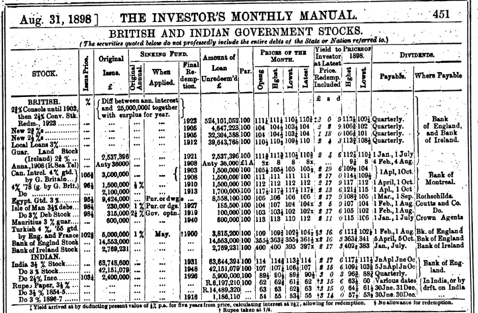

```{r setup, include=FALSE}
knitr::opts_chunk$set(echo = FALSE, warning = FALSE,
                      message = FALSE, fig.align='center', fig.retina=3,
                      out.width="75%")

```

```{r xaringan-themer, include = FALSE}
library(xaringanthemer)
style_solarized_light()
source("helper_functions/theme_lecture.R")
xaringanExtra::use_webcam()
xaringanExtra::use_tile_view()
library(tidyverse)
```

## Today's plan

.pull-left[
### 1. The export of capital

+ How much was exported?
+ When did it flow abroad?
+ How was it exported?

### 2. The consequences of capital export?

+ Why did Britain invest so much abroad?
+ Was it helpful/harmful for British growth?
]

.pull-right[
### 3. Reading the 19th century financial press: a quick tutorial

+ Some example price lists and guidance on how to read them

*****

#### Note

+ I will spend most time in the lecture tackling point 3 by going over some more technical additional readings

]
---

### 2. "...too much was invested abroad because of imperfect capital markets..."

>  "By reallocating resources, of course, any one sector of the economy could have grown faster: industry could have grown at the expense of services and exports at the expense of production for home consumption had labour and capital been allocated differently. The most popular target for hypothetical reallocation has been Britain's enormous hold- ings of capital abroad in the late nineteenth century." <br> -McCloskey, p. 451.

---

### Where did LSE investors put their money?

```{r market_weights, fig.retina=4, fig.height=4, fig.width=6}
weights <- read_csv("data/michie_lse_weights.csv",
                    col_types = "cdi")

weights <- weights %>% mutate(Market_Weight = as.numeric(Market_Weight))

weights %>% 
  ggplot(aes(Security, Market_Weight, fill = Security,
             label = Market_Weight)) +
  facet_wrap(~Year, nrow = 1) +
  geom_col(position = "dodge") +
  geom_text(nudge_y = .075) +
  theme_lecture +
  scale_fill_hc() +
  xlab("") +
  ylab("Market Weight") +
  guides(fill = FALSE) +
  coord_flip() +
  theme(axis.text.x=element_text(angle=45, hjust=1)) +
  labs(caption = "Source: Chabot & Kurz, Table 6") 
```

---

## The export of capital debate: a simple critique

### McCloskey

.pull-left40[
+ Overseas investment earns income
+ If you don't invest abroad need to do something else with the money
+ If you invest at home:
    - Maybe home investments yield lower returns (per Edelstein)
    - Anyway **additional** home investment should push the yield on domestic capital downward
+ Ergo investing more at home $\rightarrow$ fall in income
]

.pull-right60[
>"The most popular target for hypothetical reallocation has been Britain's enormous holdings of capital abroad... It is not clear, however, that exchanging domestic for foreign capital would have raised British national income. **The question is how bringing capital home could be expected to increase income and how large the increase would have been**."<br> -McCloskey 1970, p. 451
]
---

### Key assumptions of McCloskey

+ Investors *could* have invested at home or abroad
    - They *knew* about all the options
    - Equivalently, markets are integrated
+ Their decision to invest abroad tells us about relative foreign/domestic rates of return
    - This can be and has been empirically checked e.g. Edelstein, Chabot & Kurz, Goetzman & Ukov
    - "...in emphasizing the rationality of entrepreneurs denies the very notion of failure" (Kirby 1992)
+ Rates of return do not depend on investment decisions
    - Returns $\rightarrow$ investment **not** investment $\rightarrow$ returns

### Bottom line

+ This is an argument over a **counterfactual claim**: what would have happened in Britain if foreign investment had been diverted into domestic investment?
+ Counterfactual claims can only be answered with a **theory**!!

---

## Framing the debate

### Two broad questions

  1. Was it in the interests of investors to invest abroad?
  2. Was it in the "national interest" for investors to invest abroad?
      - The term "national interest" is poorly defined but usually taken here to mean growth in GDP/pc
      
---

### Was it rational for the British investor to invest so much abroad?

### Probably yes


> "When investors are given the opportunity to divide their money between home and foreign assets, the expected rate of return on domestic assets can exceed the expected rate of return on foreign assets and an unbiased, rational investor will still choose to invest a portion of her wealth overseas if the diversification benefits of foreign investment outweigh the loss of return." <br> -Chabot & Kurz, 2010

+ 518,224 individual stock or bond 28 day returns
+ The question is not whether investors should have picked foreign or investment, the question is the **optimal mix**
+ The authors compute returns by sector, test portfolios

> "The real benefit of international investing was the diversification benefit of holding foreign assets that had a low correlation with their domestic counterparts." <br> -Chabot & Kurz, 2010

---

```{r returns_variance, fig.align='center', fig.height=4, fig.width=6, fig.retina=4}
library(tidyverse)
library(ggrepel)

returns_df <- read_csv("data/portfolio_returns.csv")

returns_df %>% 
  ggplot(aes(`Std. Dev. (%)`, `28-Day Mean Return (%)`,
             label = Portfolio)) +
  geom_point(aes(color = Portfolio), size=3) +
  theme_lecture +
  geom_text_repel() +
  scale_color_hc() +
  theme(legend.position = "none") +
  ggtitle("Asset Portfolio Returns and Standard Deviations") +
  labs(caption = "Source: Chabot & Kurz 2010")

```

---

```{r returns_covariance, fig.align='center', fig.height=5, fig.width=6, fig.retina=4}

cor_mat <- read_csv("data/asset_correlation_matrix.csv", col_types = "cdddddddd")

cor_mat %>% gather("Asset2", "cor", -Asset) %>% 
  mutate(cor = as.numeric(cor)) %>% 
  ggplot(aes(Asset, Asset2, fill = cor, label = cor)) +
  geom_tile() +
  geom_text() +
  theme_lecture +
  scale_fill_viridis_c() +
  theme(axis.text.x = element_text(angle = 45, hjust = 1),
        legend.position = "right") +
  labs(fill="Correlation", caption = "Source: Chabot & Kurz 2010") +
  xlab("") + ylab("") +
  ggtitle("Correlation between asset classes")
```

---

## Was it *socially* optimal for so much investment to go abroad?

### Much harder question

1. Were there industries that *could* have raised long-run growth if pursued?
    - E.g. electrification and chemicals which become important in 20th century
    - Can investment raise productivity? Where does innovation come from?
2. Were there large social costs to foreign investments born by the public and not investors?
    - The costs of formal and informal empire in protecting the investments abroad
3. Is the market price the right metric? Maybe we should consider the amount *originally invested*?
    - Price of a security is what current holder can sell it for, **not** necessarily a reflection of the money the company got

---

## Were key domestic industries neglected?

>"Potentially successful frustrated borrowers leave no trace" <br> -Kindleberger, *Economic Growth in France and Britain*, p. 38

+ We can directly compare **observed** foreign and domestic investment
    - We cannot directly compare foreign investment and **hypothetical** domestic investment
    - Broader question of **sample selection bias**: we compare stock-exchange listed companies but this is not a random sample!
+ The case for more domestic investment:
    - Some key industries that appear important in hindsight are not extensively developed: e.g. motor industry, new techniques in steel, electricity
    - Assumption of diminishing marginal return to capital unproven: 
    
> "...in view of the fact that capital is the changing, the transforming, the dynamic element in the economy, and that it is neither homogeneous nor easily divisible, but usually lumpy and highly specific, it is by no means certain that adding to its quantity will necessarily lower its returns"<br> -Pollard, p. 502.


---

## Reading 19th century primary sources




---

#### How to read a share price list


+ **Stock**, e.g. "Guatemala 6% Sterling": Guatemalan sovereign debt pays 6% interest in sterling on nominal value
+ **Issue price**: when they created the loan what it sold for
+ **Original issue**: nominal value of debt (what is owed)
+ **Sinking fund**: is there a special fund for repayment? 
+ **Amount of loan unredeemed**: if paid back gradually how much left?
+ **Par**: nominal value of stock i.e. how much will you get paid back per stock you own. 
+ **Prices of the month**: what has the stock been trading for? E.g. Guatemala is not being traded this month
+ **Last Business Done**: last trade price. Guatemala 6% at 42 -- very low!
+ **Dividends**: where and when you can collect the interest
+ How to compute bond yield: $dividend/price = (.06 \times 100)/42 = 6/42 = .143 = 14.3\%$
