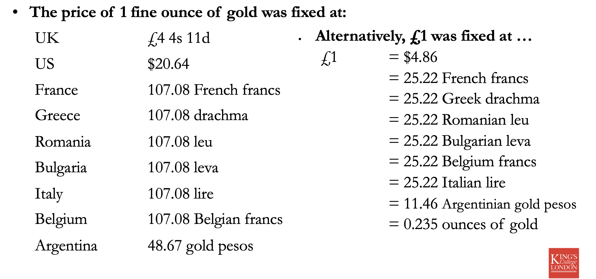
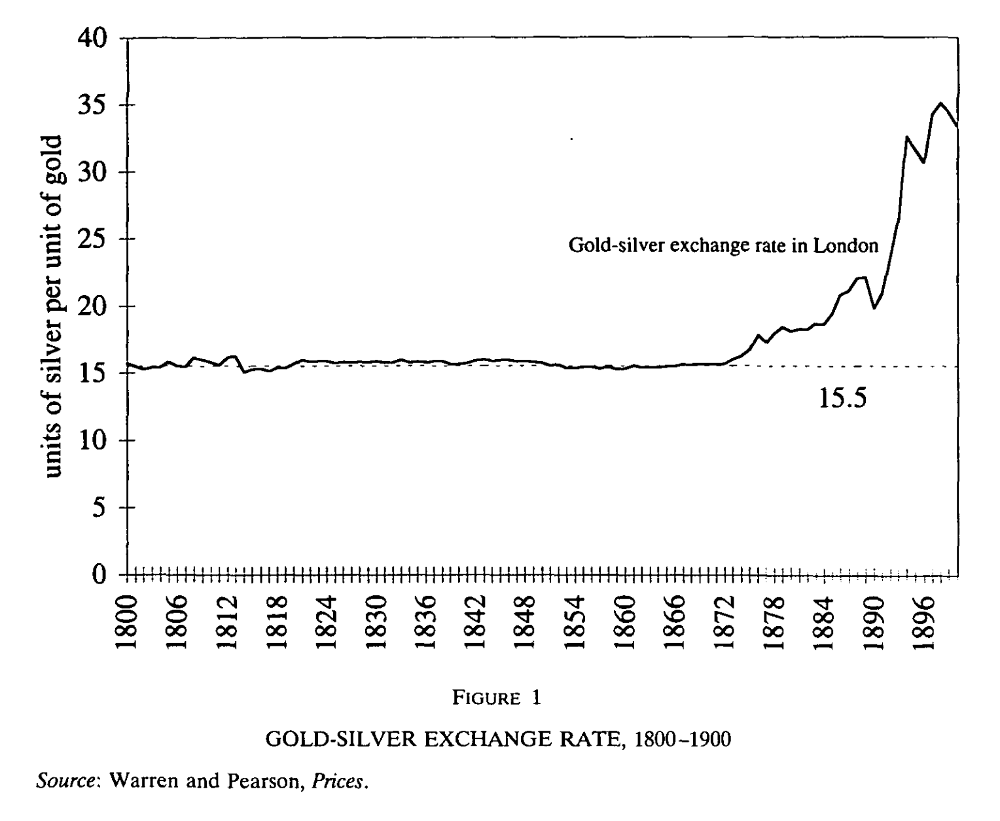
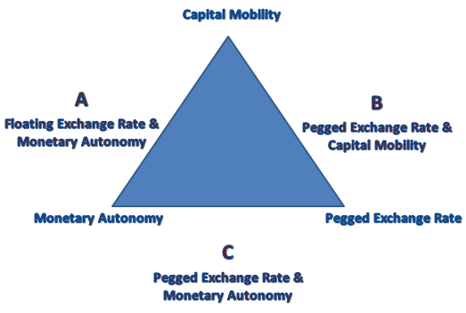
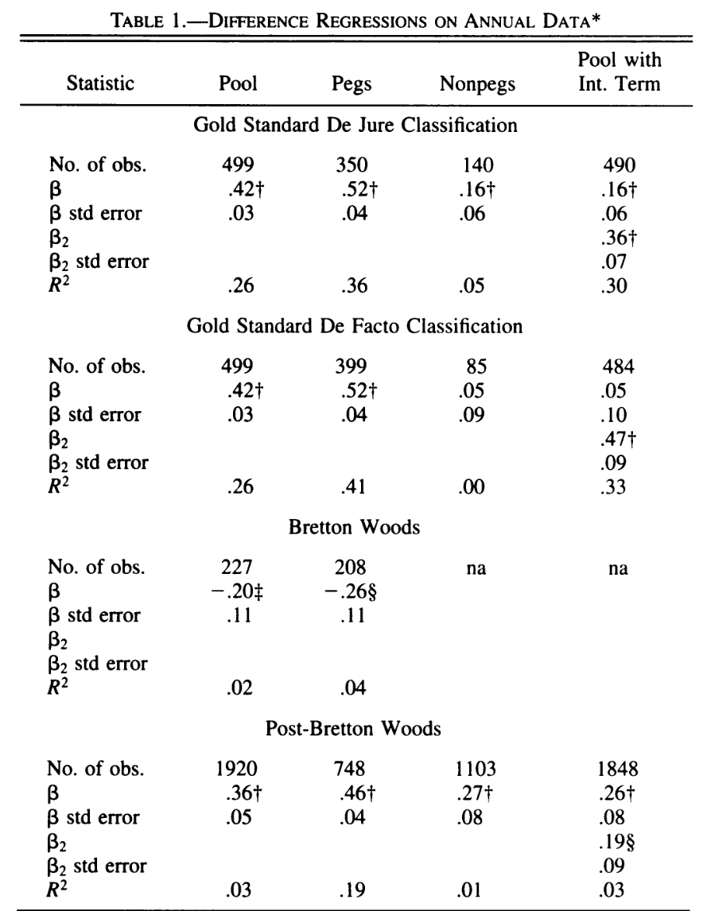

## Today's Plan

1.  What is a gold standard? Commodity money and metallic standards
2.  Stability — but for whom? Core and periphery
3.  Instability within the core: the Flandreau argument and the French
    case
4.  International finance and the trilemma

## What is a gold standard?


## What is the gold standard?

> "This phrase dates from long ago when our notes represented deposits
> of gold. At that time, a member of the public could exchange one of
> our banknotes for gold of the same value."
>
> —Bank of England

-   Notes are convertible to a fixed amount of gold

-   This implies that notes of one currency convertible to a fixed
    quantity of notes of another currency

    -   This can fluctuate a little b/c of arbitrage costs

## What is the gold standard?



## Metallic standards

Over the course of the late-19th century many countries move towards an
exclusively *gold* standard. But not all, and other metallic standards
are common, e.g. China is on a *silver* standard.

It is common in mid-19th c. to have a **bimetallic** standard e.g. gold
and silver [@redish1990; @flandreau1996; @sargent2003]

-   In a bimetallic standard notes convert to fixed amount of *gold or
    silver*.

    -   Implies gold converts to a fixed amount of silver

## How does it work?

Ricardo and other 19th c. theorists developed the 'price-specie-flow'
mechanism to describe gold-standard:

::: incremental
1.  Say Britain runs a trade deficit buying more than it sells.
2.  Pays for difference in trade balance in gold.
3.  Stock of UK gold falls so money supply contracts.
4.  Contracting money supply leads to deflation so prices fall.
5.  Lower prices make UK exports attractive so trade deficit closes.
:::

## How does it work? Adding policy {.smaller}

Central banks could follow/defy the 'rules of the game' promoting or
blocking price adjustment.

::: incremental
1.  Bank of England sees gold being exported (b/c of trade deficit e.g.)
2.  BoE can raise interest rates, this will
    1.  Attract gold to the bank from investors seeking returns
    2.  Slow economic activity
3.  Both might push down prices restoring trade balance
4.  If the bank does **not** raise interest rates, risks
    **convertibility**!

-   Central banks could also 'defy' the rules of the game, particularly
    if gold is flowing *to* the country.

    -   Can *sterilize* gold flows by buying and storing imported gold
        preventing price increases and therefore adjustment.
:::

## Stability — but for whom? {.smaller}

> "The nineteenth-century monetary mechanism succeeded, to a unique
> degree, in preserving exchange rate stability --- and freedom from
> quantitative trade restrictions --- over a large part of the world.
>
> This success, however, was **limited to the more advanced countries**
> which formed the core of the system, and to those closely linked to
> them by political as well as economic and financial ties. The exchange
> rates of other currencies — particularly in Latin America — fluctuated
> widely, and depreciated enormously, over the period. This contrast
> between the 'core' countries and those of the 'periphery' can be
> largely explained by the cyclical pattern of capital movements and
> terms of trade, which contributed to stability in the first group, and
> to instability in the second."
>
> —Triffin, quoted in @dececcco1974 [pp. 18--19]

## Instability within the core: bimetallism {.smaller}

Even within the core we see significant instability in the transition
from mixed metallic systems to the gold standard.

-   Before the 1870s the international monetary system included
    countries on **gold**, **silver**, and **bimetallism** (notably
    France).

-   By 1880, "most industrialized nations had moved to gold" — the
    international gold standard was born [@flandreau1996].

-   **What explains the shift to gold?**

## The French Crime of 1873 {.smaller}

Flandreau frames the question by contrasting the gold standard's 'golden
age' (1880–1914) with its 'gloomy age' (1920s–30s):

> "Indeed, most of the evils at work during the interwar years
> (competition among nations to attract gold, inability to enforce a
> coordinated outcome, neglect of the international effects of national
> monetary policies, and the Franco-German rivalry) were already
> operating during the 1870s. Not only did these forces contribute to
> the long deflation initiated in 1873, but they also led to the
> emergence and shaping — at least in continental Europe — of the
> international gold standard. **It was in 1873, not in the 1920s, that
> the 'Golden Fetters' were tied.**"
>
> —@flandreau1996

## Four theories of gold standard emergence {.smaller}

Flandreau identifies four schools of thought for fall of silver:

::: incremental
1.  **The fundamentals theory** — rising silver production in the late
    1860s–70s made silver relatively cheap, driving countries to gold.

2.  **The strategic theory** — Germany's demonetization of silver after
    1871 supplemented and accelerated the trend.

3.  **The technological theory** — silver was bulkier than gold and
    hence more costly for international payments.

4.  **The political economy interpretation** — creditors (the dominant
    bourgeoisie) preferred a stable store of value; gold served that
    interest.
:::

## Flandreau's argument: an accident of history {.smaller}

Flandreau argues all four theories **assume the gold standard was
inevitable**. He disagrees:

> "Far from being preordained for structural, technological, or
> political reasons, the making of the gold standard was an **accident
> of history**."
>
> —@flandreau1996

His explanation centres on the interaction between **network
externalities** and **switching costs**:

-   Growing 19th-c. trade made a common standard attractive — and gold
    nations dominated world trade, making gold a natural focal point.

-   Switching from silver to gold was costly: you needed to dispose of
    demonetized silver at acceptable prices.

## How bimetallic system worked {.smaller}

France's bimetallic system played a crucial stabilizing role — not
through central bank policy, but through **private arbitrage**.

Following a logic initially developed by Jean-Baptiste Say:

::: incremental
-   Agents can pay debts in the metal of their choice, so they seek the
    **relatively cheaper metal**.

-   This increases demand for whichever metal is depreciated, pushing
    its price back toward the legal ratio.

-   Because agents *know* the equilibrium ratio is fixed by law, they
    compete to eliminate any discrepancy — **a self-fulfilling peg**.

-   Between \~1800 and 1870, the gold-silver exchange rate was held
    within a narrow band by arbitrage.

-   France's monetary holdings adjusted **endogenously** — becoming more
    intensive in whichever metal was relatively more abundant —
    buffering global bullion shocks.
:::

## The gold-silver price ratio, 1800–1900 {.smaller}



-   Ratio held close to **15.5 silver per gold** from 1800 to 1873
-   After 1873: silver collapses in value
-   The stability was not natural — it was the French bimetallic system
    at work

## The breakdown: Franco-Prussian war {.smaller}

After 1870, the Franco-Prussian war shattered the system:

::: incremental
1.  **Germany** received a large French war indemnity — providing the
    resources to purchase gold and adopt a gold standard.

2.  Germany planned to **dispose of its demonetized silver** through
    France's bimetallic system, which had previously absorbed such
    shocks.

3.  **France retaliated** by suspending silver coinage — attempting to
    block Germany's move.

4.  But German legislation had already committed to the switch; France's
    suspension only **triggered a global flight from silver**.

5.  Result: a **blatant failure of international cooperation** — the
    gold standard emerged not by design, but from a sequence of
    strategic miscalculations.
:::

## International finance and the gold standard {.smaller}

-   Under the international gold standard central banks worked to make
    sure that their *exchange rate remained stable* against other gold
    standard currencies [@flandreau].

    -   A system of **fixed exchange rates**

-   They did this mostly by using the interest rate to regulate the
    amount of gold in the country and held by the central bank.

    -   Interest rate policy is directed towards **exchange rate
        stability** not domestic economy.

-   Today central banks (e.g. BoE) have a different target: they aim at
    price stability and a steady rate of inflation.

## The trilemma

> "Policymakers in open economies face a macroeconomic *trilemma*.
> Typically they are confronted with three typically desirably, yet
> jointly unattainable, objectives:
>
> 1.  to stabilize the exchange rate;
> 2.  to enjoy free international capital mobility;
> 3.  to engage in a monetary policy oriented toward domestic goals."
>
> @obstfeld2005

## The trilemma



## The trilemma in history

::::: columns
::: column
Can pick **two** out of:

1.  Stable exchange rates
2.  free capital mobility
3.  and flexible domestic monetary policy
:::

::: column
1.  Classical gold standard (1870s-1914): 1 & 2
2.  Interwar gold standard (1918-1938): 1 & 2 but working poorly
3.  Bretton woods (1950s-1973): 1 & 3
4.  Current regime (1970s-present): mostly 2 & 3
:::
:::::

## The trilemma: *testing* historical monetary policy regimes {.smaller}

All the pieces of trilemma are **hard to measure**.

1.  Exchange rate stability is the easiest but still imperfect, e.g. if
    a currency is **officially** pegged, does it trade at the peg in
    **practice**?
2.  Capital mobility is difficult to track.
3.  How do we know if domestic monetary policy is being exercised
    'flexibly'?

-   @obstfeld2005 propose testing **short-run nominal interest rate
    deviations** from a global benchmark
-   What if domestic authorities 'flexibly' choose to follow the global
    benchmark?

## Testing the trilemma: Interest rates {.smaller}

Call the short-term interest rate of country $i$ at time $t$: $R_{it}$
and the global baseline rate $R_{bt}$.

Not straight-forward to test the relationship between $R_{it}$ and
$R_{bt}$: interest rates often have high **autocorrelation**. If
interest rate levels tend to drift in a given direction, this can lead
to a case of **spurious regression** — a common problem when studying
time series.

. . .

::::: columns
::: column
-   Any two variables with a **time-trend** will appear correlated
    -   E.g. annual measures since 1990 of my height and the number of
        times Nicholas Cage has been married
    -   Not causal (I don't think!)
:::

::: column
For more on spurious regression see: @granger1974
:::
:::::

## Testing the trilemma: Specifications {.smaller}

Focus on relationship between **changes** in interest rates ( $\Delta$
is often used to symbolize a difference over time)

$\Delta R_{it} = \alpha + \beta \Delta R_{bit} + u_{it}$

Then consider relationship including an **error-correction term**. If
interest rates diverge how long does it take for them to come back
together?

$\Delta R_{it} = \alpha + \beta \Delta R_{bit} + \theta (c + R_{i,t-1} - \gamma R_{bi,t-1}) + u_{it}$

If no arbitrage costs we predict $\beta = 1$. Practically, expect
$\beta$ to be much lower even if still binding.

## Results in differences {.smaller}

::::: columns
::: column
-   Pegged currencies have $\beta$ coefficients that are larger
-   Gold standard and post-Bretton Woods have similar magnitude
    -   **But**: under Gold Standard this explains a lot more of the
        variation in interest rates
-   Some evidence for *fear of floating*
:::

::: column
{width="540"}
:::
:::::

------------------------------------------------------------------------

## Results with cointegration {.smaller}

::::: columns
::: {.column width="60%"}
```{r, fig.align='center', fig.retina=4}
library(tidyverse)

df <- tibble(regime = c("1870-1914: Gold Standard", "1870-1914: Gold Standard",
                             "1945-1973: Bretton Woods",
                             "1973+: Post-Bretton Woods", "1973+: Post-Bretton Woods"),
             fixed = c("Peg", "Non-Peg", "Peg", "Peg", "Non-Peg"),
             theta = c(-.27, -.16, -.11, -.19, -.06),
             Halflife = c(4.79, 4.44, 9.28, 7.84, 35.16))

df |>
  ggplot(aes(fixed, Halflife, fill = fixed)) +
  geom_col() +
  facet_wrap(~regime) +
  theme_minimal() +
  ylab("Number of months adjustment takes")

```
:::

::: {.column width="40%"}
-   For the Gold Standard: 'gold points' (costs of arbitrage) plus
    tendency for British rate to mean-revert means you can partially
    adjust and wait
-   But adjustment is still **much faster** than other eras.
:::
:::::

## Questions

-   Why is there a trilemma? Do you agree that policy-makers have three
    choices or are there really only two?

-   Flandreau argues the gold standard was an 'accident of history'. Do
    you agree?

-   Is the collapse of bimetallism better explained by politics or
    economics? What does this tell us about international monetary
    cooperation more generally?

-   Why was there such a strong political consensus in Britain around
    the gold standard in the late-19th century?

## Works Cited
