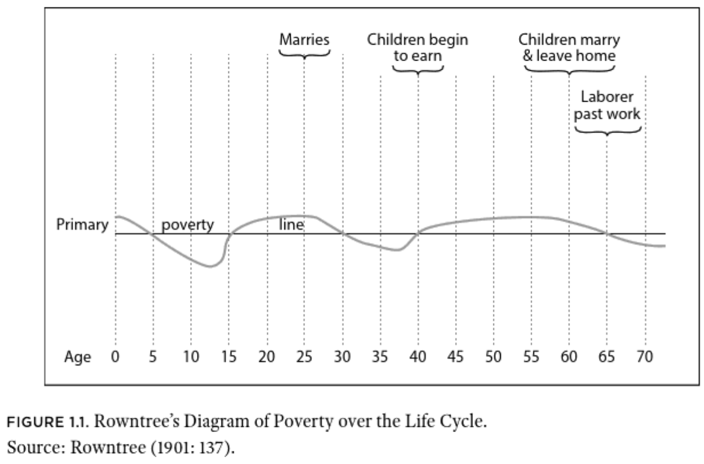
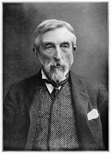
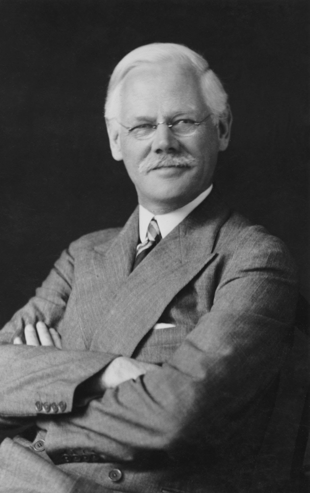
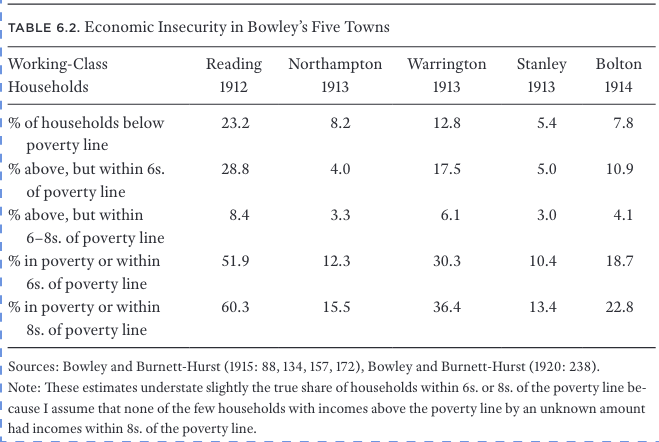
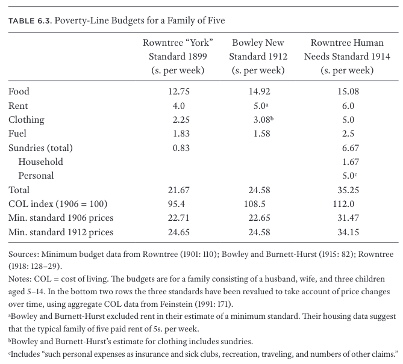
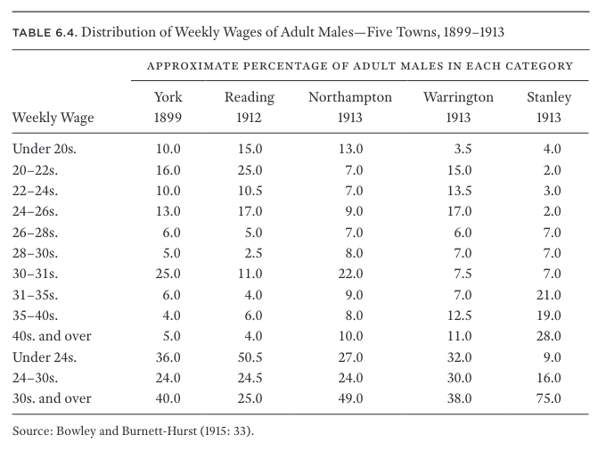
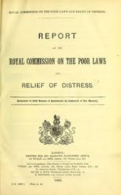
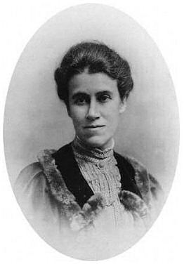
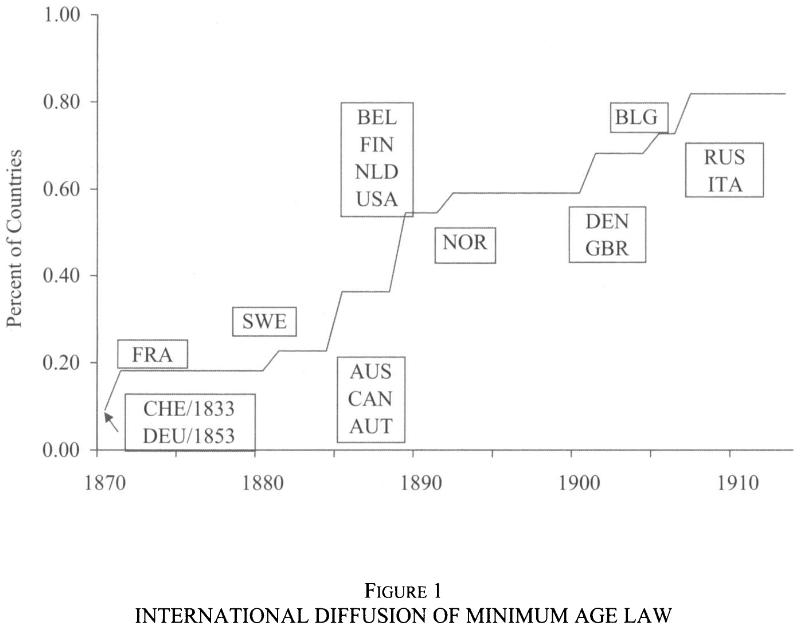

```{r setup, include=FALSE}
knitr::opts_chunk$set(echo = FALSE, warning = FALSE,
                      message = FALSE, fig.align='center', fig.retina=3,
                      out.width="75%")


```

```{r xaringan-themer, include = FALSE}
library(xaringanthemer)
style_solarized_light()
source("helper_functions/theme_lecture.R")
xaringanExtra::use_webcam()
xaringanExtra::use_tile_view()

library(tidyverse)
library(ggplot2)
```

## Today's Plan

### 1. Poverty and Economic Precarity

### 2. The Campaign Against Outrelief (CAO) and Welfare Provision

### 3. The Liberal Reforms


---

# Wages, Living Standard and Precarity

.pull-left[
> "However steady a man may be, however good a worker, he is never exempt from the fear of losing his job from ill-health or from other causes which are out of his control. . . . To the insufficiency of a low wage is added the horror that it is never secure." <br> —Reeves in Boyer, p. 1

]

.pull-right[
#### The industrial economy introduces new sources of risk

> "the peasant is insecure, but he curses the weather, not social institutions." <br> —Tawney in Boyer, p. 3
]

**************

> "By focusing on trends in full-time earnings, historians often miss what happened to those in households where the prime-age male breadwinner was unemployed or too sick to work, households headed by female workers due to the death or absence of an adult male, and households where the breadwinner, whether male or female, was too old to work or at least to work full-time."<br> —Boyer, p. 4.

---

## Economic Insecurity

.pull-left60[
#### Varies over life-cycle


+ The share of population that **ever** experiences poverty much larger than share in poverty at any given moment
]


.pull-right40[

> "The extent of working-class insecurity in Victorian Britain was determined by the interaction of three factors: **the probability of large negative income shocks**; the ability of households to buffer income shocks with **savings or insurance benefits** from friendly societies or trade unions, or assistance from kin; and **the existence and generosity of government social policies** (or charitable institutions) that provided benefits to partially offset income loss." <br> —Boyer, p. 5
]

---

## Economic Insecurity in British Economic History

.pull-left40[
> The main causes of negative income shocks for working-class households were **unemployment**, **wage and hours cuts**, and prolonged **periods of illness** of the main breadwinner. To these should be added **old age**, when individuals were no longer able to work, or at least to work full-time. <br> —Boyer, p. 11.
]

.pull-right60[
```{r share_insecure, fig.height=4, fig.width=6, out.width="100%"}
library(ggalt)
library(ggrepel)

insec_dat <- tibble(date_source = c(1802, 1861, 1867,1911),
                    share_insec = c(42.3, 44, 43.5, 33))


insec_dat %>% 
  ggplot(aes(date_source, share_insec, label = paste0(share_insec, "%"))) + 
  geom_lollipop(point.colour = "#d30102", point.size = 7) +
  geom_text_repel(nudge_y = 10) +
  xlab("") +
  ylab("Percent Insecure") +
  ylim(c(0,75)) +
  theme_lecture +
  labs(title = "Share of Households/Workers that are Economically Insecure", 
       caption = "Boyer's calculations from diverse sources, p. 10") 

```

]


---

# The state of poor relief

+ Recall the 'reform' of the Poor Law in 1834
  - Big push to have relief provided 'indoors' meaning within institutions
  - The logic of institutionalization was to dissuade people from seeking relief
  
### Challenges of the 1840s and 1860s

> "the system used to finance the Poor Law was not able to handle sharp increases in demand for relief."

<br>

> "while it was possible to raise large amounts of charitable assistance quickly, that aid, when administered in an indiscriminate manner, often did more harm than good."

<br>

> "the “principles of 1834” clearly were not being enforced in northern industrial cities or working-class districts of London"

---

# The Campaign Against Outrelief


.pull-left[
+ Non-legislative initiative to push for more poor law provision **indoors**
+ Coupled with broader mid-Victorian 'ethic of respectability and self-help'

<br>

> “simple industry and thrift will go far towards making any person of ordinary working faculty comparatively independent in his means. Even a working man may be so, provided he will carefully husband his resources.” <br> —Smiles, in Boyer, p. 78.
]

.pull-right[

]

---

```{r wages_poverty, fig.height=4, fig.width=6, out.width="80%"}

wage_dat <- tibble(cat = c("1. H. Skill", "2. H. Skill", 
                           "3. L. Skill", "4. L. Skill",
                           "5. Unskill", "6. Unskill"),
                   av_week_wage = c(31.5, 26.1, 22.5, 19.8, 15.75, 12.6))

wage_dat %>% 
  ggplot(aes(cat, av_week_wage, label = paste0(av_week_wage, " s."))) + 
  geom_lollipop(point.colour = "#d30102", point.size = 7) +
  geom_text(nudge_y = 4) + 
  geom_hline(aes(yintercept = 18, color = "Poverty")) +
  geom_hline(aes(yintercept = 28, color = "Minimum Comfort")) + 
  theme_lecture + 
  scale_color_economist() +
  ylim(c(0, 40)) + 
  ylab("Average Weekly Wage (Shillings)") + 
  xlab("") +
  labs(title = "Average Weekly Wage and the Poverty Line",
       caption = "Data from Boyer p. 80. Poverty lines from text -- approximate average by areas.")

```


---

## Political economy of poor law provision

+ Key legislative changes
  - Union Chargeability Act (1865) & Metropolitan Poor Act (1867)
  - **Shifts tax burden from poor to middle-class parishes**

****************

.pull-left[
+ The prior system:
  - Parishes nested in Poor Law unions
      + Each parish relieves its *own* poor
      + Parishes pay into Union proportional to their average expenditure on paupers, e.g. places where poor people live pay more
  - Only 'settled' persons eligible:
      + Mostly means you need to be born there
      + If you apply for relief while unsettled can be removed from parish
      + Used to dissuade applications
          - Particularly effective in cities with large migrant labor pools
]

.pull-right[
> "Poor Law unions’ boards of guardians typically were dominated by members from the wealthier parishes, who responded to the increase in their taxes by looking for ways to reduce relief costs." —Boyer, p. 84

.center[**Union Chargeability Act makes tax contributions based on property values and allows 'settlement' within 1 year**]

]


---

## Changes in Poor Relief

.pull-left[
```{r boyer_plot, fig.height=4, fig.width=4, out.width="90%"}

boyer_text <- "1861 108 709 817 4.1 1,830 9.2 13.2 1862 119 743 862 4.3 1,931 9.6 13.8 1863 123 872 995 4.9 2,229 10.9 12.4 1864 120 844 964 4.7 2,159 10.5 12.4 1865 118 783 901 4.3 2,018 9.7 13.1 1866 118 746 864 4.1 1,935 9.2 13.7 1867 122 755 877 4.1 1,964 9.2 13.9 1868 134 801 935 4.3 2,094 9.7 14.3 1869 140 817 957 4.4 2,144 9.8 14.6 1870 141 838 979 4.4 2,193 9.9 14.4 1871 140 843 983 4.4 2,202 9.8 14.2 1872 133 791 924 4.1 2,070 9.1 14.4 1873 128 702 830 3.6 1,859 8.0 15.4 1874 127 646 773 3.3 1,732 7.4 16.4 1875 129 616 745 3.1 1,669 7.0 17.3 1876 125 567 692 2.9 1,550 6.5 18.1 1877 130 530 660 2.7 1,478 6.1 19.7 1878 139 527 666 2.7 1,492 6.0 20.9 1879 147 555 702 2.8 1,572 6.3 20.9 1880 159 582 741 2.9 1,660 6.5 21.5 1881 161 561 722 2.8 1,617 6.3 22.3 1882 161 557 718 2.8 1,608 6.2 22.4 1883 162 551 713 2.7 1,597 6.0 22.7 1884 160 534 694 2.6 1,555 5.8 23.1 1885 162 533 695 2.6 1,557 5.8 23.3 1886 164 542 706 2.6 1,581 5.8 23.2 1887 167 555 722 2.6 1,617 5.9 23.1 1888 170 554 724 2.6 1,622 5.8 23.5 1889 168 548 716 2.6 1,604 5.7 23.5 1890 166 530 696 2.5 1,559 5.5 23.9 1891 163 515 678 2.4 1,519 5.3 24.0 1892 163 499 662 2.2 1,483 5.0 24.6 1893 169 505 674 2.3 1,510 5.1 25.1 1894 180 519 699 2.4 1,566 5.3 25.8 1895 184 523 707 2.4 1,584 5.3 26.0 1896 187 535 722 2.4 1,617 5.3 25.9 1897 186 530 716 2.3 1,604 5.2 26.0 1898 188 525 713 2.3 1,597 5.1 26.4 1899 190 538 728 2.3 1,631 5.2 26.1 1900 188 500 688 2.2 1,541 4.8 27.3 1901 204 494 698 2.2 1,564 4.8 29.2"

boyer_dat <- as_tibble(matrix(str_split(boyer_text, " ")[[1]] , 
                              ncol = 8, byrow = TRUE, 
                              dimnames = list(NULL, 
                                              c("Date", "Indoor Relief (1,000s)", 
                                                "Outdoor Relief (1,000s)", 
                                                "Total on Relief (1,000s)", 
                                                "Percentage Receiving Relief", 
                                                "Total on Relief (1,000s) 12-month", 
                                                "Percentage Receiving Relief 12-month", 
                                                "Percentage Relieved Indoors ")))
                       ) %>% 
  mutate(`Total on Relief (1,000s) 12-month` = as.numeric(gsub(",", "", 
                                          `Total on Relief (1,000s) 12-month`))) %>% 
  mutate_all(as.numeric)


p1 <- boyer_dat %>% 
  ggplot(aes(Date, `Percentage Relieved Indoors `)) + 
  geom_point() + geom_line() + 
  theme_lecture + 
  xlab("") + 
  ggtitle("Percentage Relieved Indoors", subtitle = "1861-1901")


p2 <- boyer_dat %>% 
  ggplot(aes(Date, `Total on Relief (1,000s)`)) + 
  geom_point() + geom_line() + 
  theme_lecture + 
  xlab("") +
  ggtitle("Number of Persons on Relief", subtitle = "1861-1901")

p1
```
]

.pull-right[

```{r boyer_plot2, fig.height=4, fig.width=4, out.width="90%"}
p2
```

]

---

# Did CAO save money?

+ Not really
  - It is more expensive to administer relief 'indoors'
  - This is not wholly offset by putting people off
  - Total real expenditures on relief **increase** between 1871 and 1881 by 7.3%

<br>
  
**************

<br>

> "In sum, while the crusade led to a sharp reduction in numbers on relief, as the COS and LGB predicted, their assertion that the workhouse test would reduce local poor rates was not correct, at least not in the short run." <br> —Boyer, p. 89.

---

## The CAO and Self-Help

.pull-left[
```{r bank_depos, fig.height=5, fig.width=5, out.width="90%"}

bank_depos <- tibble(date = seq(1850, 1910, 5),
                     wc_depos = c(7.23, 8.58, 10.33, 13.56, 15.93, 
                                  20.28, 23.31, 28.23, 33.36, 42.96,
                                  56.1, 61.44, 66.36))
bank_depos %>% 
  ggplot(aes(date, wc_depos)) + 
  geom_point() + 
  geom_line() + 
  theme_lecture + 
  ylab("Bank Deposits (£ million)") +
  ggtitle("Estimated Working-Class Bank Deposits")

```
]

.pull-right[
```{r fstubens, fig.height=5, fig.width=5, out.width="90%"}

fstu <- tibble(date = c("1871", "1891", "1911"),
               perc_ben = c(39, 47, 48))

fstu %>% 
  ggplot(aes(date, perc_ben, label = paste0(perc_ben, "%"))) + 
  geom_lollipop(point.colour = "#d30102", point.size = 7) +
  geom_text(nudge_y = 4) + 
  theme_lecture + 
  ylab("% Males with Sickness Benefits") + 
  xlab("") +
  ylim(c(0, 70)) + 
  labs(title = "Percentage of Males with Sickness Benefits",
       subtitle = "Friendly Societies and Trade Unions")

```

]
---

## The condition of england question revisited

> "The decade and a half from the turn of the twentieth century to the First World War saw an outpouring of work on poverty, economic insecurity, and living standards of the poor. ...With few exceptions, they all reached similar conclusions. **Despite growth in the average earnings of manual workers since 1850, economic insecurity and poverty remained widespread at the beginning of the new century.** Many within the working class apparently had benefitted little from the rising tide of late Victorian economic growth."

.pull-left.center[


Charles Booth
]

.pull-right.center[


Seebohm Rowntree
]

---

## Poverty before WWI

.center[

]

---

.pull-left[

## Poverty Lines and Wages at the end of the 19th C.


]

.pull-right[



> "the principal cause of poverty was deemed to be low wages, or low wages combined with large families. ...The finding that low wage rates was a major cause of poverty was surprising to many contemporaries" <br> —Boyer, p. 174-5

]

---

### The Royal Commission on the Poor Laws and the Relief of Distress


.pull-left[
.center[

]

> “never can so important a Royal Commission have produced so little in the way of immediate action.” <br> —Derek Fraser
]

.pull-right[

 

Beatrice Webb & Helen Bosanquet
]

---

### Liberal govt and reform

.pull-left60[
+ New Liberal government pushes through multiple reform acts

1. *1906 Education (Provision of Meals) Act* school meals
2. *Old Age Pension Act (1908)* in operation 1909
  - 5*s.* to people over 70 with income below £21
  - Pensioners **much** larger than expected $\rightarrow$ implies a **lot** of old people poor but avoiding the poor house
3. *Trade Boards Act (1909)* sets minimum wages in specific industries associated with sweat-shops
4. *Labour Exchanges Bill (1909)* which tries to match unemployed to employers
5. *Part II National Insurance Bill (1911)* unemployment insurance
    - Mandatory within a small set of industries
    - Covers about 20% of male labour force
    - Premiums paid by employees, employers and state
6. *Part I National Insurance Bill (1911)* health insurance
    - Faces more opposition
    - Compulsory and means-tested (less than £160 p.a.)
]

.pull-right40[
> "The Liberal Welfare Reforms, considered together, represent a major shift in British social welfare policy. They provided a minimum level of assistance outside of the Poor Law to the sick, the unemployed, and the aged, and in doing so reduced the economic insecurity associated with industrial capitalism." <br> —Boyer, p. 204
]

---

# The political economy of reform

.pull-left[
+ The role of voice?
    - Extension of the franchise
+ Political competition?
    - The rise of labor
]

.pull-right[
> “unless we can prove . . . that there is no necessity for a separate party to press forward the legitimate claims of Labour, you will find that . . . the Liberal Party will be practically wiped out and that, in its place, you will get a more extreme and revolutionary party.” <br> —Lloyd George

]

> "In October 1906, Lloyd George, then President of the Board of Trade, stated in a speech at Cardiff that if the Liberal Parliament would do something “to remove the national degradation of slums and widespread poverty and destitution” and provide “an honourable sustenance for deserving old age, . . . then the Independent Labour party will call in vain upon the working men of Britain to desert Liberalism that is so gallantly fighting to rid the land of the wrongs that have oppressed those who labour in it.”" —Boyer, p. 207

---

## Reform in international context

+ Britain is, if anything, a laggard in this kind of social legislation
+ Britain is also under-performing its GDP/pc rankings
  - Welfare is 'high' relative to europe in GDP/pc terms but middling in terms of biological welfare/schooling 

.pull-left[
#### Copying?

+ Daniel Rogers has argued for international diffusion of policy ideas within the atlantic world:
  - Liberals are "eager policy borrowers, scavengers across the boundaries of national cultures"
  - But conversely the policy details of liberal reforms don't look *that much* like e.g. German model
  
#### Conditionality and Trade?

+ Huberman & Meissner
]

.pull-right[

.center[]

+ Suggest that inter-linking trade agreements within Europe drove **stronger** social protections
+ Argue this helps to explain 'new world'/'old world' split 
  - Relevant to Britain?
]

---

class: inverse, center, middle

# Conclusion

> What explains the rise of social assistance legislation at the start of the 20th century?

<br>

> Boyer tells a tidy national history of social protection evolving within Britain, but why is the periodization of social protection similar globally? Do we believe the Huberman & Meissner story?

<br>

> Should the persistence of intense poverty, particularly poverty among the employed, cause us to revise the way we think about claims that the 19th c. economy was 'efficient' or operating 'as best it could'?