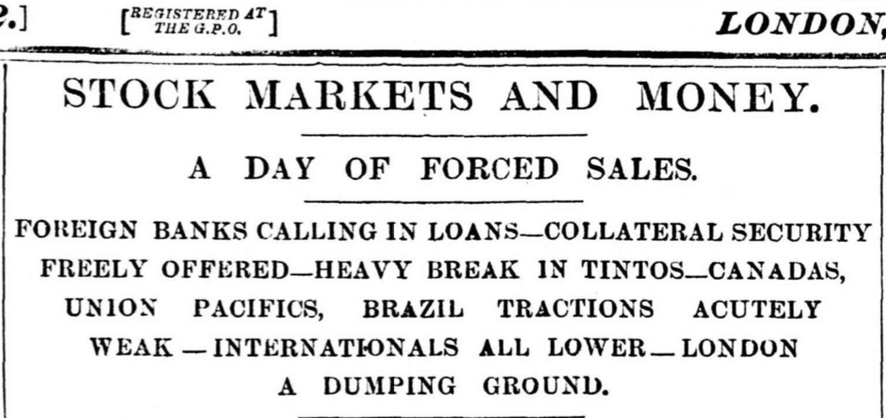
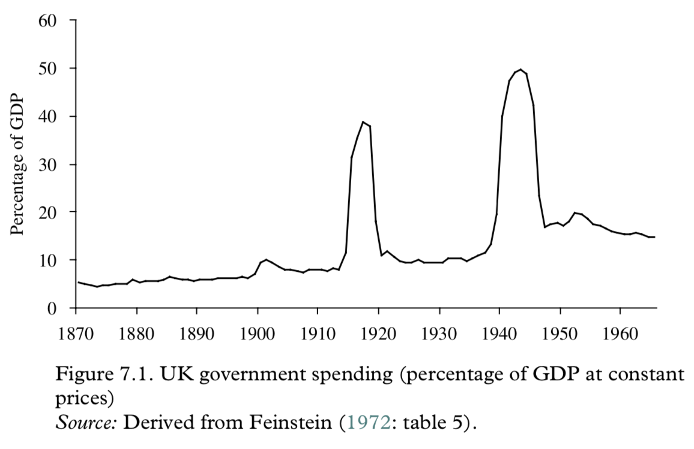
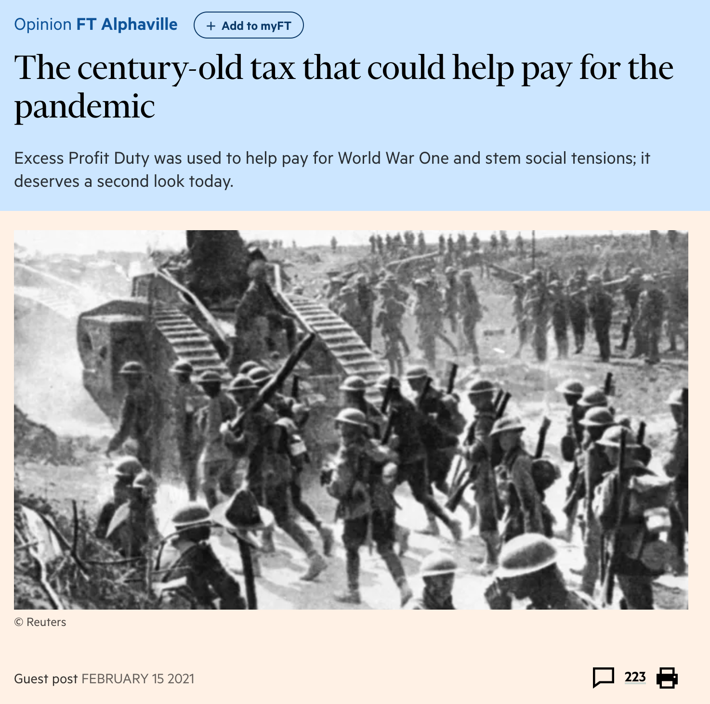

```{r setup, include=FALSE}
knitr::opts_chunk$set(echo = FALSE, warning = FALSE,
                      message = FALSE, fig.align='center', fig.retina=3,
                      out.width="75%")


```

```{r xaringan-themer, include = FALSE}
library(xaringanthemer)
style_solarized_light()
source("helper_functions/theme_lecture.R")
xaringanExtra::use_webcam()
xaringanExtra::use_tile_view()

library(tidyverse)
library(ggplot2)
```

# Today's Plan

### 1. Economics and the Origins and Conduct of the War

### 2. The British Economy during the War

---

# Did WWI have an economic origin?

### Some theorists suggesting that it might...

#### Mercantilism

+ Ideas of economic nationalism
+ Mackinder/Mahan "affected by current notions of Social Darwinism that regarded nations and especially races as engaged in a constant struggle"

#### Imperialism

+ Smith/Marx/Hobson/Lenin/Luxembourg theories that tie imperialism to global conflict

> "The theme of the competition of capitalists for raw materials overseas as leading to war ...The competition of empires led to war." <br> —Offer, p. 10.

---


> "The aim of this essay is to question this common sense view of World War I as disrupting the world economy and putting an end to an era of globalization. ...We offer a narrative sketch of how one might write **a history in which the war figured not as an exogenous shock**, but as a moment of convulsive and violent realignment endogenous to that history. ...what is at stake are **the destabilizing consequences of convergence**, the basic prediction of any neoclassical vision of globalization. ...Being converged upon by Imperial Russia was every bit as unsettling to the powers of Western Europe before 1914, as the rise of China is to the United States today."<br>
-Tooze & Fertik

### A cause of WWI?

> "...capital flows and technology transfer helped Russia converge on the established powers. This disrupted pre-existing geopolitical equilibria and led Germany in particular to devise military strategies to counter the threat. ...the spread of the Industrial Revolution to Germany had earlier undermined the geopolitical equilibrium in Europe.." (O'Rourke 2019, 373).

---

# Did WWI have an economic origin?

### Some theorists suggesting it *made no economic sense*

> "The more the ultimate political and social consequences of the modern war are calmly contemplated, the more clearly will it be evident that if war is possible it is only possible ... at the price of suicide." <br> —I.S. Bloch, 1899

+ War would be so catastrophic, and so damaging to international economic system there was no 'economic' rationale to explain it.
+ Normal Angell's *The Great Illusion* (1910):
  - international web of credit/trade would be destroyed by war

**************
  
> "What is an *economic* interpretation of the First World War? ...two possible approaches. **One** is to regard the war as a problem of management, to consider the endowment[s] ...and how it affected the preperations for, the conduct and the outcome of the war. **Another** is to seek for patterns of rationality in the planning conudct and conclusion of the war. But rationality is a slippery concept." <br> —Offer, p. 15

---

## Economics and Planning for War

### Offer's thesis

> "...Britain's late-Victorian policy of free trade led to the Edwardian naval arms race and became a source of insecurity and instability. British naval hegemony, the condition of peace, was no longer tenable in a world of so many workshops. ...The real assets of British security were the bonds and resources of the English-speaking world overseas: economic, social, political, sentimental, forming a complex but effective system of practical kinship. This formidable system failed to deter, because it was not sufficiently visible to Germany, whose view of the world was circumscribed and limited to Europe."<br> —Offer, p. 6

+ Britain depends on food imports
+ So does Germany to a lesser degree
+ Causes strategic planning in both places to focus on shipping/blockades

> "...for Britain to face the Atlantic and not the Channel: to rely on overseas assets, to align with the Dominions and the United States, and to avoid a military commitment to Europe"

+ Offer suggests pushes towards naval build-up.

---

# The British Economy during WWI

> "...World War I was a watershed for the international economy, and the central role of Britain in the pre-1914 world economy was lost" <br> —Broadberry & Howlett

+ Major changes in 
  1. Government involvement in the economy
  2. Patterns of international trade
  3. Patterns of international finance
  4. Functioning of international monetary system
  5. Strength of labour representation
  6. Role of women
  7. Political participation
  8. Etc.
+ Some of these changes we will survey in coming weeks, some today

---

## Short-term impacts: the London Stock Exchange

#### LSE is shut-down on 31 July 1914

> "...Austria’s belligerent ultimatum to Serbia on Thursday 23 July — that transformed risk perceptions of the possibility of a major European war. It ‘came like a bombshell’, stated Bankers’ Magazine under the headline ‘The Great Crisis’. As fear supplanted greed there was a universal dash for cash, preferably gold. All sellers and no buyers meant that markets quickly ceased to function." <br> —Roberts, p. 5

.pull-left[
#### Why did the LSE close?

+ International webs of credit flow to LSE
+ European banks refuse to renew repo agreements
+ Continental exchanges suspend payments to LSE
  - Shut-down to avoid massive payments crash and bankruptcies!
+ **Example of fragility of interrupted interdependence**
]

.pull-right[

]

---

## The war effort and the economy

.left-column[
### The Scale of mobilization

+ Comparable to WWII
+ Unprecedented
]

.right-column[

]

---

## The war effort and the economy

```{r exp_gdp, fig.height=3.5, fig.width=6, out.width="80%", fig.retina=4}

gdp_shares <- tibble(date = 1913:1919,
                     Consumption = c(77.2, 76.9, 71.4, 65.6, 60.2, 60.7, 76.1),
                     Government = c(8.1, 11.5, 31.2, 35.6, 38.7, 37.7, 18.1),
                     Investment = c(7.6,7.7,-2.3,-4.3,0.9,4.4,5.5))

gdp_shares$`Net exports` <- 100 - rowSums(gdp_shares) + gdp_shares$date

gdp_shares %>% 
  pivot_longer(cols = -date) %>% 
  ggplot(aes(date, value, fill = name)) + 
  geom_bar(position = "dodge", stat = "identity") + 
  theme_lecture + 
  scale_fill_hc() + 
  ggtitle("British Expenditure Shares in GDP",
          subtitle = "1913 to 1919") + 
  ylab("Share (%)") + 
  xlab("")

```

---

## The war effort and the economy

```{r fin, fig.height=3.5, fig.width=6, out.width="80%", fig.retina=4}

fin_df <- tibble(date = 1914:1918,
                 `Budget deficit` = c(334, 1222, 1625, 1989, 1690),
                 `Long debt` = c(391, 458, 1477, 748, 1019),
                 `Short debt` = c(64, 510, 95, 484, 247),
                 `Money base` = c(73, 27, 56, 42, 123))

fin_df %>% 
  pivot_longer(cols = -date) %>% 
  ggplot(aes(date, value, fill = name)) + 
  geom_bar(position = "dodge", stat = "identity") + 
  theme_lecture + 
  scale_fill_hc() + 
  ggtitle("British Defecit Financing",
          subtitle = "millions of pounds") + 
  ylab("Pounds m.") + 
  xlab("")

```

---

## The war effort and the economy

```{r debt_gdp, fig.height=3.5, fig.width=6, out.width="80%", fig.retina=4}

debt_inf <- tibble(date = 1913:1919,
                   `Debt/GDP` = c(26.2, 40.6, 64.4, 99.9, 116.3, 127.5, NA),
                   `Retail Price Index` = c(100, 101, 121, 143, 173,199,211))

debt_inf %>% 
  pivot_longer(cols = -date) %>% 
  ggplot(aes(date, value)) + 
  geom_point(size = 3, shape = 1) + 
  geom_line() +
  facet_wrap(~ name, scales = "free_y") + 
  theme_lecture + 
  ggtitle("Debt and Inflation During the War") + 
  ylab("%") + 
  xlab("")

```

---

.pull-left[

## Taxes
  
> "The excess profits duty was **probably the most significant wartime fiscal innovation.** It was **the first tax to be levied on companies as opposed to their shareholders**. ...it taxed profits in excess of a stipulated peacetime standard. The rate was initially 50 per cent, but was increased to 60 per cent in April 1916 and then to 80 per cent in May 1917. There is no doubt that it was subject to much evasion and fraud (Stamp 1932: 216), but even so it was spectacularly successful as a revenue generator. By 1918/19 it was generating £285 million for the exchequer, almost a third of total revenue, making it the single most important tax wielded by the state."
]

.pull-right[
+ Shift in levels and sources of tax revenue
  - From indirect to direct
  - Growth of tax base as threshold lowered + inflation


]

---

## Preview

1. Next week:
  + Fiscal and monetary consequences of the war
    - Reperations
    - Webs of international war loans
    - Currency instability
    - Crisis
    
2. Week after:
  + Problems for the British economy after the war
    - Currency management
    - Wage levels
    - Export markets
    - Industrial structure
    
    