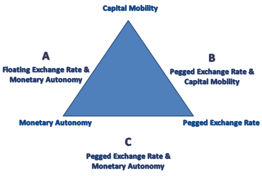
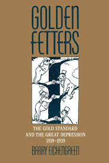
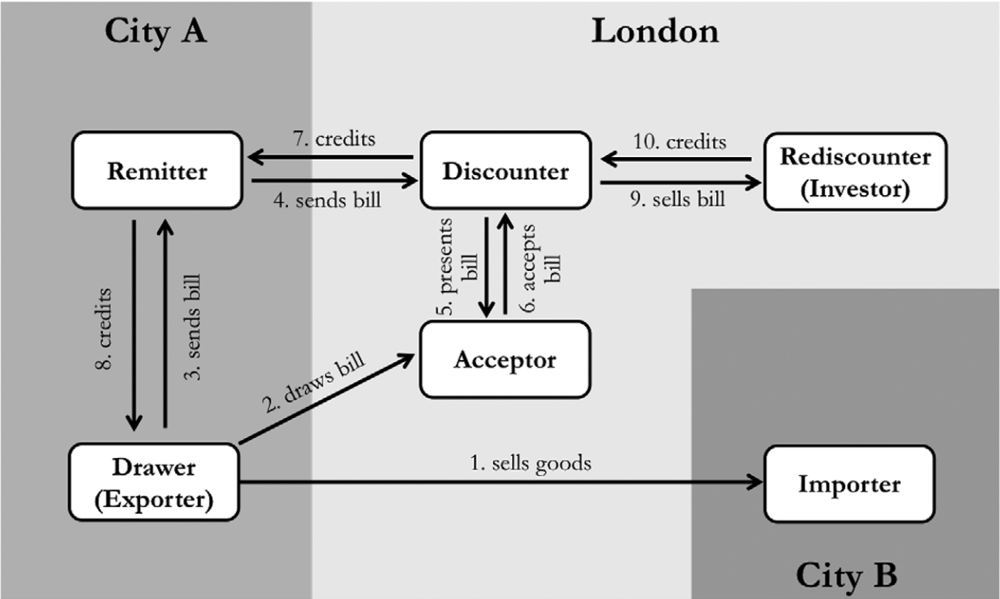
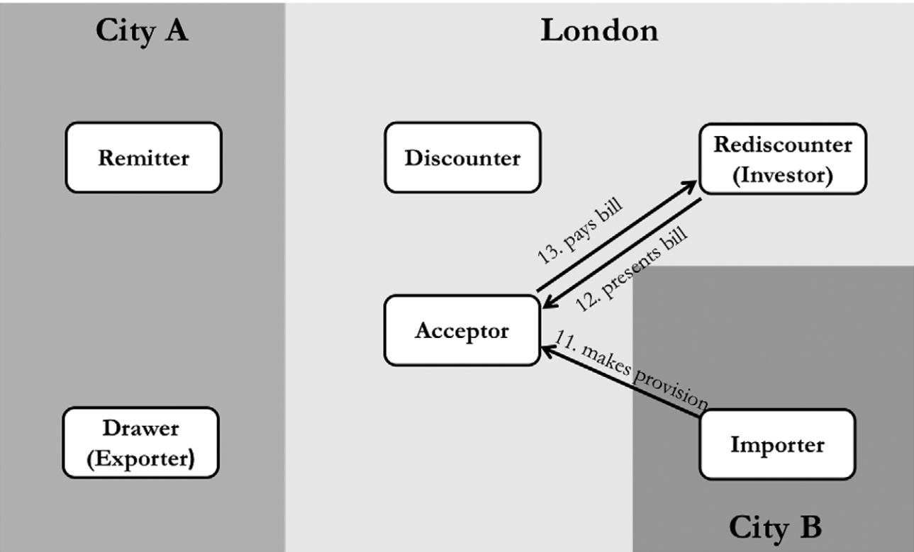
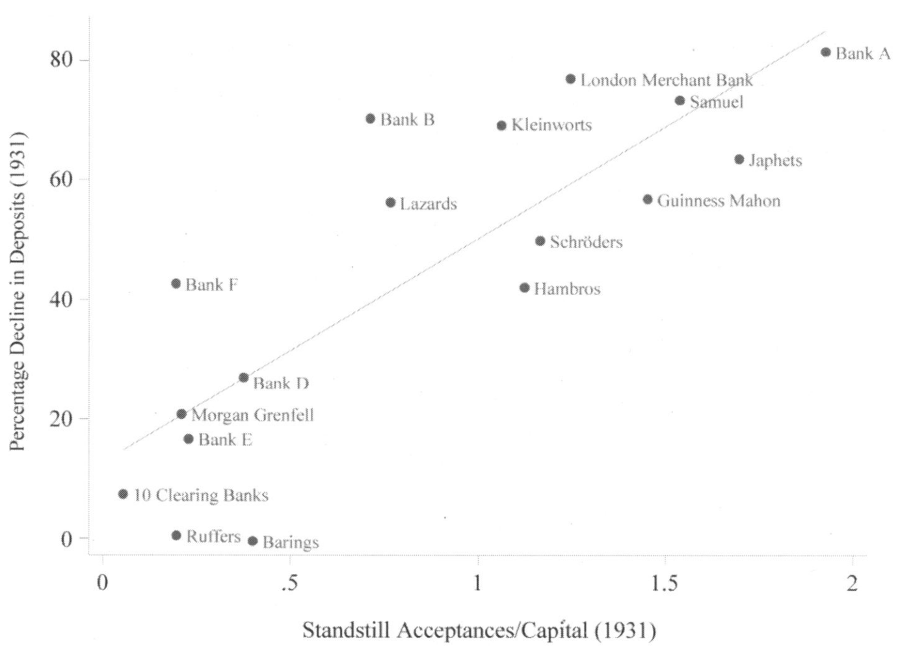

```{r setup, include=FALSE}
knitr::opts_chunk$set(echo = FALSE, warning = FALSE,
                      message = FALSE, fig.align='center', fig.retina=3,
                      out.width="75%")


```

```{r xaringan-themer, include = FALSE}
library(xaringanthemer)
style_solarized_light()
source("helper_functions/theme_lecture.R")
xaringanExtra::use_webcam()
xaringanExtra::use_tile_view()

library(tidyverse)
library(ggplot2)
```

## Today's topics

1. Globalization and money: the 'trilemma' in historical perspective
  - What is the international monetary 'trilemma'?
  - What kind of policy trade-offs do counties face?
  - Thinking about historical monetary regimes
2. The gold standard
  - How it worked in the 19th century
  - How it stopped working in the 20th century
  - Why it stopped working
3. Financial crisis
  - The Central European meltdown
  - Acceptances: the market for insuring other people's debt
  - Bank balance sheets as a transmission mechanism

---

## Economic globalization over the long-term

.center.Large[
> "The characterization of economic globalization as a "golden straitjacket" evokes two distinct sets of questions. One can ask how golden the jacket is, or else how strait it is." <br> &mdash;Obstfeld, Shambaugh, Taylor (2005), p. 423

]

.Large[
+ **'Golden'**: the way constraints on economic policy from globalization impact growth
  - E.g. literature on effects of gold standard adherence
+ **'Strait'**: how binding are these constraints anyway?
]


---

.center[


**Examples?**
]

---

## The Trilemma: historical monetary policy regimes

.pull-left[
.Large[
Can pick **two** out of:

1. Stable exchange rates
2. free capital mobility
3. and flexible domestic monetary policy,


]
]

.pull-right[

### Regimes

.Large[
1. Classical gold standard (1870s-1914): 1 & 2
2. Interwar gold standard (1918-1938): **here be dragons...**
3. Bretton woods (1950s-1973): 1 & 3
4. Current regime (1970s-present): mostly 2 & 3
]
]

---

## The trilemma: *testing* historical monetary policy regimes

.Large[

All the pieces are **hard to measure**.

1. Exchange rate stability is the easiest but still imperfect, e.g. if a currency is **officially** pegged, does it trade at the peg in **practice**?
2. Capital mobility is difficult to track.
3. How do we know if domestic monetary policy is being exercised 'flexibly'?
  + Obstfeld, Shambaugh, Taylor (2005) propose testing **short-run nominal interest rate deviations** from a global benchmark
  + What if domestic authorities 'flexibly' choose to follow the global benchmark?

]

---

## Adjusting to global interest rate movements

.right-column[
```{r, fig.align='center', fig.retina=4, fig.height=4, fig.width=6, out.width="90%"}
library(tidyverse)

df <- tibble(regime = c("1870-1914: Gold Standard", "1870-1914: Gold Standard", 
                             "1945-1973: Bretton Woods", 
                             "1973+: Post-Bretton Woods", "1973+: Post-Bretton Woods"),
             fixed = c("Peg", "Non-Peg", "Peg", "Peg", "Non-Peg"),
             theta = c(-.27, -.16, -.11, -.19, -.06),
             Halflife = c(4.79, 4.44, 9.28, 7.84, 35.16))

df |> 
  ggplot(aes(fixed, Halflife, fill = fixed)) + 
  geom_col() +
  facet_wrap(~regime) + 
  theme_lecture + 
  ylab("Number of months adjustment takes") + 
  guides(fill = F) +
  labs(caption = "From Obstfeld, Shambaugh, Taylor (2005)")

```
]

.left-column[
+ For the Gold Standard: 'gold points' (costs of arbitrage) plus tendency for British rate to mean-revert means you can partially adjust and wait
+ But adjustment is still **much faster** than other eras.]

---

## Why might adjustment be different under the gold standard?

> "What rendered the commitment to gold credible? In part, there was **little perception that policies required for external balance were inconsistent with domestic prosperity.** There was scant awareness that defense of the gold standard and the reduction of unemployment might be at odds." <br> &mdash;Eichengreen, p. 3

--

### Bringing the politics back in

> "The connection between domestic politics and international economics is at the center of this book. The gold standard, I argue, **must be analyzed as a political as well as an economic system**." <br> &mdash;Eichengreen, p. 7

---

## The political economy of the gold standard and its demise

.Large[
We have a **rapidly adjusting** international monetary system post-1880 that appears to be stable.

This system is 'paused' during WWI: in particular, during the war there are various **capital controls** including preventing the export of gold.

After WWI there are widespread efforts to return to the Gold Standard system: poor economic performance, Great Depression, destabilizing capital flows. What happened?
]

---

class: center, middle, inverse

# Monetary problems in the interwar

---

## The interwar gold standard: some major interpretations

.pull-left[
#### Charles Kindleberger: **hegemonic stability theory**


]

.pull-right[
#### Barry Eichengreen: **credibility** and **cooperation**


]

---

## Hegemonic stability

> "...**the international economic and monetary system needs leadership**. A country that is prepared ... to set standards of conduct ... to take on an undue share of the burdens of the system, and in particular to **take on its support in adversity** by accepting its redundant commodities, maintaining a flow of investment capital, and discounting its paper. Britain performed this role in the century to 1913; the United States in the period after the Second World War.... It is the theme of this book that part of the reason for the length and most of the explanation for the depth of the world depression was the inability of the British to continue their role of underwriter to the system and the reluctance of the United States to take it on until 1936."<br> &mdash; Kindleberger, 1987, p. 11

Key British roles for the system per Kindleberger

1. "accepting its redundant commodities": counter-cyclical buyer
2. "maintaining a flow of investment capital": counter-cyclical global lender
3. "discounting its paper": provider of liquidity in extremis

---

## Credibility and cooperation

.pull-left[

### Credibility

> "If one of these central banks lost gold reserves and its exchange rate weakened, funds would flow in from abroad in anticipation of the capital gains investors in domestic assets would reap once the authorities adopted measures to stem reserve losses and strengthen the exchange rate. ... The very credibility of the official commitment to gold meant that this commitment was rarely tested." <br> &mdash;Eichengreen, p. 3

+ Strengthened by domestic political economy
]

.pull-right[

### Cooperation

+ If global credit conditions are too tight and you want to loosen, difficult for a bank to do so on its own
  - E.g. if France reduces interest rates, capital will flow out to London. 
+ Argues that **outside of crises** global banks played 'follow the leader' mimicing London
+ **During crises** there is formal and explicit cooperation
+ Concludes **not** a hegemon, a cooperative system that is collectively managed
]

---

## Credibility, Cooperation and Demise

.Large[

In Eichengreen's version after WWI gold-commitment is **much less credible** because of domestic political forces on monetary and fiscal policy.

**Cooperation became much harder** because of 

1. Domestic interest groups.
2. The international war debt disputes (reparations)
3. 'competing conceptual frameworks' shaped by uniquely bad monetary experiences during and after the war
  + E.g. anti-inflationary France vs more interventionist Britain
]

---

class: center, middle, inverse

# The 1931 Crisis and the UK's exit from the Gold Standard

---

```{r us_uk_xr, fig.align='center', fig.retina=4, out.width="80%",fig.height=4.5, fig.width=6}
library(tidyverse)
library(ggrepel)

xr <- read_csv("data/EXCHANGEPOUND_1900-1945.csv", skip = 2)


xr %>% filter(Year > 1910, Year < 1938) %>% 
  ggplot(aes(Year, Rate)) +
  geom_rect(aes(xmin=1914, xmax=1918, ymin=3.5, ymax=5.5), 
            fill='coral', alpha=.25) +
  annotate('text', x=1913, y=5.25, label="WWI", color="coral")+ 
  geom_rect(aes(xmin=1925, xmax=1931, ymin=3.5, ymax=5.5), 
            fill='royalblue', alpha=.05) +
  annotate('text', x=1923, y=5.25, label="Return to\nGold at\nParity", 
           color = "royalblue") +
  geom_vline(xintercept = 1933) +
  annotate('text', x=1935, y=3.75, label="US leaves\nGold") +
  geom_line() +
  geom_point() +
  theme_lecture +
  labs(title = "The Dollar-Pound Exchange Rate", 
       subtitle = "1910-1938") +
  ylab("$ per £")

```

---

## The Great Depression

.pull-left[

### 1929

+ Crash in US stock market
  - Spills outward
  - Hits in particular places UK exports to $\rightarrow$ big falls in UK industrial production
+ **demand shock**
]

.pull-right[
### 1931

+ Failures of banks (*Creditanstalt*) in Austria, Hungary, and Germany
+ Governments introduce capital controls to stem currency depreciations
  - implies a ban on payments abroad
+ Financial crisis **imported to London via merchant banks** (Accominotti)
  - Crash in 1931 damages financial system (see James, *End of Globalization*)
  - Speculative pressure on pound
]

---


## How were UK merchant banks exposed to Central Europe?

.Large[
> "How did these Central European events affect British banks? ...their balance sheets suggest that the banks' exposure to Central Europe was not mere portfolio exposure. In fact, direct portfolio holdings of Central European debts only accounted for a sixth of the British financial system's exposure to this region in 1931. However, the banks **were** exposed through the bankers' acceptance." <br>&mdash;Accominotti (2012), p. 6.


+ **What are bankers' acceptances and how do they work?**]

---

.left-column[
### Acceptances

+ An acceptance is an insurance contract on a debt
+ They underpinned 19th c. trade finance
+ Now we call them credit-default swaps (CDS)
+ Facilitate trade finance between counter-parties that don't know each other well
]

.right-column[

#### Operations at origination from Accominotti et. al. (2021)
]

---

.left-column[
### Acceptances

+ Accepting banks are responsible for paying the debt at maturity
+ But they expect to be given the money by the importer to do so
+ The acceptance only costs them money if the imorter defaults!
+ So functionally the bank is insuring the importer's debt
]

.right-column[

#### Operations at maturity from Accominotti et. al. (2021)
]

---

.left-column[

### Acceptance defaults and bank runs

+ The 'standstill' agreements around Central European debts freeze payments
+ Outstanding bills are a **big** fraction of merchant bank capital
+ Anticipating problems, depositors withdraw from these banks prompting a run!
]


.right-column[


]
---

## From the financial crisis to monetary problems

.large[
> "The Central European crisis did not directly cause a balance-of-payment problem in Britain, it weakened the banking system. Nevertheless, in a fixed exchange rate system, banking troubles can lead to speculative attacks on the currency because investors expect authorities to loosen monetary policy in the near future, in order to support the banks."<br>&mdash;Accominotti (2012) p. 25

### Why might the UK loosen monetary policy?

+ To promote financial stability
+ To maintain London's role as an international financial center
+ The political influence of the merchant banks
]


---

class: inverse, center, middle

# Questions for Discussion

> Why was the interwar monetary system so unstable?

<br>

--

> Is a gold standard untenable for democratic societies?

<br>

--

> Did Britain choose to abandon the gold standard or was it forced to abandon the gold standard?

