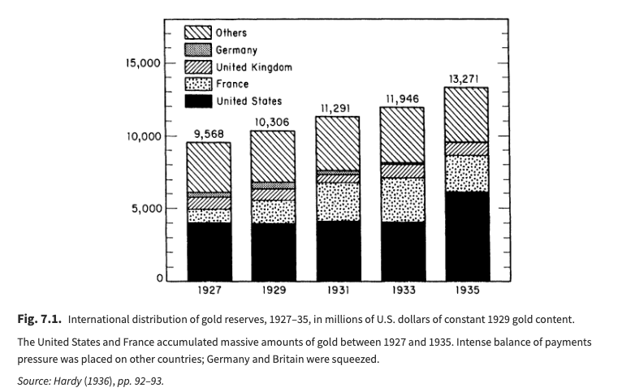
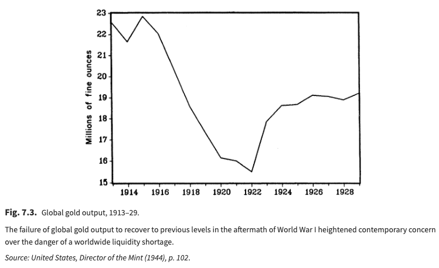
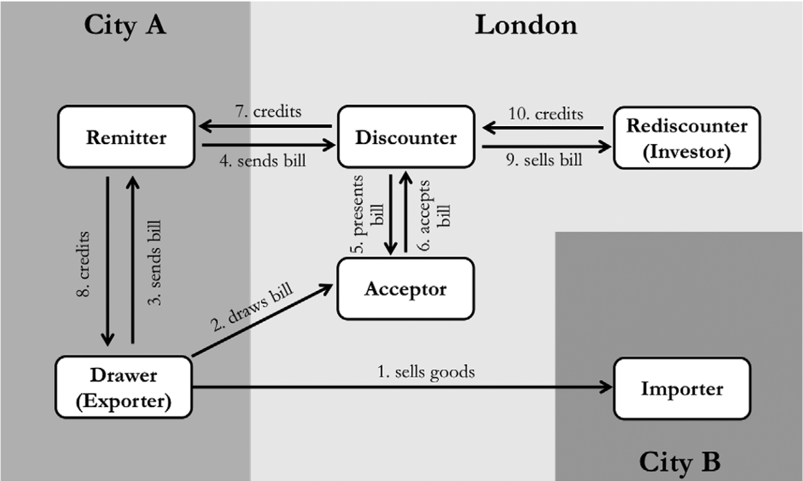
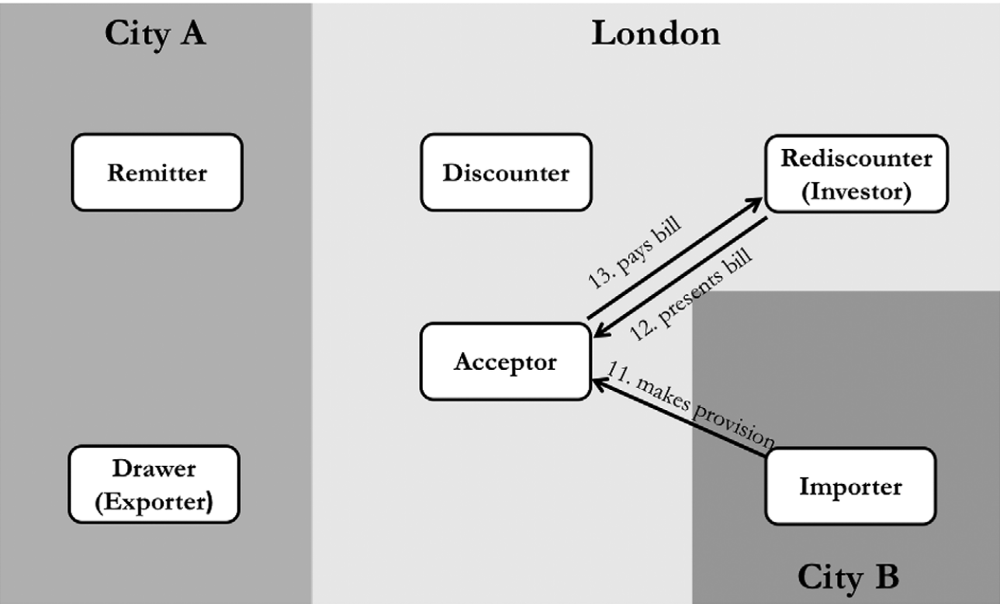
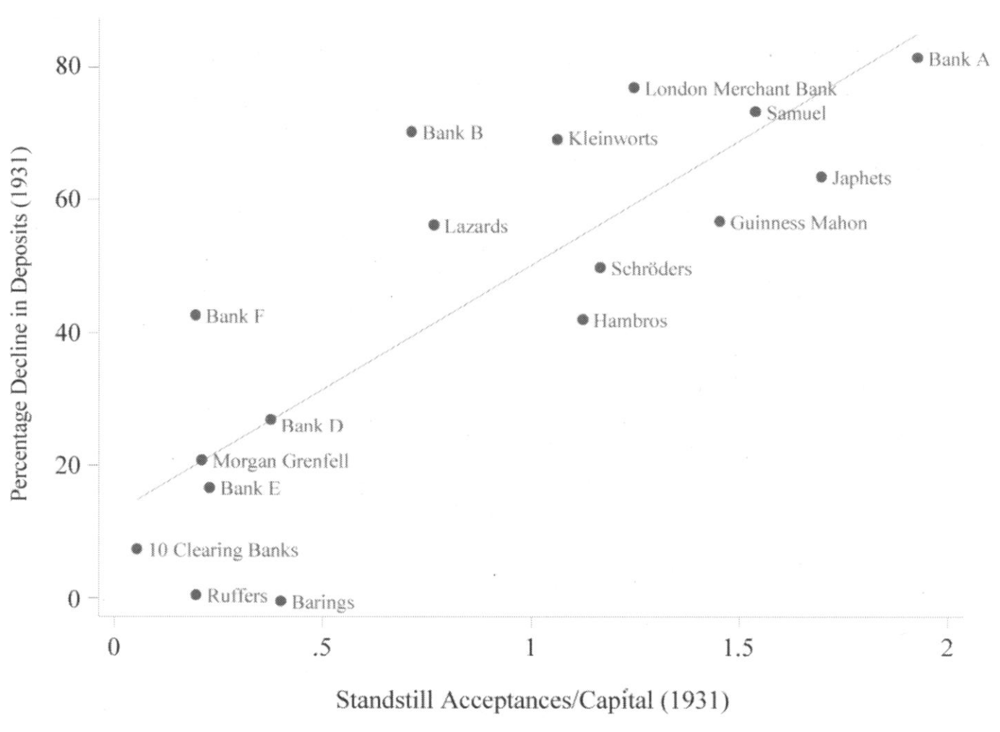

```{r setup, include=FALSE}
knitr::opts_chunk$set(echo = FALSE, warning = FALSE,
                      message = FALSE, fig.align='center', fig.retina=3,
                      out.width="75%")
library(tidyverse)
library(ggplot2)
```

## Today's plan {.smaller}

1.  The interwar monetary system: return to gold and collapse
2.  What made the interwar gold standard different?
3.  The 1931 crisis: from Central Europe to London
4.  Explaining interwar dysfunciton: Kindleberger vs Eichengreen

## The interwar return to gold {.smaller}

The gold standard was 'paused' during WWI: capital controls, suspension of gold export.

After WWI there were widespread efforts to **return** to the gold standard — yet the interwar standard proved deeply unstable.

> The system collapsed in waves: a first wave of departures in 1931–32, and a final wave in the mid-1930s.

## The wave of gold standard adoption and departure

```{r wave_chart}
#| fig-height: 4.5
#| fig-width: 7
#| out-width: "90%"

gold <- read_csv("data/eichengreen_table_7_1.csv")

gold_long <- gold |>
  pivot_longer(-Nation, names_to = "year", values_to = "status") |>
  mutate(year = as.integer(year),
         on_gold = status == "X")

gold_long |>
  group_by(year) |>
  summarise(n_on_gold = sum(on_gold, na.rm = TRUE)) |>
  ggplot(aes(year, n_on_gold)) +
  geom_line(linewidth = 1) +
  geom_point(size = 2) +
  theme_minimal() +
  labs(title = "Countries on the Gold Standard, 1919–1937",
       caption = "Source: Eichengreen, Table 7.1",
       x = "Year", y = "Number of countries")
```

## The Dollar-Pound Exchange Rate

```{r us_uk_xr}
#| fig-height: 4.5
#| fig-width: 6
#| out-width: "80%"

library(ggrepel)

xr <- read_csv("data/EXCHANGEPOUND_1900-1945.csv", skip = 2)

xr |> filter(Year > 1910, Year < 1938) |>
  ggplot(aes(Year, Rate)) +
  geom_rect(aes(xmin=1914, xmax=1918, ymin=3.5, ymax=5.5),
            fill='coral', alpha=.25) +
  annotate('text', x=1913, y=5.25, label="WWI", color="coral") +
  geom_rect(aes(xmin=1925, xmax=1931, ymin=3.5, ymax=5.5),
            fill='royalblue', alpha=.05) +
  annotate('text', x=1923, y=5.25, label="Return to\nGold at\nParity",
           color = "royalblue") +
  geom_vline(xintercept = 1933) +
  annotate('text', x=1935, y=3.75, label="US leaves\nGold") +
  geom_line() +
  geom_point() +
  theme_minimal() +
  labs(title = "The Dollar-Pound Exchange Rate",
       subtitle = "1910–1938") +
  ylab("$ per £")
```

## Interwar differences {.smaller}

::: incremental
-   Gold bullion standard
    -   Gold **coins** no longer circulate — replaced by paper backed by gold bars
-   Gold exchange standard
    -   Foreign exchange (sterling, dollars) held as central bank reserves **alongside** gold
    -   US was a notable exception — very uneconomical in its use of gold
-   Shift in monetary instruments
    -   Public debt grown larger than commercial paper
    -   Prioritizes **open market operations** as a key monetary lever
    -   Increases problem of **sterilizing gold flows**
    -   France and the US accumulated large gold stocks and sterilized them — draining liquidity from the rest of the world
:::

## Perceptions of a gold shortage {.smaller}

-   The *ratio* of gold to notes and deposits fell from **48% to 41%** between 1913 and 1925 — not a dramatic change
-   But gold was **geographically concentrated**: France and the US accumulated large reserves while sterilizing inflows
-   Deflation heightened the perception of scarcity and created anxiety about adequacy going forward

## Realities of a gold shortage

::::: columns
::: {.column width="50%"}

:::

::: {.column width="50%"}

:::
:::::

+ Output did fall but was offset by conversion of coinage
+ Reserve accumulation however was an unsustainable dynamic

## The gold exchange standard {.smaller}

The gold exchange standard created mutual dependencies that Mlynarski warned about as early as 1929:

> "The banks which have adopted the gold exchange standard will become more and more dependent on foreign gold reserves, and the banks which play the part of gold centres will grow more and more dependent on deposits belonging to foreign banks. ...the gold centres may fall into the danger of an excessive dependence on the banks which accumulate foreign exchange reserves and vice versa the banks which apply the gold exchange standard may fall into an excessive dependence on the gold centres. The latter may be threatened with difficulties in exercising their rights to receive gold, whilst the former may incur the risk of great disturbances in their credit structure in case of a sudden outflow of reserve deposits." <br>— Mlynarski, quoted in Eichengreen

This is a **Triffin dilemma** avant la lettre: the reserve-currency country must run deficits to supply liquidity, but those deficits eventually undermine confidence in the reserve currency.

## The Great Depression {.smaller}

::::: columns
::: {.column width="50%"}
### 1929

-   Crash in US stock market
    -   Spills outward
    -   Hits in particular places UK exports to $\rightarrow$ big falls in UK industrial production
-   **Demand shock**
:::

::: {.column width="50%"}
### 1931

-   Failures of banks (*Creditanstalt*) in Austria, Hungary, and Germany
-   Governments introduce capital controls to stem currency depreciations
    -   Implies a ban on payments abroad
-   Financial crisis **imported to London via merchant banks** (Accominotti)
    -   Crash in 1931 damages financial system (see James, *End of Globalization*)
    -   Speculative pressure on pound
:::
:::::

## How were UK merchant banks exposed to Central Europe? {.smaller}

> "How did these Central European events affect British banks? ...their balance sheets suggest that the banks' exposure to Central Europe was not mere portfolio exposure. In fact, direct portfolio holdings of Central European debts only accounted for a sixth of the British financial system's exposure to this region in 1931. However, the banks **were** exposed through the bankers' acceptance." <br>—Accominotti (2012), p. 6.

**What are bankers' acceptances and how do they work?**

## Acceptances: operations at origination {.smaller}

::::: columns
::: {.column width="50%"}
-   An acceptance is an **insurance contract on a debt**
-   They underpinned 19th-century trade finance
-   Now we call them credit-default swaps (CDS)
-   Facilitate trade finance between counter-parties that don't know each other well
:::

::: {.column width="50%"}
{width="100%"}
:::
:::::

## Acceptances: operations at maturity {.smaller}

::::: columns
::: {.column width="50%"}
-   Accepting banks are responsible for paying the debt at maturity
-   But they expect to be given the money by the importer to do so
-   The acceptance only costs them money if the importer defaults!
-   So functionally the bank is **insuring the importer's debt**
:::

::: {.column width="50%"}
{width="100%"}
:::
:::::

## Acceptance defaults and bank runs {.smaller}

::::: columns
::: {.column width="50%"}
-   The 'standstill' agreements around Central European debts **freeze payments**
-   Outstanding bills are a **big** fraction of merchant bank capital
-   Anticipating problems, depositors withdraw from these banks — prompting a run!
:::

::: {.column width="50%"}
{width="100%"}
:::
:::::

## From the financial crisis to monetary problems {.smaller}

> "The Central European crisis did not directly cause a balance-of-payment problem in Britain, it weakened the banking system. Nevertheless, in a fixed exchange rate system, banking troubles can lead to speculative attacks on the currency because investors expect authorities to loosen monetary policy in the near future, in order to support the banks." <br>—Accominotti (2012), p. 25

### Why might the UK loosen monetary policy?

-   To promote financial stability
-   To maintain London's role as an international financial center
-   The political influence of the merchant banks

## The interwar gold standard in a 19th century mirror {.smaller}

::::: columns
::: {.column width="50%"}
#### Charles Kindleberger: **hegemonic stability theory**

{width="50%"}
:::

::: {.column width="50%"}
#### Barry Eichengreen: **credibility** and **cooperation**

{width="50%"}
:::
:::::

## Hegemonic stability {.smaller}

> "...**the international economic and monetary system needs leadership**. A country that is prepared ... to set standards of conduct ... to take on an undue share of the burdens of the system, and in particular to **take on its support in adversity** by accepting its redundant commodities, maintaining a flow of investment capital, and discounting its paper. Britain performed this role in the century to 1913; the United States in the period after the Second World War.... It is the theme of this book that part of the reason for the length and most of the explanation for the depth of the world depression was the inability of the British to continue their role of underwriter to the system and the reluctance of the United States to take it on until 1936." <br>—Kindleberger, 1987, p. 11

Key British roles per Kindleberger:

1.  "accepting its redundant commodities": counter-cyclical buyer
2.  "maintaining a flow of investment capital": counter-cyclical global lender
3.  "discounting its paper": provider of liquidity in extremis

## Credibility and cooperation {.smaller}

::::: columns
::: {.column width="50%"}
### Credibility

> "If one of these central banks lost gold reserves and its exchange rate weakened, funds would flow in from abroad in anticipation of the capital gains investors in domestic assets would reap once the authorities adopted measures to stem reserve losses and strengthen the exchange rate. ... The very credibility of the official commitment to gold meant that this commitment was rarely tested." <br>—Eichengreen, p. 3

:::

::: {.column width="50%"}
### Cooperation

-   If global credit conditions are too tight and you want to loosen, difficult for a bank to do so on its own
    -   E.g. if France reduces interest rates, capital will flow out to London
-   Outside of crises: global banks played 'follow the leader' mimicking London
-   During crises: formal and explicit cooperation
-   Concludes **not** a hegemon, but a cooperative system that is collectively managed
:::
:::::

## Credibility, cooperation and demise {.smaller}

In Eichengreen's version, after WWI the gold-commitment is **much less credible** because of domestic political forces on monetary and fiscal policy.

**Cooperation became much harder** because of:

1.  Domestic interest groups
2.  The international war debt disputes (reparations)
3.  'Competing conceptual frameworks' shaped by uniquely bad monetary experiences during and after the war
    -   E.g. anti-inflationary France vs more interventionist Britain

## Questions for discussion

> Why was the interwar monetary system so unstable? Evaluate Kindleberger vs Eichengreen's arguments and the criticisms of Flandreau

::: fragment
> Is a gold standard untenable for democratic societies?
:::

::: fragment
> Did Britain choose to abandon the gold standard or was it forced to abandon it?
:::
