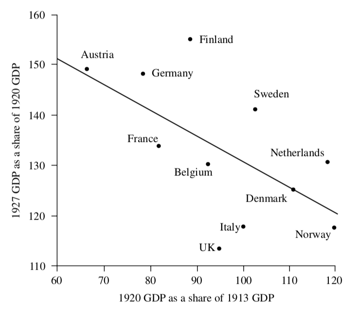
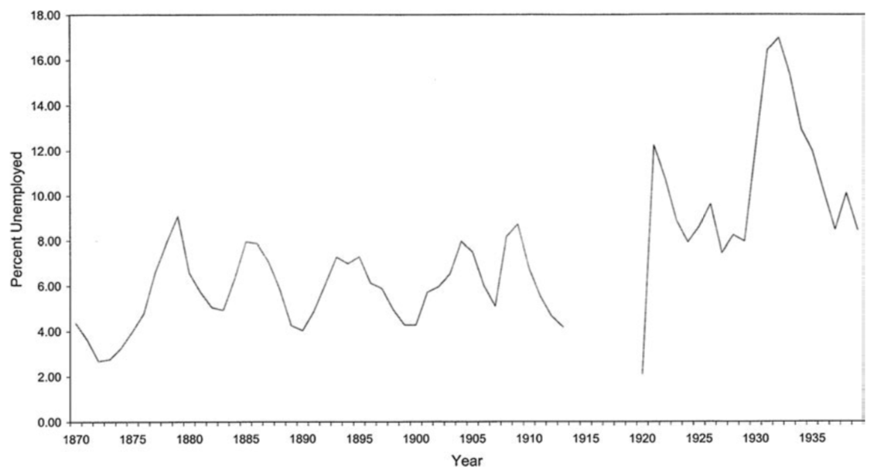
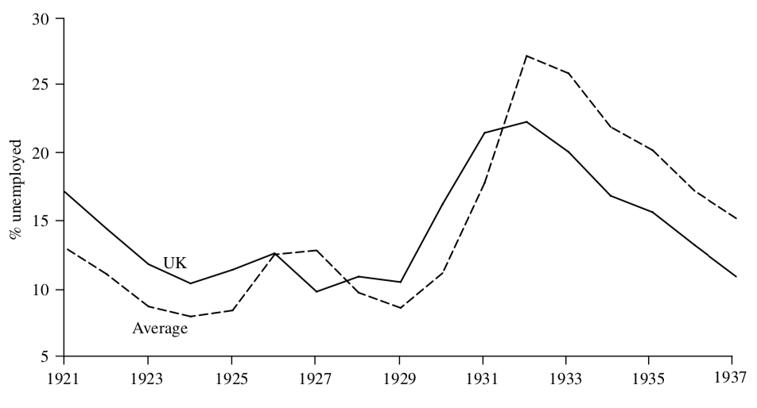
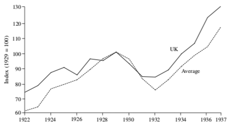

```{r setup, include=FALSE}
knitr::opts_chunk$set(echo = FALSE, warning = FALSE,
                      message = FALSE, fig.align='center', fig.retina=3,
                      out.width="75%")


```

```{r xaringan-themer, include = FALSE}
library(xaringanthemer)
style_solarized_light()
source("helper_functions/theme_lecture.R")
xaringanExtra::use_webcam()
xaringanExtra::use_tile_view()

library(tidyverse)
library(ggplot2)
```

## Today's Plan: The British economy in the interwar

.pull-left[

### Outline

1. How did the economy fair?
  - In terms of growth
  - In terms of our expectations
  - In comparison to elsewhere
2. The problems of unemployment
  - How bad was it?
  - Why was unemployment high?
3. The problems of monetary policy
  - Was money overvalued?
  - Why return to Gold?
  - Why was Britain so quick to abandon Gold?
]

.pull-right[

### Themes

+ Did Britain do worse than elsewhere in this period?
+ Were problems, like unemployment, actual policy failures?
  - Or conversely, were they merely reflection of longer-term slide in international competitiveness of GB?
]

---

class: center, middle

.pull-left[
```{r, comparative_perspective, out.width='100%', fig.height=4.5, fig.width=6, fig.retina=4}
library(readxl)
library(tidyverse)
library(ggrepel)

maddison <- read_xlsx(path = "data/mpd2018.xlsx", 
                      sheet = "Full data")

plotdf <- maddison %>% filter(year <= 1938, 
                    year > 1910, 
                    countrycode %in% c("GBR", "FRA", 
                                       "DEU", "USA",
                                       "ITA", "AUT"),
                    !is.na(rgdpnapc)) %>% 
  group_by(countrycode) %>% 
  mutate(delta_gdp = cgdppc/cgdppc[year==1911] * 100) %>% 
  ungroup()

plotdf %>% 
  ggplot(aes(year, rgdpnapc, 
             group = countrycode,
             color=countrycode)) +
  ggtitle("British GDP in the Interwar in Comparative Perspective", 
          subtitle = "Source: Maddison project") +
  geom_line() +
  geom_point() +
  geom_label_repel(data = plotdf %>%
              group_by(countrycode) %>% 
              filter(year == last(year)) %>% 
              ungroup(), 
            aes(label = country, x = year, y=rgdpnapc, color=countrycode),
            nudge_x = 15) +
  guides(color = FALSE) +
  scale_color_brewer(type = "qual", palette = 2) +
  theme_lecture +
  xlab("Year") + ylab("Real GDP per capita")

```
]

.pull-right[

```{r, comparative_perspective_percent, out.width='100%', fig.height=4.5, fig.width=6, fig.retina=4}
plotdf %>% 
  ggplot(aes(year, delta_gdp, 
             group = countrycode,
             color=countrycode)) +
  ggtitle("British GDP Growth in the Interwar in Comparative Perspective", 
          subtitle = "Source: Maddison project") +
  geom_line() +
  geom_point() +
  geom_label_repel(data = plotdf %>%
              group_by(countrycode) %>% 
              filter(year == last(year)) %>% 
              ungroup(), 
            aes(label = country, x = year, y=delta_gdp, color=countrycode),
            nudge_x = 15) +
  guides(color = FALSE) +
  scale_color_brewer(type = "qual", palette = 2) +
  theme_lecture +
  xlab("Year") + ylab("Real GDP per capita index (1911=100)")
```

]
---

## Warfare, Capital Destruction & Growth

.pull-left[

+ Should see growth after war b/c
  - Can build more productive things
  - Can replace destroyed capital stock
+ Therefore...
  - The harder you fall between 1913-1920,
  - The faster you should grow between 1920-1927
  
### Britain seems to underperform

+ This is especially true considering that Britain's capital intensity increases more rapidly than in other European countries

]

.pull-right[


]


---

## Key problems for Britain at end of war

+ Loss of external markets:
  - During war, exports disrupted but demand remains in e.g. LA and Southeast Asia
  - Countries like Japan/USA fill export whole,
    + Hard to displace post-war
+ During war, Britain requisitioned foreign assets, sold ~10%
  - We recall income from investments abroad was *big* for GB
  - Implies ~10% fall in income frome abroad
  - This demands an *improvement* in exports to earn foreign exchange abroad, at a time when hard
  
---

.pull-left[
## The 1920 Recession

+ Arguably over-determined
+ Demand-side view
  - Firms use wartime profits to invest, buy rivals
  - End of price-controls, inflation
  - But... from 1918-1920 Gov't cuts spending by 75%
  - Raises interest rates
  - **demand falls** while firms have excess capacity
+ Supply-side view
  - Unions strong post-war
  - Negotiates hourly reductions keeping wages constant (13% fall in working week)
  - Labor productivity constant
  - **supply-shock**
]

.pull-right[
```{r uk_cpi, fig.align='center', fig.retina=4, out.width="100%",fig.height=3.25, fig.width=4}
library(tidyverse)
library(ggrepel)

cpi <- read_csv("data/UKCPI_1910-1938.csv", skip = 1)


cpi %>% filter(Year > 1910, Year <= 1938) %>%
  ggplot(aes(Year, `Retail Price Index (2010 = 100)`)) +
  geom_line() +
  geom_point() +
  geom_vline(xintercept = 1920, linetype="dashed") +
  theme_lecture +
  labs(title = "UK Retail Price Index",
       subtitle = "1910-1938") +
  ylab("2010=100")

```

+ Both theories could be true.
+ Continued slow growth in 1920's points a little towards supply shock
]
---

## Unemployment



+ The spike in unemployment post-WWI is v. large
+ The level after 1929 is enormous

---

## Unemployment in Comparative Perspective

.right-column[
]

.left-column[
+ Britain's unemployment problem tends to be worse than other industrialized countries in the 1920s
    - Situation changes after 1931 when Britain abandons the Gold Standard
]
---

## Theories of the Unemployment Problem, I

### A. Government interventions in labor market (unemployment insurance)
  - Some scholars think this explains a lot of it
  - Most think it doesn't 

### B. Poor specialization in industries
  - Britain was specialised in industries (coal, iron, steel) that saw slow global growth
  - Related to longer tradition of worry about Britain's failure to excel in more dynamic sectors
    + Chemicals, electricity, new textiles (rayon), etc.
      
---

## Theories of the Unemployment Problem, II

### C. Unions 
  - In period of falling prices blocked nominal wage cuts
  - Obtained hour reductions at equivalent wages after war -- supply-side shock contributes to recession in 1920

### D. Monetary mis-alignment
  - Aim for Gold Standard at pre-War parity promotes high interest rates and tight fiscal policy
    - On gold standard, pound is over-valued relative to prices
    - Demands major nominal labor market adjustment that labor institutions not able to implement
    
> Theories C & D share view that nominal wages had downward rigidities

+ Stated plainly: 
  - people don't like the number written on each paycheck to get smaller even if it's value stays the same

---

## The Gold Standard and Unemployment

+ Britain returns to the Gold Standard in 1925 at **pre-War parity**
  - **Pre-War parity** means that sterling is redeamable for the same amount of gold as before the war
  - Since the dollar remained on gold throughout the war, this is equivalent to fixing Sterling to the pre-War $/£ exchange rate
+ **Gold Standard** here means really two things:
  1. You can convert your money into Gold at the specified price
  2. You do not face restrictions on importing/exporting that gold
  
### Difficulties of returning to Gold

+ What might be the problem of returning to Gold Standard?
  - Your goods as priced in $ get more expensive
  - To make your goods cheaper you need your labor costs to $\downarrow$
    + If they don't labor is too expensive and you get persistent unemployment

---


.pull-left[
### Why return to Gold at the pre-war parity?

#### Arguments justifying decision

1. Return to gold was popular
  - But plenty of critics...
2. Price-gaps hard to estimate
  - But BoE at the time thought it was not right
3. Things were bad anyway so don't blame monetary policy
  - Economic hardship makes the mistake *worse*!
4. Other prices were wrong e.g. French exchange rate, British wages
  - Unreasonable to insist everyone else must adjust
]

--

.pull-right[

### Vested interests: a simpler explanation?

> "The decision of the monetary authorities in this period cannot become fully intelligible until it is realized that they were dominated by a narrow section of the City ... and by its spokesman and representative, the Bank of England." <br>&mdash;Pollard (1970), p. 13.

<br>
> "To restore the value of the pre-war holdings by Deflation means ... raising the total claims of the rentier class not only beyond what they are entitled to, but to an intolerable proportion of the total income of the community." <br>&mdash;Keynes cited in Edgerton (2019), p. 123.
]

---

```{r us_uk_xr, fig.align='center', fig.retina=4, out.width="80%",fig.height=4.5, fig.width=6}
library(tidyverse)
library(ggrepel)

xr <- read_csv("data/EXCHANGEPOUND_1900-1945.csv", skip = 2)


xr %>% filter(Year > 1910, Year < 1938) %>% 
  ggplot(aes(Year, Rate)) +
  geom_rect(aes(xmin=1914, xmax=1918, ymin=3.5, ymax=5.5), 
            fill='coral', alpha=.25) +
  annotate('text', x=1913, y=5.25, label="WWI", color="coral")+ 
  geom_rect(aes(xmin=1925, xmax=1931, ymin=3.5, ymax=5.5), 
            fill='royalblue', alpha=.05) +
  annotate('text', x=1923, y=5.25, label="Return to\nGold at\nParity", 
           color = "royalblue") +
  geom_vline(xintercept = 1933) +
  annotate('text', x=1935, y=3.75, label="US leaves\nGold") +
  geom_line() +
  geom_point() +
  theme_lecture +
  labs(title = "The Dollar-Pound Exchange Rate", 
       subtitle = "1910-1938") +
  ylab("$ per £")

```

---

## Was gold the problem? 

### Maybe...

+ Hard to know what the 'correct' exchange rate should be
+ Keynes famously over-estimated by how much £ was overvalued
  - Keynes says ~15%
  - Subsequent estimates say 5-10%
  - Estimates very imprecise
+ Made some exports uncompetitive
  - But some argue also accelerated adjustment towards newer industries within Britain (theory B)
  - Also, if you are an industry who buys their *inputs* from abroad exchange rate makes inputs cheap

---

## Interwar Depression, Economic Thought and the Rise of the Corporate Economy

> "...the situation faced by British industrial firms after 1919 was profoundly different from that which had been envisaged in the closing stages of the war. Intead of the anticipated postwar prosperity there was, after a brief inflationary boom, a fierce slump, and in 1921 the unemployment rate rose above 10 per cent, never to fall below that figure again before the Second World War. **Economic depression was, then, a central fact of the interwar experience...** The effect of the depression in increasing political consciousness and stimulating the growth of the Labour Party, and its impact on the collapse of the classical paradigms of economic theory in the Keynesian revolution, have often been analysed by historians. **Less well covered, but no less important, is its impact at the level of popular business philosophy**, as more businessmen began to question the desirability of the configuration of firms and markets which they had inherited from the prewar era. **The rationalization movement** — which gained the attention of bankers, politicians and trade unionists, as well as of prominent industrialists between the wars — was an important aspect of the build up of **dissatisfaction with the market mechanism** and of the movement towards greater reliance on large firms for economic organization." <br> —Hannah, *Rise of the Corporate Economy*, p. 31-32.

---
  
### The push for 'orderly competition'

.pull-left[
+ Gov't eager to support business
  - Push significant mergers and amalgamations
  - Allow significant coordination in name of 'managerial capitalism' with economies of scale
  - Effect is often cartel/monopoly
  - No anti-trust enforcement

> "...as much as half of manufactured output to be produced by cartel members in the mid-1930s (Crafts 1999), leading one contemporary pessimistically to observe that ‘as a feature of industrial and commercial organisation free competition has nearly disappeared from the British scene’ (Lucas 1937: 64)." <br> -Eichengreen
]

.pull-right[
> "Competition was disliked by both socialists and rationalizers, and they both stressed not only scientific and rational, but also humane, values: 'the glamour of the perfect, unselfish mechanism hangs about the system of rationalization'. The business classes were, of course, very much aware of **the need to provide a political and economic alternative to socialism**. It was their position that was endangered by depression and it behoved them to revalidate it by showing that those parts of the market system which were causing trouble could be excised by the reorganization of private capitalism." <br> —Hannah, p. 36
]
---


### The Corporate Economy and Industrial Concentration

.pull-left[
```{r industrial_concentration, fig.align='center', fig.retina=4, out.width="100%",fig.height=3.25, fig.width=4}
library(hrbrthemes)

conc_df <- tibble(date = c(1909, 1919, 1924, 1930, 1935, 1939),
                  share_100 = c(15, 17, 21, 26, 23, 23)/100)

conc_df %>% 
  ggplot(aes(date, share_100)) + 
  geom_point(size=5) + 
  geom_line() + 
  theme_lecture + 
  ggtitle("Share of largest 100 firms", subtitle = "Manufacturing net output")  +
  scale_y_percent() + 
  ylim(c(.10, .3)) +
  ylab("Output share") + 
  xlab("") 


```
#### Source: Hannah, p. 216
]

.pull-right[

```{r industrial_concentration2, fig.align='center', fig.retina=4, out.width="100%",fig.height=3.25, fig.width=4}

library(ggalt)

ind_conc <- tibble(Industry = rep(c("Food", "Vehicles", 
                                    "Textiles", "Metal manufacture"), each=2),
                   Date = rep(c(1919, 1930), 4),
                   Share = c(39, 74, 34.1, 66.5, 47.4, 64, 28.7, 45.9 ))

ind_conc %>% 
  ggplot(aes(as.character(Date), Share, label = paste0(Share, "%"))) + 
  geom_lollipop(point.size = 5) + 
  theme_lecture + 
  geom_text(nudge_y = 20) +
  facet_wrap(~ Industry) +
  ylim(c(0, 100)) + 
  xlab("Date") + ylab("Share (%)") + 
  ggtitle("Share of largest 5 firms", subtitle = "Select industries")
```
#### Source: Hannah, p. 225.
]


---


## The Great Depression

.pull-left[

### 1929

+ Crash in US stock market
  - Spills outward
  - Hits in particular places UK exports to $\rightarrow$ big falls in UK industrial production
+ **demand shock**
]

.pull-right[
### 1931

+ Failures of banks (*Credit Anstalt*) in Austria and Germany
+ Financial crisis imported to London via loan portfolios
  - Crash in 1931 damages financial system (see James, *End of Globalization*)
  - Speculative pressure on pound
]

---

.pull-left[
## Leaving Gold

#### Britain abandons the Gold Standard September 19, 1931

+ Why so soon?
  - Labor gov't unwilling to exacerbate unemployment with rate hikes and fiscal contraction
  
#### Effects

+ Pretty good!
  - Can slash interest rates, helps industrial growth
  - British banks have liabilities in sterling

]

.pull-right[


#### Britain after 1931

+ Britain recovers better than elsewhere
  - Helps to be off gold
+ Recovery driven predominantly by domestic demand
  - Home-building biggest growth sector
]


---

## Taking the long view

>  "**Economic history is distinguished from economics by a predisposition to focus upon the long run.** When looking at the inter-war... the timespan (1921-37) is short and punctuated by a uniquely severe depression (1929-32). Thus in arguments about the efficacy of government policies, inspired by Keynesian and anti-Keynesian conceptions of the period, historians are inclined to bring Britain's structural problems to the fore. The origins of these problems can be traced back to the 1870s and they became serious during the last great international boom of the Liberal era, 1899-1914, when the productivity of industry failed to grow at all. Britain entered the First World with an economy specialized upon a narrow range of staple industries, under intensifying threat from foreign competition."<br> —O'Brien, 128

+ Is the interwar subject to special problems apart from the recession?
+ Or is this just the continuation of a longer-term trajectory of decline?

---

class: inverse, center, middle

# Questions for Discussion

> Why did Britain return to the Gold Standard at the pre-War parity in 1925?

<br>

--

> Was the commitment to the Gold Standard to blame for the persistent unemployment problem in interwar Britain?
