```{r setup, include=FALSE}
knitr::opts_chunk$set(echo = FALSE, warning = FALSE,
                      message = FALSE, fig.align='center', fig.retina=3,
                      out.width="100%", fig.width=6, fig.height=4.5)

library(RefManageR)
BibOptions(check.entries = FALSE, 
           bib.style = "authoryear", 
           style = "markdown",
           dashed = TRUE, hyperlink = FALSE)
source("helper_functions/helper_print_bib.R")
bib <- ReadBib("pres.bib")
```

```{r xaringan-themer, include = FALSE}
library(xaringanthemer)
style_solarized_light()
source("helper_functions/theme_lecture.R")
xaringanExtra::use_webcam()
xaringanExtra::use_tile_view()
```

class: center, inverse, middle

# Outline

---

.Large[
## Today's goals

+ Some preliminary remarks on how classes will work
+ Part I
  - A quantitative overview of British economic history
  - A critical look at GDP
+ Part II
  - A consideration on the rise in population
  - Productivity: a worked example
+ Part III
  - What this course will cover
  - How you will be assessed
]

---

name: return

## Preliminaries 

I want you to...

+ Do the reading
+ Talk! 
    - Active learning is much more effective
+ Engage with numerical evidence
    - [We all start somewhere](#message)

You should take from this...

+ An overview of British economic development, but also...
+ Highly transferable analytic skills!

---

class: inverse, center, middle

# Part I

---

```{r gdp_pc, fig.align='center', fig.retina=3, fig.width=7, fig.height=5, out.width="85%"}
library(tidyverse)
library(readxl)

real_gdp_eng <- read_xlsx(path = "data/a-millennium-of-macroeconomic-data-for-the-uk.xlsx", 
                      sheet = "A21. GDP per capita 1086+", 
                      range = "A5:K859")

names(real_gdp_eng)[1] <- "Year"

real_gdp_eng %>% 
  filter(Year > 1270) %>% 
  ggplot(aes(Year, `Real GDP per capita`)) +
  #geom_point() + 
  geom_line() +
  scale_x_continuous(breaks = seq(1300, 1900, 50)) +
  ggtitle("English Real GDP per capita, 1270-1939", 
          subtitle = "Source: Broadberry et. al. (2015) & Bank of England") +
  ylab("Real GDP per capita") + 
  theme_lecture 

```

---

```{r gdp_pc_ir, fig.align='center', fig.retina=3, fig.width=7, fig.height=5, out.width="85%"}

real_gdp_eng %>% 
  filter(Year > 1270) %>% 
  ggplot(aes(Year, `Real GDP per capita`)) +
  #geom_point() + 
  geom_line() +
  scale_x_continuous(breaks = seq(1300, 1900, 50)) +
  ggtitle("English Real GDP per capita, 1270-1939", 
          subtitle = "Source: Broadberry et. al. (2015) & Bank of England") +
  ylab("Real GDP per capita") + 
  annotate("rect", xmin=1760, xmax=1820, 
           ymin=500, ymax=6000, fill="coral",
           alpha=.3) +
  annotate("text", x=1670, y=5500, 
           label="Industrial revolution?", color="coral") +
  theme_lecture 

```

---

```{r, gdp_pc_ag_transition, fig.align='center', fig.retina=3, fig.width=7, fig.height=5, out.width="85%"}
real_gdp_eng %>% 
  filter(Year > 1270) %>% 
  ggplot(aes(Year, `Real GDP per capita`)) +
  #geom_point() + 
  geom_line() +
  scale_x_continuous(breaks = seq(1300, 1900, 50)) +
  ggtitle("English Real GDP per capita, 1270-1939", 
          subtitle = "Source: Broadberry et. al. (2015) & Bank of England") +
  ylab("Real GDP per capita") + 
  annotate("rect", xmin=1760, xmax=1820, 
           ymin=500, ymax=6000, fill="coral",
           alpha=.3) +
  annotate("text", x=1670, y=5500, 
           label="Industrial revolution?", color="coral") +
  annotate("rect", xmin = 1600, xmax=1850, ymin=500, ymax = 4000, 
           fill = 'steelblue', alpha = .3) +
  annotate("text", x=1500, y=4000, 
           label = "Agricultural revolution?", color="steelblue") +
  theme_lecture 
```

---

```{r, gdp_pc_institutions, fig.align='center', fig.retina=3, fig.width=7, fig.height=5, out.width="85%"}
real_gdp_eng %>% 
  filter(Year > 1270) %>% 
  ggplot(aes(Year, `Real GDP per capita`)) +
  #geom_point() + 
  geom_line() +
  scale_x_continuous(breaks = seq(1300, 1900, 50)) +
  ggtitle("English Real GDP per capita, 1270-1939", 
          subtitle = "Source: Broadberry et. al. (2015) & Bank of England") +
  ylab("Real GDP per capita") + 
  annotate("rect", xmin=1760, xmax=1820, 
           ymin=500, ymax=6000, fill="coral",
           alpha=.3) +
  annotate("text", x=1670, y=5500, 
           label="Industrial revolution?", color="coral") +
  annotate("rect", xmin = 1600, xmax=1850, ymin=500, ymax = 4000, 
           fill = 'steelblue', alpha = .3) +
  annotate("text", x=1500, y=4000, 
           label = "Agricultural revolution?", color="steelblue") +
  annotate("segment", x=1400, xend = 1688, y=2900, 
           yend = real_gdp_eng$`Real GDP per capita`[real_gdp_eng$Year==1688]) +
  annotate("text", x=1400, y=3200, 
           label = "Institutional/Fiscal/\nFinancial revolution?") +
  theme_lecture 
```

---

```{r, gdp_pc_industrious, fig.align='center', fig.retina=3, fig.width=7, fig.height=5, out.width="85%"}
real_gdp_eng %>% 
  filter(Year > 1270) %>% 
  ggplot(aes(Year, `Real GDP per capita`)) +
  #geom_point() + 
  geom_line() +
  scale_x_continuous(breaks = seq(1300, 1900, 50)) +
  ggtitle("English Real GDP per capita, 1270-1939", 
          subtitle = "Source: Broadberry et. al. (2015) & Bank of England") +
  ylab("Real GDP per capita") + 
  annotate("rect", xmin=1760, xmax=1820, 
           ymin=500, ymax=6000, fill="coral",
           alpha=.3) +
  annotate("text", x=1670, y=5500, 
           label="Industrial revolution?", color="coral") +
  annotate("rect", xmin = 1600, xmax=1850, ymin=500, ymax = 4000, 
           fill = 'steelblue', alpha = .3) +
  annotate("text", x=1500, y=4000, 
           label = "Agricultural revolution?", color="steelblue") +
  annotate("segment", x=1400, xend = 1688, y=2900, 
           yend = real_gdp_eng$`Real GDP per capita`[real_gdp_eng$Year==1688]) +
  annotate("text", x=1400, y=3200, 
           label = "Institutional/Fiscal/\nFinancial revolution?") +
  annotate("segment", x=1475, xend = 1750, y=1800, 
           yend = real_gdp_eng$`Real GDP per capita`[real_gdp_eng$Year==1750]) +
  annotate("text", x=1350, y=1800, 
           label = "Industrious revolution?") +
  theme_lecture 
```

---

### Tantamount to asking what caused the industrial revolution

+ An enormous number of theories -- we will survey many but not all!
    - institutional innovation -> functional credit/property markets `r AutoCite(bib["northConstitutionsCommitmentEvolution1989"])`
    - external trading markets `r AutoCite(bib["findlayPowerPlentyTrade2009","inikoriAfricansIndustrialRevolution2002"])`
        + Slavery & IR sub-debate: for recent reviews see `r AutoCite(bib["oakesCapitalismSlaveryCivil2016", "wrightSlaveryAngloAmericanCapitalism2019"])`
    - Colonies `r AutoCite(bib["pomeranzGreatDivergenceChina2009"])`
    - Easy availability of coal/energy supplies `r AutoCite(bib["pomeranzGreatDivergenceChina2009", "wrigleyEnergyEnglishIndustrial2010"])`
    - (Relatively) highly educated workforce `r AutoCite(bib["kellyPrecociousAlbionNew2014","mokyrEnlightenedEconomyEconomic2012"])`
    - Science/technology `r AutoCite(bib["mokyrEnlightenedEconomyEconomic2012"])`
    - (Relatively) highly paid workforce `r AutoCite(bib["allenBritishIndustrialRevolution2009"])`
    - Others

---

```{r, comparative_perspective, fig.align='center', fig.retina=3, fig.width=7, fig.height=5, out.width="85%"}
library(ggrepel)

maddison <- read_xlsx(path = "data/mpd2018.xlsx", 
                      sheet = "Full data")

plotdf <- maddison %>% filter(year <= 1851, 
                    year > 1700, 
                    countrycode %in% c("GBR", "FRA", 
                                       "NLD", "AUT", 
                                       "DEU", "CHN",
                                       "IND", "JPN"),
                    !is.na(cgdppc))

plotdf %>% 
  ggplot(aes(year, cgdppc, 
             group = countrycode,
             color=countrycode)) +
  ggtitle("British GDP per capita in a global mirror", 
          subtitle = "Source: Maddison project") +
  geom_line() +
  geom_point() +
  geom_label_repel(data = plotdf %>%
              group_by(countrycode) %>% 
              filter(year == last(year)) %>% 
              ungroup(), 
            aes(label = country, x = year, y=cgdppc, color=countrycode),
            nudge_x = 15) +
  xlim(c(1700,1900)) +
  guides(color = FALSE) +
  scale_color_brewer(type = "qual", palette = 2) +
  ylab("Chained GDP per capita") +
  xlab("") +
  theme_lecture

```

---

```{r, climacteric, fig.align='center', fig.retina=3, fig.width=7, fig.height=5, out.width="85%"}

plotdf <- maddison %>% filter(year >= 1800, 
                    year <= 1940, 
                    countrycode %in% c("GBR", "FRA",
                                       "DEU", "USA"),
                    !is.na(cgdppc))

plotdf %>% 
  ggplot(aes(year, cgdppc, 
             group = countrycode,
             color=countrycode)) +
  ggtitle("British GDP per capita in a global mirror", 
          subtitle = "Source: Maddison project") +
  geom_line() +
  geom_point() +
  geom_label_repel(data = plotdf %>%
              group_by(countrycode) %>% 
              filter(year == last(year)) %>% 
              ungroup(), 
            aes(label = country, x = year, y=cgdppc, color=countrycode)) +
  guides(color = FALSE) +
  scale_color_brewer(type = "qual", palette = 2) +
  ylab("Chained GDP per capita") +
  xlab("") +
  theme_lecture

```

---

## Historical national accounts

+ Historical national income accounting -- attempts to measure GDP `r AutoCite(bib["broadberryBritishEconomicGrowth2015"])`
    * Is GDP a good measure of anything? 
    * Alternatives (HDI)?
    * What is the 'average' person?

---

## Reconstructing British national accounts

```{r, broadberry_et_al, fig.align='center', out.width="30%"}

```

---

## How the sausage gets made: GDP

Three ways to measure GDP

1. Income:

$GDP =(\texttt{daily wage-rates} \times \texttt{days worked}) + \\ (\texttt{return on capital} \times \texttt{capital stock}) + \\ (\texttt{rent} \times \texttt{land area})$
 
2. Expenditure:

$GDP = \texttt{consumption} + \texttt{investment} + \texttt{government spending} + \\ \texttt{net exports}$

3. Output:

$GDP = \texttt{agricultural value added} + \texttt{industrial value added} + \\  \texttt{services value added}$

`r Citet(bib["broadberryBritishEconomicGrowth2015"])` attempt the *output* approach.

---

## How the sausage gets made: GDP

+ How hard is output based estimation?
+ To compute output just for agriculture:
    1. estimate amount of land under different ag. uses
    2. derive trends in cropped areas
    3. and trends in crop yields
    4. derive livestock numbers 
    5. and livestock yields
    6. aggregate these numbers from farms weighted by spatial area
    7. convert total outputs to value added using prices and knowledge of cost structure
    8. convert to real prices
+ Incredibly difficult and incredibly imprecise undertaking!

---

name: nhavalue

## How the sausage gets made: GDP 

+ Why do it this way?
    - Existing wage series `r AutoCite(bib["clarkConditionWorkingClass2005", "clark1381MalthusDelusion2013"])` [did not seem to match other historical evidence!](#clarkvbroadberry) `r AutoCite(bib["broadberryBritishEconomicGrowth2012"])`
    - Macro/micro ways of approaching the problem are in dialogue

--

## Is sausage healthy?

+ Do we want national accounts? Are they helpful?
    - GDP during the actual period of the industrial revolution does not seem to move
    - National accounts can give the illusion of stasis
+ By 1820 only 35% of Brits work in agriculture whereas 60-80% on the continent do:
    - A big shift in *what* people are doing

---

```{r, ag_share, fig.align='center', fig.retina=3, fig.width=7, fig.height=5, out.width="85%"}
library(ggalt)
ag_share <- tibble(year = c(1780, 1820, 1870, 1913),
                   ag_share = c(45, 35, 22.7, 11.8))

ag_share %>% 
  ggplot(aes(as.factor(year), ag_share, label = paste0(ag_share, "%"))) +
  geom_lollipop(point.colour = "coral", 
                point.size = 5, ) +
  geom_text(nudge_y = 3) +
  ylab("Percent of Workforce in Agriculture") +
  xlab("Date") +
  ggtitle("Changing How People Worked", 
          subtitle = "Agricultural Employment in England, 1780-1913") +
  labs(caption = "Source: Crafts 1998, pp. 195") +
  theme_lecture
  
```

---

class: inverse, center, middle

# Part II

---

### Overcoming 'Organic'/Malthusian constraints

.left-column[
+ Ricardo describes diminishing *marginal* returns from land `r AutoCite(bib["wrigleyPovertyProgressPopulation2004"])`
    - What does *marginal* mean?
]

--

.right-column[
```{r dimmarg, fig.retina=3, fig.align="center", out.width="70%"}
Input <- 1:100
Output <- Input^.5

df <- tibble(Input, Output)

df %>% 
  ggplot(aes(Input, Output)) + 
  geom_line() +
  geom_segment(aes(x = 25, xend = 100, y = 5, yend = 5), color = "steelblue") + 
  annotate(geom = "text", y = 4.5, x = 75, 
           label = "4 x Input", color = "steelblue") +
  geom_segment(aes(x = 100, xend = 100, y = 5, yend = 10), color = "tomato") +
  annotate(geom = "text", y = 8, x = 90, 
           label = "2 x Output", color = "tomato") +
  ggtitle("Example of Diminishing Marginal Returns") + 
  theme_lecture
```
]
--
.right-column[
.pull.center[**And yet population grows!**]
]
---

```{r population, fig.align='center', fig.retina=3, fig.width=7, fig.height=5, out.width="85%"}
real_gdp_eng %>% 
  #filter(Year > 1700) %>% 
  ggplot(aes(Year, Population)) +
  #geom_point() + 
  geom_line() +
  ggtitle("English population, 1086-1939", 
          subtitle = "Source: Broadberry et. al. (2015) & Bank of England") +
  ylab("population") + 
  scale_x_continuous(breaks = seq(1000, 1940, 100)) +
  annotate('rect', xmin=1325, xmax=1375, ymin=1.5, ymax=7.5, 
           color='black', fill='grey', alpha=.3) +
  annotate('text', x=1250, y=8.5, label='Black Death') +
  annotate("rect", xmin=1450, xmax = 1800, ymin = .5, ymax = 10, 
           fill = "coral", color="black", alpha=.3) +
  annotate('text', x=1600, y=11.5, label='Escape from Malthus?', color="coral") +
  theme_lecture 

```

---

### Overcoming 'Organic'/Malthusian constraints

```{r, wages_pop, fig.align='center', out.width="70%"}

```

---

### Overcoming 'Organic'/Malthusian constraints

+ Ricardo describes diminishing *marginal* returns from land `r AutoCite(bib["wrigleyPovertyProgressPopulation2004"])`
    - What does *marginal* mean?
+ And yet population grows!
+ `r Citet(bib["clarkConditionWorkingClass2005"])` shows that the negative association of income and wages becomes a positive association after ~1650

---

## What accounts for the jump in growth? Productivity

+ *Productivity*: doing more with what you have
+ This does not resolve the problem, merely pushes it back (where does productivity come from?)
+ If you know:
    - Change in prices of a good
    - Change in price index
    - Change in price of inputs
+ You can compute change in productivity `r AutoCite(bib["mccloskey17801860Survey1994"])`
    * actually need to additionally assume markups don't change a lot

---

## Productivity: the evidence from prices

>"The diminution of price has . . . been most remarkable in those manufactures of which the materials are the coarse metals. A better movement of a watch, that about the middle of the last century could have been bought for twenty pounds, may now perhaps be had for twenty shillings." 
<br>
> —Adam Smith (1976 , bk. 1, ch. 11, pt. 3) `r AutoCite(bib["kellyAdamSmithWatch2016"])`

---

## Productivity: the example from watches

```{r, kelly_ograda_frontpiece, fig.align='center', out.width='70%'}
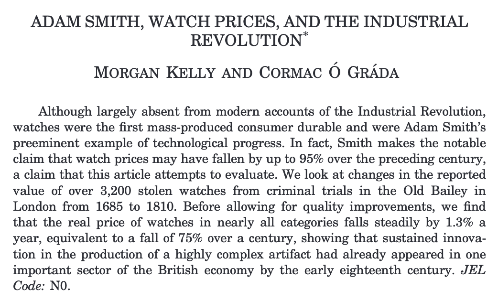
```

---

## Productivity: the example from watches

```{r, old_bailey_data, fig.align='center', out.width="85%"}
knitr::include_graphics("figures/watch_distributions.png")
```

---

## Productivity: the example from watches

```{r, watch_victims, fig.align='center', out.width="65%"}

```

---

## Productivity: the example from watches

```{r, watch_prices, fig.align='center', out.width="75%"}

```

---

## Productivity: the example from watches

+ Average real price in 1710: £6
+ Average real price in 1809: £2
+ Average fall in price: approx. -1.3% per year
    - Wages were roughly unchanged
    - adjusting for quality changes productivity gains of roughly 2% a year.

---

## Division of labor

+ In a mid-eighteenth-century description of London trades, Campbell (1747 , p. 250) described how watches “at their first appearance . . . were began and ended by one man who was called a watchmaker” but “of late years the watchmaker . . . scarce makes anything belonging to a watch. He only deploys the different tradesmen among who the art is divided.” `r AutoCite(bib["kellyAdamSmithWatch2016"])`

+ “...if the Demand of Watches shou’d become so very great as to find constant imployment for as many Persons . . . the Maker of the Pins, or Wheels, or Screws, or other Parts, must needs be more perfect and expeditious at his proper work, . . . than if he is also to be imploy’d in all the variety of a Watch.” `r AutoCite(bib["henryConsiderationsEastIndiaTrade1701"])`

---

class: inverse, center, middle

# Part III

---

.center.pull.Large.black[Course outline]

.pull-left[
### Semester 1

1. Introduction
2. Agricultural revolution
3. Industrious revolution
4. Government & the financial revolution
5. The industrial revolution: an introduction and the factory system
6. Causes of the industrial revolution
7. The industrial revolution and international trade
8. The standard of living debate
9. The Poor Law and Social Assistance
10. 19th century globalization and trade
]

--

.pull-right[
### Semester 2

11. The Bank of England and monetary and financial stability
12. Britain and the export of capital
13. Decline in British Agriculture 1850-1890
14. Did Victorian Britain fail?
15. Entrepreneurial Failure?
16. The economics of empire
17. Unemployment assistance, the labour market and trade
18. The economics of WWI
19. The interwar monetary and financial crisis
20. The interwar economy
]

---

## Useful references

.pull-left[

]
.pull-right[

]

---

## Assessed work

+ 2 essays: 30%
    - 2,000 words each
    - Each essay counts towards 15% of grade
+ Exam: 60%
    * Past exams are available on the Keat's page
+ Presentation: 10%

---

## Essays

+ A short list of essay questions is on Keats
    - You are **encouraged** to develop your own essay question
    - You must get my approval for your own essay question
+ I cannot give extentions
    - If you cannot submit on the deadline you must request MCF in advance
+ **Talk to me about your essay plan**
+ I want you to make an argument!

---

## Presentation

+ Presentations start in week 6
+ Can sign up for presentations starting in week 3
    * No more than two presenters a day
    * Slots allocated to whoever signs up first
+ Presentation questions for each week posted on Keats
    - You may propose an alternative presentation question to me if you like.

---

class: inverse, center, middle

# Appendix 

---

name: message

## Appendix Slides

```{r, message_to_marc, fig.align='center', out.width='80%'}

```

---

### Appendix Slides

```{r, recent_pub, fig.align='center', out.width='70%'}

```

[return](#return)

---

name: clarkvbroadberry


[return](#nhavalue)

---

## References

```{r biblliography, results='asis'}
print_bib_rmd(bib, start = 1, stop = 6)
```

---

## References, contd

```{r bib2, results='asis'}
print_bib_rmd(bib, start = 7, stop = 12)
```

---

## References, contd

```{r bib3, results='asis'}
print_bib_rmd(bib, start = 13)
```

<!--chapter:end:01_long_run_overview.Rmd-->

---
title: "The Agricultural Revolution"
author: | 
    | Dr. Gabriel Geisler Mesevage 
    | gabriel.mesevage@kcl.ac.uk
    | Office Hours: Tues. 9-10am & Thurs. 4-5pm
date: "Last update: `r format(Sys.time(), '%d %B, %Y')`"
output: 
  xaringan::moon_reader:
    nature:
      beforeInit: "helper_functions/macros.js"
      ratio: '16:9'
    lib_dir: libs
    css: ["xaringan-themer.css", "helper_functions/extra.css"]
---

```{r setup, include=FALSE}
knitr::opts_chunk$set(echo = FALSE, warning = FALSE,
                      message = FALSE, fig.align='center', fig.retina=3,
                      out.width="75%")

library(RefManageR)
BibOptions(check.entries = FALSE, 
           bib.style = "authoryear", 
           style = "markdown",
           dashed = TRUE, hyperlink = FALSE)
source("helper_functions/helper_print_bib.R")
bib <- ReadBib("pres.bib")
```

```{r xaringan-themer, include = FALSE}
library(xaringanthemer)
style_solarized_light()
source("helper_functions/theme_lecture.R")
xaringanExtra::use_webcam()
xaringanExtra::use_tile_view()
```

# Outline

### Part 1. Feeding Britain: an overview

### Part 2. The agricultural revolution

### Part 3. Enclosure: a closer look

### Part 4: Preview of next week: reading regressions

---

class: inverse, center, middle

# Part I: Feeding Britain: an overview

---

## A growth-accounting framework

+ Agricultural output is the result of combining
    - Land
    - Labor
    - Capital
+ Productivity is how *well* you combine them
+ Measuring inputs is a good starting point since productivity is poorly understood

---

.pull-left40[
## Feeding Britain: an overview

+ Source: `r AutoCite(bib["kellyNumerareEstErrare2013a"])`.
+ **But remember**: population goes from ~6 m. in 1300 to ~20 m. in 1850!

]

.pull-right60[
```{r, kelly_and_pop, fig.align='center', out.width="100%"}
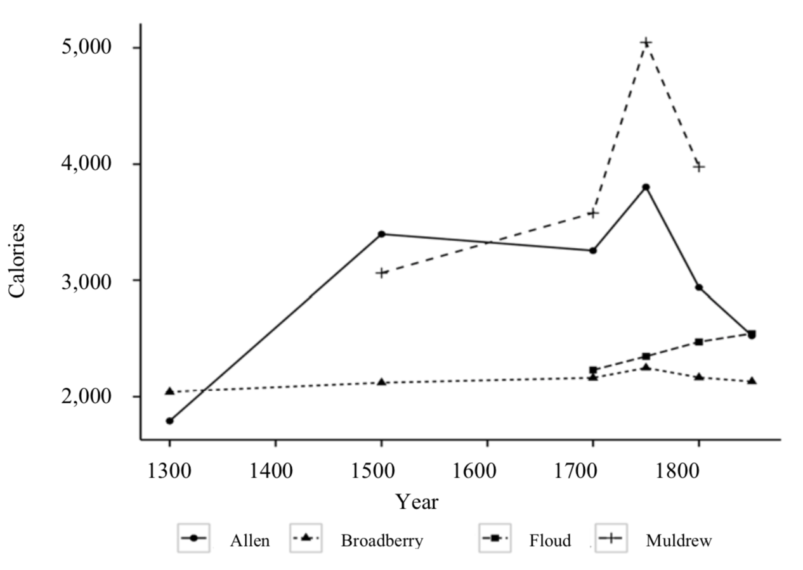
```
]


---

```{r, input_indices, fig.height=4.5, fig.width=6}
library(tidyverse)
library(ggalt)
library(ggrepel)

df <- data.frame(date = rep(c(1700,1800,1850), 2),
                 input = rep(c("Land", "Labor"), each=3),
                 index = c(1, 1.35, 1.37, 1, .95, 1.16))

df %>% ggplot(aes(date, index, color=input, label=index)) + 
  geom_line() +
  geom_point(size=4) +
  geom_text(nudge_y = .04, color="black") +
  facet_wrap(~input) +
  scale_color_viridis_d(option = "D") + 
  ggtitle("Index of Land and Labour inputs")+
  theme_minimal() +
  ylab("Index") + xlab("") +
  guides(color=FALSE) +
  xlim(c(1690,1860)) + theme_lecture

```

---

```{r, capital_deepening, fig.height=4.5, fig.width=6}
cap <- data.frame(date = rep(c(1700, 1750, 1800, 1850), 2),
                  input = rep(c("Landlord", "Tenant"), each=4),
                  index = c(112, 114, 143, 232, 183, 195, 242, 353))

cap %>% ggplot(aes(date, index, color=input, label=index)) + 
  geom_line() +
  geom_point(size=4) +
  geom_text(nudge_y = 18, color="black") +
  facet_wrap(~input) +
  scale_color_viridis_d(option = "D") + 
  ggtitle("Index of Capital Deepening", subtitle = "Landlords and Tenants")+
  theme_minimal() +
  ylab("Index") + xlab("") +
  guides(color=FALSE)+
  xlim(c(1690,1860)) + theme_lecture

```

---

.right-column[
```{r, change_per_acre, out.width="100%", fig.height=4, fig.width=6}

pc <- data.frame(date = unique(df$date),
                 labor_ratio = df$index[df$input=="Labor"]/df$index[df$input=="Land"])

pc <- cbind(pc, cap %>% group_by(date) %>% 
  summarise(tot_cap = sum(index)) %>% 
  ungroup() %>% 
  filter(date != 1750) %>% 
  select(tot_cap))

pc %>% mutate(tot_cap = tot_cap/tot_cap[1]) %>% 
  gather(key = item, value = index, labor_ratio, tot_cap) %>% 
  mutate(item = if_else(item=="tot_cap", "Capital ratio", "Labor ratio")) %>% 
  ggplot(aes(date, index, color=item, label=round(index, 2))) +
  geom_line() + 
  geom_point(size=4) +
  facet_wrap(~item) + 
  geom_text(nudge_y = .1, color="black") +
  scale_color_viridis_d(option = "D") + 
  ggtitle("Index of Labor and Capital per Acre")+
  theme_minimal() +
  ylab("Index") + xlab("") +
  guides(color=FALSE)+
  xlim(c(1690,1860)) +
  theme_lecture

```
]

.left-column[
+ A consequence of increasing farm size
    - Enclosure, more below
]

---

## Feeding Britain: an overview

+ Farms got much bigger
+ The number of people employed in agriculture did not increase a lot
+ But the amount of land used increased substantially!
+ Remaining piece of the puzzle is productivity

---

class: inverse, center, middle

# Part 2: Agricultural revolution

---

## What do we mean when we say revolution?

At least 4 interpretations `r AutoCite(bib["overtonAgriculturalRevolutionEngland1996"])`:

--
1. A transformation in agricultural technique

--
2. Agriculture's ability to feed the growing population

--
3. Productivity increases

--
4. Broader criteria of change (an 'Agrarian Revolution') associated with institutional reform

---

### When was the Agricultural Revolution? Some conflicting interpretations

### Traditional View

+ Late-18th early 19th century

--

### Revisionist views

+ 17th century

--

### More revision

+ Even further into the past (16th century-17th century)
+ Unusual views: mid-19th century!

---

class: inverse, center, middle

# The traditional view of the agricultural revolution

---

## Traditional View of the Agricultural Revolution

**What**:

+ Agricultural technological innovation
    - Broad consensus on aspects of this, dispute is about timing

**How**:

+ Role of 'Great Men' of agriculture in pushing innovation
+ Institutional reform (enclosure)

**When**:

+ Late 18th early 19th century

---

## Traditional View of the Agricultural Revolution

**What**:

+ **Agricultural technological innovation**
    - Broad consensus on aspects of this, dispute is about timing

**How**:

+ Role of 'Great Men' of agriculture in pushing innovation
+ Institutional reform (enclosure)

**When**:

+ Late 18th early 19th century

---

## Agricultural technological innovation

.Large[
+ Crop rotation
+ Husbandry
+ Land improvement
+ Technology
]

---

## Crop rotation

.pull-left40[

+ Core innovations revolved around crop-use
+ Targeted use of crops to improve nitrogen fixation in soil and boost yields
+ Decreases the time that fields need to lie fallow
]

.pull-right60[
```{r, overfig, fig.align='center'}
knitr::include_graphics("figures/overton_twoviews.png")
```
]
---

## Husbandry

> "But, without any improper partiality to our own country, we are fully justified in asserting, that Britain alone exceeds all modern nations in husbandry." <br> -*Encyclopaedia Britannica*, 1797, i 249 cited (and endorsed) in `r AutoCite(bib["allenEnclosureYeomanAgricultural1992"])`

<br>

> "Nowhere is the culture of enrichment through improvement based on experience and experiment better illustrated than in the area of livestock breeding" <br> -`r AutoCite(bib["mokyrEnlightenedEconomyEconomic2012"])`.

<br>

- E.g. Bakewell's New Leicester Sheep: 15 years experimenting for a sheep that is 1.) fleshy, 2.) gains weight early in life, 3.) high muscle to bone ratio. Although "wool was of middling quality" `r AutoCite(bib["mokyrEnlightenedEconomyEconomic2012"])`.
- E.g. due to breeding cost of horses for transport falls 20-30% between 1724 and 1816-21 `r AutoCite(bib["gerholdProductivityChangeRoad1996"])`.

---

## Land improvement

+ Draining

> "The only modern technique that raised yields was hollow draining, and its diffusion was indeed responsible for the growth of yields in the heavy arable district" <br> -`r AutoCite(bib["allenEnclosureYeomanAgricultural1992"])`.

<br>

> "...a revolution on the claylands brought about by tile under-draining which allowed the conventional 'agricultural revolution' to spread from light soils to heavier ones" <br> -`r AutoCite(bib["overtonAgriculturalRevolutionEngland1996", "sturgessAgriculturalRevolutionEnglish1966"])`

---

## Technology

```{r, rotherham_plot, fig.align='center'}

```

+ Rotherham Plow
    - two horses instead of four
+ James Small `r AutoCite(bib["bruntMechanicalInnovationIndustrial2003", "mokyrEnlightenedEconomyEconomic2012"])`

---

.pull-right60[
```{r, tull_seed_drill, fig.align='center', out.width="100%"}
knitr::include_graphics("figures/tull_seed_drill.jpg")
```
]

.pull-left40[
## Technology

+ Jethro Tull's Seed Drill
]
---

## Traditional View of the Agricultural Revolution

**What**:

+ Agricultural technological innovation
    - Broad consensus on aspects of this, dispute is about timing

**How**:

+ **Role of 'Great Men' of agriculture in pushing innovation**
+ Institutional reform (enclosure)

**When**:

+ Late 18th early 19th century

---

## The 'Great Men' of the agricultural revolution

.pull-left[
```{r, great_men_young, out.width="60%"}

```

+ Arthur Young
]

.pull-right[
```{r, great_men_tull, out.width="60%"}
knitr::include_graphics("figures/jethro_tull.jpg")
```

+ Jethro Tull
]
---

## The 'Great Men' of the agricultural revolution

+ The 'Great Men': Jethro Tull, Lord Townshend, Arthur Young, etc.

> "These men are seen to have triumphed over a conservative mass of country bumpkins and single-handedly transformed English agriculture within a few years from a peasant subsistence economy into a thriving capitalist agricultural system capable of feeding the teaming millions in the new industrial cities" <br> -`r AutoCite(bib["overtonAgriculturalRevolutionEngland1996"], after = ", p. 4")`.

---

## The 'Great Men' critiqued

+ Revision in the timing of improvment
+ Doubts about the *diffusion* of their innovations:

> "All in all, it seems implausible that all this intellectual activity affected more than a small sliver of the agricultural sector, and that its effects on overall output, with some exceptions, were modest and late" <br> -`r AutoCite(bib["mokyrEnlightenedEconomyEconomic2012"], after = ", p. 186")`.

+ Doubts about the *quality* of their innovations
    - e.g. Jethro Tull argued that air was the best fertilizer

---

## Traditional View of the Agricultural Revolution

**What**:

+ Agricultural technological innovation
    - Broad consensus on aspects of this, dispute is about timing

**How**:

+ Role of 'Great Men' of agriculture in pushing innovation
+ **Institutional reform (enclosure)**

**When**:

+ Late 18th early 19th century

---

class: inverse, center, middle

# Part 3: Enclosure

---
.pull-left40[
## Enclosure

+ A reinterpretation of the role of enclosure in the agricultural revolution
]

.pull-right60[
```{r, allen_frontis, out.width="65%"}
knitr::include_graphics("figures/allen_enclosure_frontis.jpg")
```
]

---

## Enclosure: the traditional view

Allen's depiction of what he calls 'Agrarian Fundamentalism':

1. Technical revolution in farming caused by 'modernization' of rural institutions
2. Growth in agricultural productivity boosted early industrialization. 

> "The manufacturing cities were built with savings from the agricultural surplus, they were people with labour freed from farming, and they were fed with the food produced by improved methods." <br> —`r AutoCite(bib["allenEnclosureYeomanAgricultural1992"], after = ", p. 2")`

3. Increase in inequality an inherent feature. 

> "The idea that there is a trade-off between growth and equity is one of the most entrenched ideas of Agrarian Fundamentalism." <br> —`r AutoCite(bib["allenEnclosureYeomanAgricultural1992"], after = ", p. 2")`

---

## Enclosure: the traditional view

Early views quotes from `r AutoCite(bib["allenEnclosureYeomanAgricultural1992"], after = ", p. 3")`:

> "the destruction of the common-field system of cultivation; the enclosure, on a large scale, of commons and waste lands; and the consolidation of small farms into large...wrought, without doubt, distinct improvement from an agricultural point of view. They meant the substitution of scientific for unscientific culture." <br> —Toynbee (1884)

<br> 

> "Small yeomen, openfield farmers, and commoners could never have fed a manufacturing population. They could not have initiated and would not have adopted agricultural improvements." <br> —Ernle (1912)

---

## Enclosure: the traditional view

This view remains influential (quotes from `r AutoCite(bib["allenEnclosureYeomanAgricultural1992"])`):

+ "Enclosure of open fields, engrossing of smaller plots and holdings into larger agricultural units (units of production and tenure rather than units of ownership) established the basis of improvement...The break-up of the peasantry was the price England paid for the increased supplies of corn and meat to feed her growing population" (Mathias, *First Industrial*, 1983)
+ "The full benefits of drainage and root crops were not possible without enclosure...The land must be freed from communal restrictions that held back the numbers of livestock and technical improvements. The purpose of enclosure was to do precisely this...Yields may have been nearly doubled" (Wilson, *England's Apprenticeship*, 1984)

---

## Agrarian Fundamentalism

Allen suggests two flavors of Agrarian Fundamentalism

#### 1. Tory view

+ Enclosure begets more capital intensive agriculture
    - Think employment should *increase* because of profitability but fall as a percentage of population

#### 2. Marxist view

+ Enclosure is labor-shedding: frees workers to go to manufacturing

.large[**Both view it as necessary component of industrialization!**]

#### Allen's view:

+ "We have surely now heard the last of the incompatibility of small properties and small farms with agricultural improvement. (Mill 1848: 154)."

---

## The view from development economics

.pull-left[
#### Contemporary studies of peasant production suggest:
    
1. Production usually exhibits constants returns to scale
2. Small farms are typically more intensively worked 
  + household labor (e.g. grandparents)
3. Some of the additional work actually functions as capital formation 
4. Output per acre tends to be higher on smaller farms because of greater intensity
5. *Purchased* capital goods and fertilizers tend to give large farms an advantage because they borrow at cheaper rates
]

.pull-right[
```{r, boserup, out.width="50%"}

```

+ Boserup as 'anti-Malthus'
+ Productivity increasing in population density
  - Necessity the mother of invention
]
---

## When did enclosure occur?

```{r, enclosure_table}

```

+ Source: `r AutoCite(bib["clarkCommonRightsLand2001"])`.

---

## When did enclosure occur?

```{r, enclosure_graph, out.width="60%"}

```

+ Source: `r AutoCite(bib["overtonAgriculturalRevolutionEngland1996"])`

---

## What Allen argues

> "I argue that there were two agricultural revolutions in English history — the
yeomen's and the much more famous landlords'" <br> —`r AutoCite(bib["allenEnclosureYeomanAgricultural1992"], after = ", p. 13")`.

#### Rise and fall of Yeoman

+ Black Death $\rightarrow$ unrest $\rightarrow$ enclosure $\rightarrow$ provision of property rights c.16th
+ "The real collapse of yeoman agriculture occurred in the eighteenth century" (pp. 14)
    - sold their holdings to large estates where owners, or estates refuse to renew leases

#### **Most growth in output comes from yeomen's revolution**
  - Enclosed estates *do* adopt new tech faster, but aggregate effect is small
  - Landlord's revolution is a transfer of value to landlord

---

## Two revolutions?

.pull-left[
```{r, two_revs_1, out.width="100%"}
knitr::include_graphics("figures/allen_first_ar.png")
```
]

.pull-right[
```{r, two_revs_2, out.width="100%"}

```
]

---

## Yeoman's revolution

+ A product predominantly of crop varieties, and rotations adopted between 1600-1750

> "There was a biological revolution in English agriculture between the middle ages and the nineteenth century — corn yields approximately doubled. That revolution was not the result of large-scale, capital-intensive farming" <br> —`r AutoCite(bib["allenEnclosureYeomanAgricultural1992"])`.

---

.pull-left40[
## Landlord's revolution

#### Rents rose benefitting landowners
  
- prices rise (.red[-consumers])
- rents on farm capital fall (.red[-tenants])
- wages stagnant (.red[-tenants])

]

.pull-right60[
```{r, rental_rate, out.width="100%"}

```
]


---

## Conclusion

Labor productivity in agriculture grew for three reasons:

1. More land under cultivation and **increasing** $\texttt{land}/\texttt{labor}$ ratio
2. Increase in capital per worker
3. Increase in growing efficiency: the techniques of the ag revolution

Enclosure

+ Was not hugely important in increasing output
    - although does seem in general to raise efficiency slightly
+ But brought change in social relations
    - The agricultural labor force became predominantly salaried male adults

---

## Conclusion

+ Hard to argue Britons ate much better in 1850 than 1700 `r AutoCite(bib["mokyrEnlightenedEconomyEconomic2012"], after = ", p. 195")`.
+ But also tripled population and did not starve
    - Also did so without serious famine as in Ireland
+ "...Britain may by 1815 have had the most productive and advanced farming sector in the world, but it was *still* in its best interest to abandon all that and specialize in what it was best at, which was manufacturing and services" `r AutoCite(bib["mokyrEnlightenedEconomyEconomic2012"], after = ", p. 197")`.

---

class: inverse, center, middle

# Discussion

---

class: inverse, center, middle

## Questions about Allen, "Tracking"

> "The concept of agricultural revolution does not mean simply an increase in output-it also implies an increase in productivity." Do you agree with this?

--
<br>

> Is Allen pursuasive in his advocacy for an earlier agricultural revolution?

--

## Questions about Kelly and O Grada

> In light of Kelly and O Grada's article, are estimates of agricultural output precise enough to meaningfully interpret trends over time?

--
<br> 

> Kelly and O Grada reference modern estimates from developing countries to try to calibrate the income elasticity of demand. Other economic historians (e.g. `r AutoCite(bib["allenEnclosureYeomanAgricultural1992"])`) also do this. Is this a helpful approach? A meaningful approach?

---

class: inverse, center, middle

## Part 4: Preview of next week: how to read a regression table

---

## What you will see

```{r, reg_examp, out.width="80%"}

```

+ Look at each row

---
.left-column[
## A Closer Look

+ The true relationships is:

$$ave(y) = 40 + 1.5 x$$
+ Regressions assume $ave(y) = a + b x$ and estimate $a$ and $b$
+ They estimate $a$ and $b$ by picking values that put the points 'close to' the line
]

.right-column[
```{r, reg_manual, out.width="100%", fig.height=4.5, fig.width=6}
set.seed(42)
x <- rnorm(100)
beta <- 1.5
alpha <- 40
eps <- rnorm(100)

y <- alpha + beta*x + eps

fd <- data.frame(y, x, eps)

reg <- lm(y~x, data = fd)

fd %>% 
  ggplot(aes(x, y)) + 
  geom_point(size = 3, color = "tomato") +
  geom_abline(slope = 1.5, intercept = 40) +
  theme_minimal() +
  geom_label_repel(data = data.frame(x = 0, y = 40,
                                     lab = "The intercept is 40"), 
                   aes(x, y, label = lab), nudge_x = -2, nudge_y = 2) +
  geom_label_repel(data = data.frame(x = -1.5, 
                                     y = 1.5 * -1.5 + 40,
                                     lab = "The slope of\nthis line is 1.5"), 
                   aes(x, y, label = lab), nudge_x = 3, nudge_y = -2) +
  geom_vline(xintercept = 0) +
  ggtitle("A simple regression") +
  geom_segment(aes(x, y, xend = x, yend = fitted(reg)), linetype="dashed") + 
  theme_lecture
  

```
]
---

.left-column[
## A simple regression

+ Regression with 100 observations
+ Close to true values:
  - 1.527 $\approx$ 1.5
  - 39.912 $\approx$ 40
]

.right-column[.Large[
```{r, reg_output, results='asis'}
stargazer::stargazer(reg, header = FALSE, 
                     title = "Example Regression Table",
                     single.row = TRUE,
                     omit.stat = c("rsq", "f", "ser"), type = 'html')
```
]]

---

.left-column[
### **Assumptions**: linearity

+ Here true relationship is $$ave(y) = 40 + 1.5 x^2$$
+ But estimated relationship assumes $$ave(y) = a + b x$$
]

.right-column[
```{r, reg_manual_nl, out.width="100%", fig.height=4.5, fig.width=6}
set.seed(42)
x <- rnorm(100)
beta <- 1.5
alpha <- 40
eps <- rnorm(100)

y <- alpha + beta*x^2 + eps

fd <- data.frame(y, x, eps)

reg2 <- lm(y~x, data = fd)

fd %>% 
  ggplot(aes(x, y)) + 
  geom_point(size = 3, color = "tomato") +
  stat_smooth(method = 'lm', se = FALSE) +
  theme_minimal() +
  ggtitle("A bad fit") +
  geom_segment(aes(x, y, xend = x, yend = fitted(reg2)), linetype="dashed") +
  theme_lecture
  

```
]

---

.left-column[
### **Assumptions**: nothing omitted

+ The relationship between any two variables can change when you introduce a third
+ *correlation $\neq$ causation*
]

.right-column[
```{r, reg_manual_ovb, out.width="100%", fig.height=4.5, fig.width=6}
set.seed(4242)
alpha <- 40
eps <- rnorm(100, mean = 0, sd = 15)
z <- rep(c(10,20), each = 50)
x <- rnorm(100, mean = z, sd = 3)

y1 <- alpha - x[1:50] + eps[1:50] + 5 * z[1:50]
y2 <- alpha - x[51:100] + eps[51:100] + 5 *  z[51:100]

y <- c(y1, y2)

fd <- data.frame(y, x, z, eps)

reg3 <- lm(y~x, data = fd)

p1 <- fd %>% 
  ggplot(aes(x, y)) + 
  geom_point(size = 3) +
  stat_smooth(method = 'lm', se = FALSE) +
  theme_minimal() +
  #ggtitle("Missing variables can change a relationship") +
  geom_segment(aes(x, y, xend = x, yend = fitted(reg3)), linetype="dashed") +
  theme_lecture
  
p2 <- fd %>% 
  ggplot(aes(x, y, color=as.factor(z), group=as.factor(z))) + 
  geom_point(size = 3) +
  stat_smooth(method = 'lm', se = FALSE) +
  theme_minimal() +
  #ggtitle("Missing variables can change a relationship") +
  geom_segment(aes(x, y, xend = x, yend = fitted(reg3)), linetype="dashed") +
  scale_color_viridis_d() +
  guides(color = FALSE) +
  theme_lecture

cowplot::plot_grid(p1, p2)

```
]
---

### Questions to think about when reading a regression

#### Did the authors omit variables that could change the relationship and should be included?

+ Requires researcher to argue for what should be included/excluded
  - This cannot be determined in statistical terms
  - A *qualitative* question about how the world works

#### Is the model appropriate?

- Did they measure things that are relevant?
- Did they measure them well?
- Is the relationship plausibly linear?

#### Is the relationship of a meaningful magnitude?

+ A lot of focus on statistical significance which we can ignore
+ Two key questions:
  - How uncertain are we about the relationship between two variables?
  - Is the size of the relationship big enough to matter?

---
.left-column[
### If you want to learn more...

+ 2 books on regression
+ 2 books on quantification in history
+ Feel free to talk to me about it!
]

.right-column[
.pull-left[

```{r, regression_stories, out.width="50%"}
knitr::include_graphics("figures/regression_stories_frontis.jpg")
```

```{r, mastering, out.width="50%"}

```

]

.pull-right[

```{r, history_numbers, out.width="50%"}
knitr::include_graphics("figures/history_numbers_frontis.jpg")
```

```{r, quant_humanities, out.width="50%"}

```

]
]

---

## References

```{r biblliography, results='asis'}
print_bib_rmd(bib, start = 1, stop = 6)
```

---

## References

```{r biblliography2, results='asis'}
print_bib_rmd(bib, start = 7)
```

<!--chapter:end:02_agricultural_revolution.Rmd-->

---
title: "Week 3: Consumption in the 18th Century" 
author: | 
    | Dr. Gabriel Geisler Mesevage 
    | gabriel.mesevage@kcl.ac.uk
    | Office Hours: Tues. 9-10am & Thurs. 4-5pm
date: "Last update: `r format(Sys.time(), '%d %B, %Y')`"
output: 
  xaringan::moon_reader:
    nature:
      beforeInit: "helper_functions/macros.js"
      ratio: '16:9'
    lib_dir: libs
    css: ["xaringan-themer.css", "helper_functions/extra.css"]
---
  
```{r setup, include=FALSE}
knitr::opts_chunk$set(echo = FALSE, warning = FALSE,
                      message = FALSE, fig.align='center', fig.retina=3,
                      out.width="75%")

library(RefManageR)
BibOptions(check.entries = FALSE, 
           bib.style = "authoryear", 
           style = "markdown",
           dashed = TRUE, hyperlink = FALSE)
source("helper_functions/helper_print_bib.R")
bib <- ReadBib("pres.bib")
```

```{r xaringan-themer, include = FALSE}
library(xaringanthemer)
style_solarized_light()
source("helper_functions/theme_lecture.R")
xaringanExtra::use_webcam()
xaringanExtra::use_tile_view()
```

# Today's Plan

### Shorter videos about key themes
  
.Large[
1. Consumption goods
2. The industrious revolution hypothesis
3. Backward bending labor supply curves
4. Time use
]
---

class: center, inverse, middle

# Part I: Consumption

---

background-image: url(figures/tea_background.jpg)
background-size: cover

## The rise of consumption

<style type="text/css">
.black { color: black; }
</style>

.pull-left[.black[

Tea & Sugar
+ 1722: 1oz of tea per person per year
+ 1822: 1oz of tea per person per week!

> "During the eighteenth century sugar became the single most important import into the British economy (Koyama, 2012, 516)".

Commodity consumption

> The history of ‘colonial groceries is one of the transformation of exotic luxuries into necessities’ (Berg, 2004, 365 in Koyoma, 2012, 516).
]]


---

## The rise of consumption

+ Probate inventories show consumer durables increasingly common

```{r kent_cornwall_probate, fig.align='center', out.width="60%"}
knitr::include_graphics("figures/kent_cornwall_probate.png")
```


---

## The rise of consumption

```{r glass_shopping, fig.align='center'}
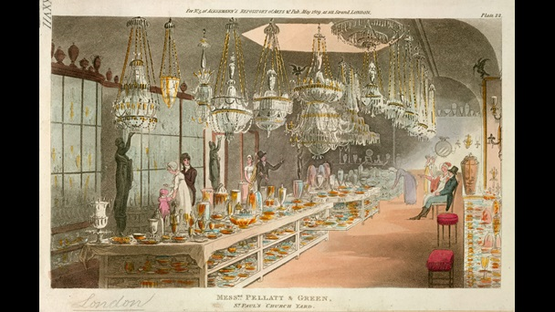
```

+ Shopping for glassware at Messrs. Pellatt and Green's, 1809

---

## The rise of consumption

```{r fabriuc_shopping, fig.align='center', fig.retina=3, out.width="65%"}
knitr::include_graphics("figures/consumerism-shopping-fabric-D40089-62.jpg")
```

+ Shopping for fabric, 1809

---

### Contemporary notice

> "The substantial tradesman, who was wont to pass his evening at the ale house for  fourpence  half-penny,  now  spends  three  shillings  at  the  tavern,  while his  wife  keeps  card-tables  at  home;  she  must  likewise  have  fine  clothes,  her chaise  or  pad,  with  country  lodgings,  and  go  three  times  a  week  to  public diversions...  The gayest  places  of  public  entertainment  are  filled  with  fashionable figures; which, upon inquiry, will be found to be journeymen tailors, serving men, and abigails [ladies’ maids], disguised like their betters" (Smollett 1793).

--

### Berg's conclusion

> "Consumer aspirations across class and gender stimulated the rapid and extensive proliferation of new commodities from the later seventeenth century onwards. The supply-side responses to these aspirations were in turn to generate wider and deeper demand for these goods, bought to satisfy desires for fashion, respectability, sociability, or for convenience and comfort. These new consumer goods were generated through technological change, but above all through product innovation" (Berg, 2007, 246).

---

## Measuring and explaining consumption

.center[
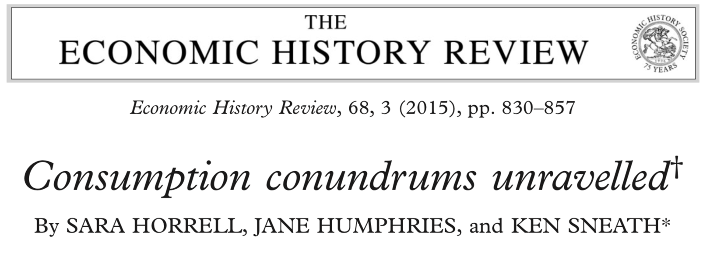]

+ Laborers seemed really poor (see week 8!) **who** was actually consuming?
+ The prices of consumer goods were falling (remember Adam Smith and Watch Prices?)
    - Was it a change in **preferences** that drove consumption?
    - Or was it a change in **prices**?
    - (Clearly its going to be at least in part prices — object is to measure how much.)

---

class: inverse, center, middle

## The source: Old Bailey Thefts

### Key Questions

What do we think about the composition of this sample?

Is it problematic for inferring trends in who owned what?

Is it problematic for inferring when they owned it?

---

## Measuring and explaining consumption

### The approach

+ For each **good** that is stolen (e.g. coins, stockings, etc.)
    - Examine change over time in average occupational status of owner
    - **But!**:
        + Need to net out change owing to price changes
        + Change owing to people getting richer (real wages)
        + And changes in the kind of good itself (improvements in quality)
+ General framework: **multiple regression**
+ Their interpretation: 
    - The relationship between occupational status and price reflects goods getting cheaper
    - The relationship between occupational status and time reflects changing tastes

$$\Big [ \texttt{Intuition: after prices and income you own what you prefer.}\Big ]$$

--

.center[**Is this sensible?**]
        
---

## Measuring and explaining consumption

> "Our findings underline the importance of fashion and tastes, which exerted an independent influence on the ownership of all the items that we examined, but make space too for price and income effects. The relative magnitude of fashion, price, and income varied according to the specific item considered, but none should be omitted in an account of the consumer revolution, which our evidence suggests involved a complex interplay between desires and differentiation, and aspiration and affordability." <br>—Horrell et. al.

--

.center[**What is the role of social competition and status in driving our long working ours?**]

---

class: inverse, center, middle

# Part II: the industrious revolution hypothesis

---

.left-column[
## The puzzle

Probate inventories (and other sources) say consumption rising **but** wage data is flat

**How to reconcile?**]

```{r clark_v_probate, fig.align='center'}
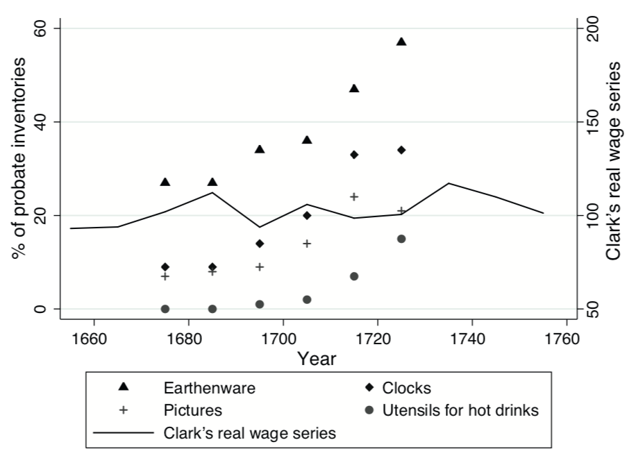
```


---

.left-column[
## The puzzle

Probate inventories say consumption rising **but** wage data is flat

**How to reconcile?**]

.right-column[
> "**Consumer demand grew**, even **in the face of contrary real wage trends**, and the productive achievements of industry and agriculture in the century before the Industrial Revolution could occur **because of reallocations of the productive resources of households.** In England, but in fact through much of Northwestern Europe and Colonial America, a broad range of **households made decisions that increased both the supply of marketed commodities and labor and the demand for goods offered in the marketplace.** This combination of changes in household behavior constituted an "industrious revolution"" (de Vries, 1994, 255)
]

---

## The industrious revolution

.pull-left[
+ If wages were stable...
+ But consumption increased

$\rightarrow$ Implies an increase in **hours worked**

### Why?

+ de Vries argues change in consumer desires leads to increased labor

$\rightarrow$ This implies that **before** this 'industrious revolution' workers had less desire for wages 

$\rightarrow$ they might work **less** if paid **more**

]

.pull-right[]

---

## The Building Blocks of de Vries Industrious Revolution

.pull-left[
#### Contextual factors

**The Revolt of the Early Modernists**: as we saw in the Agricultural revolution lecture the 17th and 18th centuries were far from static.

**The Revisionist Macroeconomics of the British IR**: The newer GDP estimates revised growth rates downwards -- growth rises far more smoothly from the 18th to the 19th century.
]

--

.pull-right[
#### Theoretical building blocks

**The Western European Marriage Pattern**: a critical element in de Vries' theory of a family that is adaptable to the market, but whose behavior is not wholly determined by market forces.

**The 'New' Household Economics**: de Vries will tackle the 'black box' of the family unit by approaching it with microeconomic theory.
]

---

## A model of the family

.pull-left[


+ Families can allocate their time ( $T$ ) towards
    - Leisure ( $T_l$ )
    - House work ( $T_c$ )
    - Wage work ( $T_w$ )
    - And that accounts for all of their time: $T = T_l + T_c + T_w$

<br>

+ Families do not directly consume products, they transform them to consume them using their labor, and they consume them in their leisure
    - **e.g.** Products ( $x_i$ ) might be groceries and what is eaten ( $z_i$ ) is the product of the food and the labor allocated to preparing it
        + Consider shopping and cooking ( $T_c$, $T_w$, $x_i$ ) to eat ( $T_l$, $z_i$ ) as opposed to ordering take-out ( $\downarrow T_c$, $\uparrow T_w$, $x_j$ )

]

--

.pull-right[
+ Family welfare is the sum of what they consume ( $\sum_i z_i \pi_i$ )
+ **But** what we measure of family welfare is the sum of the goods they purchase/the wage they receive ( $\sum_i x_i p_i$ )
+ We are missing
    - The value-added of family labor
    - Changes in the efficiency of family production
]

---

class: center, middle, inverse

# Discussion: de Vries and the Industrious Revolution

> Explain how in de Vries model "full income" of a household could diverge from its measured income?

--

<br>

> "...new commodities by themselves do not possess the utility that they come to acquire once they are bundled with others." Why is this point important to de Vries' argument?

--

<br>

> Is the industrious revolution more than the decline in the prices of consumer durables?

--

<br>

> How strong is the case for a demand-led industrial revolution?

---

class: inverse, center, middle

# Part III: Backward bending labor supply curves

---

### Backward Bending Labor Supply Curves?

+ **Recap**: per De Vries workers might work **less** if paid **more**

***

--

.pull-left[
### Leisure is a superior good 

> On laborers: "if by Fours Days labor in a Week they can maintain themselves, will hardly be persuaded to work the fifth" (Mandeville, 1924, 1723, 509).
]

.pull-right[
> The poor "just work so much and no more, as may maintain them in that mean condition to which they have been accustomed" (Sir Joshua Childs in Koyama 2012)
]

***

--

### Until better goods arrive...

> "it is a violent method and most cases impracticable, to oblige the laborer to toil in order to raise from the land more than what subsists himself and his family. Furnish him with manufactures and commodities and he will do it himself." (David Hume quoted in de Vries, 2008).

---

.left-column[
## Backward Bending Labor Supply Curves?

Implies some wage rate $w^*$ above which higher wages result in less work and more leisure
]

.right-column[
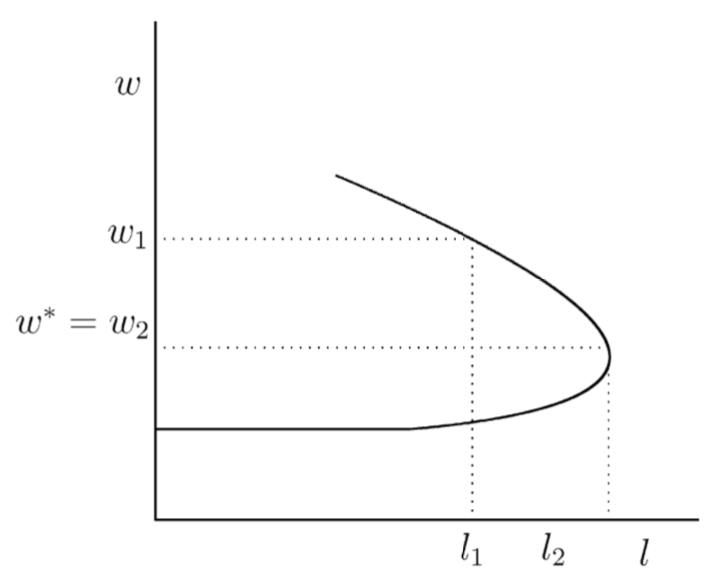
]


---

class: inverse, center, middle

# Part IV: Time use

---

## Economic change and time use


> "Thompson saw the coming of industry as a watershed in the history of time and work. The pre-industrial world, he suggested, was marked by irregular work rhythms. Workers focused on completing certain tasks, rather than working for a set number of hours, and consequently there was little need for an understanding or application of clock time." <br> —Hailwoood, p. 2.

+ Hailwood, on basis of 4,300 rural witness statements, argues that "Thompson was wrong to see clock-time consciousness and regular work rhythms as inventions of the factory."

---

## Voth's approach

.Large[
+ Look at Old Bailey reports
  + What do witnesses say they were doing and **what time do they say they were doing it!**
]

<br>

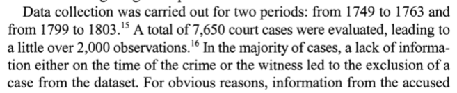

---

## Why do we work so much?

.pull-left[
```{r working_hours}

work_time <- data.frame(Date = c(1760, 1800, 1830, 1870, 2000),
                        Estimate = c(2576, 3328, 3356, 2755, 1653))

work_time$`Avg. Hours/week` <- round(work_time$Estimate/52, 2)

knitr::kable(work_time, format = "html", caption = "Estimated Annual working hours in England (Koyama, p. 508, Table 1)")
```

+ In 1930, JM Keynes famously predicted that in the future we would have a 15 hour work week.]

.pull-right[


]

---

class: inverse, center, middle

# Questions about time use

> Do we think times as collected by witness statements are a good representation of work patterns?

--

<br>

> Is the increased labor hours Voth finds evidence for De Vries theory?

<br>

> How else might we explain the rise in working hours during the industrial revolution?

---

class: inverse, middle, center

# Open questions?

> Was Keynes roughly correct in his predictions about work?

<br>

> What about the concept of a career? Do we labor for the money or the social distinction?


<!--chapter:end:03_consumption.Rmd-->

---
title: "Week 4: Government and the Financial Revolution" 
author: | 
    | Dr. Gabriel Geisler Mesevage 
    | gabriel.mesevage@kcl.ac.uk
    | Office Hours: Tues. 9-10am & Thurs. 4-5pm
date: "Last update: `r format(Sys.time(), '%d %B, %Y')`"
output: 
  xaringan::moon_reader:
    nature:
      beforeInit: "helper_functions/macros.js"
      ratio: '16:9'
    lib_dir: libs
    css: ["xaringan-themer.css", "helper_functions/extra.css"]
---

```{r setup, include=FALSE}
knitr::opts_chunk$set(echo = FALSE, warning = FALSE,
                      message = FALSE, fig.align='center', fig.retina=3,
                      out.width="75%")

library(RefManageR)
BibOptions(check.entries = FALSE, 
           bib.style = "authoryear", 
           style = "markdown",
           dashed = TRUE, hyperlink = FALSE)
source("helper_functions/helper_print_bib.R")
bib <- ReadBib("pres.bib")
```

```{r xaringan-themer, include = FALSE}
library(xaringanthemer)
style_solarized_light()
source("helper_functions/theme_lecture.R")
xaringanExtra::use_webcam()
xaringanExtra::use_tile_view()
```

class: center, middle, inverse

# Today's plan

---

## Lecture Outline

.pull-left[

#### Video 1

+ Context
    + The financial revolution
    + The growth in government borrowing
    + The growth of fiscal capacity

***

#### Video 3

+ Some critiques
  + Clark on private rates of return
  + Sussman & Yafeh on Britain vs the Netherlands
]

.pull-right[

#### Video 2

+ Douglass North, Institutions and the Financial Revolution
    + The 'New Institutional Economics', a brief overview
    + Douglass North and his legacy in economic history
    + 'Constitutions and Commitment': the argument
        + 'Credible commitment'
        + Revolution and restraint
        + The evidence from bond yields
]

---

class: inverse, center, middle

# Part I

---

## The financial revolution

.left-column[

]

.right-column[

+ P.G.M Dickson, *The Financial Revolution in England: A Study in the Development of Public Credit, 1688-1756*, 1967.
+ Influential history of administrative and bureaucratic reform underpinning the development of the market for public debt
+ Two major prongs
    1. Growth of finance and insurance
        + Bank of England chartered in 1694
        + Sun Fire Insurance in 1710, and others
        + Declining interest rates, growth in trade
    2. War
        + Vicious mercantile wars of 18th c.
        + England at war for 29 of 66 years between 1688 and 1756
]

---

.left-column[
## Debt and war

+ War is a catalyst for borrowing capacity
]

.right-column[

]

---

.left-column[

]

.right-column[

### The 'Fiscal-Military State'

> "In recent years it has been fashionable to downplay the importance of taxes in funding the bellicose expansion of the eighteenth-century English state and to emphasize the importance of a highly sophisticated system of public borrowing. This vogue is largely explained by the brilliant work of P.G.M. Dickson... But in ascribing the evolution of public indebtedness to the weakness of the English tax system, **Dickson underestimates the importance of taxes to the so-called financial revolution.** No matter how sophisticated the mechanism or means, the state’s ability to borrow was contingent upon the belief among its creditors that it had the capacity and determination to meet its payments." (Brewer, 1987, 73, my emph).

]

---
.right-column[
]

.left-column[
### Tax Power

+ Note the rise of excise and fall of land tax
+ Symptomatic of centralizing power of taxation (land tax preferred by Parliament)
]
---

## The Fiscal-Military State

+ Nexus of effective taxation and borrowing geared toward the pursuit of war
+ Growth in tax *not* mere reflection of economic growth
    - Between 1670 and 1810 tax receipts grow ~5 $\times$ faster than economy
    
> "The eclipse of the land tax was symptomatic of two developments which were of major importance to the subsequent history of the English state. The switch from direct to indirect taxation meant that the bulk of the revenue was no longer collected by a hodge-podge of amateur and local officials but by a centrally appointed body of crown employees. It also signalled the birth of the long-term national debt as more and more indirect taxes were assigned to fund government loans. In this way **the preponderance of indirect taxes was inextricably linked to the growth of public credit.**"

---

## The state, credibility, and restraint

.pull-left[

>"Other expedients to finance war which might have been tried (and were, by other powers), such as inflation of the currency or writing off accumulated debts, were by definition self-defeating in anything except the short run." (Dickson, pp. 10-11)

]

.pull-right[

> "The land tax, despite its heavy incidence on the landed classes, was preferred by the House of Commons over other taxes because it was the most limited case of the exercise of executive power... Opting for the land tax, then, was one of several parliamentary strategies designed to reduce the growth of the fiscal-military state." (Brewer, pp. 81)

]

<br>

.center[
###...Segue to North and Weingast (1989)
]

---

class: inverse, center, middle

# Part II

---

## Douglass North

.pull-left[


]

.pull-right[

+ Shared the Econ Nobel in 1993 with Robert Fogel
    - Important figure in popularizing a particular way of writing economic history
+ Cliometrics
+ New Institutional Economics
+ A very influential paper — although thesis has been heavily critiqued
    - 5,302 citations!

]

---

.pull-left[
### Cliometrics

+ Douglass North and Robert Fogel win Nobel for being "pioneers in the branch of economic history that has been called the ‘new economic history,’ or cliometrics."
+ "Cliometric School" (Clio + Econometrics)
    - Incorporation of theory (from economics) and statistical analysis (econometrics)
    - First in the US in the 1950's-70's, then spreads to UK

.center[ 
]

]

.pull-right[
### New Institutional Economics

+ Ronald Coase and Oliver Williamson
+ *Transaction costs*:
    - Institutions arise to reduce them
    - Explain the existence of wide-variety of non-market structures
    
> "The costs of defining and enforcing property rights — transaction costs — lead to non-price allocation of many goods and services today, because the costs of delineation or enforcement exceed the benefits." (North, "Markets and Other Allocation Systems in History: the Challenge of Karl Polanyi")

]

---

.left-column[
### North's work and influence
]

.right-column[
  

  
]

---

## 'Constitutions and Commitment': the problem

+ Difficulty of making a promise now when you are not incentivized to keep it later.
+ **Why do sovereigns pay back debts?**
    - One solution: Reputation
    - BUT reputation depends on discount rate, difficult in times of war

--


.right-column[

***

### Discount Rate

+ How much do you prefer a dollar today relative to a dollar next year?
    - If you wait to get paid you might:
        + Die, and not get to spend your dollar
        + Inflation might erode the value of your dollar
        + You would miss out on investing your dollar
        + You might really need the dollar right now for coffee, etc.

***
]

---

## 'Constitutions and Commitment': the argument

.pull-left[
#### Features

+ Glorious revolution creates checks on executive power
+ Check's on power include
    - Curtailing outside sources of executive revenue
    - Parliamentary 'supremacy'
]

--
.pull-right[
#### Mechanisms

+ Previous removal of monarchs gives Parliament 'credible threat'
+ Combine with funding government
    - Argues Parliament itself not predatory b/c of countervailing interests
+ Specific to Financial Revolution
    - earmarking of taxes to debts
    - BoE with restriction on purchase/lending without Parliamentary consent
]

--

#### Result

+ The Crown can 'credibly commit' today to pay back a loan tomorrow
+ Facilitates the development of national debt
    - Drives down the interest rate on national debt


---
.left-column[
### 'Constitutions and Commitment': the evidence

+ Interest rates decline in ~60 years after revolution
]

.right-column[
```{r interest_loans, fig.height=3.5, fig.width=5, out.width="100%"}
library(tidyverse)
library(ggthemes)
library(ggrepel)

irates <- data.frame(Date = c(1693, 1694,
                              1694, 1697,
                              1698, 1707,
                              1721, 1728,
                              1731, 1739),
                     Interest = c(14, 14, 8, 6.3, 8, 6.25, 
                                  5,4,3,3))

irates %>% 
  ggplot(aes(Date, Interest, label = paste0(Interest, "%"))) +
  geom_point() + 
  geom_text_repel() +
  ggtitle("Interest rates on select loans") +
  theme_hc() +
  theme_lecture


```
]

---
.pull-left[
## 'Constitutions and Commitment': the consequences
]

.pull-right[
.center[
> "The institutions leading to the growth of a stable market for public debt provided a large and positive externality for the parallel development of a market for private debt." (North and Weingast, pp. 825).
]
]

<br>

.Large[
.center[
BoE & security in property $\rightarrow$ growth in banking, bill market, and financial activity
]
]

---
class: inverse, center, middle

# Part III

---

.pull-left[
## 'Constitutions and Commitment': the critique

### Criticizing the link to the financial revolution

+ Growing body of evidence pushing Financial Revolution back in time
    - e.g. Ann Murphy, *Origins of English Financial Markets*, Sussman (2019 -- a few weeks ago!) on Corporation of London
+ Clark, "Political Foundations" (1996) computes rates of return on other assets (e.g. mortgages) and finds no fall in rates after 1688
]

--

.pull-right[
### Criticizing the link to lowered borrowing costs

+ Sussman and Yafeh, "Institutional reforms", (2006)
+ Suggests decline in interest rates was slow to follow, tracked the Netherlands, and was partially explained by Dutch rates

> "The long time lag between the institutional reforms of the late seventeenth century and the emergence of London as the world's main financial center suggests that the link between the two is, at best, a long-run phenomenon; even if institutions do affect interest rates and financial development, the effect tends to be slow." (pp. 910).
]

---

.pull-left[

### Clark's Critique

+ Computes *private* rates of return, mostly to land
+ Data from the Charity Commission
  - A few thousand transactions or wills

> "Did any of the supposedly important political events of the sixteenth and seventeenth century affect rates of return in the private capital market? ...The private rates of return change slowly with time, indicating no dramatic upward movement in any of the periods of political uncertainty..." <br>(p. 578)
]

.pull-right[
.center[


]
]

---

.pull-left[

### Sussman and Yafeh's Critiques
 
>  "The main conclusion that emerges from the present study is that financial markets do not reward countries for institutional reforms in the short run. "Good" institutions may well be important for long-run growth, but the mechanism relating institutions and growth is apparently something other than an immediate reaction of financial markets and a reduction in the cost of capital. ...We believe that Britain's ascendancy to a position of supremacy in Europe and in the world was the outcome of very long processes... The evidence on the importance of the Glorious Revolution and the institutional changes of the seventeenth century as a turning point remains elusive." <br> (p. 929).
]

.pull-right[
.center[


]
]

---

class: inverse, center, middle

# Questions

>"...one necessary condition for the creation of modern economies dependent on specialization and division of labor (and hence impersonal exchange) is the ability to engage in secure contracting across time and space. That entails low transaction costs per exchange. The creation of impersonal capital markets is the single most important piece of evidence that such a necessary condition has been fulfilled." Explain and evaluate this claim by North and Weingast

---

class: inverse, center, middle

# Discussion

> Carlos and Neal describe the Netherlands as a 'bank-oriented system' and Britain as a 'market-oriented system': what do they mean by this? What evidence do they point to?

--

<br> 

> Carlos and Neal recount British and Dutch finance as displaying "...a symbiosis that proved highly beneficial for both financial systems." Is it misleading to speak of a financial revolution in *England*? Is financial history inimical to history narrated in national terms? Is the interpenetration of English and Dutch markets problematic for the story told by North and Weingast?

---

class: inverse, middle, center

# Discussion

>"The creation of what I call ‘the fiscal-military state’ was the most important transformation in English government between the domestic reforms of the Tudors and the major administrative changes in the first half of the nineteenth century." Is 'fiscal-military state' a useful analytical construct? 

--

<br>

> "Whatever the situation when it came to the administration of law and order, in the fiscal-military sphere the state gained a hold as never before. This grip did not, however, become the stranglehold of autocracy, which raises, of course, the question of why Britain was able to enjoy the fruits of military prowess without the misfortunes of a *dirigiste* or despotic regime." How do we reconcile Brewer's narrative of the rise of centralized state power with North and Weingast's account of checks on political authority? 


<!--chapter:end:04_gov_finance.Rmd-->

---
title: "Week 5: The Industrial Revolution, Context and Overview" 
author: | 
    | Dr. Gabriel Geisler Mesevage 
    | gabriel.mesevage@kcl.ac.uk
    | Office Hours: Tues. 9-10am & Thurs. 4-5pm
date: "Last update: `r format(Sys.time(), '%d %B, %Y')`"
output: 
  xaringan::moon_reader:
    nature:
      beforeInit: "helper_functions/macros.js"
      ratio: '16:9'
    lib_dir: libs
    css: ["xaringan-themer.css", "helper_functions/extra.css"]
---

```{r setup, include=FALSE}
knitr::opts_chunk$set(echo = FALSE, warning = FALSE,
                      message = FALSE, fig.align='center', fig.retina=3,
                      out.width="75%")

library(RefManageR)
BibOptions(check.entries = FALSE, 
           bib.style = "authoryear", 
           style = "markdown",
           dashed = TRUE, hyperlink = FALSE)
source("helper_functions/helper_print_bib.R")
bib <- ReadBib("pres.bib")
```

```{r xaringan-themer, include = FALSE}
library(xaringanthemer)
style_solarized_light()
source("helper_functions/theme_lecture.R")
xaringanExtra::use_webcam()
xaringanExtra::use_tile_view()
```

# Outline of Today's Lecture

--

.pull-left[

#### Video 1

+ The debate about the industrial revolution
    - Was there an industrial revolution?
    - The process of industrial transformation
    
#### Video 3

+ The industrial revolution's history
    - Early views
    - Contesting the 'revolutionary' character
    - Rehabilitating the 'revolutionary' character
]

.pull-left[

#### Video 2

+ Inventions and key sectors
    - Energy
    - Textiles
    - Metallurgy
]

---

class: center, middle, inverse

# Part I: Framing

---

class: center, middle, inverse

## Was there an industrial revolution?

>"English society before 1832 did not experience an industrial revolution let alone an Industrial Revolution... [Its] causes have been so difficult to agree on because there was no 'Industrial Revolution', historians have been chasing a shadow" (Clark, 1986 in Mokyr, "Editor's introduction")

<br>

>"Was there an industrial revolution? The absurdity of the question is not that it is taken seriously but that the term is taken seriously ... by scholars who should know better" (Cameron, 1990 in Mokyr, "Editor's introduction")

---
.left-column[
### The process of industrial transformation

+ Hard to see in aggregate
]

.right-column[
```{r broadberry_et_al_headline, fig.height=4, fig.width=5.5, out.width="100%"}
library(tidyverse)
library(readxl)
library(ggthemes)

real_gdp_eng <- read_xlsx(path ="data/a-millennium-of-macroeconomic-data-for-the-uk.xlsx", 
                      sheet = "A21. GDP per capita 1086+", 
                      range = "A5:K790")

names(real_gdp_eng)[1] <- "Year"

real_gdp_eng %>%
  filter(Year > 1750 & Year < 1850) %>%
  ggplot(aes(Year, `Real GDP per capita`)) +
  #geom_point() +
  geom_line() +
  scale_x_continuous(breaks = seq(1750, 1850, 10)) +
  ggtitle("English Real GDP per capita, 1750-1850",
          subtitle = "Source: Broadberry et. al. (2015)") +
  ylab("Real GDP per capita") +
  annotate("path",
   x=1790+30*cos(seq(0,2*pi,length.out=100)),
   y=2200+300*sin(seq(0,2*pi,length.out=100)), color = "red") +
  annotate("text", x = 1760, y = 2500, label = "Industrial Rev?", color="red") +
  theme_lecture

```
]

---

## Urbanization & the fall in agricultural employment

.pull-left[
```{r ag_share, fig.align='center', fig.retina=3, out.width="80%", fig.width=5, fig.height=4}
library(ggalt)
library(ggrepel)

ag_share <- tibble(year = c(1601, 1780, 1820, 1870, 1913),
                   ag_share = c(63, 45, 35, 22.7, 11.8))

ag_share %>% 
  ggplot(aes(year, ag_share, label = paste0(ag_share, "%"))) +
  geom_lollipop(point.colour = "coral", 
                point.size = 5, ) +
  geom_text(nudge_y = 6) +
  ylab("Percent of Workforce in Agriculture") +
  xlab("Date") +
  ggtitle("Agricultural Employment Share", 
          subtitle = "Source: Crafts (1998) & Wrigley (2018)") +
  scale_x_continuous(breaks = ag_share$year) +
  theme_lecture

```
]

.pull-right[
```{r, out.width="80%"}

```

]

--

> "In organic economies, an increase in the proportion of the population living in towns was possible only if agricultural productivity was rising. Simply put, if, on average, every four families in the countryside were producing enough food to feed five families, a fifth of the population could be town dwellers." (Wrigley 2018)

---

.left-column[
## Urbanization & the fall in agricultural employment
]

.right-column[
```{r urbanization, fig.align='center', fig.retina=3, , out.width="100%", fig.width=5.5, fig.height=4}

urban <- data.frame(date = c(1520, 1600,
                                 1700,1750,1800),
                    London = c(2.3, 4.8, 11.0,
                               11.4, 11.1),
                    Other = c(2.9, 3.2, 5.3, 9.1, 16.4))

urban$Total <- urban$London + urban$Other

urban <- urban %>% gather("cat", "Percent", -date) 

urban %>% 
  ggplot(aes(date, Percent, color=cat)) +
  geom_point() +
  geom_line() +
  ylim(c(0,32)) + xlim(1500, 1820) +
  geom_label(data = urban %>% 
                     filter(cat=="Total"),
                   aes(date, Percent, 
                       label=paste0(Percent,"%")),
                   nudge_y = 3,
             show.legend=FALSE) +
  ggtitle("English Urban Population, percent of total",
          subtitle = "Source: Wrigley (2018), pp. 18") +
  scale_color_hue(name = "") +
  theme_lecture

```
]

---

class: center, middle, inverse

# Part II: Invention & Key Industries

---

## Inventions: a vocabulary

.pull-left[

### Process versus Product

+ **Process** innovations -- changing how things are built
+ **Product** innovations -- changing what is built
]

--

.pull-right[
### Macro vs Micro

+ **Macro** inventions -- "door opening breakthroughs"
+ **Micro** inventions -- "gap-filling minor improvements"
]

--
<br>

.pull.center.Large[ None of these distinctions are very clean]

---

class: inverse
background-image: url(figures/coal_map.jpg)
background-position: right
background-size: contain

.pull-left40[
## Energy

> "...it was physically impossible to produce iron and steel on the scale needed to create a modern railway system, or to construct large fleets of steel ships, or to enable each family to have a car, if the heat energy needed to smelt and process the iron and steel came from wood and charcoal." (Wrigley 2010)
]

---

.pull-left[
## Energy: Steam Engine

+ Converting *heat* energy into *work* energy
    - e.g. firearms
    - Steam engine:
        + 1690 Prototype, Denis Papin
        + 1712 Thomas Newcomen engine
        + 1765 James Watt separate condenser (4-fold fuel efficiency gain)
        + Roughly 2,500 built by 1800
        + Clear prototype for fossil fuels
]

.pull-right[

]

---

## Energy: Improvements in Water

+ John Smeaton 'breastshot' waterwheel

<br>

> "If the Industrial Revolution is located in the period 1760-1830, as it frequently is, then there are good grounds for regarding it as the Age of Water Power" (Musson, *The Growth of British Industry*, 139).

<br>

>"The developments in water power also demonstrate the fact that to view the industrial revolution as a switch from wood and animate energy to a coal-using economy is somewhat misleading" (Mokyr, "Technological Change", 25).

---

background-image: url(figures/Spinning-jenny.jpg)
background-position: right
background-size: cover

.pull-left[
## Textiles
]

---


.pull-left[
## Textiles

+ Cotton paradigmatic industry for showcasing inventiveness
+ Multi-step production process:
    1. cleaning (stalks and debris)
    2. carding to align the fibres
    3. spun -- technique determines thread 'count'
    4. Then woven
]

--

.pull-right[
+ Hargreaves, Spinning Jenny, 1764
    - Small and compatible with cottage production
    - Over 150,000 in use by 1811
+ Crompon 'Mule', 1779: extracts fibres and spins
+ Automating weaving is harder
    - Initial boom for weavers up to 1820
    - Gradual mechanisation, decline of handloom weaver in 1830s
+ Other innovations: bleaching (chemicals), 1784 Claude Berthollet; Color prints Thomas Bell 1783; Jacquard loom, 1801, weaving prints (binary code)
]

--

> "In the long run, the factory eliminated most of domestic production, though economic historians are not sure whether that was entirely the result of the new technology or whether other factors that favoured large-scale, concentrated enterprises played a role as well" (Mokyr, 22)
+ Marglin, "What do Bosses Do?", *Review of radical political economics*

---

.pull-left[
## Metallurgy

Iron ore $\rightarrow$ pig iron $\rightarrow$ wrought iron

+ Abraham Darby, 1709, use coke instead of charcoal in making pig iron
+ Henry Cort, 1784, improved refinement process, pig iron $\rightarrow$ wrought iron
    + Output increases 500% 1788-1815
    + Price falls from £22/ton to £14/ton 1801-1815
    
>"It is conceivable to imagine an industrial revolution based on water power and linen or wool -- in fact in many places that is precisely what happened. There was no substitute for iron, however, in thousands of uses, from nails to engines. As its price fell, iron invaded terrains traditionally dominated by timber, such as bridges, ships and eventually buildings" (Mokyr, p. 27).
]

.pull-right[
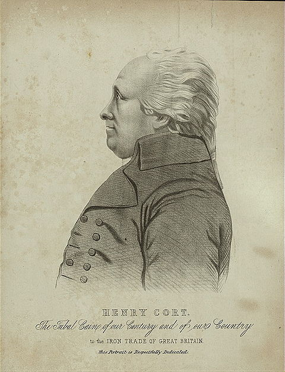
]

---

class: center, middle, inverse

## Part III: The industrial revolution's history

---

## Early views

.pull-left.center[

]

.pull-right[

> "...the essence of the industrial revolution is the substitution of competition for the medieval regulations which had previously controlled the production and distribution of wealth." (Toynbee 1884)

<br>

> "[The industrial revolution] separated England from her past as completely as the political revolution separated France from her past." (J. L. and B. Hammond, 1911)

]

---

## The view from the mid-20th century

.pull-left-border[

```{r rostow, out.width="45%", fig.align='center'}

```

+ An 'Non-Communist Manifesto'
+ A typology of economic development by 'stages' in which industrial revolution is prominent

]

.pull-right[
```{r thompson, out.width="45%", fig.align='center'}

```

+ IR as a turning point in class conception

]

---

### The early quantitative view

```{r dean_and_cole, out.width='85%', fig.height=3.5, fig.width=6, fig.align='center', fig.retina=3}

growth_data <- data.frame(dates = c("1700-60",
                                    "1760-80",
                                    "1780-1801",
                                    "1801-1831"),
                          dc = c(.45, -.04, 1.08,1.61),
                          crafts = c(.31, .01, .35, .52))

growth_data %>% 
   gather(key = "series", "growth_rate", -dates) %>% 
   filter(series == "dc") %>% 
   ggplot(aes(dates, growth_rate, color = series, group=series, label=growth_rate)) +
   geom_point(size=3) + 
   geom_line() +
  geom_label_repel(show.legend=FALSE)+
   ggtitle("Estimated growth rates: output per capita") +
   ylab("Growth rate") + xlab("")+ 
   theme(axis.text.x=element_text(angle=45, hjust=1))+
  scale_color_manual(values = c("steelblue"),
    name = "", labels = c("Dean & Cole")) +
  theme_lecture
  

```

---

### Revisionists: The Historical Macroeconomists

```{r dean_and_cole_and_crafts, out.width='85%', fig.height=3.5, fig.width=6, fig.align='center', fig.retina=3}

growth_data <- data.frame(dates = c("1700-60",
                                    "1760-80",
                                    "1780-1801",
                                    "1801-1831"),
                          dc = c(.45, -.04, 1.08,1.61),
                          crafts = c(.31, .01, .35, .52))

growth_data %>% 
   gather(key = "series", "growth_rate", -dates) %>% 
   #filter(series == "dc") %>% 
   ggplot(aes(dates, growth_rate, color = series, group=series, label=growth_rate)) +
   geom_point(size=3) + 
   geom_line() +
  geom_label_repel(show.legend=FALSE)+
   ggtitle("Estimated growth rates: output per capita") +
   ylab("Growth rate") + xlab("")+ 
   theme(axis.text.x=element_text(angle=45, hjust=1))+
  scale_color_manual(values = c("coral", "steelblue"),
    name = "", labels = c("Crafts", "Dean & Cole")) +
  theme_lecture
  

```

---

.pull.center[
]

### Revisionists: The dynamism of the 17th & 18th centuries

+ Agricultural revolution
+ Consumer revolution
+ Transport Revolution
+ Political/Financial Revolution

---

## Rehabilitating the industrial revolution: Berg & Hudson

.pull-left40[

### Growth is mismeasured

+ "...growth and productivity change in the period are currently underestimated"

### Growth is not the whole story

+ "...growth rates on their own are inadequate to the task of identifying and comprehending the industrial revolution"
]

.pull-right[

### What should we focus on?

> "The national accounts approach to economic growth and productivity change is not a good starting point for the analysis of fundamental economic discontinuity."
]

---

## Rehabilitating the industrial revolution: Mokyr's Example

+ Imagine the British economy as composed of two sectors
    1. Traditional
        + Large
        + Grows slowly
    2. Modern
        + Small
        + Grows quickly

<br>

> "A moment of reflection and a few simple computations indicate that for a country that undergoes structural change while it grows, very sudden accelerations in the growth rate of the kind that Rostow envisaged are simply impossible. Thus the finding that the aggregate effects of the Industrial Revolution are not overwhelming before 1820 is not surprising" (Mokyr, "Editor's introduction", 12).

---

## Rehabilitating the industrial revolution: Mokyr's Example

```{r animation, fig.retina=3, fig.align='center', cache=TRUE, warning=FALSE, message=FALSE, out.width="50%"}
library(tidyverse)
library(gganimate)

df <- data.frame(year = 1:100)
df$modern <- 1.04^(df$year - 1)*.1
df$traditional <- 1.01^(df$year - 1)*.9

p <- df %>% gather("sector", "output", -year) %>% 
  ggplot(aes(year, output, fill=sector)) + 
  geom_area() + 
  ggtitle("Total economic growth with two sectors") + 
  scale_fill_manual(values = c("#cb4b16", "#268bd2")) +
  theme(legend.position="bottom") + 
  ylab("Total output (year 1 = 1)") + 
  xlab("Years") + transition_reveal(year) +
  theme_lecture

animate(p, height = 400, width = 504, end_pause = 10)  

```


---

## Rehabilitating the industrial revolution: what national accounts miss

.pull-left40[
### The pitfalls of an aggregate view

+ The wages of women and children
+ The service sector
+ New products
+ New materials
+ Regional divergence
]

.pull-right60[
> "The industrial revolution was an economic and social process which added up to much more than the sum of its measurable parts. The period saw the sectoral specialization of regions and the growth of regionally integrated economies... The movement of aggregate quantitative indicators ignores this and, as presently calculated, fails to give an accurate account of the structural shift in the nature and deployment of the workforce because the calculations rely on adult male labor." (Berg & Hudson, 1992)
]

---

class: center, middle, inverse

# Questions

--

> "...we cannot think of the events of the past seventy years as sudden. Seventy British years [in the period 1760-1830] passed no more rapidly" (Hughes, *Industrialization and Economic History*, p. 45). Is the term industrial revolution misleading?

--

<br>

> "National income accounting, by itself, is not adequate to the task of presenting national economic activity" (Berg, p. 18). What are Berg's critiques of the Crafts-Harley view?

--

<br>

> "In fact, we still know too little to be able to write convincingly the type of book Berg has attempted. Perhaps her effort will, as she hopes, spur others on" (Hoppit, p. 223). What changes would Berg and Hoppit like to see in the historiography of the industrial revolution?


<!--chapter:end:05_ir_overview.Rmd-->

---
title: "Week 6: Causes of the Industrial Revolution" 
author: | 
    | Dr. Gabriel Geisler Mesevage 
    | gabriel.mesevage@kcl.ac.uk
    | Office Hours: Tues. 9-10am & Thurs. 4-5pm
date: "Last update: `r format(Sys.time(), '%d %B, %Y')`"
output: 
  xaringan::moon_reader:
    nature:
      beforeInit: "helper_functions/macros.js"
      ratio: '16:9'
    lib_dir: libs
    css: ["xaringan-themer.css", "helper_functions/extra.css"]
---

## Today's Plan

.pull-left[
.large[
### Part 1

+ Some quick advice on essay writing
+ Counterfactuals and causes in history
]
]

.pull-right[
.large[
### Part 2

+ Allen's theory of induced innovation
+ Some critiques of Allen

]]

.pull-left[
.large[
### Part 3

+ Mokyr's theory of 'industrial enlightenment'
+ Some criticism
]
]

```{r setup, include=FALSE}
knitr::opts_chunk$set(echo = FALSE, warning = FALSE,
                      message = FALSE, fig.align='center', fig.retina=3,
                      out.width="75%")

library(RefManageR)
BibOptions(check.entries = FALSE, 
           bib.style = "authoryear", 
           style = "markdown",
           dashed = TRUE, hyperlink = FALSE)
source("helper_functions/helper_print_bib.R")
bib <- ReadBib("pres.bib")
```

```{r xaringan-themer, include = FALSE}
library(xaringanthemer)
style_solarized_light()
source("helper_functions/theme_lecture.R")
xaringanExtra::use_webcam()
xaringanExtra::use_tile_view()
```

---


class: center, middle, inverse

# Part I

---

## Some brief advice on writing essays

.pull-left[
### Answer the question!!

+ ...by presenting and interpreting other scholars answers to the question
+ This should be easy as you can pick your own question
    - Check with me first that your question is OK

### Care about your reader

+ Spelling, Style, Structure
+ Say what you will do and then do it
]

.pull-right[
### Things not to worry about

+ Don't worry about your essay "not being economics-y enough"
+ You are not obliged to incorporate primary sources
    - If it is natural go ahead
+ You can use the first person "I will..."

### Give yourself time to edit!!!

> 
]

---
## Some brief advice on writing essays: essay structure

.pull-left[
.Large[
+ 2,000 words $\approx$ 5 paragraphs (400 words/paragraph)
    + Each paragraph should make a point
    + Subtracting intro and conclusion you can only make ~3 points. Make them count!
]]

--

.pull-right[
.Large[
+ How to write an introduction
  + What you will argue and what you will cover
  + *Do not* put definitions
  + *Do not* put pre-history


+ How to write a conclusion
  + Summarize argument
  + Assess strengths and weaknesses
]
]

---

## Causation: a Few Thoughts

### Causality in contemporary social science

+ Revolves around the idea of a **counterfactual**
    - Had you not taken an aspirin would you still have a headache?

.pull-left[    
```{r causality, fig.align='center', out.height="70%"}
library(DiagrammeR)

mermaid("
graph LR
  A(Aspirin) -->|Take| B(Head Pain<br>with Aspirin)
  A -->|Don't Take| C(Head Pain<br>w/out Aspirin)
")

```
]

.pull-right[
+ Difference in headache status is the causal effect
+ **Can never be observed!**
    - Attributing a cause is about defining the unobserved counterfactual
    - Causal claims flow from causal stories (models/narratives)
]
---

## Counterfactuals and history

.left-column[
+ Counterfactuals are debated in history
+ Much more common in economic history/social-scientific history
    - Why?
]

.right-column[

.pull-left[
]

.pull-right[
]
]
---

class: inverse, middle, center

# Part II

---

## Allen on Why the Industrial Revolution was British

.pull-left[

```{r allen_graph, fig.align='center', fig.retina=3, out.width="100%"}
library(DiagrammeR)

mermaid("
graph LR
  A((Commercial<br>Revolution)) --> B((Wages))
  C((Geography)) --> D((Energy<br>Prices))
  B((Wages)) --> F((Innovation))
  D((Energy<br>Prices)) --> F((Innovation))
  E((Capital<br>Prices)) --> F((Innovation))
  A --> G((Machine<br>Tools))
  G --> F
  B --> H((Education/<br>Training))
  H --> F
  A --> I((Urbanization))
  I --> D
  D --> E
style I fill:#93a1a1
style A fill:#93a1a1
style B fill:#93a1a1
style C fill:#93a1a1
style D fill:#93a1a1
style E fill:#93a1a1
style F fill:#93a1a1
style G fill:#93a1a1
style H fill:#93a1a1
")


```
]

.pull-right[
+ Allen's theory is multi-causal
    - High relative wages are one important component
+ He mainly wants to explain the adoption of technology in production -- industrial innovation

<br>

+ Methodologically he insists on a **comparative** view: why Britain as opposed to elsewhere?
]

---

## Allen: Core causal mechanism

.pull-left[
```{r allen_graph_3, fig.align='center', fig.retina=3, out.width="100%"}

mermaid("
graph LR
  A((Commercial<br>Revolution)) --> B((Wages))
  C((Geography)) --> D((Energy<br>Prices))
  B((Wages)) --> F((Innovation))
  D((Energy<br>Prices)) --> F((Innovation))
  E((Capital<br>Prices)) --> F((Innovation))
  A --> G((Machine<br>Tools))
  G --> F
  B --> H((Education/<br>Training))
  H --> F
  A --> I((Urbanization))
  I --> D
  D --> E
style I fill:#93a1a1
style B fill:#dc322f
style D fill:#dc322f
style E fill:#dc322f
style A fill:#93a1a1
style C fill:#93a1a1
style F fill:#93a1a1
style G fill:#93a1a1
style H fill:#93a1a1
")

```
]

.pull-right[
+ The core elements of the theory are
    * The price of labor
    * The price of capital
    * The price of energy
    * In particular the focus is on **relative prices**
        + High wage costs and low energy/capital costs incentivize switching machines for labor
        + These are factors that effect the **demand** for innovation by firms
]

---

## Allen: additional supply factors

.pull-left[
```{r allen_graph_core, fig.align='center', fig.retina=3, out.width="100%"}

mermaid("
graph LR
  A((Commercial<br>Revolution)) --> B((Wages))
  C((Geography)) --> D((Energy<br>Prices))
  B((Wages)) --> F((Innovation))
  D((Energy<br>Prices)) --> F((Innovation))
  E((Capital<br>Prices)) --> F((Innovation))
  A --> G((Machine<br>Tools))
  G --> F
  B --> H((Education/<br>Training))
  H --> F
  A --> I((Urbanization))
  I --> D
  D --> E
style I fill:#93a1a1
style B fill:#93a1a1
style D fill:#93a1a1
style E fill:#93a1a1
style A fill:#93a1a1
style C fill:#93a1a1
style F fill:#93a1a1
style G fill:#dc322f
style H fill:#dc322f
")

```
]

.pull-right[
+ The **supply** of innovation increased by
    + Availability of education
        - Product of high wages (as education is costly)
    + Availability of industries (like watches) linked to scientific thought and machine tools
    + For Allen these are secondary factors
+ **Warning**: If quality of labor is too good implies the **real** wage may not be high
]

---

## Allen: causes of the causes, why were wages high?

.pull-left[
```{r allen_graph_4, fig.align='center', fig.retina=3, out.width="100%"}

mermaid("
graph LR
  A((Commercial<br>Revolution)) --> B((Wages))
  C((Geography)) --> D((Energy<br>Prices))
  B((Wages)) --> F((Innovation))
  D((Energy<br>Prices)) --> F((Innovation))
  E((Capital<br>Prices)) --> F((Innovation))
  A --> G((Machine<br>Tools))
  G --> F
  B --> H((Education/<br>Training))
  H --> F
  A --> I((Urbanization))
  I --> D
  D --> E
style I fill:#93a1a1
style B fill:#93a1a1
style D fill:#93a1a1
style E fill:#93a1a1
style A fill:#dc322f
style C fill:#dc322f
style F fill:#93a1a1
style G fill:#93a1a1
style H fill:#93a1a1
")

```
]

.pull-right[
- Thinks wages grew through external trade/colonialism
- Thinks low energy prices stem from geography: availability of coal deposits
    + Also trade drives commercial adoption of coal through urbanization
    
    <br>
    
- Low energy prices subsidize cost of capital goods (coal used in producing iron, etc.)
]

---

## Critiques of Allen

### Jane Humphries

+ Family structure as depicted is unrealistic
    - Need more than 3x a man's subsistence wage to support wife/children
    - Therefore wage averaged over family is not high
    - Implies probably women/children working $\rightarrow$ low wage labor

--

### Judy Stephenson

+ Re-examines key wage series Allen relies on: builder's wages in London

> "...the bills that have been interpreted in the past as reports of wages received by labourers and craftsmen did not, in fact, state the pay of workers, but the rates charged by major building contractors to clients for types of service. ...Once contractors’ margins are taken into account, the actual wage in London construction was significantly below the levels reported in the series that have been used by Allen and others."

---
class: inverse, center, middle

# Part III

---

.pull-left[

## Mokyr, on the Intellectual Origins of the Industrial Revolution

```{r mokyr_0, fig.align='center', fig.retina=3, out.width="200%"}

mermaid("
graph LR
  A((Enlightenment)) --> B((Scientific<br>Culture))
  C((Cultures of<br>Improvement)) --> D((Industrial<br>Enlightenment))
  D --> G((Knowledge<br>Production))
  A --> C
  B --> D
  D --> E((Access<br>Costs))
  E --> F((Innovation))
  G --> F
style A fill:#93a1a1
style B fill:#93a1a1
style C fill:#93a1a1
style D fill:#93a1a1
style E fill:#93a1a1
style F fill:#93a1a1
style G fill:#93a1a1
")

```
]

.pull-right[
+ **cultural** account grounded in Enlightenment
    - Cultures that produce **useful knowledge**
+ Prime movers are small fraction of high human capital individuals
+ Causal forces are broadly European
    - Britain has some advantages, but Europe would industrialize anyway
]
---

.pull-left[

## Mokyr, on the Intellectual Origins of the Industrial Revolution

```{r mokyr_1, fig.align='center', fig.retina=3, out.width="200%"}

mermaid("
graph LR
  A((Enlightenment)) --> B((Scientific<br>Culture))
  C((Cultures of<br>Improvement)) --> D((Industrial<br>Enlightenment))
  D --> G((Knowledge<br>Production))
  A --> C
  B --> D
  D --> E((Access<br>Costs))
  E --> F((Innovation))
  G --> F
style A fill:#93a1a1
style B fill:#93a1a1
style C fill:#93a1a1
style D fill:#dc322f
style E fill:#93a1a1
style F fill:#93a1a1
style G fill:#93a1a1
")

```
]

.pull-right[
+ Core idea is a particular form of Enlightenment: **Industrial Enlightenment**
    - More focussed on science/engineering than elsewhere
    - Devoted to creating *useful knowledge*
    - Entails strong links between scientists and manufacturers
]

---

.pull-left[

## Mokyr, on the Intellectual Origins of the Industrial Revolution

```{r mokyr_2, fig.align='center', fig.retina=3, out.width="200%"}

mermaid("
graph LR
  A((Enlightenment)) --> B((Scientific<br>Culture))
  C((Cultures of<br>Improvement)) --> D((Industrial<br>Enlightenment))
  D --> G((Knowledge<br>Production))
  A --> C
  B --> D
  D --> E((Access<br>Costs))
  E --> F((Innovation))
  G --> F
style A fill:#93a1a1
style B fill:#93a1a1
style C fill:#93a1a1
style D fill:#93a1a1
style E fill:#dc322f
style F fill:#93a1a1
style G fill:#dc322f
")

```
]

.pull-right[
+ *Knowledge production*: both scientific but also descriptive
    - Effect is more than cumulative as knowledge interacts
+ *Access costs* to information
    - Learned societies
    - Books/journals
    - Encyclopedias
    - Universities/Meeting places
]

---

.pull-left[

## Mokyr, on the Intellectual Origins of the Industrial Revolution

```{r mokyr_3, fig.align='center', fig.retina=3, out.width="200%"}

mermaid("
graph LR
  A((Enlightenment)) --> B((Scientific<br>Culture))
  C((Cultures of<br>Improvement)) --> D((Industrial<br>Enlightenment))
  D --> G((Knowledge<br>Production))
  A --> C
  B --> D
  D --> E((Access<br>Costs))
  E --> F((Innovation))
  G --> F
style A fill:#93a1a1
style B fill:#dc322f
style C fill:#dc322f
style D fill:#93a1a1
style E fill:#93a1a1
style F fill:#93a1a1
style G fill:#93a1a1
")

```
]

.pull-right[
+ *Belief in progress* as attainable in many domains (politics, ethics, natural philosophy) seen as important cultural view
    - Supports will to experiment in production
+ *Baconian science*:
    - More empirical & concrete than e.g. Descartes
    - More closely allied to applied scientific work
]

---

## Critiques of Mokyr

### O'Brien

+ Mokyr inexplicably dismissive of the litany of other causal factors (geography, agriculture, institutions, etc)
+ Does not engage in *reciprocal comparison* -- comparing Britain to comparable units elsewhere in the world to ensure these mechanisms are absent
+ Does not really examine influence of Enlightenment ideas elsewhere

> "I conclude that an enlightened economy... are labels awaiting research and development to mature into operational concepts."


---


## Discussion

.center[
> What, in O'Brien's view, is missing from both Mokyr and Allen's accounts?

]

--
<br>
> Does Mokyr's approach convince us that the industrial revolution would not have occurred without the Industrial Enlightenment?

--

<br>
> Does Humphries depiction of regular hunger and immiseration matter for Allen's argument? Is her criticism convincing?

--

<br>
> What about Stephenson's revision of wage rates? Does it fatally undermine the argument?

<!--chapter:end:06_causes_IR.Rmd-->

---
title: "Week 7: Trade & the Industrial Revolution" 
author: | 
    | Dr. Gabriel Geisler Mesevage 
    | gabriel.mesevage@kcl.ac.uk
    | Office Hours: Tues. 9-10am & Thurs. 4-5pm
date: "Last update: `r format(Sys.time(), '%d %B, %Y')`"
output: 
  xaringan::moon_reader:
    nature:
      beforeInit: "helper_functions/macros.js"
      ratio: '16:9'
    lib_dir: libs
    css: ["xaringan-themer.css", "helper_functions/extra.css"]
---


```{r setup, include=FALSE}
knitr::opts_chunk$set(echo = FALSE, warning = FALSE,
                      message = FALSE, fig.align='center', fig.retina=3,
                      out.width="85%")

library(RefManageR)
BibOptions(check.entries = FALSE, 
           bib.style = "authoryear", 
           style = "markdown",
           dashed = TRUE, hyperlink = FALSE)
source("helper_functions/helper_print_bib.R")
bib <- ReadBib("pres.bib")
```

```{r xaringan-themer, include = FALSE}
library(xaringanthemer)
style_solarized_light()
source("helper_functions/theme_lecture.R")
xaringanExtra::use_webcam()
xaringanExtra::use_tile_view()
```

## Today's Plan

.pull-left[
.large[
### Part I

+ Background: trade & the IR
    - The commercial revolution
    - The early case for trade as a cause of the IR
]
]

.pull-right[
.large[

### Part II

+ The case against trade as a cause of the IR

### Part III

+ Rehabilitating trade as a cause: 
    - Inikori
    - Findlay & O'Rourke
]]

---

class: center, middle, inverse

## Part I

---

## Why trade could matter

.center.Large[**It usually does!!**]

<br>

> "One of the ways -- the commonest perhaps -- by which an economy can develop from a pre-industrial to an industrial state is to exploit the opportunities open to it from international trade." (Deane, p. 51).


.pull-left[
#### Profits of trade and the IR 
+ Marxist (and other, e.g. Williams) theorists thought profits from trade might have financed IR
    - Mostly financed out of business

]
.pull-right[

]
---

## The Commercial Revolution


---

## The Commercial Revolution

.pull-left[
### Direct Impacts

+ Incomes
+ Ideas

### Indirect Impacts

+ Organizational and Institutional improvements
    + Shipping
    + Finance
    + Insurance
    ]
    
.pull-right[

]

---

.left-column[
## The early case for trade

+ Trade as a share of output and manufacturing output
]

.right-column[

```{r trade_growth, fig.align='center', fig.retina=3, fig.width=6, fig.height=4.5, out.width="100%"}
library(tidyverse)
library(ggthemes)
library(ggrepel)

df <- data.frame(date = c(1700, 1760, 1780, 1801, 1831, 1851),
                 `Share of GDP` = c(8.4, 14.6, 9.4, 15.7, 14.3, 19.6),
                 `Share of Manufacturing` = c(13, 18, 25,40,49,NA))

df %>% gather("indicator", "share", -date) %>% 
  ggplot(aes(date, share, 
             color = indicator, 
             label = paste0(share, "%"))) +
  geom_point() + 
  geom_line()+
  geom_label_repel(color = "black") +
  ggtitle("Industrial growth and trade clearly correlated", subtitle = "Trade as a share of GDP and Manufacturing") +
  scale_color_viridis_d() +
  theme_lecture +
  ylab("Share (%)") +
  xlab("")

```
]
---

## The early case for trade

+ Per Inikori, early writers on the IR (1880-1945) largely favor trade as an explanation
    + Toynbee (1880), Mantoux (1906), Gilboy (1932), Barnes (1937), etc.
    + External **demand** is key
    + Other mechanisms
        - Growth of market orientation (Toynbee)
        - Influx of specie (Cunningham) leading to capital accumulation
        - New *types* of demand
        - Trade as an engine for financial and political development

<br>

> "There can be little doubt that in the historiographical epoch from 1880 to 1945, the development of industrial production in England, ...was explained largely as a function of expanding overseas commerce." (Inikori, p. 101)

---

class: inverse, center, middle

# Part II

---

## Criticisms of Trade as a Cause of the IR

+ Trade is a fraction of an industry which is a fraction of total income
    - A fraction $\times$ a fraction is usually small
    - If external demand disappears resources will be re-allocated
    
--

+ Quick example from Harley
    - What matters is the *terms of trade* -- how much Britain could purchase with its exports vs how much it would cost to produce domestically
    - Hypothetical: 
        + Trade makes grain 10% cheaper
        + Trade is 19% of national income
        + In a world without trade Britain is $10\% \times 19\% = 1.9\%$ poorer

--

> "Self-sufficiency in 1860, then, would have cost Britain only (50 per cent)∗(0.125) or about 6 per cent of national income. ... no trivial sum,to be sure, but measured against the whole rise in output per worker of roughly 80 per cent from 1855 to 1913, only one thirteenth of the story." (Harley, p.194-5).

---

## Criticisms of Trade as a Cause of the IR

--

#### Manufacturing growth as a cause of trade expansion

+ Manufactures are exported
+ Foreign markets buy British manufactures with money earned selling primary commodities to British manufacturers

--

#### General British prosperity as a cause of trade expansion

+ Deane and Cole argue:
    - Agric. Rev. $\rightarrow$ Imports
    - Foreign income from selling to Britain $\rightarrow$ Increase in British exports

<br>

--

**General problem that correlation $\neq$ causation**

---

class: inverse, center, middle

# Part III

---

## Rehabilitating trade: Inikori

.pull-left60[

+ Argues for a *regional* approach
  - Trade can be a big component of a small region (e.g. Lancashire)
  - Argues that regions can be treated as nearly separate economic units (I do not find this claim persuasive)
      + Domestic demand associated with agricultural revolution is in the *South*
      + Manufacturing growth is in the *North* driven by external demand
      + Britain engages in Import Substituting Industrialization (ISI)
          - Manufacture what you formerly imported
]

.pull-right40[

.center[
]
]
---

## Rehabilitating trade: Findlay & O'Rourke

.pull-left[

+ Britain faced continuously deteriorating terms-of-trade
    - Thus supply was outstripping demand
    - Therefore unlikely that external *demand* was key
+ But argue trade key for 2 reasons

<br>
#### Reason 1

+ Trade amplifies income gains from technological innovation

#### Reason 2

+ Extent of technological change depended in part on trade openess
]

.pull-right[

> "Both arguments rely crucially on the well-known fact that **trade systematically raises the elasticities of supply and demand** facing an economy." (Findlay & O'Rourke, p. 339)

]


---

## Rehabilitating trade: Findlay & O'Rourke

.pull-left[

+ The Triangular trade
    + Americas
        - Export primary products
        - Import manufactures and slaves
    + Africa
        - Export slaves
        - Import manufactures
    + Britain
        - Export manufactures
        - Import primary products
 ]
    
.pull-right[
> "On both the supply and the demand sides, trade increased elasticities, meaning that a given domestic impulse (in this case, technological change) propelled the British economy much farther than would otherwise have been the case." (Findlay & O'Rourke, p. 343)

]

.center[

#### Effects 

Given a technological innovation, trade cushions the fall in manufacturing prices
and dampens the rise in primary product/slave prices $\rightarrow$ bigger manufacturing profits and a greater incentive to innovate
]

---

## But...

.center[

### William Clarence-Smith on Inikori

> "...a Scottish jury might well return a verdict of "not proven," if only because of the insignificance attributed to autonomous technical factors as prime movers in the Industrial Revolution. Much recent research stresses that the seventeenth-century Scientific Revolution, unique in the world, was a precondition for the technological break-throughs of the Industrial Revolution, even if the connections were often quite indirect."
]

<br>

+ Does trade explain technological change or the success of technological change?
+ Is it a necessary factor? A necessary and sufficient factor? Merely an accelerant?

---

class: center, middle, inverse

## More questions

> "Taken together with the unsuccessful processes in renaissance Italy and seventeenth-century Holland, what comes out is that sustained expansion of manufactured exports or lack of it could ultimately make the difference between completion and non-completion of the industrialization process." (Inikori)
+ Do you agree with Inikori that without trade the IR would have petered out?

--

<br>

> "Although we still lack a universally accepted theory of technological progress, it seems clear that any sensible model would yield the result that if Britain had been closed to trade, the Industrial Revolution could not have been sustained."
+ Why do Findlay & O'Rourke believe this?

<!--chapter:end:07_trade_ir.Rmd-->

---
title: "Week 8: Living Standards & the Industrial Revolution" 
author: | 
    | Dr. Gabriel Geisler Mesevage 
    | gabriel.mesevage@kcl.ac.uk
    | Office Hours: Tues. 9-10am & Thurs. 4-5pm
date: "Last update: `r format(Sys.time(), '%d %B, %Y')`"
output: 
  xaringan::moon_reader:
    nature:
      beforeInit: "helper_functions/macros.js"
      ratio: '16:9'
    lib_dir: libs
    css: ["xaringan-themer.css", "helper_functions/extra.css"]
---


## Lecture Outline

### Welfare in multiple dimensions

.pull-left[
#### .Large[I will cover..].

### Wages

- Changing views of their growth
- Wages vs family income
]

.pull-right[
### Heights?

- The promise and pitfalls of anthropometrics


### Child labor

- Growth or decline in IR?
- Why?
]

```{r setup, include=FALSE}
knitr::opts_chunk$set(echo = FALSE, warning = FALSE,
                      message = FALSE, fig.align='center', fig.retina=3,
                      out.width="75%")

library(RefManageR)
BibOptions(check.entries = FALSE, 
           bib.style = "authoryear", 
           style = "markdown",
           dashed = TRUE, hyperlink = FALSE)
source("helper_functions/helper_print_bib.R")
bib <- ReadBib("pres.bib")
```

```{r xaringan-themer, include = FALSE}
library(xaringanthemer)
style_solarized_light()
source("helper_functions/theme_lecture.R")
xaringanExtra::use_webcam()
xaringanExtra::use_tile_view()
```

---

class: inverse, center, middle

# Part I

---

class: center, inverse, middle

## The standard of living debate

> "What happened to the standard of living of the working class during the British industrialization has probably been the most contentious issue in economic history" (Horrell & Humphries, p. 849).

<br>

> "Very few questions in economic history have been the focus of such prominent and persistent attention as the controversy about the impact of early industrialization and capitalism on the standard of living of the British working class" (Feinstein, p. 625).

---


## The old view on the standard of living

>  And did the Countenance Divine,<br>
Shine forth upon our clouded hills?<br>
And was Jerusalem builded here,<br>
Among these dark Satanic Mills?<br> -William Blake

<br>

> "A feeling very generally exists that the condition and disposition of the Working Classes is a rather ominous matter at present; that something ought to be said, something ought to be done, in regard to it." <br> -Thomas Carlyle, *Chartism*, pp. 1

<br> 

+ Early writers on the IR (Hammond and Hammond, *Town labourer*; Webb and Webb, *Industrial democracy*; Toynbee, *Lectures*) stressed the poverty, inequality and negative externalities of industrialization 

---

.pull-left60[
```{r lw, fig.align='left', fig.retina=3, out.width="100%", fig.height=5, fig.width=5}
library(tidyverse)
library(ggrepel)
library(ggthemes)
library(readxl)

lw_feinstein <- read_xlsx("data/lw_feinstein.xlsx")

lw_feinstein <- lw_feinstein %>% 
  gather("series", "index", -Date) 

lw_feinstein %>% 
  filter(series =="LW") %>% 
  ggplot(aes(Date, index, color = series, label = index)) + 
  geom_point() + 
  geom_line() + 
  geom_text_repel() +
  geom_text(data = lw_feinstein %>% 
               filter(Date == max(Date),
                      series == "LW"),
             aes(Date, index, label = series),
           nudge_x = 10) +
  theme_hc() + 
  scale_color_hc() +
  xlim(c(1780,1865)) +
  guides(color=FALSE) +
  theme_lecture +
  xlab("") +
  ggtitle("Lindert-Williamson (LW) wage series", 
          subtitle = "A sharp rise in real income")

```
]


.pull-right40[

+ LW computed wages and found an 80% rise in real wages between 1780 and 1850
    - To compute a real wage:
        - Measure wages in all sectors in a year $w_{1,1840}, w_{2, 1840}, ...$ (e.g. agriculture)
        - Measure how big each sector is in a year $s_{1, 1840}, s_{2, 1840}, ...$ (e.g. 30%)
        - Measure how much things cost in a year $p_{1840}$
        - Add it all up and divide by prices
    - Measurement depends on measuring wages, shares and prices!
    
<br> 

\begin{equation}
 \texttt{realwage}_{1840} = [s_{1, 1840}*w_{1,1840} + \\
 s_{2, 1840}*w_{2, 1840}+...]/p_{1840}
\end{equation}

]

---

.pull-left60[
```{r humphries_wages_family, fig.align='left', fig.retina=3, out.width="100%", fig.height=5, fig.width=5}

hh_df <- data.frame(years = c(1795, 1800, 1820, 1835, 
                              1840, 1845, 1850, 1865),
                    male_earnings = c(71.1, 78.2, 83.9, 72.7,
                                      104.4, 95.6, 123.0, 122.0),
                    family_earnings = c(66.1, 78.8, 86.9, 89.2,
                                        111.1, 88.9, 100.8, 102.6))

hh_df <- hh_df %>% gather("series", "index", -years) 

hh_df %>% 
  ggplot(aes(years, index, color = series, label = index)) + 
  geom_point() + 
  geom_line() + 
  geom_text_repel() +
  geom_text(data = hh_df %>% 
               filter(years == 1865) %>% 
               mutate(Lab = c("Male Wages", "Family Income")),
             aes(years, index, label = Lab),
           nudge_x = 10) +
  xlim(c(1790, 1880)) +
  theme_hc() + 
  scale_color_hc() +
  guides(color=FALSE) +
  theme_lecture +
  xlab("") +
  ggtitle("Wages grew more than family income", 
          subtitle = "Evidence from family budgets, Horrell & Humphries (1992)")
  

```
]

.pull-right40[
+ Horell and Humphries (HH) point out that wages $\neq$ family income
> "...the standard of living is determined by the household's access to all resources -- including the contributions of other family members and welfare subsidies" (HH, 1992, p. 850).
]

---

.pull-left60[
```{r lw_revised, fig.align='left', fig.retina=3, out.width="100%", fig.height=5, fig.width=5}

lw_feinstein %>% 
  filter(series != "Feinstein_original") %>% 
  ggplot(aes(Date, index, color = series, label = round(index))) + 
  geom_point() + 
  geom_line() + 
  geom_text_repel() +
  geom_text(data = lw_feinstein %>% 
               filter(Date == max(Date),
                      series != "Feinstein_original"),
             aes(Date, index, label = series),
           nudge_x = 10) +
  theme_hc() + 
  xlim(c(1780,1865)) +
  scale_color_hc() +
  guides(color=FALSE) +
  theme_lecture + 
  xlab("") +
  ggtitle("LW revised by Feinstein", 
          subtitle = "A very small rise in real income")

```
]


.pull-right40[

+ Charles Feinstein revisits LW in 1998 "Pessimism Perpetuated"
    + A number of changes: $s$ computed more often, more $w$, new $p$ index 

> "This marked contrast... arises almost entirely from the differences in the underlying cost-of-living indices discussed above. ...it is not the result of the inclusion of the incomes of women and children in a previously patriarchal earnings index" (p. 643)

<br> 

\begin{equation}
 \texttt{realwage}_{1840} = [s_{1, 1840}*w_{1,1840} + \\
 s_{2, 1840}*w_{2, 1840}+...]/\underbrace{p_{1840}}_{\texttt{Revised}}
\end{equation}

]

---
.left-column[
## The verdict on wages

+ Mixed: grow, but slowly enough that dis-amenities of urban life could dominate
+ For instance, hard to argue for an 'improved' standard of living with small rise in income and big fall in life-expectancy!
]

.right-column[
```{r life_expec, fig.align='center', fig.retina=3, fig.height=5, fig.width=7, out.width="90%"}

le <- data.frame(year = seq(1800, 1890, 10),
                 le_urban = c(NA, NA, 35, 29, 30, 34, 34, 38, 40, 42),
                 le_national = c(40, 41, 41, 41, 41, 41, 41, 43, 45, 46))

le %>% 
  gather("series", "life_expectancy", -year) %>% 
  ggplot(aes(year, life_expectancy, color = series, label = life_expectancy)) +
  geom_point(size = 3) + 
  geom_line() +
  geom_label_repel(nudge_y = .5) +
  geom_text(data = le %>% 
              gather("series", "life_expectancy", -year) %>% 
              mutate(lab = if_else(series=="le_urban", 
                                   "Avg. Cities > 100,000", 
                                   "Avg. Eng. & Wales")) %>% 
              filter(year == max(year)),
            aes(year, life_expectancy, label = lab), nudge_x = 18) + 
  xlim(c(1800, 1920)) +
  guides(color=F) +
  ggtitle("Life expectancy in Britain", 
          subtitle = "Source: Szreter & Mooney (1998)") +
  ylab("Life Expectancy at Birth (years)") + 
  xlab("") +
  theme_hc() + 
  scale_color_hc() +
  theme_lecture


```
]

---

class: inverse, center, middle

> "The present account of trends in living standards also seems **more plausible in relation to other indicators** of well-being. It accords better with the evidence of a sharp deterioration in infant and child mortality. It eliminates the paradox of the decline in nutritional status indicated by the early nineteenth-century height data occurring at a time of an allegedly swift advance in living standards." <br> -Feinstein, p. 652

---

class: inverse, center, middle

# Part II

---

## Height as a measure of human welfare?

.pull-left[
#### Anthropometrics

+ A *net* measure
+ Lots of historical sources
+ Requires only height and age

#### But...

+ Several problems
  - Bias/truncation
  - Composition effects
  - Separating out the cause of height change
      * Epidemics? Public health works? Child labor
  - When *exactly* do we grow?

]

.pull-right[.center[

The concept of **biological well-being** 


### But how does it work?
]
]

---

.pull-left30[

On **average** it is not genes

>  "Newcomers to the idea that stature measures important aspects of the standard of living should not be sidetracked by genetic issues. **Genes are important determinants of individual height, but genetic differences approximately cancel in comparisons of averages across most populations**, and in these situations heights accurately reflect health status." <br> —Steckel, "Stature", p. 1903
]

.pull-right70[

*Source*: Clark, *A Farewell to Alms*, 2008.
]

---

## Heights during the IR

.pull-right70.center[
 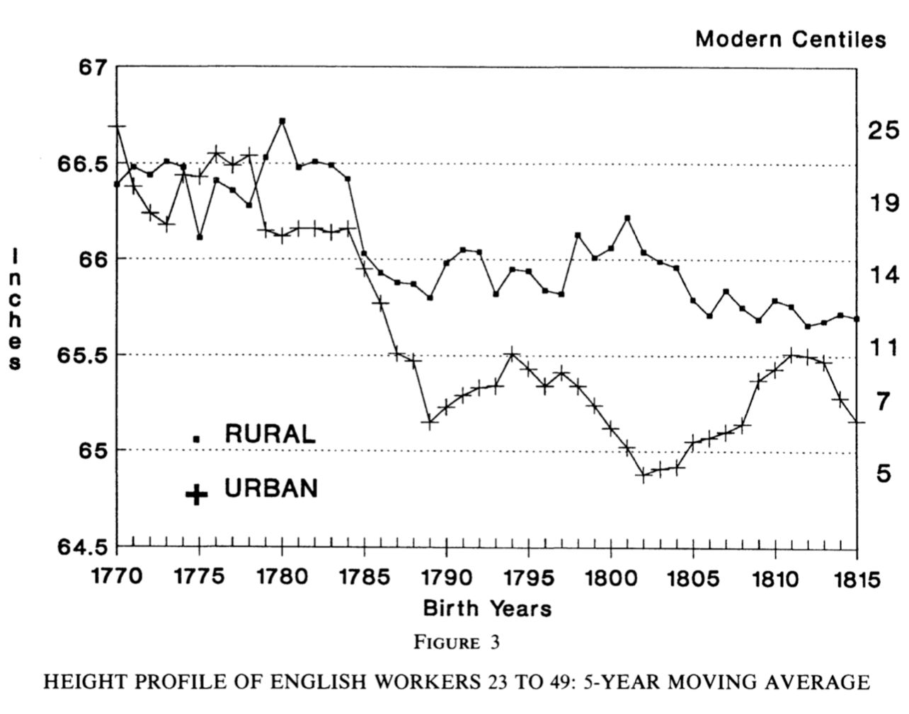
*Sources*: Komlos, "Secular Trend" & Nicholas & Steckel, "English Workers"
]

.pull-left30[
> "In some regards the common men and women of the early industrial age were not as well off as their parents. **There was some divergence between their living standard, as conventionally conceived, and their biological well-being**." <br> -Komlos, "Physical Stature"  
]

---

.pull-left40[
## Anthropometrics: a critical regard


+ Why do people join the military?
+ Why does crime rise and fall?

]

.pull-right60[
> "Sample-selection bias is a potential problem for every source that was not produced or collected for the entire population, or for which only non-random sub-samples survive. **Selection bias also affects textual and other non-quantitative sources.**"<br> —Bodenhorn, Guinnane & Mroz, p. 1157

<br>

> "We do question whether parts of the literature add to our understanding of long-term changes in economic well-being because they rely on choice- based samples... Several militaries ... relied on volunteers rather than conscripts drawn randomly from their underlying populations. Selection occurs at every stage of the criminal justice system: prisons house only those alleged to have committed crimes, whom the police choose to catch, states’ attorneys choose to prosecute, and juries choose to convict." <br> —Bodenhorn, Guinnane & Mroz, p. 1155.

]

---

class: inverse, center, middle

# Part III

---

.pull-left[
# Child Labor


]

.pull-right[

+ Professor Jane Humphries<br>CBE, BA, MA, PhD, FBA
+ Draws on 600+ biographies of working men to study child labor
    + Qualitative and quantitative approach
]

---
.left-column[
## Distribution of work-starting ages by cohort

+ "...the sons of miners, factory workers, outworkers, casual workers, and soldiers all on average started work below the age of 10." <br> Humphries, p. 406.
]

.right-column.center[
]

---

.pull-left60[
## A simple model of child labor


]

.pull-right40[
+ Assume parents prefer their children at home
+ Assume all jobs *could* be done by adults or children
+ Assume a standard of living $s$ such that if household income falls below $s$ children are sent to work
    - Good equilibrium $E1$: 
        + Only parents work, low labor supply high wage
    - Bad equilibrium $E2$:
        + Children and parents working leads to high labor supply and low wage
    - Unstable equilibrium $E3:$
        + Labor supply curve is backward bending (if wages rise parents take children home)
]

---

## Children's labor undercuts adult labor: vicious cycle

> "When I was just over seven I went into the boot trade.There was no room for a child my age in the kind of work my father did... But about this time an entirely new method of making shoes came up. It was called riveting ..." <br> William Arnold cited in Humphries, p. 413

--

### A sentimental conclusion

> "These children bore many of the social and economic costs of the industrial revolution but they also contributed to its success and thereby through time to our own comfort and prosperity. Their part in this great historical divide merits remembrance." <br> -Humphries, p. 416

---

class: inverse, middle, center

## Questions

### How would *you* measure a population's "standard of living"?

<!--chapter:end:08_standard_of_living_debate.Rmd-->

---
title: "Week 9: 19th century globalization and trade: domestic politics" 
author: | 
    | Dr. Gabriel Geisler Mesevage 
    | gabriel.mesevage@kcl.ac.uk
    | Office Hours: Wed. 10-11am & Thurs. 3-4pm
date: "25 November 2019"
output: 
  xaringan::moon_reader:
    nature:
      beforeInit: "macros.js"
    lib_dir: libs
    css: xaringan-themer.css
---

<style type="text/css">
.white { color: white; }
.large { font-size: 130% }
.small { font-size: 70% }
.pull-right40{ 
  float: right;
  width: 40%;}
.pull-left60{
  float: left;
  width: 60%;
}
.scale120{
  float: left;
  width: 120%;
}
.scale80{
  float: right;
  width: 80%
}
</style>

## Today's Plan

.pull-left[
.large[
1. Presentation
    * Presentation discussion
2. Lecture
3. Discussion
]
]

```{r setup, include=FALSE}
knitr::opts_chunk$set(echo = FALSE, message = FALSE, warning = FALSE)
```


```{r xaringan-themer, include = FALSE}
library(xaringanthemer)
solarized_light()
```

---

class: center, inverse, middle

## Presentation

---

class: center, inverse, middle

## Lecture

---

## What were the corn laws?

.pull-left[


### Tariffs on imported grain

1. **French Wars**: the price of grain is high
2. **1815**: wheat imports prohibited if price < 82s. 6d. per quarter
3. **1828**: sliding scale of duties, e.g. 
    + if price > 73, duty = 1 
    + if price = 60, duty = 27
4. **1842**: lower sliding scale
    + if price > 73, duty = 1 
    + if price = 60, duty = 14
5. **1846**: 'repeal', actual mostly flat duty
    + if price > 53, duty = 4 
    + duty + 1 as price falls up to a duty of 10
6. **1849**: duty is 1 shilling

]

.pull-right[

]

---

### The 'repeal' of the corn laws

.pull-left[

]

.pull-right[
+ A symbolic victory because of **who** voted for repeal.
+ Major re-allignment within conservative party
    - Peelites vs Non-Peelites
    - First of many internal party schisms on trade
        + 1903 Chamberlain Tariff debate, EU accession, Brexit
        
> "Britain’s bold move to free trade in 1846... violated the core protectionist ideology of the Conservative party while simultaneously undercutting the economic interests of the ruling landed aristocracy." <br> -Schonhardt-Bailey, p. 1
]

---

## Why?: Two broad categories of explanation

.pull-left[

#### Ideas

+ The benefits of free trade per the political economy of Smith, Ricardo, etc.

> "Writers upon political economy have already said, that the ultimate tendency of wages is to accomodate itself to the price of food. I must say that I do not believe it" <br> -Peel cited in Irwin, 1989, p. 55.

]

.pull-right[

#### Interests

> "Economists exert a minor and scarcely detectable influence on the societies in which they live... If Cobden had spoken only Yiddish, and with a stammer, and Peel had been a narrow, stupid man, England would have moved toward free trade in grain as its agricultural classes declined and its manufacturing and commercial classes grew" <br> -Stigler in Irwin, 1989, p. 41.

]

---

.pull-left[
## The political economy of repeal

|  | group | | |
|--|-------|-|--
|Outcome| Land. | Man. | Lab.| 
|No Tariff| - | **+** | **+**/- |
|Tariff| **+** | - | -/**+** |

<br>

+ Tariffs raise (**+**) the price of grain benefitting landowners
+ Tariffs reduce the purchasing power of labour (-) as food is more expensive
+ The high price of grain hurts manufacturers (-) by forcing them to pay higher wages

]
.pull-right[


> "The impact of repeal on worker... depends on the ability of manufacturing to absorb the rural emigrants... They will **gain** if food is a large component of the consumption basket, but they **could lose** otherwise." <br> -O'Rourke & Williamson, p. 80
]

---

### What explains repeal? Schonhardt-Bailey

> "The findings of this book tell a simple but compelling story: **economic interests accounted for the momentum behind repeal**, a momentum that overshadowed almost all else. ...these same interests, left unsatisfied, could have snowballed into revolution — as Peel and others feared... Interests account for most of the dynamics of repeal, **but they do not on their own explain why reform rather than revolution emerged**... To understand that last (quite important) fraction of the whole, we require an understanding of how **the engine of interests was shaped by the forces of ideas and institutions**."<br> -SB, p. 2


.pull-left[
### Schonhardt-Bailey's Argument

+ Anti-Corn Law League
+ Chartism
+ Weakening opposition (aristocratic portfolio diversification)
]

.pull-right[

> "Peel characterized repeal as a means to preserve the traditional institutions of the British government — and, in particular, the aristocracy."<br> -SB, p. 41
]

---

.pull-left60[
## The Anti-Corn Law League Campaign

+ First modern single-issue pressure group
+ Two-fold strategy:
    - Get electors struck-off
    - Get voters qualified

]

.pull-right40[


]

.center[

]

---

## Peel's appeal to a 'territorial democracy'

.pull-left[
+ Anti-Corn Law League threatened marginal MPs
+ Shift some Cons toward repeal
+ Peel offers argument in conservative terms: 

> "Peel characterized repeal as a means to **preserve the traditional institutions of the British government** — and, in particular, the aristocracy." (SB, 41)
]

.pull-right[

]
********

> ‘‘this [French Revolution of 1848] comes of trying to govern the country through a narrow representation in Parliament, without regarding the wishes of those outside. It is what this party behind me wanted me to do in the matter of the Corn Laws, and I would not do it’’ <br> -Peel in SB, p. 39.

---

### The effect of repeal

.pull-left[

#### If Britain is a 'small' economy

+ 'Small' here means the world price of manufactured goods **is not** set by Britain
    - If this is true, Ricardo's analysis holds:
    - A fall in the price of grain pushes labor out of agriculture
    - Lowers the effective cost of labor
    - Increases manufacturing employment and profits

]

.pull-right[

#### If Britain is a 'large' economy

+ 'Large' here means the world price of manufactured goods **is** set by Britain
    - If this is true, Torrens (1844) analysis holds:
    - Agricultural profits would decline
    - Real wages would rise
    - But manufacturing profits would **decline** as terms-of-trade deteriorate

]

********

> "The big difference between the "small" country and the "large" country view of Britain... is that in the former case, British capitalists paid most of the subsidy to British landlords under the Corn Laws, while in the latter case foreigners paid most of the subsidy." <br> -O'Rourke & Williamson, p. 86.

---

### The immediate effect on prices

> "the Laws appear to have made little difference to British grain prices; the ability of contemporaries to understand their own affairs is discredited, and the whole Corn Law controversy is made to seem pointless and 'much ado about nothing'"<br> -Fairly in O'Rourke and Williamson, p. 81.

+ But this does not interrogate the counter-factual
    - What would prices have been in the absence of repeal?
    - Crimean War, American Civil War
+ Williamson (1990) finds correlation of Prussian-GB grain prices
+ O'Rourke (1994) simulates counterfactual

.center[

]

---

## The Impact of Repeal

+ The big effects of repeal seem to emerge after the 1870s
+ Repeal appears to shift the composition of agricultural output
    - Farms move increasingly into non-tradables
    - 1870 grains = 25% of farm output
    - 1904 grains = 13% of farm output
+ More extreme shift in Ireland

> "The Emerald Isle was a lot greener in the second half of the nineteenth century" <br> OW, p. 89

<br> 

> "this event [repeal] alone was sufficient to give great impulse to the conversion of Irish arable land into pasture, to the concentration of farms, and to the eviction of small-scale cultivators... The Irishman, banished by the sheep and the ox, reappears on the other side of the ocean as a Fenian" <br> -Marx in OW, p. 90

---

class: inverse, center, middle

## Questions

> Explain why repealing the Corn Laws should in theory yield an increase in manufacturing output.

<br>
--

> Why does the effect of Corn Law repeal on labour depend on the share of food consumption in a laborer's consumption basket?

<br>
--

> Was Peel's fear of revolution credible?

<!--chapter:end:09_corn_laws.Rmd-->

---
title: "Week 9: The Poor Law and Social Assistance" 
author: | 
    | Dr. Gabriel Geisler Mesevage 
    | gabriel.mesevage@kcl.ac.uk
    | Office Hours: Tues. 9-10am & Thurs. 4-5pm
date: "Last update: `r format(Sys.time(), '%d %B, %Y')`"
output: 
  xaringan::moon_reader:
    nature:
      beforeInit: "helper_functions/macros.js"
      ratio: '16:9'
    lib_dir: libs
    css: ["xaringan-themer.css", "helper_functions/extra.css"]
---


## Lecture Outline

.pull-left[

### Part I: Background

+ The Old Poor Law
+ The New Poor Law

### Part II: Historiography

+ The traditional view of the economics of the Poor Law
+ The neo-traditional view
+ The revisionists
]

.pull-right[
### Part III: The economics of the poor law

+ Boyer's model
+ Solar's ruminations

]

```{r setup, include=FALSE}
knitr::opts_chunk$set(echo = FALSE, warning = FALSE,
                      message = FALSE, fig.align='center', fig.retina=3,
                      out.width="75%")

library(RefManageR)
BibOptions(check.entries = FALSE, 
           bib.style = "authoryear", 
           style = "markdown",
           dashed = TRUE, hyperlink = FALSE)
source("helper_functions/helper_print_bib.R")
bib <- ReadBib("pres.bib")
```

```{r xaringan-themer, include = FALSE}
library(xaringanthemer)
style_solarized_light()
source("helper_functions/theme_lecture.R")
xaringanExtra::use_webcam()
xaringanExtra::use_tile_view()
library(tidyverse)
```

---

class: inverse, center, middle

# Part I: Backgroound

---

### The 'Old Poor Law'

.pull-left[
#### A *relatively* generous system (a low bar!)

> "English poor relief was probably the most generous in Europe in the late eighteenth and the early nineteenth centuries, absorbing around 2 per cent of the national product" <br> —Kidd, p. 10

#### Speenhamland system
+ Outdoor relief (meaning outside of workhouses)
+ Supplements wages in kind — usually with wheat
  - Countercyclical wage subsidy
+ Geographically tethered — relief comes from locality
+ Predominant in wheat growing regions of the south
]

.pull-right[
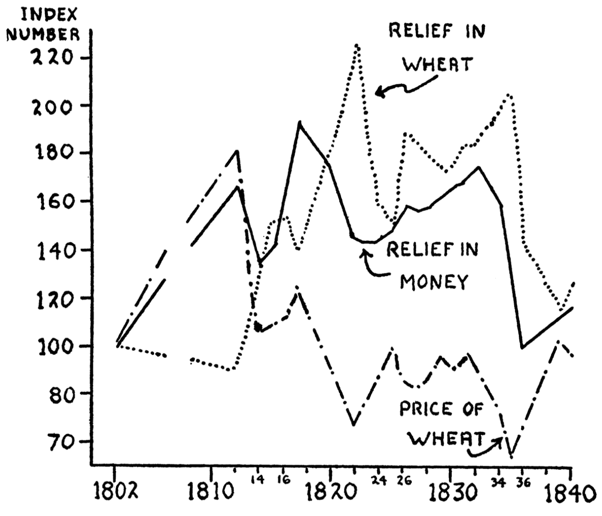
]

---

.left-column[
### The Critique of the 'Old Poor Law'

<br>
<br>
<br>
<br>
<br>
<br>


]
.right-column[

+ .Large[Malthus]

> "[The] first obvious tendence [of the Poor Laws] is to increase population without increasing the food or its support. A poor man may marry with little or no prospect of being able to support a family without parish assistance. **They may be said, therefore, to create the poor which they maintain.**" <br> —Malthus

+ .Large[But...]

> **To a generation drunk on Malthusian wine, the population argument seemed irrefutable. But nowadays we are inclined to treat this type of reasoning with more skepticism**, particularly if the subsidy is modest in amount, increases less than proportionately with each additional child, and is continuously scaled down year after year; ...all three things were true under the Old Poor Law." <br> —Blaug, p. 153

+ .Large[But but...] 
    - Boyer disagrees ("Malthus was right after all" *JPE*, 1989)
]


---

### The Critique of the 'Old Poor Law'

#### Poverty vs. Pauperism

+ **Poverty** a 'natural' state of those required to labor for subsistence
+ **Pauperism** the condition of those unable to labor (sick, crippled, elderly, etc.)

#### Burke's 'labourers' vs. the 'poor'

> "We have heard many plans for the relief of the 'labouring poor'. This puling jargon is not as innocent as it is foolish .... Hitherto the name of poor (in the sense in which it is used to excite compassion) has not been used for those who can, but for those who cannot labour — for the sick and infirm, for orphan infancy, for languishing and decrepit age; but **when we affect to pity, as poor, those who must labour or the world cannot exist, we are trifling with the condition of mankind.**"<br> —Burke, *Letters on a Regicide Peace*

---


.pull-left40[

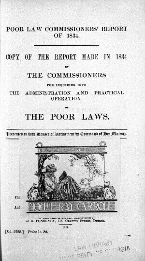]

.pull-right60[

#### Claims the Old Poor Law is...
> "a bounty on indolence and vice"

> "a universal system of pauperism"

+ Expresses view that Old Poor Law encourages able-bodied workers to depend on relief

.pull-left[]

.pull-right[]
]


---

### The New Poor Law

+ Passed in 1834
+ Based on *Royal Commission* of 1832-34
+ Written by Edwin Chadwick (Bentham's secretary) & Nassau Senior

.pull-left[
> "...a narrower and increasingly more punitive approach to adult applicants for relief." <br> —Kidd, p. 8
]

.pull-right[

> "The answer, Chadwick believed, was to deter pauperdom ...deprive the pauper of his liberty, split up his family and incarcerate them in a workhouse." —Porter, p. 116  

]

---

class: inverse
background-image: url(figures/workhouse_men_beds.jpg)
background-size: cover

## The Workhouse

---

## The workhouse

.pull-left[
+ Categorize individuals (age, gender, infirm)
+ Family separation
+ Daily 10 hour labor in summer, 9 hour labor in winter

> "Any pauper may quit the workhouse, upon giving the master three hours notice of his wish to do so." <br> -*First Annual Report of the Poor Law Commissioners*

+ Varied regional implementation
]

.pull-right[
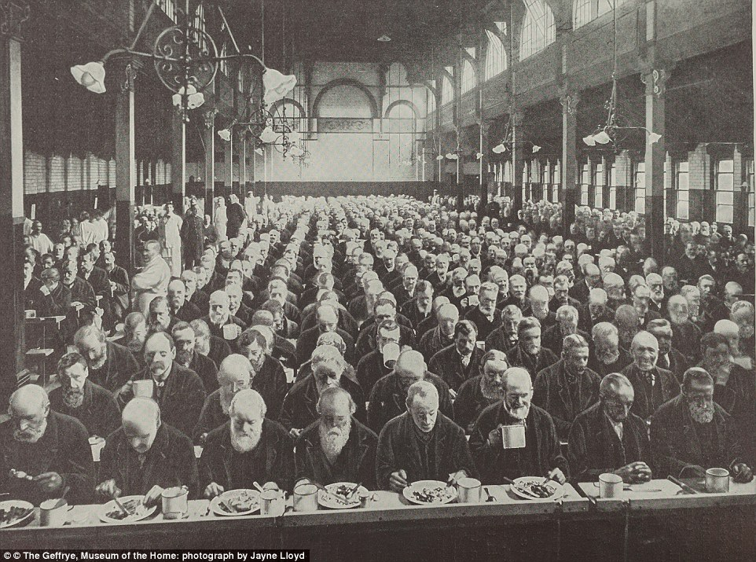
]
---

.left-column[

"Industrial development reduced the relative importance of agriculture in the economy, but **left the burden of poor rates primarily on landed income**. Is it surprising, then, that in the 1830s **a parliament dominated by landowners managed to impose restrictions on relief expenditure?**" <br> —Solar, p. 18.
]
.right-column[
```{r poor_law, fig.align='center', fig.retina=3, fig.width=7, fig.height=5, out.width="85%"}
library(readxl)
pl <- read_xlsx("data/boyer_pl.xlsx")

pl <- gather(pl, "series", "percent", -date)

pl %>% 
  mutate(series = if_else(series=="perc_pl_relief", 
                          "% of Pop. on PL Relief",
                          "PL Expenditure as % of GDP")) %>% 
  ggplot(aes(date, percent, color=series)) +
  geom_point() +
  geom_line() +
  facet_wrap(~series, nrow = 2, scales = "free_y") +
  theme_hc() + 
  scale_color_hc() +
  theme(panel.background = element_rect(fill = "#fdf6e3"),
        plot.background = element_rect(fill = "#fdf6e3")) +
  guides(color = F) +
  xlab("") + ylab("Percent") +
  ggtitle("Poor Law Recipients and Expenditures, 1812-1850", 
          subtitle = "Source: Boyer (2019)")

```
]

---

class: inverse, center, middle

# Part II: Historiography

---

## The economics of the Old Poor Law

.pull-left[

### Boyer's classification

1. The traditionalists
  + E.g. Malthus, authors of the Poor Law Report
2. The 'neo-traditionalists'
  + Accept the traditionalist economics
  + Differ in their politics, interests
  + E.g. the Hammonds, the Webbs, Polanyi
3. The revisionists
  + Blaug, also Baugh, Digby, McCloskey in part
]

.pull-right[
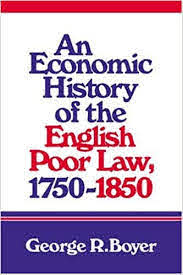]

---

.pull-left60[

> The Poor Law's "...obvious  tendency  is  to  **increase  population  without  increasing  the  food  for  its support**...  [A]s  the  provisions  of  the  country  must,  in  consequence  of  the increased  population,  be  distributed  to  every  man  in  smaller  proportions,  it  is evident that  the labour  of those who are not supported  by parish assistance, will purchase  a  smaller  quantity  of  provisions  than  before,  and  consequently,  more of them  must be driven  to ask  for  support. <br> —Malthus

<br>

>  The  elimination  of  outdoor  relief  would  not  only  eliminate  unemployment,  it  would  also  cause  laborers  to  become  "more  steady  and  diligent," thereby increasing productivity,  which would make "the return to the  farmers'  capital  larger,  and  the  consequent  increase  of  the  [wages] fund  for  the employment  of labour enables  and  induces the capitalist  togive  better  wages"  (1834:  329). <br> —Boyer, p. 64
]

.pull-right40[
## The traditionalists

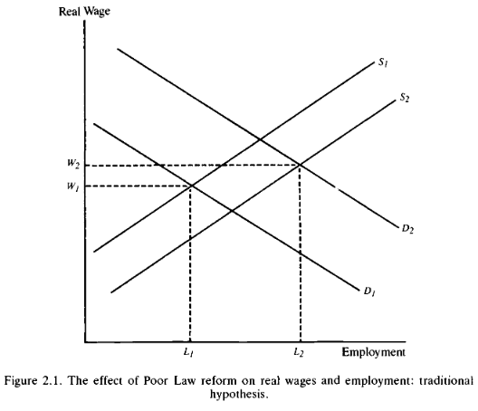
]
---

.pull-left70[

### The Fabian interpretation

+ Focused on the *origins* of outdoor relief

>  "the transformation of economic organisation brought about by the progress of the Industrial Revolution — coupled with the rapid enclosure of nearly all the remaining common fields and manorial wastes and the gradual diminution of the independent handicraftsmen" <br> —Webbs (1927: 420-1).


### Polanyi

+ Focused on the *support* for Speenhamland by large farmers
+ Hobsbawm and Rude follow his analysis

> They all "...considered Speenhamland an attempt by landlords and farmers to stop the development of a capitalist labor market" —Boyer, p. 75

]

.pull-right30[
## The Neo-traditionalists

+ Agree with the **diagnoses** of the 1834 report
  - Actually the Webbs provide critique
+ Disagree with the origins
]

---
.pull-left30[
## The Revisionists

+ Starts with Blaug 1963
+ Key points:
  1. Low wage rates are the cause of adoption, not an effect
  2. Increased labor productivity because of caloric deficits
  3. Scale too low to encourage idleness
  4. Allowances-in-aid-of-wages mostly gone by 1830s
  5. Seasonal unemployment explains a lot
  6. Chronic unemployment in the south
  7. Rise in relief expenditures was bad harvests
]

.pull-right70[

.center.Large[Critiquing the Poor Law Report]

>  The Poor Law Commissioners of 1834 ... **selected the facts so as to impeach the existing administration on predetermined lines**. ...what evidence they did present consisted of little more than picturesque anecdotes of maladministration. Even the elaborate questionnaire which they circulated among the parishes was never analyzed..."<br> —Blaug, pp. 177

<br>

> "...as evidence of a social malady [the report] has little value, particularly on the ultimate question of the corrupting influence of lavish relief: in what age would it not be possible to collect complaints from the upper classes about the laziness of workers?"<br> —Blaug, pp. 177

]

---

class: inverse, center, middle

# Part III

---


.pull-left[
## Why the Old Poor Law?

#### Boyer's model: Key features

1. Seasonality
2. The implicit subsidy to agricultural employers

#### The model

+ Farmers could cope with the seasonality problem in 4 ways
    1. Yearlong contract
    2. Really high wages when employed that last through year
    3. Some kind of unemployment insurance (Poor Law)
    4. Some allotment scheme giving land so laborers can grow extra food
+ **3 most efficient because of tax-subsidy!**

]

.pull-right[


<br>


]

---

## Solar's ruminations

> "...this article also speculates on the effects of relief on economic development. Some simple economic reasoning is used to draw out the implications of the essential features of the English system. One line of argument looks at poor relief as a system of insurance and focuses on the behaviour of beneficiaries. The other examines the way in which relief was financed and how this affected the behaviour of the property owners who paid for the system." —Solar, p. 3

.pull-left[
#### Poor Law different from continent in that

1. More uniform and comprehensive
2. Financed out of local property tax (less regressive)
3. Relatively generous

> "Poor relief, the quintessential function of local government in England, is ripe for inclusion in this new political economy of English development in the seventeenth and eighteenth centuries." —Solar, p. 1
]

.pull-right[
#### Effects

+ Larger than those who are recipients (insurance)
+ On recipients
  - Fertility decisions (+/-)
  - waged labor (promotes enclosure)
  - Possibly **boosted** labor mobility
+ On payers
  - subsidized labor demand
  - motivated landowners to limit local fertility
]

<!--chapter:end:09_poor_law.Rmd-->

---
title: "Week 10: 19th century globalization and trade" 
author: | 
    | Dr. Gabriel Geisler Mesevage 
    | gabriel.mesevage@kcl.ac.uk
    | Office Hours: Tues. 9-10am & Thurs. 4-5pm
date: "Last update: `r format(Sys.time(), '%d %B, %Y')`"
output: 
  xaringan::moon_reader:
    nature:
      beforeInit: "helper_functions/macros.js"
      ratio: '16:9'
    lib_dir: libs
    css: ["xaringan-themer.css", "helper_functions/extra.css"]
---

```{r setup, include=FALSE}
knitr::opts_chunk$set(echo = FALSE, warning = FALSE,
                      message = FALSE, fig.align='center', fig.retina=3,
                      out.width="75%")

library(RefManageR)
BibOptions(check.entries = FALSE, 
           bib.style = "authoryear", 
           style = "markdown",
           dashed = TRUE, hyperlink = FALSE)
source("helper_functions/helper_print_bib.R")
bib <- ReadBib("pres.bib")
```

```{r xaringan-themer, include = FALSE}
library(xaringanthemer)
style_solarized_light()
source("helper_functions/theme_lecture.R")
xaringanExtra::use_webcam()
xaringanExtra::use_tile_view()
```


## Today's Plan

.pull-left[
### Part I

+ Globalization and History

### Part II

+ The Corn Laws
+ Political Economy of Free Trade
]

.pull-right[
### Part III

+ Heckscher-Ohlin trade theory
+ factor prices
+ The European grain invasion

]
---
class: inverse, center, middle

# Part I: Globalization and history

---

## Globalization in History

.pull-left[
### When was globalization?

+ The 1500s vs the 1800's
]

.pull-right[
### What should we consider globalization?

+ The existence of trading links?
+ The size of trading links?
]

<br>

.center.Large[**Need to define the term globalization**]

---

.pull-left[
## Plausible globalizations

> "There have been few times in history when the world has been so closely interconnected — not only economically, but also in culture and tradition." <br> - Beatrice Manz cited in Cooper, *Colonialism in Question*, p. 100.

]

.pull-right[

]

### Proponents of earlier globalizations

+ Andre Gunder Frank (before 1500)
+ Janet Abu-Lughod (before 1350)
+ Frank and Gills: "the existence of the same world system in which we live stretches back at least 5,000 years"

.pull.center[**Clearly definitions matter!**]

---

## Plausible globalizations

#### Is connection enough?

> "The discovery of America, and that of a passage to the East Indies by the Cape of Good Hope, are the two greatest and most important events recorded in the history of mankind. ... By uniting, in some measure, the most distant parts of the world, by enabling them to relieve one another's wants, to increase one another's enjoyments, and to encourage one another's industry, their general tendency would seem to be beneficial." <br> 
-Adam Smith, *The Wealth of Nations*, Book 4, ch. 7, part 3.

--

#### Or does scale matter?

> "What remains ... in doubt is the contemporary impact or significance of these new configurations of long-distance trade ... it is far less clear what meaning the new connections had for those who lived in the sixteenth or even the seventeenth century" <br> 
-Tracy, *The Rise of Merchant Empires*, quoted in O'Rourke and Williamson, "When did globalization begin?"

---

## Economic Globalization as price convergence?

> "Thus, *the only irrefutable evidence that globalisation is taking place is a decline in the international dispersion of commodity prices or what might be called commodity price convergence* [Emphasis in original]." <br>
-O'Rourke and Williamson, "When did globalization begin?", p. 26.

--

### Why?

+ A measure of globalization that captures the domestic impact of global forces
+ Changes in trade volumes could just be shifts in supply or demand
+ When trade forces changes in domestic prices it can 'influence things that really matter' like income distribution, living standards, quality of life, etc.

---

## Economic globalization as price convergence?

> "We see no evidence documenting significant pre-nineteenth century global price convergence for the (competing) commodities that really mattered to the economic lives of the vast majority. Nor do we see any evidence of significant commodity price convergence even for those (non-competing) commodities that mattered little to the vast majority. The implications for world history are, we think, revisionist and profound."
<br>
-O'Rourke and Williamson, "When did globalization begin?", p. 28

#### Key questions

+ Why does this occur in 19th century?
+ What drives commodity market integration at scale?
+ What are the forces that produce commodity price convergence?
+ What are the consequences of this kind of globalization?

---

class: inverse, center, middle

# Part II: The Corn Laws and the Political Economy of Free Trade

---


.pull-left[
## What were the corn laws?

### Tariffs on imported grain

1. **French Wars**: the price of grain is high
2. **1815**: wheat imports prohibited if price < 82s. 6d. per quarter
3. **1828**: sliding scale of duties, e.g. 
    + if price > 73, duty = 1 
    + if price = 60, duty = 27
4. **1842**: lower sliding scale
    + if price > 73, duty = 1 
    + if price = 60, duty = 14
5. **1846**: 'repeal', actual mostly flat duty
    + if price > 53, duty = 4 
    + duty + 1 as price falls up to a duty of 10
6. **1849**: duty is 1 shilling

]

.pull-right[

]

---

### The 'repeal' of the corn laws

.pull-left[

]

.pull-right[
+ A symbolic victory because of **who** voted for repeal.
+ Major re-allignment within conservative party
    - Peelites vs Non-Peelites
    - First of many internal party schisms on trade
        + 1903 Chamberlain Tariff debate, EU accession, Brexit
        
> "Britain’s bold move to free trade in 1846... violated the core protectionist ideology of the Conservative party while simultaneously undercutting the economic interests of the ruling landed aristocracy." <br> -Schonhardt-Bailey, p. 1
]

---

## Why?: Two broad categories of explanation

.pull-left[

#### Ideas

+ The benefits of free trade per the political economy of Smith, Ricardo, etc.

> "Writers upon political economy have already said, that the ultimate tendency of wages is to accomodate itself to the price of food. I must say that I do not believe it" <br> -Peel cited in Irwin, 1989, p. 55.

]

.pull-right[

#### Interests

> "Economists exert a minor and scarcely detectable influence on the societies in which they live... If Cobden had spoken only Yiddish, and with a stammer, and Peel had been a narrow, stupid man, England would have moved toward free trade in grain as its agricultural classes declined and its manufacturing and commercial classes grew" <br> -Stigler in Irwin, 1989, p. 41.

]

---

.pull-left[
## The political economy of repeal

|  | group | | |
|--|-------|-|--
|Outcome| Land. | Man. | Lab.| 
|No Tariff| - | **+** | **+**/- |
|Tariff| **+** | - | -/**+** |

<br>

+ Tariffs raise (**+**) the price of grain benefitting landowners
+ Tariffs reduce the purchasing power of labour (-) as food is more expensive
+ The high price of grain hurts manufacturers (-) by forcing them to pay higher wages

]
.pull-right[


> "The impact of repeal on worker... depends on the ability of manufacturing to absorb the rural emigrants... They will **gain** if food is a large component of the consumption basket, but they **could lose** otherwise." <br> -O'Rourke & Williamson, p. 80
]

---

### What explains repeal? Schonhardt-Bailey

> "The findings of this book tell a simple but compelling story: **economic interests accounted for the momentum behind repeal**, a momentum that overshadowed almost all else. ...these same interests, left unsatisfied, could have snowballed into revolution — as Peel and others feared... Interests account for most of the dynamics of repeal, **but they do not on their own explain why reform rather than revolution emerged**... To understand that last (quite important) fraction of the whole, we require an understanding of how **the engine of interests was shaped by the forces of ideas and institutions**."<br> -SB, p. 2


.pull-left[
### Schonhardt-Bailey's Argument

+ Anti-Corn Law League
+ Chartism
+ Weakening opposition (aristocratic portfolio diversification)
]

.pull-right[

> "Peel characterized repeal as a means to preserve the traditional institutions of the British government — and, in particular, the aristocracy."<br> -SB, p. 41
]

---

.pull-left60[
## The Anti-Corn Law League Campaign

+ First modern single-issue pressure group
+ Two-fold strategy:
    - Get electors struck-off
    - Get voters qualified

]

.pull-right40[


]

.center[

]

---

## Peel's appeal to a 'territorial democracy'

.pull-left[
+ Anti-Corn Law League threatened marginal MPs
+ Shift some Cons toward repeal
+ Peel offers argument in conservative terms: 

> "Peel characterized repeal as a means to **preserve the traditional institutions of the British government** — and, in particular, the aristocracy." (SB, 41)
]

.pull-right[

]
********

> ‘‘this [French Revolution of 1848] comes of trying to govern the country through a narrow representation in Parliament, without regarding the wishes of those outside. It is what this party behind me wanted me to do in the matter of the Corn Laws, and I would not do it’’ <br> -Peel in SB, p. 39.

---

### The effect of repeal

.pull-left[

#### If Britain is a 'small' economy

+ 'Small' here means the world price of manufactured goods **is not** set by Britain
    - If this is true, Ricardo's analysis holds:
    - A fall in the price of grain pushes labor out of agriculture
    - Lowers the effective cost of labor
    - Increases manufacturing employment and profits

]

.pull-right[

#### If Britain is a 'large' economy

+ 'Large' here means the world price of manufactured goods **is** set by Britain
    - If this is true, Torrens (1844) analysis holds:
    - Agricultural profits would decline
    - Real wages would rise
    - But manufacturing profits would **decline** as terms-of-trade deteriorate

]

********

> "The big difference between the "small" country and the "large" country view of Britain... is that in the former case, British capitalists paid most of the subsidy to British landlords under the Corn Laws, while in the latter case foreigners paid most of the subsidy." <br> -O'Rourke & Williamson, p. 86.

---

### The immediate effect on prices

> "the Laws appear to have made little difference to British grain prices; the ability of contemporaries to understand their own affairs is discredited, and the whole Corn Law controversy is made to seem pointless and 'much ado about nothing'"<br> -Fairly in O'Rourke and Williamson, p. 81.

.pull-left[
+ But this does not interrogate the counter-factual
    - What would prices have been in the absence of repeal?
    - Crimean War, American Civil War
+ Williamson (1990) finds correlation of Prussian-GB grain prices
+ O'Rourke (1994) simulates counterfactual
]

.pull-right[

]

---

## The Impact of Repeal
.pull-left[
+ The big effects of repeal seem to emerge after the 1870s
+ Repeal appears to shift the composition of agricultural output
    - Farms move increasingly into non-tradables
    - 1870 grains = 25% of farm output
    - 1904 grains = 13% of farm output
+ More extreme shift in Ireland
]

.pull-right[
> "The Emerald Isle was a lot greener in the second half of the nineteenth century" <br> OW, p. 89
]

<br> 

> "this event [repeal] alone was sufficient to give great impulse to the conversion of Irish arable land into pasture, to the concentration of farms, and to the eviction of small-scale cultivators... The Irishman, banished by the sheep and the ox, reappears on the other side of the ocean as a Fenian" <br> -Marx in OW, p. 90

---

class: inverse, center, middle

# Part III: Heckscher-Ohlin and Factor Prices

---

## Heckscher-Ohlin

.pull-left[

+ Eli Heckscher
+ Bertil Ohlin
]

.pull-right[

]

---

## Heckscher-Ohlin: Determinants of Trade

> "Australia has a small population and an abundant supply of land, much of it not very fertile. Land is consequently cheap and wages high, in relation to most other countries. It would therefore seem profitable to produce goods requiring large areas of less fertile land but relatively little labour. Such is the case, for example, in wool production. . . . Similarly, regions well endowed with technically trained labor and capital will specialize in industrial production. . . . Exports from one region to the other will on the whole consist of goods that are intensive in those factors with which this region is abundantly endowed and the prices of which are therefore low. . . . In short, commodities that embody large quantities of particularly scarce factors are imported, and commodities intensive in relatively abundant factors are exported. . . . **Australia exchanges wool and wheat for industrial products since the former embody much land and little labour while the opposite is true of industrial products. Australian land is thus exchanged for European labor.**"<br> -Ohlin, 1924 

---

## Heckscher-Ohlin: Determinants of Factor Prices

> "If, for example, Australia produced its own industrial products rather than importing them from Europe and America in exchange for agricultural products, then, on the one hand, the demand for labor would be greater and wages consequently higher, and on the other the demand for land, and therefore rent, lower than at present. At the same time, in Europe the scarcity of land would be greater and that of labor less than at present if the countries of Europe were constrained to produce for themselves all their agricultural products instead of importing some of them from abroad. **Thus trade increases the price of land in Australia and lowers it in Europe, while tending to keep wages down in Australia and up in Europe. The tendency, in other words, is to approach an equalization of the prices of productive factors**."<br> -Ohlin, 1924

---

.pull-left[
### Land Abundant Exporters

Factors   |  Technology  |  Exports
```{r ho_mermaid}
library(DiagrammeR)

mermaid("
graph LR
A((Abundant Land)) --> D[Production<br>Process]
B((Labor)) --> D
C((Capital)) --> D
D --> E((Food))")

```
]

.pull-right[
### Labor Abundant Exporters
Factors   |  Technology  |  Exports
```{r ho_mermaid_2}
library(DiagrammeR)

mermaid("
graph LR
A((Land)) --> D[Production<br>Process]
B((Abundant Labor)) --> D
C((Capital)) --> D
D --> E((Manuf.<br>goods))")

```
]
---

## Convergence in Factor Markets: The Evidence

.pull-left[
+ OW compute a measure of how 'spread out' the data is


+ Divergence in the early 19th c. as New World wages ran ahead

]

.pull-right[
\begin{equation}
C(N) = \frac{\sum_{i=1}^N(x_i - \bar{x})^2}{\bar{x}^2}, \ \bar{x} = \frac{\sum_{i=1}^N x_i}{N}
\end{equation}

+ The late 19th c. saw pronounced convergence.
+ Even more so if you trim outliers


]

---

```{r uk_factors, fig.align='center', fig.retina=3, out.width="90%", fig.height=4, fig.width=6}
library(tidyverse)
library(ggthemes)

fp <- data.frame(date = seq(1877, 1912, 5),
                 real_wage = c(100, 104,
                               113.9, 118.8,
                               127.6, 121.6,
                               128.8, 125.9),
                 real_land = c(100, 77.3, 76.1, 
                               76.7, 82.2, 69.8,
                               68.3, 58.2))

fp <- fp %>%
  gather("factor", "index", -date) 

fp %>% 
  ggplot(aes(date, index, color=factor)) +
  geom_line() + 
  geom_point()+
  theme_hc() +
  scale_color_hc() +
  guides(color = FALSE) +
  geom_label(data = fp %>% filter(date==1912),
             aes(date, index, color=factor, 
                 label = c("Real Wage", "Real Land Prices"))) +
  xlim(c(1875, 1915)) +
  theme_lecture  +
  ggtitle("Hekscher-Ohlin at Work?", 
          subtitle = "Index of British Land and Labor Prices")

```

---

```{r wage_rent_ratios, fig.align='center',fig.retina=3, out.width="100%", fig.width=6, fig.height=4}
library(readxl)
library(ggrepel)

wr <- read_xlsx("data/wage_rent_ratios.xlsx")

wr <- wr %>% gather("Country", "Index", - Year) %>% 
  mutate(Continent = ifelse(Country %in% c("Australia", "US"), 
                            "New World", "Old World"),
         Policy = ifelse(Country %in% c("France", "Germany"),
                                 "Protectionist", "Open"))

wr %>% 
  ggplot(aes(Year, Index, 
             group = Country, 
             color = Continent, linetype = Policy)) +
  geom_line() + 
  geom_point()+
  theme_hc() +
  scale_color_hc() +
  guides(color = FALSE) +
  geom_label_repel(data = wr %>% filter(Year==1912),
             aes(Year, Index, color=Continent, 
                 label = Country)) +
  xlim(c(1875, 1915)) +
  theme_lecture  +
  ggtitle("Evidence of Convergence in Wage-Rental Ratios?", 
          subtitle = "1877 to 1912")

```

---
.right-column[
]

.left-column[
### Price of Wheat Convergence
+ Factor price convergence implies commodity market integration
+ The **European Grain Invasion**
]

---

.right-column[

]

.left-column[
### What accounts for convergence?

+ Transport costs fall so quickly tariffs are almost insufficient!
]

---

## Transport Revolution

### Canals

+ Earliest major transport improvement, e.g. 1750-1820 in UK
    - In 1817 took 52 days to move freight from Cincinnati to NYC
    - in 1852 took 6 days

### Steamship

+ Series of improvements after 1860s make them more efficient
+ **Suez Canal** interacts with steam ships -- can refuel on trips east

### Railroads

+ Link internal markets, particularly in US
+ Critical for pioneering financial and managerial capitalism

---

### Consequences: The Age of Mass Migration

.pull-left[


]

.pull-right[

]

+ About 60 million Europeans emigrate between 1820 and 1920
+ Relatively higher wages in New World drove immigrants abroad
+ Also displacement from disappearing agricultural jobs

---

## Consequences: The Collapse of Agricultural Income

+ The discovery and colonization of the 'New World' raised the amount of land per European capita 6-fold!

> "Less frequently remarked upon, but equally obvious, are the long-run implications for European income distribution. Such an increase in land endowments would inevitably spell disaster for European landowners. Over-all living standards might increase, but in the long run European rents would decline, with European labor or capital benefitting." <br> -O'Rourke, "European Grain Invasion", p. 775


### Backlash to globalization

+ Several political consequences flow from 19th century globalization
    1. Tariffs on the continent (an 'Iron & Rye' alliance) 
    2. Free trade in Britain (a labor & capital alliance)
    3. Escalating immigration restriction in the New World
    4. New world tariffs to defend manufactures

---
## Key take-aways

### Heckscher-Ohlin

- What you trade is driven by factor ratios
- Trade drives factor price convergence

### Commodity prices converged over the 19th century

- especially in primary agricultural products


### Technology as a driving force for globalization

- This is in contrast to e.g. post-WWII where the creation of GATT/WTO is predominantly a political project.

---

background-image: url(figures/questions_large.png)
background-size: contain


<!--chapter:end:10_grain_invasion.Rmd-->

---
title: "Week 11: Banking, Money and Finance" 
author: | 
    | Dr. Gabriel Geisler Mesevage 
    | gabriel.mesevage@kcl.ac.uk
    | Office Hours: Tues. 9-10am & Thurs. 4-5pm
date: "Last update: `r format(Sys.time(), '%d %B, %Y')`"
output: 
  xaringan::moon_reader:
    nature:
      beforeInit: "helper_functions/macros.js"
      ratio: '16:9'
    lib_dir: libs
    css: ["xaringan-themer.css", "helper_functions/extra.css"]
---

```{r setup, include=FALSE}
knitr::opts_chunk$set(echo = FALSE, warning = FALSE,
                      message = FALSE, fig.align='center', fig.retina=3,
                      out.width="75%")

library(RefManageR)
BibOptions(check.entries = FALSE, 
           bib.style = "authoryear", 
           style = "markdown",
           dashed = TRUE, hyperlink = FALSE)
source("helper_functions/helper_print_bib.R")
bib <- ReadBib("pres.bib")
```

```{r xaringan-themer, include = FALSE}
library(xaringanthemer)
style_solarized_light()
source("helper_functions/theme_lecture.R")
xaringanExtra::use_webcam()
xaringanExtra::use_tile_view()
```


# Lecture Outline

### Part I

+ Some useful background
    - What is a bank?
    - Balance sheet and leverage
    - Leverage, risk and liability
    - Illiquidity vs insolvency?
    
### Part II

+ The Bank of England as a Monopoly Lender
+ The rise of joint-stock banks

### Part III

+ The emergence of central banking doctrine
    - Central banking and financial stability?

---

class: inverse, center, middle

# Part I

---

## Banking and financial crises in historical perspective

<br>

.middle[
>  **Warnings from history** <br> <br> 227.  The Commission recommends that an additional external member be appointed to the FPC, with particular responsibility for **taking a historical view of financial stability and systemic risk**, and drawing the attention of FPC colleagues, and the wider public through speeches and articles, to historical and international parallels to contemporary concerns. (Paragraph 1115) <br><br> -*Changing banking for good - Parliamentary Commission on Banking Standards*, Vol. 1, [https://publications.parliament.uk/pa/jt201314/jtselect/jtpcbs/27/2704.htm](https://publications.parliament.uk/pa/jt201314/jtselect/jtpcbs/27/2704.htm) 
]

---

# What is a Bank?

.center[

]

---

### Leverage: Barclay's Simplified Balance Sheet, 2006

.center[

]

+ Leverage ratio $= 996,787/ 27,390 = 36.4$

---

## Leverage, Risk and Liability: Why do banks fail?

.pull-left[
### Liability-side risks

.large[
+ Runs on deposits
    - Deposits can be withdrawn at will
    - First-come-first-served
+ Can spook creditors
+ Can spark fire-sales
    - Asset-side deterioration
]
]

.pull-right[
.large[
### Asset-side risks

+ Investments also go down!
    - Economy-wide shocks (e.g. US Civil War and 'cotton famine')
    - If Barclay's assets (in 2006) declined by > 2.7% the bank is technically insolvant (net worth is negative)!


]]

---

## Leverage, Risk and Liability: Why do banks fail?

.pull-left[
### Why take on so much risk?

.large[
+ Why take on so much leverage?
    - Why do companies get bigger?
+ What happens in the case of failure?
    - Limited liability, double liability, unlimited liability
+ Seperation of ownership and control (agency problems)
]
]

.pull-right[
### Why do depositors allow it?

.large[
+ Very hard to monitor
    - I give you a list of 100s of investments (bonds, stocks, land, water, gold, wine, art, etc.) and ask how much its worth. How accurate can you be?
    - Exact asset positions not public
]
]

<br>

.Large[**Why not have banks hold 100% deposits in reserves?**]

---

## Leverage, Risk and Liability: solutions?

.pull-left[

]

.pull-right[
.large[

### Turner Suggests 2:

1. Extended liability
    - Unlikely to 'risk shift' if entire net-worth on the line

2. Regulation/Government Supervision
]]

---

## Illiquidity vs Insolvency

.large[
### Insolvency

+ Liabilities exceed assets

### Illiquidity

+ Short-run demand for cash exceeds supply
+ Assets exceed liabilities but not all held as cash

### Illiquidity $\rightarrow$ Insolvency?

+ If you need to sell in a hurry the value of your assets can decline
    - Often what begins as a 'liquidity' crisis can come to look like 'insolvency'
]

---

class: inverse, center, middle

# Part II

---

background-image: url("figures/bank_of_england.jpg")
background-size: cover

## The Bank of England

+ Established 1694
+ A deal between government and the Bank
    - Gov't gets loan, bank gets special privileges
        + Joint-stock, limited liability
        + Monopoly as chartered bank
        + Issued banknotes

---

## The impact of the BoE?

> "Its [the BoE's] creation resulted from the coupling of the government's urgent need for money with the bank promoters' desire for the profits of both speculation and monopoly. In this it set a pattern for the formation of national banks (later called central banks) in other countries, but **its own contributions to industrial finance were negligible, if not negative.**"
<br> - Rondo Cameron, 1967

+ Monopoly deal
    - Up until 1825 other banks limited to 6 partners
    - No small denomination notes
    - Tax on notes
    
> "However useful finance is to growth in other contexts, our study reveals that England's Financial Revolution in public borrowing enabled concurrent government activities to retard economic growth during the Industrial Revolution." 
<br> - Temin and Voth, 2013.

---

## The path to central banking: ending commercial monopoly

### The Banking System in 1815

+ Bank of England (London only)
+ Goldsmith bankers (London only, 6 partners max)
+ Small country banks (also 6 partners)
    - Massive growth in number
        + 1780: ~100
        + 1810: ~600

### Sources of reform

1. End of Napoleonic Wars
2. Merchant pressure

---

### The path to central banking: ending commercial monopoly

```{r mmd, out.width='100%'}
library(timevis)

data <- data.frame(
  id      = 1:6,
  content = c("Allow General<br>Joint-Stock Banking.<br>No regulation<br>No limited liability", 
              "Clarify act of 1825<br>and rights.<br>Sharp growth.",
              "Bank Charter Act (1844)<br>banks may not<br> issue notes", 
              "Joint Stock<br>Banking Act (1844)<br>banks need charter<br>extensive regultion",
              "Joint Stock<br> Companies Act (1856)<br> Limited Liablity, <br> extended to banks <br> by 1860",
              "Companies Act (1879)<br>helps Unlimited<br>Liability Banks<br>Convert to<br>Limited Liability"),
  start   = c("1825", "1833", "1844", "1844", "1856", "1879"),
  end     = c(NA, NA, NA, NA, NA, NA)
)

timevis(data, showZoom = F, fit = T, height = 600)
```

---

```{r bankgraph, out.width='80%', fig.height=4.5, fig.width=6, fig.retina=4}
library(ggrepel)

bdata <- data.frame(type = rep(c("State-chartered bank", 
                                 "Unlimited-liability JS",
                             "Limited-liability JS"), each = 7),
                    date = rep(c(1826, 1830, 1839, 1849, 1869, 1889, 1899),
                               3),
                    number = c(rep(1, 7), 3, 14, 117, 113, 73, 2, 0,
                               0,0,0,0,41,102,81))

bdata %>% filter(type != "State-chartered bank") %>% 
  ggplot(aes(date, number, 
             color = type,
             label = number)) + 
  geom_point(size=3) + 
  geom_label_repel() +
  geom_line() +
  theme_hc() +
  scale_color_hc() +
  theme_lecture +
  xlab("") +
  ylab("Number of Banks") +
  ggtitle("The Growth of Unlimited- and Limited-Liability Banking")
```

---

## Network Growth and Consolidation


#### source: Grossman, *Unsettled Account*, p. 184

---

## Network Growth and Consolidation: a cartel?


---

class: inverse, center, middle

# Part III

---

## The Path to Central Banking: Crisis Intervention

.pull-left[

### Crises

+ 1825: foreign loans
+ 1836: railways
+ 1847: railways
+ 1857: Exposure to US corps/banks
+ 1866: Money-market intermediaries

<br> 

+ Gradual development of Bagehot's rule?

### Bagehot's Rule

1. Lend freely
2. On good collateral
3. At a penalty rate

+ These rules are never exactly explicitly given
]

.pull-right[


.center[

]]

---

## Bagehot's Rule

### 1. Lend Freely

> "In opposition to what might be at first sight supposed, **the best way for the bank or banks who have the custody of the bank reserve to deal with a drain arising from internal discredit, is to lend freely.** The first instinct of everyone is the contrary. There being a large demand on a fund which you want to preserve, the most obvious way to preserve it is to hoard it — to get in as much as you can, and to let nothing go out which you can help. But every banker knows that this is not the way to diminish discredit." (23)

### 2. On good collatoral

+ Require the borrowers to put up collateral of high quality for the loans

### 3. At a penalty rate

+ *Not* as reflected in modern doctrine
+ Two reasons:
  1. Punish borrowers for getting into trouble
  2. Incentivize the private sector to lend

---

## Development of Lender of Last Resort

.pull-left[
### 1825

+ BoE refuses liquidity provision initially


]

.pull-right[
### 1866

+ lends extensively on collateral (discounts)


]

---

## Bagehot's Rule Developing

### Why do we see this pattern?


---

class: inverse, center, middle

# Discussion

> What accounts for the growth in banking stability in the latter half of the 19th century up until the latter half of the 20th century?

--

<br>
> What is a 'lender of last resort' (LOLR)? Why might a LOLR be necessary?

--

<br>

> Do bank failures matter? Do market stock-market crashes matter?

--

<br>

> What accounts (in your view) for the decline of unlimited liability in Britain? 

<!--chapter:end:11_boe_money_finance.Rmd-->

---
title: "Week 12: Export of capital from Britain" 
author: | 
    | Dr. Gabriel Geisler Mesevage 
    | gabriel.mesevage@kcl.ac.uk
    | Office Hours: Mon 10:30-11:30 & Friday 2-3pm
date: "Last update: `r format(Sys.time(), '%d %B, %Y')`"
output: 
  xaringan::moon_reader:
    nature:
      beforeInit: "helper_functions/macros.js"
      ratio: '16:9'
    lib_dir: libs
    css: ["xaringan-themer.css", "helper_functions/extra.css"]
---


```{r setup, include=FALSE}
knitr::opts_chunk$set(echo = FALSE, warning = FALSE,
                      message = FALSE, fig.align='center', fig.retina=3,
                      out.width="75%")

library(RefManageR)
BibOptions(check.entries = FALSE, 
           bib.style = "authoryear", 
           style = "markdown",
           dashed = TRUE, hyperlink = FALSE)
source("helper_functions/helper_print_bib.R")
bib <- ReadBib("pres.bib")
```

```{r xaringan-themer, include = FALSE}
library(xaringanthemer)
style_solarized_light()
source("helper_functions/theme_lecture.R")
xaringanExtra::use_webcam()
xaringanExtra::use_tile_view()
```


## Primary source exercise

### 2 'Teams'

  + You may each access copies of two share price lists (online)
      - They are **long** and **difficult** price lists from the *Investor's Monthly Manual* 

### Object

+ Describe the evolution of British lending in the period 1873-1898

### Sources

+ You may use the 2 documents provided
+ You may [access the same documents online](https://som.yale.edu/imm-issues)
+ You may draw on additional documents (online)
    - Plus the readings (obviously)
    
---

#### How to read a share price list


+ **Stock**, e.g. "Guatemala 6% Sterling": Guatemalan sovereign debt pays 6% interest in sterling on nominal value
+ **Issue price**: when they created the loan what it sold for
+ **Original issue**: nominal value of debt (what is owed)
+ **Sinking fund**: is there a special fund for repayment? 
+ **Amount of loan unredeemed**: if paid back gradually how much left?
+ **Par**: nominal value of stock i.e. how much will you get paid back per stock you own. 
+ **Prices of the month**: what has the stock been trading for? E.g. Guatemala is not being traded this month
+ **Last Business Done**: last trade price. Guatemala 6% at 42 -- very low!
+ **Dividends**: where and when you can collect the interest
+ How to compute bond yield: $dividend/price = (.06 \times 100)/42 = 6/42 = .143 = 14.3\%$

<!--chapter:end:12_export_capital.Rmd-->

---
title: "The Great Depression, 1873-96" 
author: | 
    | Dr. Gabriel Geisler Mesevage 
    | gabriel.mesevage@kcl.ac.uk
    | Office Hours: Wed. 10-11am & Thurs. 2-3pm
date: "`r format(Sys.time(), '%d %B, %Y')`"
output: 
  xaringan::moon_reader:
    nature:
      beforeInit: "macros.js"
    lib_dir: libs
    css: xaringan-themer.css
---

<style type="text/css">
.white { color: white; }
.large { font-size: 130% }
.small { font-size: 70% }
.pull-right40{ 
  float: right;
  width: 40%;}
.pull-left60{
  float: left;
  width: 60%;
}
.scale120{
  float: left;
  width: 120%;
}
.scale80{
  float: right;
  width: 80%
}
</style>

```{r setup, include=FALSE}
knitr::opts_chunk$set(echo = FALSE, message = FALSE, warning = FALSE)
```


```{r xaringan-themer, include = FALSE}
library(xaringanthemer)
solarized_light()
source("~/Dropbox/teaching/lecture_ggplot2_theme.R")
```

## The perception of decline


> "It must be clear to everyone that we are under the shadow of a business depression...", <br> -*Banker's Magazine*, October 1883

<br>

> "Since 1862 the tide of agricultural propsperity had ceased to flow; after 1874 it turned and rapidly ebbed" <br> -Lord Ernley, *English Farming Past and Present*, 1927

<br>

> "There was, in fact, a continuous output of discussions, speeches, books, reports, and pamphlets, which prove, at least, that people thought they were depressed ... 1873 to 1896 was a period when people said there was a great depression." <br> -Beales, "The Great Depression in Industry and Trade", 1934 

???

Might begin with the name: Great Depression

+ Now if you tell someone you spent the morning in a lecture on the Great Depression they will almost certainly think you are talking about the 1930s

widespred discussion of decline

+ 2 royal commission in 70s and 90s on agriculture
+ 2 on trade and industry
+ 1 on the monetary system
+ Widespread discussion in the Political Economy Club and House of Commons

---

## Giffen and the fall in prices

.pull-left[

]

.pull-right[


+ Robert Giffen, "The Fall of Prices and Commodities in Recent Years", *Journal of the Royal Statistical Society*, Vol. 42, 1879.
]

???

Giffen

+ Address given to the Royal Statistical Society in 1879
+ He is chief statistical department Board of Trade
+ Since 1873 **prices of goods declining**!

---

## The fall in British prices

```{r price_plot, fig.align='center', fig.retina=3, out.width="100%", fig.width=6, fig.height=4}

library(tidyverse)

df <- read_csv("uk_cpi_1850-1914.csv", skip = 1)

df %>% 
  ggplot(aes(Year, `Retail Price Index (2010 = 100)`)) +
  geom_point() + geom_line() +
  theme_lecture + 
  annotate('rect', xmin=1873, xmax = 1896, 
           ymin = min(df$`Retail Price Index (2010 = 100)`), 
           ymax = max(df$`Retail Price Index (2010 = 100)`),
           alpha = .3) + 
  annotate("text", x = 1902, y = 1.4, label = "The Great\nDepression,\n1873-1896")


```


???

The drop in prices

+ Greg Clark retail price index
+ Clearly confirms what contemporaries noted -- prolonged fall in prices in the period of the Great Depression
+ **Are price declines a depression**? 
    - Not necessarily! We call this *deflation*
        * Good for lenders bad for debtors
        * Depends **what** prices are falling

---

### What might explain the fall in prices?

> "There is an immense **diminution in the production of gold.**"<br> -Goschen, Manchester Chamber of Commerce, 1885

+ Less **supply** of gold $\rightarrow$ lower prices

<br>

???

Money is confusing

+ simplest way to think about the price level is as a ratio
    - What is the ratio of money to things?
    - How many things would people offer to obtain a pound?
    - How many pounds does it take to get a thing?

--

> "...the recent course of prices... is the result in part of the diminished production **and the increased extroardinary demands upon the supply of gold.**"<br> -Giffen, *Contemporary Review*, 1885.

+ Less **demand** for gold $\rightarrow$ lower prices

--

> "The prime cause affecting prices, it seems to us, is plain enough, namely, the **excessive production** in all things, the use of machinery, the fruitfullness of the earth, far outstripping the wants of man combined with his power to purchase..."<br> -*Banker's Magazine*, 1885.

+ Increased **productivity** $\rightarrow$ lower prices

---

### Why were prices falling? Supply and demand for money

.pull-left[

+ US: Crime of '73
+ **A global phenomenon**

> "There is a greater strain upon gold through the discarding of silver in very important countries..."<br> -Goschen, Manchester Chamber of Commerce, 1885

<br>


#### Source Flandreau et. al. 2008
]

.pull-right[

]

???

Crime of 73

+ US used to have a bimetallic standard
    - Dollars could be redeamed for silver **or gold**
    - Shift to gold only
+ Contraction in money supply
+ Growing demand for gold
+ This is not purely a British phenomenon!
    - The plot from Flandreau et al shows **global** prices falling

Transition

+ The background is one of monetary explanations for the fall in prices
+ But we need to consider productivity
    - Producing more with less can make goods cheaper
    - A paradigmatic case -- and one that was important to Britain, was transport


---

### Why were prices falling? Global grain market integration

.center[

]

+ Major productivity gains in **transportation**
+ Both shipping and significant railway building in the US

---

### Why were prices falling? Global grain market integration


???

This graphic merits close study because it tells an interesting story
about the fall in the price of Wheat -- a staple of the British diet.

+ Top line is British price - Chicago wheat price 
+ Bottom line is British price - NY price

---

### The Agricultural Great Depression?

> "...the existence of a great depression in agriculture was, and is, universally accepted, and farmers' sufferings have been wept over by generations of mourners."<br> -Fletcher, "The Great Depression of English Agriculture", p. 417

<br>

???

Fletcher made this point in the course of critiquing it

+ We will return to his caveats
+ But general pressure on wheat is real

--

### The Impact of Falling Agricultural Prices

> "Less frequently remarked upon, but equally obvious, are the long-run implications for European income distribution. Such an increase in land endowments would inevitably spell disaster for European landowners. Over-all living standards might increase, but in the long run European rents would decline, with European labor or capital benefitting." <br> -O'Rourke, "European Grain Invasion", p. 775

???

O'Rourke raises the broader question of structural transformation

+ This has echoes of contemporary debates about the winners and losers of globalization
+ The fall in agricultural prices **helped consumers**. It made their food cheaper and left them with more money leftover to spend.
+ But it hurt farmers, and generated agricultural employment.
    - It also hurt landowners and pushed down the rate of return to land

---

```{r uk_factors, fig.align='center', fig.retina=3, out.width="100%", fig.width=6, fig.height=4.5}
library(tidyverse)
library(ggthemes)

fp <- data.frame(date = seq(1877, 1912, 5),
                 real_wage = c(100, 104,
                               113.9, 118.8,
                               127.6, 121.6,
                               128.8, 125.9),
                 real_land = c(100, 77.3, 76.1, 
                               76.7, 82.2, 69.8,
                               68.3, 58.2))

fp <- fp %>%
  gather("factor", "index", -date) 

fp %>% 
  ggplot(aes(date, index, color=factor)) +
  geom_line() + 
  geom_point()+
  theme_hc() +
  scale_color_hc() +
  guides(color = FALSE) +
  geom_label(data = fp %>% filter(date==1912),
             aes(date, index, color=factor, 
                 label = c("Real Wage", "Real Land Prices"))) +
  xlim(c(1875, 1916)) +
  theme(panel.background = element_rect(fill = "#fdf6e3"),
        plot.background = element_rect(fill = "#fdf6e3"))  +
  ggtitle("The Impact of Falling Agricultural Prices?", 
          subtitle = "Index of British Land and Labor Prices")

```
#### Source: O'Rourke & Williamson, *Globalization and History*

???

The money tenants pay to landlords we call rent

+ The effect of tying together Britain and the US was that the rent paid to landowners fell as the profitability of British land declined
+ Likewise, the **real wage**, the wage measured in terms of what it can buy, rose
+ This is a process of **convergence**: 
    - Britain had a large population working a relatively small amount of land
    - Compared to the US wages were low and rents were high. 
    - By trading with the Americas, British wages rose toward American wages, and British rents fell toward American rents
    - Conversely, American wages fell towards British wages, and American rents rose toward British rents
    - We call this **Factor Price Convergence**

---

```{r wage_rent_ratios, fig.align='center',fig.retina=3, out.width="100%", fig.width=6, fig.height=4.5}
library(readxl)
library(ggrepel)

wr <- read_xlsx("wage_rent_ratios.xlsx")

wr <- wr %>% gather("Country", "Index", - Year) %>% 
  mutate(Continent = ifelse(Country %in% c("Australia", "US"), 
                            "New World", "Old World"),
         Policy = ifelse(Country %in% c("France", "Germany"),
                                 "Protectionist", "Open"))

wr %>% 
  ggplot(aes(Year, Index, 
             group = Country, 
             color = Continent, linetype = Policy)) +
  geom_line() + 
  geom_point()+
  theme_hc() +
  scale_color_hc() +
  guides(color = FALSE) +
  geom_label_repel(data = wr %>% filter(Year==1912),
             aes(Year, Index, color=Continent, 
                 label = Country)) +
  xlim(c(1875, 1915)) +
  theme(panel.background = element_rect(fill = "#fdf6e3"),
        plot.background = element_rect(fill = "#fdf6e3"))  +
  ggtitle("Evidence of Convergence in Wage-Rental Ratios?", 
          subtitle = "1877 to 1912") +
  theme_lecture

```
#### Source: O'Rourke, "European Grain Invasion"

???

Not just a British story, a European story:

+ Globalized trade placed European agriculture in stiff competition
+ In general, European **real wages** rose from the falling food prices
+ And the rents paid to European landowners/farmers fell

---

## Not all farmers

```{r different indices, fig.align='center',fig.retina=3, out.width="100%", fig.width=6, fig.height=3.75}

fpi <- data.frame(Year = rep(seq(1870, 1900, by = 5), 3),
                  Product = rep(c("Wheat", "Sheep", "Milk"), each = 7),
                  Index = c(100,86.7,77.1,57.4,53.9,50.7,49.8,
                            100,109.5,108.5,92.3,91.8,89.4,92.1,
                            100,112.5,112.5,87.5,84.4,81.3,87.5))

fpi %>% 
  ggplot(aes(Year, Index, color = Product, group = Product)) + 
  geom_point(size = 3) +
  geom_line() +
  theme_lecture +
  scale_color_hc()+ 
  theme(legend.background = element_rect(fill="#fdf6e3"))

```
#### Source: Turner, "Agriculture, 1860-1914", pp. 141

???

Productivity gains in transport and american farming pushed down prices of **traded** goods

+ Things that were harder to trade were more protected, for instance fresh milk
+ In addition, the rise in **real wages** led to Britains buying more meat and drink
+ Plus, grains are an **input** into the cost of producing animals and animal products

> "...the sort of man who had bread and cheese for his dinner 40 years ago now demands a chop." Graham 1899

---

## Other sectors

.pull-left[

### Coal & Steel

+ Increased competition, e.g. Germany
+ Declining productivity

### Questions:

+ Was this inevitable catch-up?
+ Were there disadvantages to industrializing first?
]

.pull-right[

### Textiles/Manufactures for Export

+ Rising competition from late-Industrializers
+ Growth of '2nd Industrial Revolution'
    - Chemicals
    - Electrification
]

???

Agriculture was not the only affected industry

+ Jevons and the Coal Question
    - Hard to be as profitable as *new* coal seams
    - British manufactures faced competition from USA/Europe, esp Germany
+ Much handwringing & huge literature on 'decline'
    - Inevitable new industrializers grow quicker?
    - Inevitable that Britain could not maintain a quasi-monopoly on manufactures?
    
    
---

## New opportunities!

.pull-left60[
> "...the soapmakers, sorry for themselves though they often were, never really felt the pinch of the 'Great Depression'. Quite the contrary, in fact, for **the very influences which, by producing low wholesale prices, worked against the capital goods industries, worked in favour of consumer goods** by raising retail customers' purchasing power." <br> -Reader, "The United Kingdom Soapmakers' Association and the English Soap Trade, 1867-1896", pp. 83.

+ Low prices of food and wholesale products promps **growth in consumer goods**
]

.pull-right40[
.right[

]]

???

We already saw with pasture that the fall in prices could benefit some industries as well as consumers

+ more disposable income
+ the era of consumer goods brands: 
    - Hovis bread founded in 1886, 
    - Cadburys chocolate expands to larger factory production in this period
    - Rowntree confectionary moves to factory as sales quadruple in the 1890s
    - Rise of newspapers, both as entertainment **and** because of advertiser financing catering to reader consumption

---

### New opportunities!

.pull-left60[


.center[
]
]

.pull-right40[
.right[
]
]

???

This was a time for the expansion of major retail

+ Morrison the warehouse expert dies one of the wealthiest men in Britain as Rubinstein demonstrates
+ David Lewis develops succesful department stores selling mass-produced consumer goods that are **cheap**
+ In short, there is much that is succesful in **consumption**

---

## Was there a Great Depression?

.pull-left[
> "The 'Great Depression' years were in fact years not only of crisis but of new growth, sometimes actual, sometimes potential."<br> -Wilson, "Economy and Society in Late Victorian Britain", pp. 198.
]

.pull-right[

> "As regards the 'Great Depression' itself, surely the major outcome of modern research has been to destroy once and for all the idea of the existence of such a period in any unified sense." <br> -Saul, *The Myth of the Great Depression, 1873-1896*, pp. 54.
]

???

In a conventional sense of the word depression it is difficult to describe the Great Depression as such

+ A period of transformation in which the British economy was exposed to increased international competition
+ A period of social disruption, in particular for landowners
+ A period of rising prosperity and new consumer opportunities for wage-earners
+ The late-19th century British experience highlights the way global market integration generates winners and losers

<!--chapter:end:13_great_depression.Rmd-->

---
title: "Did Victorian Britain Fail?" 
author: | 
    | Dr. Gabriel Geisler Mesevage 
    | gabriel.mesevage@kcl.ac.uk
    | Office Hours: Mon. 10:30-11:30am & Fri. 2-3pm
date: "Last update: `r format(Sys.time(), '%d %B, %Y')`"
output: 
  xaringan::moon_reader:
    nature:
      beforeInit: "helper_functions/macros.js"
      ratio: '16:9'
    lib_dir: libs
    css: ["xaringan-themer.css", "helper_functions/extra.css"]
---

```{r setup, include=FALSE}
knitr::opts_chunk$set(echo = FALSE, warning = FALSE,
                      message = FALSE, fig.align='center', fig.retina=3,
                      out.width="75%")


```

```{r xaringan-themer, include = FALSE}
library(xaringanthemer)
style_solarized_light()
source("helper_functions/theme_lecture.R")
xaringanExtra::use_webcam()
xaringanExtra::use_tile_view()
```

background-image: url("figures/mccloskey_frontis.png")
background-size: contain

---

# 3 Arguments

.large[
1. "...output grew too slowly because of sluggish demand..."
2. "...too much was invested abroad because of imperfect capital markets..."
3. "...productivity stagnated because of inept entrepreneurship..."
]

---

# 3 Arguments

.large[
.red[
1. "...output grew too slowly because of sluggish demand..."
2. "...too much was invested abroad because of imperfect capital markets..."]
<ol start=3>
<li> "...productivity stagnated because of inept entrepreneurship..."
</ol>
]

.pull-left[
.large[
.red[
+ We will discuss this today
]
]
]

.pull-right[
.large[
+ This is for next week
]
]

---

### 1. "...output grew too slowly because of sluggish demand..."

```{r trade_growth, fig.retina=4, fig.height=4, fig.width=6}
library(tidyverse)
library(readxl)

trade <- read_excel("data/a-millennium-of-macroeconomic-data-for-the-uk.xlsx", sheet = "A35. Trade volumes and prices", 
                    range = "A556:G626", col_names = FALSE)


trade <- trade[,c(1,7)]
names(trade) <- c("Date", 
                  "Composite Export Index (2013 prices)")

trade <- trade %>%
  mutate(period = ifelse(Date > 1870, "post-1870", "pre-1870"),
         ln_index = log(`Composite Export Index (2013 prices)`))

reg_pre_1870 <- broom::tidy(lm(ln_index ~ Date, 
                               data = trade %>% 
                                 filter(period == "pre-1870")))

reg_post_1870 <- broom::tidy(lm(ln_index ~ Date, 
                               data = trade %>% 
                                 filter(period == "post-1870")))

trade %>% 
  ggplot(aes(Date, log(`Composite Export Index (2013 prices)`), 
             color = period)) +
  stat_smooth(method = "lm") +
  geom_point() + geom_line() +
  annotate("text", x = 1860, y = 8, 
           label = paste0("Average annual change of ", 
                          scales::percent(reg_pre_1870$estimate[2], 
                                          accuracy = .01)),
           color = "blue") +
  annotate("text", x = 1860, y = 10, 
           label = paste0("Average annual change of ", 
                          scales::percent(reg_post_1870$estimate[2], 
                                          accuracy = .01)),
           color = "red") +
  theme_lecture +
  ggtitle("Log composite export index with estimated growth rates",
          subtitle = "1830-1869 vs 1870-1900") +
  scale_color_manual(values = c("red", "blue"))
```

---

### Could things have been better?

#### Population growth

> "The argument that Britain's output grew more slowly because of slower growing exports, however, **assumes that aggregate demand alone determined output**, when **in fact there were constraints of supply**. Indeed, there is evidence that they were the only binding constraints. ...the labour force at the end of the period would have had to have been twice as large as the actual labour force and two-fifths larger than the entire population aged 15 and over." <br> -McCloskey, p. 448-449.

#### Savings rate

.pull-left[
+ Simple accounting exercise

$$
Q = s_K K + s_L L + T
$$
+ Total growth (Q) comes from labor growth (L) with proportion $s_L$ and capital growth (K) with proportion $s_K$ and getting better at doing things (T).
]

.pull-right[
+ Re-arranging

$$
K = \frac{1}{s_K} \Big(Q - s_LL - T \Big)
$$

+ plug in plausible values and growth in $K$ has to be huge implying extraordinary high savings rate.
]

---

### 2. "...too much was invested abroad because of imperfect capital markets..."

>  "By reallocating resources, of course, any one sector of the economy could have grown faster: industry could have grown at the expense of services and exports at the expense of production for home consumption had labour and capital been allocated differently. The most popular target for hypothetical reallocation has been Britain's enormous hold- ings of capital abroad in the late nineteenth century." <br> -McCloskey, p. 451.

---

### Where did LSE investors put their money?

```{r market_weights, fig.retina=4, fig.height=4, fig.width=6}
library(tidyverse)
weights <- read_csv("data/michie_lse_weights.csv")

weights <- weights %>% mutate(Market_Weight = as.numeric(Market_Weight))

weights %>% 
  ggplot(aes(Security, Market_Weight, fill = Security,
             label = Market_Weight)) +
  facet_wrap(~Year, nrow = 1) +
  geom_col(position = "dodge") +
  geom_text(nudge_y = .075) +
  theme_lecture +
  scale_fill_hc() +
  xlab("") +
  ylab("Market Weight") +
  guides(fill = FALSE) +
  coord_flip() +
  theme(axis.text.x=element_text(angle=45, hjust=1)) +
  labs(caption = "Source: Chabot & Kurz, Table 6") 
```

---

## The export of capital debate: a simple critique

### McCloskey

.pull-left40[
+ Overseas investment earns income
+ If you don't invest abroad need to do something else with the money
+ If you invest at home:
    - Maybe home investments yield lower returns (per Edelstein)
    - Anyway **additional** home investment should push the yield on domestic capital downward
+ Ergo investing more at home $\rightarrow$ fall in income
]

.pull-right60[
>"The most popular target for hypothetical reallocation has been Britain's enormous holdings of capital abroad... It is not clear, however, that exchanging domestic for foreign capital would have raised British national income. **The question is how bringing capital home could be expected to increase income and how large the increase would have been**."<br> -McCloskey 1970, p. 451
]
---

### Key assumptions of McCloskey

+ Investors *could* have invested at home or abroad
    - They *knew* about all the options
    - Equivalently, markets are integrated
+ Their decision to invest abroad tells us about relative foreign/domestic rates of return
    - This can be and has been empirically checked e.g. Edelstein, Chabot & Kurz, Goetzman & Ukov
    - "...in emphasizing the rationality of entrepreneurs denies the very notion of failure" (Kirby 1992)
+ Rates of return do not depend on investment decisions
    - Returns $\rightarrow$ investment **not** investment $\rightarrow$ returns

### Bottom line

+ This is an argument over a **counterfactual claim**: what would have happened in Britain if foreign investment had been diverted into domestic investment?
+ Counterfactual claims can only be answered with a **theory**!!

---

## Framing the debate

### Two broad questions

  1. Was it in the interests of investors to invest abroad?
  2. Was it in the "national interest" for investors to invest abroad?
      - The term "national interest" is poorly defined but usually taken here to mean grown in GDP/pc
      
---

### Was it rational for the British investor to invest so much abroad?

### Probably yes


> "When investors are given the opportunity to divide their money between home and foreign assets, the expected rate of return on domestic assets can exceed the expected rate of return on foreign assets and an unbiased, rational investor will still choose to invest a portion of her wealth overseas if the diversification benefits of foreign investment outweigh the loss of return." <br> -Chabot & Kurz, 2010

+ 518,224 individual stock or bond 28 day returns
+ The question is not whether investors should have picked foreign or investment, the question is the **optimal mix**
+ The authors compute returns by sector, test portfolios

> "The real benefit of international investing was the diversification benefit of holding foreign assets that had a low correlation with their domestic counterparts." <br> -Chabot & Kurz, 2010

---

```{r returns_variance, fig.align='center', fig.height=4, fig.width=6, fig.retina=4}
library(tidyverse)
library(ggrepel)

returns_df <- read_csv("data/portfolio_returns.csv")

returns_df %>% 
  ggplot(aes(`Std. Dev. (%)`, `28-Day Mean Return (%)`,
             label = Portfolio)) +
  geom_point(aes(color = Portfolio), size=3) +
  theme_lecture +
  geom_text_repel() +
  scale_color_hc() +
  theme(legend.position = "none") +
  ggtitle("Asset Portfolio Returns and Standard Deviations") +
  labs(caption = "Source: Chabot & Kurz 2010")

```

---

```{r returns_covariance, fig.align='center', fig.height=5, fig.width=6, fig.retina=4}

cor_mat <- read_csv("data/asset_correlation_matrix.csv")

cor_mat %>% gather("Asset2", "cor", -Asset) %>% 
  mutate(cor = as.numeric(cor)) %>% 
  ggplot(aes(Asset, Asset2, fill = cor, label = cor)) +
  geom_tile() +
  geom_text() +
  theme_lecture +
  scale_fill_viridis_c() +
  theme(axis.text.x = element_text(angle = 45, hjust = 1),
        legend.position = "right") +
  labs(fill="Correlation", caption = "Source: Chabot & Kurz 2010") +
  xlab("") + ylab("") +
  ggtitle("Correlation between asset classes")
```

---

## Was it *socially* optimal for so much investment to go abroad?

### Much harder question

1. Were there industries that *could* have raised long-run growth if pursued?
    - E.g. electrification and chemicals which become important in 20th century
    - Can investment raise productivity? Where does innovation come from?
2. Were there large social costs to foreign investments born by the public and not investors?
    - The costs of formal and informal empire in protecting the investments abroad
3. Is the market price the right metric? Maybe we should consider the amount *originally invested*?
    - Price of a security is what current holder can sell it for, **not** necessarily a reflection of the money the company got

---

## Were key domestic industries neglected?

>"Potentially successful frustrated borrowers leave no trace" <br> -Kindleberger, *Economic Growth in France and Britain*, p. 38

+ We can directly compare **observed** foreign and domestic investment
    - We cannot directly compare foreign investment and **hypothetical** domestic investment
    - Broader question of **sample selection bias**: we compare stock-exchange listed companies but this is not a random sample!
+ The case for more domestic investment:
    - Some key industries that appear important in hindsight are not extensively developed: e.g. motor industry, new techniques in steel, electricity
    - Assumption of diminishing marginal return to capital unproven: 
    
> "...in view of the fact that capital is the changing, the transforming, the dynamic element in the economy, and that it is neither homogeneous nor easily divisible, but usually lumpy and highly specific, it is by no means certain that adding to its quantity will necessarily lower its returns"<br> -Pollard, p. 502.

---

## Today's Plan: Debate!

.center[
]

---
.pull-left[

## Rules

+ 2 Teams
+ You have **15 minutes** to prepare
+ I will spend half of time helping each team

#### Presentations
+ each team gets a 5 minute chance to talk
+ each team gets a 2 minute rebuttal
+ The judge (in his wisdom) deliberates and declares a winner
]

.pull-right[
## Judging Criteria

### Making a coherent argument

- Assertions without evidence (-)
- Obvious strawmanning (-)

### Compelling presentation

+ Use of visuals (+)
+ Bonus points for humor (++)

### Evidence of Breadth

+ Full use of the team (+)

]

---

class: inverse, center, middle

# Debate Question:
# "Did Britain invest too much capital abroad?"

<!--chapter:end:14_failure.Rmd-->

---
title: "Entrepreneurial Failure" 
author: | 
    | Dr. Gabriel Geisler Mesevage 
    | gabriel.mesevage@kcl.ac.uk
    | Office Hours: Mon. 10:30-11:30am & Fri. 2-3pm
date: "Last update: `r format(Sys.time(), '%d %B, %Y')`"
output: 
  xaringan::moon_reader:
    nature:
      beforeInit: "helper_functions/macros.js"
      ratio: '16:9'
    lib_dir: libs
    css: ["xaringan-themer.css", "helper_functions/extra.css"]
---

```{r setup, include=FALSE}
knitr::opts_chunk$set(echo = FALSE, warning = FALSE,
                      message = FALSE, fig.align='center', fig.retina=3,
                      out.width="75%")


```

```{r xaringan-themer, include = FALSE}
library(xaringanthemer)
style_solarized_light()
source("helper_functions/theme_lecture.R")
xaringanExtra::use_webcam()
xaringanExtra::use_tile_view()
```

# Today's Plan

.pull-left[
### 1. Can entrepreneurs be irrational?

+ Some history of economic history
+ Framing the problem of relative decline
+ The cliometric critique
+ A new 'institutionalist' response
+ Critiquing the institutionalists
]

.pull-right[
### 2. A case study: the Lancashire cotton industry

+ Lancashire cotton as an ideal case
+ The measurement problem
+ Findings
+ Interpretation
]
---

class: inverse, center, middle

# Part I

---

## A potted history of economic history (especially in the United States)

.pull-left60[
+ People have been writing 'economic history' for a long-time
  - This is a story of disciplinary growth and identity
+ Economics had a strong historical component at beginning of 20th c.
  - E.g. Harvard awards first US chair in Economic History in 1892 to William Ashley
  - But growing tensions around theory vs history
+ Growing divide between historians vs economists with increased interest in quantification in 1930s
  - E.g. Elizabeth Gilboy who we saw earlier in the course
]

.pull-right40[
> The economist is likely to suggest topics and problems that strike the historian as anachronistic and ahistorical, since available evidence will not be able to support such an inquiry. On the other hand, the questions raised by the historian – representing an attempt at mediation between what one would like to know and what the sources disclose – may seem to the economist to be devoid of any economic significance. <br> Cipolla, *Between Two Cultures*, p. 16
]

---

.pull-left[
## Professionalization

+ Research is still very interdisciplinary
+ In 1940 group of economists & historians form Economic History Association (EHA)
+ Around same time create Research Center in Entrepreneurial History
  - Again, a mix of economists, historians and sociologists
]

.pull-right[
  > "The starting point for [RCEH's] thinking was Joseph Schumpeter’s concept of entrepreneurship as a creative act that in discontinuous fashion shifted outward the economy’s production possibility frontier (Schumpeter 1934). Entrepreneurship was important to study, they believed, because this kind of creativity was the key to greater economic well-being." <br> -Lamoreaux, "Beyond", p. 7
]
  
### The Cliometric Revolution

+ Mostly economists: Gerschenkron, Kuznets, Fogel, North
  - Use models, statistical testing, and computers to work with data to a greater extent
+ Critical of existing work

> “Even a cursory examination of accepted ‘truths’ of U.S. economic history suggests that many of them are inconsistent with elementary economic analysis and have never been subjected to — and would not survive — testing with statistical data” <br> —North

---

.pull-left[

> "The fuss about counterfactual history was itself, however, largely **a proxy war for a more fundamental disagreement about the importance of entrepreneurial innovation to economic growth.** Fogel promoted the neoclassical view that **technological change was induced by movements in relative prices** that signaled opportunities for profit. In the absence of the railroad, he argued, not only was it likely that the canal system would have expanded to meet the demand for low-cost transportation services in the U.S., but the automobile could well have been developed earlier: “The axiom of indispensability proceeds on the implicit and unverified assumption that the success of railroads did not choke off the search for other solutions to the problem of overland transportation” (Fogel 1964: 14-15)." <br> —Lamoreaux, "Beyond", p. 13.
]

.pull-right[
## Conflict


+ Railroads promote mass distribution, mass production, managerial hierarchy (Chandler 1977)
]

---

.left-column[
## Framing the problem

]

```{r, climacteric, fig.height=3.5, fig.width=6}
library(ggrepel)
library(tidyverse)
library(ggplot2)
library(readxl)

maddison <- read_xlsx(path = "data/mpd2018.xlsx", 
                      sheet = "Full data")

plotdf <- maddison %>% filter(year >= 1850, 
                    year <= 1920, 
                    countrycode %in% c("GBR",
                                       "DEU", "USA"),
                    !is.na(rgdpnapc)) %>% 
  group_by(countrycode) %>% 
  mutate(norm_gdp = rgdpnapc/rgdpnapc[1] * 100)

plotdf %>% 
  ggplot(aes(year, norm_gdp, 
             group = countrycode,
             color=countrycode)) +
  ggtitle("British GDP per capita in comparison, 1850-1920", 
          subtitle = "Source: Maddison project") +
  geom_line() +
  geom_point() +
  geom_label_repel(data = plotdf %>%
              group_by(countrycode) %>% 
              filter(year == last(year)) %>% 
              ungroup(), 
            aes(label = country, x = year, y=norm_gdp, color=countrycode)) +
  guides(color = FALSE) +
  scale_color_brewer(type = "qual", palette = 2) +
  ylab("Index of GDP per capita (1850 = 100)") +
  xlab("") +
  theme_lecture

```

> "Increasingly after the 1890’s in the editorial columns of trade journals and in the pages of government reports, for one industry after another, blame for the British lag behind Germany and America was put on British management." <br> —McCloskey & Sandberg

---

## The 'Entrepreneurial Failure' view

> "It was the heirs of Veblen and Schumpeter, ...who in the 1950’s carried on the development of the hypothesis of entrepreneurial failure. An important factor in this work was a group of economic historians ... who developed the argument in the late 1940’s and 1950’s that **the linchpin of economic history is the entrepreneur**. ...Building on [a] piece presented [at] ... the Harvard University Center in Entrepreneurial History ...Landes crystallized the long-standing argument that the contrast between German and American industrial triumphs and British defeats could best be explained by emphasis on “the importance of this human factor — the success of entrepreneurial and technological creativity on one side, the failure on the other.“" <br> —McCloskey & Sandberg, p. 92

#### Menu of indictments run:

1. Britain did not adopt best technologies
2. Britain underestimated imp. of science and industrial applied research
3. Britain over-invested in export staples like cotton/iron
4. Britain was bad at sales, especially abroad
5. Britain did not organize cartels effectively 

---

### McCloskey & Sandberg's Critique

.pull-left[

#### Core of critique:

> "...But in a competitive milieu, even a brief period of irrationality would be eroded by the expansion of better managed firms, and there is little doubt that the British economy was on the whole competitive." <br> —McCloskey & Sandberg p. 104

+ 'Irrational' behavior is assumed incompatible with market competition: no money on the table

> "...the orthodox neoclassical, or 'cliometric' approach, which in emphasizing the rationality of entrepreneurs denies the very notion of failure." <br> —Kirby, p. 637.
]

.pull-left[
#### Some general pertinent critiques

+ Argument by residual

> "Eliminate all other factors, and the one which remains must be the truth." <br> –Sherlock Holmes

<br>

> "Entrepreneurship has always been studied as a residual, because it is not a variable that can be measured directly." <br> —McCloskey & Sandberg, p. 107


]

---

## McCloskey & Sandberg Critique, cont'd

#### Critique measure of entrepreneurial failure

> "...an industry’s output or an industry’s speed in adopting allegedly critical innovations ... Neither of these measures is adequate ... the measures of output because they confound influences of demand with those of supply and the measures of indicative innovations because they neglect the variability in the advantage to be gained from different innovations in different countries."<br> —McCloskey & Sandberg, p. 100

#### Discuss a gamut of industry case studies

> "One swallow, then, does not make a summer, nor do scattered cases of entrepreneurial successor failure make or break the hypothesis of general entrepreneurial failure." <br> —McCloskey & Sandberg p. 99

+ But think on balance case studies rejecting claims of irrationality

---

## Elbaum & Lazonick Institutionalist Response

.center[

]

> "...the historical perspective presented below attributes the decline of the British economy to the rigid persistence of economic and social institutions from the nineteenth-century era of relatively atomistic competition. ...successful twentieth-century economic development has been based on mass production methods and corporate forms of managerial coordination. But in Britain adoption of these modern technological and organizational innovations was impeded by inherited socioeconomic constraints" <br> —Elbaum & Lazonick, p. 568

---

## Elbaum & Lazonick Institutionalist Response, Cont'd

.pull-left[
### Critique

> "...the issue of Britain's decline has largely been avoided by neoclassical economic historians who have been preoccupied with demonstrating that turn-of-the-century British managers "did the best they could" by optimizing subject to given constraints" (568)

+ Even if entrepreneurs were not irrational, this does not address the issue of decline!!
]

.pull-right[
### Argument

> "The managerial organization and technology employed by nineteenth- century British firms were comparatively simple. Characteristically, firms were run by owner-proprietors or close family associates." (569)

+ Argument is **Chandlerian**: need large-scale corporate structure

> "What British industry in general required was **the visible hand of coordinated control**, not the invisible hand of the self-regulating market."


]

---

.left-column[
## Elbaum & Lazonick's Claim

+ Is 20th century economic growth a story of states/firms subordinating markets?
]

.right-column.large[
> "There is considerable irony in the neoclassical focus on free market competition as the engine of economic dynamism. The focus derives from the fundamental assumption of neoclassical theory that firms are subordinate to markets. History suggests, however, that successful development in the twentieth century has been achieved by markets being made subordinate to firms. **The main thrust of the perspective presented here is that the British economy failed to make a successful transition to corporate capitalism in the twentieth century precisely because of the very highly developed market organization of the economy that had evolved when it was the first and foremost industrial nation.**" (582)]

---

## Elbaum & Lazonick: Critical Appraisal

#### Endorsed by Kirby as a productive agenda

> "The institutional focus, moreover, is entirely credible in the light of the intellectual stalemate which has developed in British economic history between the upholders of entrepreneurial failure and neoclassical rationality. Elbaum and Lazonick may be **accused of naivete in their assumption of the universal validity of corporate capitalism as the route to successful economic growth** in the twentieth century, but much of value remains in their analysis. There can be little doubt that in the British context the state has had a legitimate role to play in securing institutional reforms beneficial to economic progress. Only the most extreme proponent of the free market could contend, for example, that the complex structural problems of the late nineteenth-century British economy, the starting point for Elbaum and Lazonick's analysis, could have been resolved by market forces unaided" (654)

#### Some critique

+ Scholars such as Leslie Hannah suggest idea that 'small family firms' were characteristic of Europe is generally untrue
  - London and Paris stock exchanges larger and more important than New York
  - Bigger hubs for the separation of ownership and control
  
---

class: inverse, center, middle

# Part II
---

### Case: The Lancashire Cotton Industry vs the New England Cotton Industry (Leunig 2003)

#### Why Lancashire?

+ Use the older technology (mule for spinning and power loom) 
  - Could be 'entrepreneurial failure' to adopt best tech?
+ Very small businesses with almost no vertical integration
  - Could be failure to adopt modern management and scale economies

> "It was the industry that grew by adding more and more firms, with little or no growth in firm size." (90)

#### Why might US be more productive?

+ Rothbarth-Habakkuk thesis

> "At its simplest, this states that in land-rich America, labour was drawn to agriculture, so that industry became characterized by high capital intensity and by correspondingly high labour productivity. In contrast, land-poor Britain had abundant industrial labour, so industry was characterized by low capital intensity and low labour productivity." (92)

---

## Not so simple to compare

> "In theory, labour productivity is easy to calculate: total output is simply divided by total employment. In reality, the process is not as straightforward because countries often produce different products, with different labour and capital requirements." (97)

+ Cotton output often measured by **weight**
  - This is bad because finer thread means more length per unit weight
+ Course thread vs fine thread are basically different products
  - E.g. used for bags vs clothes
+ Different technologies (mule vs ring) can take different quality inputs
  - Rings need higher quality (more expensive) input or fibers break
  - Mules possibly more labor but cheaper input

.pull-left[
### Leunig's approach

+ $2 \times 2 \times product$ design
+ For each thread count
]

.pull-right[

+ Compare NE to Lanc
  - For rings
  - For mules
]

---

## Results: labor productivity by technology and location

.pull-left40[
+ Lanc. spinners on mules best
+ NE on rings close for low thread count

<br>

.Large.center[**Seems pretty rational for Lancashire to use the mule!**]
]
.pull-right60.center[
]

---

## Results: but which location was more productive?

.pull-left40[
+ The question is given the available machines and people, where should you send a job to produce 100 lbs of 40 thread count yarn

<br>

+ **Still mostly Lancashire**
+ NE is possibly better at very low thread count output
]
.pull-right60.center[
]

---

## Interpretation

> .Large["I argue ...the most plausible proximate cause of Lancashire's success was external economies of scale, and that this reflects a deeper underlying advantage: vigorous competition." (108)]

+ Some vindication for McCloskey & Sandberg!
+ External economies of scale:
  - Economies of scale that are not internal to the company (obvious definition)
  - E.g. having all the skilled weavers available in Lancashire
  - Learning right away about new techniques
+ Argues that Lancashire may have been "more Chandlerian"
  - Because focused on fewer products, firms had more spindles, produced longer runs
  - More like mass production
  - Half a loaf for Elbaum & Lazonick?

---

## Some provocative reflections from Leunig

> "The idea that competition increases the pressure to be efficient may help to explain why Britain was so much more succesful in the first industrial revolution than in the second. Both of Britain's early productivity successes — textiles and agriculture — were characterized by low minimum efficient scale and high levels of competitive pressure." (110)

+ Contrast that with quintessential second IR technology: the car
  - US is big and can support multiple car firms that compete *and* have massive scale
  
> "...the size of the British domestic market was too small for Britain to have a car firm that was simultaneously large enough to gain available economies of scale, and to face sustained competitive pressure from at least one other firm." (110)

+ Concludes that you need competitive pressure **and** a market big enough to support competition at efficient scale

<!--chapter:end:15_entrepreneurial.Rmd-->

---
title: "The Economics of Empire" 
author: | 
    | Dr. Gabriel Geisler Mesevage 
    | gabriel.mesevage@kcl.ac.uk
    | Office Hours: Mon. 10:30-11:30am & Fri. 2-3pm
date: "Last update: `r format(Sys.time(), '%d %B, %Y')`"
output: 
  xaringan::moon_reader:
    nature:
      beforeInit: "helper_functions/macros.js"
      ratio: '16:9'
    lib_dir: libs
    css: ["xaringan-themer.css", "helper_functions/extra.css"]
---

```{r setup, include=FALSE}
knitr::opts_chunk$set(echo = FALSE, warning = FALSE,
                      message = FALSE, fig.align='center', fig.retina=3,
                      out.width="75%")


```

```{r xaringan-themer, include = FALSE}
library(xaringanthemer)
style_solarized_light()
source("helper_functions/theme_lecture.R")
xaringanExtra::use_webcam()
xaringanExtra::use_tile_view()

library(tidyverse)
library(ggplot2)
```

## Today's Plan

### 1. Framing the debate

### 2. Offer's critiques

### 3. Cain and broader counter-factuals

---

# The question

.center.Large[
> "Whether this complex institutional edifice of supranational power ... brought tangible gains to anything like a majority of British people" <br> —O'Brien, p. 163.
]

### Caveats

+ *Not* a discussion of whether empire $\rightarrow$ industrialization
  - O'Brien doesn't think so but as we saw (e.g. Inikori, Findlay & O'Rourke) people disagree
+ The debate is about the 

> "material costs and benefits for British society as a whole, imputable to political decisions to retain and extend the empire from the onset of free trade through to the First World War, 1846 to 1914" <br> —O'Brien, p. 164.

---

# Some intellectual history

+ Tradition since Smith of arguing that Empire is burden on taxpayers and "increased threats of war and the probability of political corruption at home" (O'Brien, p. 164).

>  "We do not any longer ask - we certainly do not receive - from our colonies any commercial advantages which are not equally open to the whole world, which we should not equally command though the political connection were severed tomorrow" <br> —Cairncross, 1873

### Radical critique of empire

> "... if I invest either in the public funds or in some private industrial venture in a foreign country for the benefit of my private purse, getting specially favorable terms to cover risks arising from the political insecurity of the country or the deficiencies of its Government, I am entitled to call upon my Government to use its political and military force to secure those very risks which I have already discounted in the terms of my investment. Can anything be more palpably unfair?" <br> —Hobson, 1902, p. 358.

---

# The growth of 'Imperial accountancy'

> "Edward Gibbon Wakefield, Cobden, Marx, J. A. Hobson — every generation has had a shot at this question. In the last decade this debate has taken a new turn, which might be called 'imperial accountancy'." <br> —Offer, p. 215.

+ Referring in particular to the work by 
  * **Davis & Huttenback**  
  * **Edelstein**

---

### Davis and Huttenback, *Mammon and the Pursuit of Empire*

.pull-left40[

]

.pull-right60[
+ The strong case for the economic irrationality of empire
    - Compute costs and revenues
    - Revenues go to narrow elite
    - Costs fall on the public
        + costs of defence, administration, infrastructure, opportunity costs
    - 'Winners' are specific elites and settler colony emigres
    - 'Losers' are the British taxpayer and (obviously) the colonized
]

---

### Edelstein, *Overseas Investment in the Age of High Imperialism*

.pull-left40[

]

.pull-right60[
+ Moderately positive case for *economic benefits* of empire
    - takes a large sample of home and foreign investments
    - computes returns on 'home' vs. 'overseas' and finds positive returns abroad
    - This is familiar to us from export of capital week
    
]

---

# D&H vs. Edelstein: why do they differ?

+ D&H believe there is a 'market problem'
  - Financial markets bid assets values up and down
    + e.g. Gamestop mkt cap on 25/01 was 5b, on 27/01 it was 20b, on 04/02 it was 3.5b: total investment in Gamestop never changed! 
+ Want to compute returns on *initial investment*
  - This needs to be built with *accounting data*
  - Create a sample of 482 firms
+ D&H are using **different data** and a *different approach* to measuring rate of return

---

.pull-left[
## Offer's critique

### Critique along 2 dimensions

1. Data and measurement
  - Thinks 'market problem' is unreal
  - Thinks accounting data is poor
    
2. Costs of defence
  - Thinks costs of defence mismeasured
]

.pull-right[

> "But even if the accounting estimates of historical capital were sound, they do not necessarily form an appropriate basis for estimating economic performance. In economics, past investments are sunk costs, water under the bridge. The constant review of expectations and prospects is the essence of economic life. Investments are sold in financial markets precisely in order to facilitate this constant review, and to convert lumpy chunks of physical capital into tradeable financial assets. That is why marketable securities were issued in the first place, so it is wrong to value such enterprises by historical cost methods, even if they are updated mechanically. **The market is a more objective and public mechanism for updating values. The Edelstein methodology of relying on market valuations is thus theoretically superior.**" <br> —Offer, p. 219
]

---

## Offer on Data problems

1. Some problems of selection
  - Excludes government bonds
  - Choice of time-periods
2. Some problems of computation
  - Returns are *unweighted* meaning return to 100 mil. firm weighted the same as 1 mil. firm.
3. The market problem
  - Does not think it is real: market prices incorporate capital gains and losses

.pull-left60[
> "D. & H.'s rates of return consist of two elements: reported profits, and asset valuations. Both elements can be questioned." <br> —Offer, p. 218

+ Profits:
  - Easily manipulated 
+ Asset valuations:
  - Ad hoc adjustments for depreciation, inflation, goodwill
]
---

## Is defence like insurance? Offer's critique

+ Avner Offer offers several critiques:
    1. Defence costs per head are not sensible, consider as share of income
        + UK 2.95 % of GNP, Germany 2.86, France 4.52 (!)
    2. Defence costs in the absence of empire are not zero
        + What is the counterfactual? Argues the global trading system must be defended and benefits Britain
    3. Cannot directly compare defence costs as defence *requirements* are different
        + "If military expenditure is a form of insurance, then the higher the risk, the higher the premium required." -Offer, p. 226
    4. Should not understate how much Brits liked having the empire
        + Paid for it because they wanted it
    5. The empire was a strategic resource that paid-off in WWI
    
> "From the defence point of view, investment in empire looks very different if one stops in 1919 instead of 1912, as D. & H. chose to do."<br> -Offer, p. 235

---

```{r costs_of_defence, fig.align='center', fig.height=4, fig.width=6, out.width='90%', fig.retina=4}
def_costs <- tibble(Countries = c("UK", "Responsible\nGovernments", 
                                  "India", "Dependent\nGovernments",
                                  "France", "Germany"),
                    DH = c(1.14, .12, .1, .033, .62, .62),
                    Offer=c(1.07,.26, .07, .03, 1.05, .69))

def_costs %>% 
  gather("Author", "Pounds per capita", -Countries) %>% 
  ggplot(aes(Countries, `Pounds per capita`, fill = Author)) +
  geom_col(position = "dodge") +
  theme_lecture +
  xlab("") +
  scale_fill_hc() +
  theme(legend.position = "right") +
  labs(title = "Davis & Huttenback vs Offer", 
       subtitle = "The costs of defence",
       caption = "Source: Edelstein Table 8.5")

```

---

## Edelstein on how to measure the costs


.pull-right60[
> "If the state of political and economic relations between Britain and Germany (or France or the US) provides an example of ‘non-imperialist’ economic and political relations, then the gains to Britain from ruling India (for example) can be measured as the amount by which Britain benefited from its economic relationship with India minus the benefits Britain would have gained if Britain had not ruled India but merely traded with India as she did with Germany, France or the US." <br> —Edelstein, p. 211
]


### The "marginal non-imperialist standard"

- Economic development left unchanged but at point of measurement granted independence

### The "strong non-imperialist standard"

- Assumes that countries were never involved with Britain and this affects their involvement in world economy

---

## Edelstein's estimates


---

## Edelstein's estimates: does this make any sense?

+ Is it a meaningful counter-factual?
+ Social scientists often want to consider changes *ceteris paribus* ('all other things equal') — is this possible here?

### Where are the politics?

+ The geopolitics of balance of power?
+ The political economy of development?

> "...it remains difficult to envisage that the political circumstances — the non-existence of the raj — could be so drastically different without the economic circumstances — railways, ports, investments, commerce — being affected at all. ...There was little doubt that the cost of maintaining British army garrisons in India, Egypt and Natal was considerable; but were the imperialists completely wrong in arguing that, if those garrisons were withdrawn, there would be other costs to pay?"<br> —Paul Kennedy, p. 187.

+ Broader disconnect "between economic history literatures on 19th century globalization (who ignore geopolitics) and political science literatures on international relations (which ignore economics)" (Hauner et. al. 2017)?

---

## Imagining broader counterfactual histories: Cain

> "...a true perspective on its role can only be obtained by looking **beyond the confines of the cost-benefit analysis** usually adopted by economists and economic historians. Most of them recognise this to some extent." 

<br>

> "...rather than simply looking at the effects of possessing or relinquishing empire on the economic system per se, it would be more helpful to set up **a broader counterfactual enquiry**..."

<br>

> "...set it against some ***plausible* alternatives**, that is those which were actively canvassed in Britain at the time." <br> -Cain, p. 366

---

.pull-left[

### Cobden/Hobson Model

+ Possible shift in income distribution
+ More domestic investment
+ But still strong commitment to free-trade -- doubts they would have avoided imperial entanglement
    - Takes the example of Gladstone and Egypt
+ Various counterfactuals for early 20th century conflict
    - Britain less willing to shoulder defence costs, smaller anglosphere to draw on
    - War less likely?
]

.pull-right[

### "Constructive imperialism"

+ Tariff policy likely to support British infant industry/possibly cartels
+ Unlikely (per Cain) to boost growth
+ Likely to heighten conflict with Germany
+ Probably larger British military build-up, potentially WWI comes sooner (Germany claimed in 1909 that empire tariffs would be cause for war)
+ Would US support be forthcoming?

]

*****

> "Neither the radical nor the constructive imperialist alternatives would necessarily have produced a more vibrant economy, a more cohesive society or one more capable of defending itself against its enemies than the actual one presided over by gentlemanly capitalists before the 1950s."<br> -Cain, p. 372

---

class: middle, inverse, center

# Question

> Is it possible to reason meaningfully about an historical counterfactual as large as the absence of British Empire?


<!--chapter:end:16_imperialism.Rmd-->

---
title: "Unemployment Assistance and Poverty" 
author: | 
    | Dr. Gabriel Geisler Mesevage 
    | gabriel.mesevage@kcl.ac.uk
    | Office Hours: Mon. 10:30-11:30am & Fri. 2-3pm
date: "Last update: `r format(Sys.time(), '%d %B, %Y')`"
output: 
  xaringan::moon_reader:
    nature:
      beforeInit: "helper_functions/macros.js"
      ratio: '16:9'
    lib_dir: libs
    css: ["xaringan-themer.css", "helper_functions/extra.css"]
---

```{r setup, include=FALSE}
knitr::opts_chunk$set(echo = FALSE, warning = FALSE,
                      message = FALSE, fig.align='center', fig.retina=3,
                      out.width="75%")


```

```{r xaringan-themer, include = FALSE}
library(xaringanthemer)
style_solarized_light()
source("helper_functions/theme_lecture.R")
xaringanExtra::use_webcam()
xaringanExtra::use_tile_view()

library(tidyverse)
library(ggplot2)
```

## Today's Plan

### 1. Poverty and Economic Precarity

### 2. The Campaign Against Outrelief (CAO) and Welfare Provision

### 3. The Liberal Reforms


---

# Wages, Living Standard and Precarity

.pull-left[
> "However steady a man may be, however good a worker, he is never exempt from the fear of losing his job from ill-health or from other causes which are out of his control. . . . To the insufficiency of a low wage is added the horror that it is never secure." <br> —Reeves in Boyer, p. 1

]

.pull-right[
#### The industrial economy introduces new sources of risk

> "the peasant is insecure, but he curses the weather, not social institutions." <br> —Tawney in Boyer, p. 3
]

**************

> "By focusing on trends in full-time earnings, historians often miss what happened to those in households where the prime-age male breadwinner was unemployed or too sick to work, households headed by female workers due to the death or absence of an adult male, and households where the breadwinner, whether male or female, was too old to work or at least to work full-time."<br> —Boyer, p. 4.

---

## Economic Insecurity

.pull-left60[
#### Varies over life-cycle

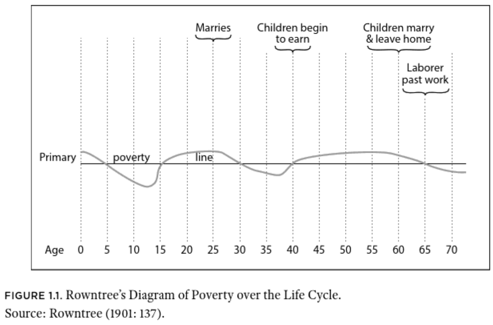
+ The share of population that **ever** experiences poverty much larger than share in poverty at any given moment
]


.pull-right40[

> "The extent of working-class insecurity in Victorian Britain was determined by the interaction of three factors: **the probability of large negative income shocks**; the ability of households to buffer income shocks with **savings or insurance benefits** from friendly societies or trade unions, or assistance from kin; and **the existence and generosity of government social policies** (or charitable institutions) that provided benefits to partially offset income loss." <br> —Boyer, p. 5
]

---

## Economic Insecurity in British Economic History

.pull-left40[
> The main causes of negative income shocks for working-class households were **unemployment**, **wage and hours cuts**, and prolonged **periods of illness** of the main breadwinner. To these should be added **old age**, when individuals were no longer able to work, or at least to work full-time. <br> —Boyer, p. 11.
]

.pull-right60[
```{r share_insecure, fig.height=4, fig.width=6, out.width="100%"}
library(ggalt)
library(ggrepel)

insec_dat <- tibble(date_source = c(1802, 1861, 1867,1911),
                    share_insec = c(42.3, 44, 43.5, 33))


insec_dat %>% 
  ggplot(aes(date_source, share_insec, label = paste0(share_insec, "%"))) + 
  geom_lollipop(point.colour = "#d30102", point.size = 7) +
  geom_text_repel(nudge_y = 10) +
  xlab("") +
  ylab("Percent Insecure") +
  ylim(c(0,75)) +
  theme_lecture +
  labs(title = "Share of Households/Workers that are Economically Insecure", 
       caption = "Boyer's calculations from diverse sources, p. 10") 

```

]


---

# The state of poor relief

+ Recall the 'reform' of the Poor Law in 1834
  - Big push to have relief provided 'indoors' meaning within institutions
  - The logic of institutionalization was to dissuade people from seeking relief
  
### Challenges of the 1840s and 1860s

> "the system used to finance the Poor Law was not able to handle sharp increases in demand for relief."

<br>

> "while it was possible to raise large amounts of charitable assistance quickly, that aid, when administered in an indiscriminate manner, often did more harm than good."

<br>

> "the “principles of 1834” clearly were not being enforced in northern industrial cities or working-class districts of London"

---

# The Campaign Against Outrelief


.pull-left[
+ Non-legislative initiative to push for more poor law provision **indoors**
+ Coupled with broader mid-Victorian 'ethic of respectability and self-help'

<br>

> “simple industry and thrift will go far towards making any person of ordinary working faculty comparatively independent in his means. Even a working man may be so, provided he will carefully husband his resources.” <br> —Smiles, in Boyer, p. 78.
]

.pull-right[

]

---

```{r wages_poverty, fig.height=4, fig.width=6, out.width="80%"}

wage_dat <- tibble(cat = c("1. H. Skill", "2. H. Skill", 
                           "3. L. Skill", "4. L. Skill",
                           "5. Unskill", "6. Unskill"),
                   av_week_wage = c(31.5, 26.1, 22.5, 19.8, 15.75, 12.6))

wage_dat %>% 
  ggplot(aes(cat, av_week_wage, label = paste0(av_week_wage, " s."))) + 
  geom_lollipop(point.colour = "#d30102", point.size = 7) +
  geom_text(nudge_y = 4) + 
  geom_hline(aes(yintercept = 18, color = "Poverty")) +
  geom_hline(aes(yintercept = 28, color = "Minimum Comfort")) + 
  theme_lecture + 
  scale_color_economist() +
  ylim(c(0, 40)) + 
  ylab("Average Weekly Wage (Shillings)") + 
  xlab("") +
  labs(title = "Average Weekly Wage and the Poverty Line",
       caption = "Data from Boyer p. 80. Poverty lines from text -- approximate average by areas.")

```


---

## Political economy of poor law provision

+ Key legislative changes
  - Union Chargeability Act (1865) & Metropolitan Poor Act (1867)
  - **Shifts tax burden from poor to middle-class parishes**

****************

.pull-left[
+ The prior system:
  - Parishes nested in Poor Law unions
      + Each parish relieves its *own* poor
      + Parishes pay into Union proportional to their average expenditure on paupers, e.g. places where poor people live pay more
  - Only 'settled' persons eligible:
      + Mostly means you need to be born there
      + If you apply for relief while unsettled can be removed from parish
      + Used to dissuade applications
          - Particularly effective in cities with large migrant labor pools
]

.pull-right[
> "Poor Law unions’ boards of guardians typically were dominated by members from the wealthier parishes, who responded to the increase in their taxes by looking for ways to reduce relief costs." —Boyer, p. 84

.center[**Union Chargeability Act makes tax contributions based on property values and allows 'settlement' within 1 year**]

]


---

## Changes in Poor Relief

.pull-left[
```{r boyer_plot, fig.height=4, fig.width=4, out.width="90%"}

boyer_text <- "1861 108 709 817 4.1 1,830 9.2 13.2 1862 119 743 862 4.3 1,931 9.6 13.8 1863 123 872 995 4.9 2,229 10.9 12.4 1864 120 844 964 4.7 2,159 10.5 12.4 1865 118 783 901 4.3 2,018 9.7 13.1 1866 118 746 864 4.1 1,935 9.2 13.7 1867 122 755 877 4.1 1,964 9.2 13.9 1868 134 801 935 4.3 2,094 9.7 14.3 1869 140 817 957 4.4 2,144 9.8 14.6 1870 141 838 979 4.4 2,193 9.9 14.4 1871 140 843 983 4.4 2,202 9.8 14.2 1872 133 791 924 4.1 2,070 9.1 14.4 1873 128 702 830 3.6 1,859 8.0 15.4 1874 127 646 773 3.3 1,732 7.4 16.4 1875 129 616 745 3.1 1,669 7.0 17.3 1876 125 567 692 2.9 1,550 6.5 18.1 1877 130 530 660 2.7 1,478 6.1 19.7 1878 139 527 666 2.7 1,492 6.0 20.9 1879 147 555 702 2.8 1,572 6.3 20.9 1880 159 582 741 2.9 1,660 6.5 21.5 1881 161 561 722 2.8 1,617 6.3 22.3 1882 161 557 718 2.8 1,608 6.2 22.4 1883 162 551 713 2.7 1,597 6.0 22.7 1884 160 534 694 2.6 1,555 5.8 23.1 1885 162 533 695 2.6 1,557 5.8 23.3 1886 164 542 706 2.6 1,581 5.8 23.2 1887 167 555 722 2.6 1,617 5.9 23.1 1888 170 554 724 2.6 1,622 5.8 23.5 1889 168 548 716 2.6 1,604 5.7 23.5 1890 166 530 696 2.5 1,559 5.5 23.9 1891 163 515 678 2.4 1,519 5.3 24.0 1892 163 499 662 2.2 1,483 5.0 24.6 1893 169 505 674 2.3 1,510 5.1 25.1 1894 180 519 699 2.4 1,566 5.3 25.8 1895 184 523 707 2.4 1,584 5.3 26.0 1896 187 535 722 2.4 1,617 5.3 25.9 1897 186 530 716 2.3 1,604 5.2 26.0 1898 188 525 713 2.3 1,597 5.1 26.4 1899 190 538 728 2.3 1,631 5.2 26.1 1900 188 500 688 2.2 1,541 4.8 27.3 1901 204 494 698 2.2 1,564 4.8 29.2"

boyer_dat <- as_tibble(matrix(str_split(boyer_text, " ")[[1]] , 
                              ncol = 8, byrow = TRUE, 
                              dimnames = list(NULL, 
                                              c("Date", "Indoor Relief (1,000s)", 
                                                "Outdoor Relief (1,000s)", 
                                                "Total on Relief (1,000s)", 
                                                "Percentage Receiving Relief", 
                                                "Total on Relief (1,000s) 12-month", 
                                                "Percentage Receiving Relief 12-month", 
                                                "Percentage Relieved Indoors ")))
                       ) %>% 
  mutate(`Total on Relief (1,000s) 12-month` = as.numeric(gsub(",", "", 
                                          `Total on Relief (1,000s) 12-month`))) %>% 
  mutate_all(as.numeric)


p1 <- boyer_dat %>% 
  ggplot(aes(Date, `Percentage Relieved Indoors `)) + 
  geom_point() + geom_line() + 
  theme_lecture + 
  xlab("") + 
  ggtitle("Percentage Relieved Indoors", subtitle = "1861-1901")


p2 <- boyer_dat %>% 
  ggplot(aes(Date, `Total on Relief (1,000s)`)) + 
  geom_point() + geom_line() + 
  theme_lecture + 
  xlab("") +
  ggtitle("Number of Persons on Relief", subtitle = "1861-1901")

p1
```
]

.pull-right[

```{r boyer_plot2, fig.height=4, fig.width=4, out.width="90%"}
p2
```

]

---

# Did CAO save money?

+ Not really
  - It is more expensive to administer relief 'indoors'
  - This is not wholly offset by putting people off
  - Total real expenditures on relief **increase** between 1871 and 1881 by 7.3%

<br>
  
**************

<br>

> "In sum, while the crusade led to a sharp reduction in numbers on relief, as the COS and LGB predicted, their assertion that the workhouse test would reduce local poor rates was not correct, at least not in the short run." <br> —Boyer, p. 89.

---

## The CAO and Self-Help

.pull-left[
```{r bank_depos, fig.height=5, fig.width=5, out.width="90%"}

bank_depos <- tibble(date = seq(1850, 1910, 5),
                     wc_depos = c(7.23, 8.58, 10.33, 13.56, 15.93, 
                                  20.28, 23.31, 28.23, 33.36, 42.96,
                                  56.1, 61.44, 66.36))
bank_depos %>% 
  ggplot(aes(date, wc_depos)) + 
  geom_point() + 
  geom_line() + 
  theme_lecture + 
  ylab("Bank Deposits (£ million)") +
  ggtitle("Estimated Working-Class Bank Deposits")

```
]

.pull-right[
```{r fstubens, fig.height=5, fig.width=5, out.width="90%"}

fstu <- tibble(date = c("1871", "1891", "1911"),
               perc_ben = c(39, 47, 48))

fstu %>% 
  ggplot(aes(date, perc_ben, label = paste0(perc_ben, "%"))) + 
  geom_lollipop(point.colour = "#d30102", point.size = 7) +
  geom_text(nudge_y = 4) + 
  theme_lecture + 
  ylab("% Males with Sickness Benefits") + 
  xlab("") +
  ylim(c(0, 70)) + 
  labs(title = "Percentage of Males with Sickness Benefits",
       subtitle = "Friendly Societies and Trade Unions")

```

]
---

## The condition of england question revisited

> "The decade and a half from the turn of the twentieth century to the First World War saw an outpouring of work on poverty, economic insecurity, and living standards of the poor. ...With few exceptions, they all reached similar conclusions. **Despite growth in the average earnings of manual workers since 1850, economic insecurity and poverty remained widespread at the beginning of the new century.** Many within the working class apparently had benefitted little from the rising tide of late Victorian economic growth."

.pull-left.center[


Charles Booth
]

.pull-right.center[


Seebohm Rowntree
]

---

## Poverty before WWI

.center[
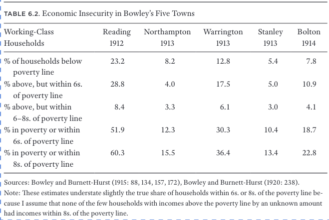
]

---

.pull-left[

## Poverty Lines and Wages at the end of the 19th C.

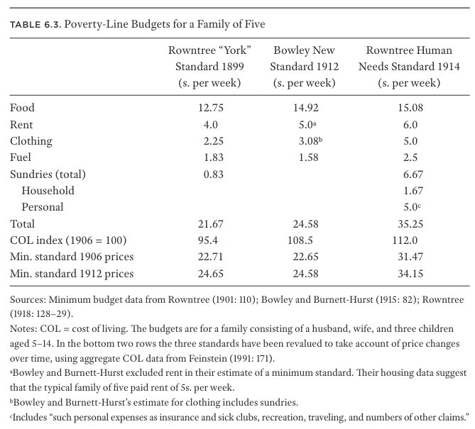
]

.pull-right[


> "the principal cause of poverty was deemed to be low wages, or low wages combined with large families. ...The finding that low wage rates was a major cause of poverty was surprising to many contemporaries" <br> —Boyer, p. 174-5

]

---

### The Royal Commission on the Poor Laws and the Relief of Distress


.pull-left[
.center[

]

> “never can so important a Royal Commission have produced so little in the way of immediate action.” <br> —Derek Fraser
]

.pull-right[

 

Beatrice Webb & Helen Bosanquet
]

---

### Liberal govt and reform

.pull-left60[
+ New Liberal government pushes through multiple reform acts

1. *1906 Education (Provision of Meals) Act* school meals
2. *Old Age Pension Act (1908)* in operation 1909
  - 5*s.* to people over 70 with income below £21
  - Pensioners **much** larger than expected $\rightarrow$ implies a **lot** of old people poor but avoiding the poor house
3. *Trade Boards Act (1909)* sets minimum wages in specific industries associated with sweat-shops
4. *Labour Exchanges Bill (1909)* which tries to match unemployed to employers
5. *Part II National Insurance Bill (1911)* unemployment insurance
    - Mandatory within a small set of industries
    - Covers about 20% of male labour force
    - Premiums paid by employees, employers and state
6. *Part I National Insurance Bill (1911)* health insurance
    - Faces more opposition
    - Compulsory and means-tested (less than £160 p.a.)
]

.pull-right40[
> "The Liberal Welfare Reforms, considered together, represent a major shift in British social welfare policy. They provided a minimum level of assistance outside of the Poor Law to the sick, the unemployed, and the aged, and in doing so reduced the economic insecurity associated with industrial capitalism." <br> —Boyer, p. 204
]

---

# The political economy of reform

.pull-left[
+ The role of voice?
    - Extension of the franchise
+ Political competition?
    - The rise of labor
]

.pull-right[
> “unless we can prove . . . that there is no necessity for a separate party to press forward the legitimate claims of Labour, you will find that . . . the Liberal Party will be practically wiped out and that, in its place, you will get a more extreme and revolutionary party.” <br> —Lloyd George

]

> "In October 1906, Lloyd George, then President of the Board of Trade, stated in a speech at Cardiff that if the Liberal Parliament would do something “to remove the national degradation of slums and widespread poverty and destitution” and provide “an honourable sustenance for deserving old age, . . . then the Independent Labour party will call in vain upon the working men of Britain to desert Liberalism that is so gallantly fighting to rid the land of the wrongs that have oppressed those who labour in it.”" —Boyer, p. 207

---

## Reform in international context

+ Britain is, if anything, a laggard in this kind of social legislation
+ Britain is also under-performing its GDP/pc rankings
  - Welfare is 'high' relative to europe in GDP/pc terms but middling in terms of biological welfare/schooling 

.pull-left[
#### Copying?

+ Daniel Rogers has argued for international diffusion of policy ideas within the atlantic world:
  - Liberals are "eager policy borrowers, scavengers across the boundaries of national cultures"
  - But conversely the policy details of liberal reforms don't look *that much* like e.g. German model
  
#### Conditionality and Trade?

+ Huberman & Meissner
]

.pull-right[

.center[]

+ Suggest that inter-linking trade agreements within Europe drove **stronger** social protections
+ Argue this helps to explain 'new world'/'old world' split 
  - Relevant to Britain?
]

---

class: inverse, center, middle

# Conclusion

> What explains the rise of social assistance legislation at the start of the 20th century?

<br>

> Boyer tells a tidy national history of social protection evolving within Britain, but why is the periodization of social protection similar globally? Do we believe the Huberman & Meissner story?

<br>

> Should the persistence of intense poverty, particularly poverty among the employed, cause us to revise the way we think about claims that the 19th c. economy was 'efficient' or operating 'as best it could'?

<!--chapter:end:17_unemployment.Rmd-->

---
title: "The Economy and WWI" 
author: | 
    | Dr. Gabriel Geisler Mesevage 
    | gabriel.mesevage@kcl.ac.uk
    | Office Hours: Mon. 10:30-11:30am & Fri. 2-3pm
date: "Last update: `r format(Sys.time(), '%d %B, %Y')`"
output: 
  xaringan::moon_reader:
    nature:
      beforeInit: "helper_functions/macros.js"
      ratio: '16:9'
    lib_dir: libs
    css: ["xaringan-themer.css", "helper_functions/extra.css"]
---

```{r setup, include=FALSE}
knitr::opts_chunk$set(echo = FALSE, warning = FALSE,
                      message = FALSE, fig.align='center', fig.retina=3,
                      out.width="75%")


```

```{r xaringan-themer, include = FALSE}
library(xaringanthemer)
style_solarized_light()
source("helper_functions/theme_lecture.R")
xaringanExtra::use_webcam()
xaringanExtra::use_tile_view()

library(tidyverse)
library(ggplot2)
```

# Today's Plan

### 1. Economics and the Origins and Conduct of the War

### 2. The British Economy during the War

---

# Did WWI have an economic origin?

### Some theorists suggesting that it might...

#### Mercantilism

+ Ideas of economic nationalism
+ Mackinder/Mahan "affected by current notions of Social Darwinism that regarded nations and especially races as engaged in a constant struggle"

#### Imperialism

+ Smith/Marx/Hobson/Lenin/Luxembourg theories that tie imperialism to global conflict

> "The theme of the competition of capitalists for raw materials overseas as leading to war ...The competition of empires led to war." <br> —Offer, p. 10.

---


> "The aim of this essay is to question this common sense view of World War I as disrupting the world economy and putting an end to an era of globalization. ...We offer a narrative sketch of how one might write **a history in which the war figured not as an exogenous shock**, but as a moment of convulsive and violent realignment endogenous to that history. ...what is at stake are **the destabilizing consequences of convergence**, the basic prediction of any neoclassical vision of globalization. ...Being converged upon by Imperial Russia was every bit as unsettling to the powers of Western Europe before 1914, as the rise of China is to the United States today."<br>
-Tooze & Fertik

### A cause of WWI?

> "...capital flows and technology transfer helped Russia converge on the established powers. This disrupted pre-existing geopolitical equilibria and led Germany in particular to devise military strategies to counter the threat. ...the spread of the Industrial Revolution to Germany had earlier undermined the geopolitical equilibrium in Europe.." (O'Rourke 2019, 373).

---

# Did WWI have an economic origin?

### Some theorists suggesting it *made no economic sense*

> "The more the ultimate political and social consequences of the modern war are calmly contemplated, the more clearly will it be evident that if war is possible it is only possible ... at the price of suicide." <br> —I.S. Bloch, 1899

+ War would be so catastrophic, and so damaging to international economic system there was no 'economic' rationale to explain it.
+ Normal Angell's *The Great Illusion* (1910):
  - international web of credit/trade would be destroyed by war

**************
  
> "What is an *economic* interpretation of the First World War? ...two possible approaches. **One** is to regard the war as a problem of management, to consider the endowment[s] ...and how it affected the preperations for, the conduct and the outcome of the war. **Another** is to seek for patterns of rationality in the planning conudct and conclusion of the war. But rationality is a slippery concept." <br> —Offer, p. 15

---

## Economics and Planning for War

### Offer's thesis

> "...Britain's late-Victorian policy of free trade led to the Edwardian naval arms race and became a source of insecurity and instability. British naval hegemony, the condition of peace, was no longer tenable in a world of so many workshops. ...The real assets of British security were the bonds and resources of the English-speaking world overseas: economic, social, political, sentimental, forming a complex but effective system of practical kinship. This formidable system failed to deter, because it was not sufficiently visible to Germany, whose view of the world was circumscribed and limited to Europe."<br> —Offer, p. 6

+ Britain depends on food imports
+ So does Germany to a lesser degree
+ Causes strategic planning in both places to focus on shipping/blockades

> "...for Britain to face the Atlantic and not the Channel: to rely on overseas assets, to align with the Dominions and the United States, and to avoid a military commitment to Europe"

+ Offer suggests pushes towards naval build-up.

---

# The British Economy during WWI

> "...World War I was a watershed for the international economy, and the central role of Britain in the pre-1914 world economy was lost" <br> —Broadberry & Howlett

+ Major changes in 
  1. Government involvement in the economy
  2. Patterns of international trade
  3. Patterns of international finance
  4. Functioning of international monetary system
  5. Strength of labour representation
  6. Role of women
  7. Political participation
  8. Etc.
+ Some of these changes we will survey in coming weeks, some today

---

## Short-term impacts: the London Stock Exchange

#### LSE is shut-down on 31 July 1914

> "...Austria’s belligerent ultimatum to Serbia on Thursday 23 July — that transformed risk perceptions of the possibility of a major European war. It ‘came like a bombshell’, stated Bankers’ Magazine under the headline ‘The Great Crisis’. As fear supplanted greed there was a universal dash for cash, preferably gold. All sellers and no buyers meant that markets quickly ceased to function." <br> —Roberts, p. 5

.pull-left[
#### Why did the LSE close?

+ International webs of credit flow to LSE
+ European banks refuse to renew repo agreements
+ Continental exchanges suspend payments to LSE
  - Shut-down to avoid massive payments crash and bankruptcies!
+ **Example of fragility of interrupted interdependence**
]

.pull-right[

]

---

## The war effort and the economy

.left-column[
### The Scale of mobilization

+ Comparable to WWII
+ Unprecedented
]

.right-column[

]

---

## The war effort and the economy

```{r exp_gdp, fig.height=3.5, fig.width=6, out.width="80%", fig.retina=4}

gdp_shares <- tibble(date = 1913:1919,
                     Consumption = c(77.2, 76.9, 71.4, 65.6, 60.2, 60.7, 76.1),
                     Government = c(8.1, 11.5, 31.2, 35.6, 38.7, 37.7, 18.1),
                     Investment = c(7.6,7.7,-2.3,-4.3,0.9,4.4,5.5))

gdp_shares$`Net exports` <- 100 - rowSums(gdp_shares) + gdp_shares$date

gdp_shares %>% 
  pivot_longer(cols = -date) %>% 
  ggplot(aes(date, value, fill = name)) + 
  geom_bar(position = "dodge", stat = "identity") + 
  theme_lecture + 
  scale_fill_hc() + 
  ggtitle("British Expenditure Shares in GDP",
          subtitle = "1913 to 1919") + 
  ylab("Share (%)") + 
  xlab("")

```

---

## The war effort and the economy

```{r fin, fig.height=3.5, fig.width=6, out.width="80%", fig.retina=4}

fin_df <- tibble(date = 1914:1918,
                 `Budget deficit` = c(334, 1222, 1625, 1989, 1690),
                 `Long debt` = c(391, 458, 1477, 748, 1019),
                 `Short debt` = c(64, 510, 95, 484, 247),
                 `Money base` = c(73, 27, 56, 42, 123))

fin_df %>% 
  pivot_longer(cols = -date) %>% 
  ggplot(aes(date, value, fill = name)) + 
  geom_bar(position = "dodge", stat = "identity") + 
  theme_lecture + 
  scale_fill_hc() + 
  ggtitle("British Defecit Financing",
          subtitle = "millions of pounds") + 
  ylab("Pounds m.") + 
  xlab("")

```

---

## The war effort and the economy

```{r debt_gdp, fig.height=3.5, fig.width=6, out.width="80%", fig.retina=4}

debt_inf <- tibble(date = 1913:1919,
                   `Debt/GDP` = c(26.2, 40.6, 64.4, 99.9, 116.3, 127.5, NA),
                   `Retail Price Index` = c(100, 101, 121, 143, 173,199,211))

debt_inf %>% 
  pivot_longer(cols = -date) %>% 
  ggplot(aes(date, value)) + 
  geom_point(size = 3, shape = 1) + 
  geom_line() +
  facet_wrap(~ name, scales = "free_y") + 
  theme_lecture + 
  ggtitle("Debt and Inflation During the War") + 
  ylab("%") + 
  xlab("")

```

---

.pull-left[

## Taxes
  
> "The excess profits duty was **probably the most significant wartime fiscal innovation.** It was **the first tax to be levied on companies as opposed to their shareholders**. ...it taxed profits in excess of a stipulated peacetime standard. The rate was initially 50 per cent, but was increased to 60 per cent in April 1916 and then to 80 per cent in May 1917. There is no doubt that it was subject to much evasion and fraud (Stamp 1932: 216), but even so it was spectacularly successful as a revenue generator. By 1918/19 it was generating £285 million for the exchequer, almost a third of total revenue, making it the single most important tax wielded by the state."
]

.pull-right[
+ Shift in levels and sources of tax revenue
  - From indirect to direct
  - Growth of tax base as threshold lowered + inflation


]

---

## Preview

1. Next week:
  + Fiscal and monetary consequences of the war
    - Reperations
    - Webs of international war loans
    - Currency instability
    - Crisis
    
2. Week after:
  + Problems for the British economy after the war
    - Currency management
    - Wage levels
    - Export markets
    - Industrial structure
    
    

<!--chapter:end:18_wwi.Rmd-->

---
title: "Britain in the Interwar Period" 
author: | 
    | Dr. Gabriel Geisler Mesevage 
    | gabriel.mesevage@kcl.ac.uk
    | Office Hours: Mon. 10:30-11:30am & Fri. 2-3pm
date: "Last update: `r format(Sys.time(), '%d %B, %Y')`"
output: 
  xaringan::moon_reader:
    nature:
      beforeInit: "helper_functions/macros.js"
      ratio: '16:9'
    lib_dir: libs
    css: ["xaringan-themer.css", "helper_functions/extra.css"]
---

```{r setup, include=FALSE}
knitr::opts_chunk$set(echo = FALSE, warning = FALSE,
                      message = FALSE, fig.align='center', fig.retina=3,
                      out.width="75%")


```

```{r xaringan-themer, include = FALSE}
library(xaringanthemer)
style_solarized_light()
source("helper_functions/theme_lecture.R")
xaringanExtra::use_webcam()
xaringanExtra::use_tile_view()

library(tidyverse)
library(ggplot2)
```

## Today's Plan: The British economy in the interwar

.pull-left[

### Outline

1. How did the economy fair?
  - In terms of growth
  - In terms of our expectations
  - In comparison to elsewhere
2. The problems of unemployment
  - How bad was it?
  - Why was unemployment high?
3. The problems of monetary policy
  - Was money overvalued?
  - Why return to Gold?
  - Why was Britain so quick to abandon Gold?
]

.pull-right[

### Themes

+ Did Britain do worse than elsewhere in this period?
+ Were problems, like unemployment, actual policy failures?
  - Or conversely, were they merely reflection of longer-term slide in international competitiveness of GB?
]

---

class: center, middle

.pull-left[
```{r, comparative_perspective, out.width='100%', fig.height=4.5, fig.width=6, fig.retina=4}
library(readxl)
library(tidyverse)
library(ggrepel)

maddison <- read_xlsx(path = "data/mpd2018.xlsx", 
                      sheet = "Full data")

plotdf <- maddison %>% filter(year <= 1938, 
                    year > 1910, 
                    countrycode %in% c("GBR", "FRA", 
                                       "DEU", "USA",
                                       "ITA", "AUT"),
                    !is.na(rgdpnapc)) %>% 
  group_by(countrycode) %>% 
  mutate(delta_gdp = cgdppc/cgdppc[year==1911] * 100) %>% 
  ungroup()

plotdf %>% 
  ggplot(aes(year, rgdpnapc, 
             group = countrycode,
             color=countrycode)) +
  ggtitle("British GDP in the Interwar in Comparative Perspective", 
          subtitle = "Source: Maddison project") +
  geom_line() +
  geom_point() +
  geom_label_repel(data = plotdf %>%
              group_by(countrycode) %>% 
              filter(year == last(year)) %>% 
              ungroup(), 
            aes(label = country, x = year, y=rgdpnapc, color=countrycode),
            nudge_x = 15) +
  guides(color = FALSE) +
  scale_color_brewer(type = "qual", palette = 2) +
  theme_lecture +
  xlab("Year") + ylab("Real GDP per capita")

```
]

.pull-right[

```{r, comparative_perspective_percent, out.width='100%', fig.height=4.5, fig.width=6, fig.retina=4}
plotdf %>% 
  ggplot(aes(year, delta_gdp, 
             group = countrycode,
             color=countrycode)) +
  ggtitle("British GDP Growth in the Interwar in Comparative Perspective", 
          subtitle = "Source: Maddison project") +
  geom_line() +
  geom_point() +
  geom_label_repel(data = plotdf %>%
              group_by(countrycode) %>% 
              filter(year == last(year)) %>% 
              ungroup(), 
            aes(label = country, x = year, y=delta_gdp, color=countrycode),
            nudge_x = 15) +
  guides(color = FALSE) +
  scale_color_brewer(type = "qual", palette = 2) +
  theme_lecture +
  xlab("Year") + ylab("Real GDP per capita index (1911=100)")
```

]
---

## Warfare, Capital Destruction & Growth

.pull-left[

+ Should see growth after war b/c
  - Can build more productive things
  - Can replace destroyed capital stock
+ Therefore...
  - The harder you fall between 1913-1920,
  - The faster you should grow between 1920-1927
  
### Britain seems to underperform

+ This is especially true considering that Britain's capital intensity increases more rapidly than in other European countries

]

.pull-right[


]


---

## Key problems for Britain at end of war

+ Loss of external markets:
  - During war, exports disrupted but demand remains in e.g. LA and Southeast Asia
  - Countries like Japan/USA fill export whole,
    + Hard to displace post-war
+ During war, Britain requisitioned foreign assets, sold ~10%
  - We recall income from investments abroad was *big* for GB
  - Implies ~10% fall in income frome abroad
  - This demands an *improvement* in exports to earn foreign exchange abroad, at a time when hard
  
---

.pull-left[
## The 1920 Recession

+ Arguably over-determined
+ Demand-side view
  - Firms use wartime profits to invest, buy rivals
  - End of price-controls, inflation
  - But... from 1918-1920 Gov't cuts spending by 75%
  - Raises interest rates
  - **demand falls** while firms have excess capacity
+ Supply-side view
  - Unions strong post-war
  - Negotiates hourly reductions keeping wages constant (13% fall in working week)
  - Labor productivity constant
  - **supply-shock**
]

.pull-right[
```{r uk_cpi, fig.align='center', fig.retina=4, out.width="100%",fig.height=3.25, fig.width=4}
library(tidyverse)
library(ggrepel)

cpi <- read_csv("data/UKCPI_1910-1938.csv", skip = 1)


cpi %>% filter(Year > 1910, Year <= 1938) %>%
  ggplot(aes(Year, `Retail Price Index (2010 = 100)`)) +
  geom_line() +
  geom_point() +
  geom_vline(xintercept = 1920, linetype="dashed") +
  theme_lecture +
  labs(title = "UK Retail Price Index",
       subtitle = "1910-1938") +
  ylab("2010=100")

```

+ Both theories could be true.
+ Continued slow growth in 1920's points a little towards supply shock
]
---

## Unemployment


+ The spike in unemployment post-WWI is v. large
+ The level after 1929 is enormous

---

## Unemployment in Comparative Perspective

.right-column[
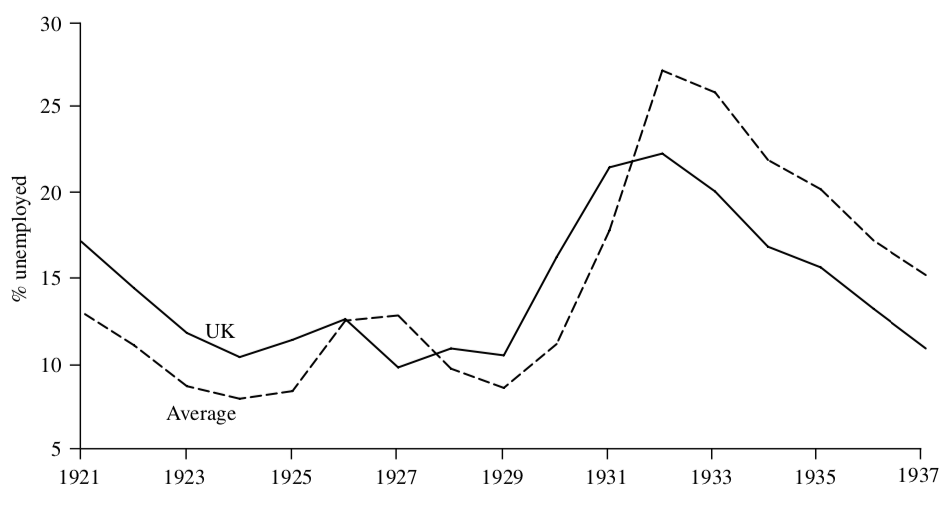]

.left-column[
+ Britain's unemployment problem tends to be worse than other industrialized countries in the 1920s
    - Situation changes after 1931 when Britain abandons the Gold Standard
]
---

## Theories of the Unemployment Problem, I

### A. Government interventions in labor market (unimployment insurance)
  - Some scholars think this explains a lot of it
  - Most think it doesn't 

### B. Poor specialization in industries
  - Britain was specialised in industries (coal, iron, steel) that saw slow global growth
  - Related to longer tradition of worry about Britain's failure to excel in more dynamic sectors
    + Chemicals, electricity, new textiles (rayon), etc.
      
---

## Theories of the Unemployment Problem, II

### C. Unions 
  - In period of falling prices blocked nominal wage cuts
  - Obtained hour reductions at equivalent wages after war -- supply-side shock contributes to recession in 1920

### D. Monetary mis-alignment
  - Aim for Gold Standard at pre-War parity promotes high interest rates and tight fiscal policy
    - On gold standard, pound is over-valued relative to prices
    - Demands major nominal labor market adjustment that labor institutions not able to implement
    
> Theories C & D share view that nominal wages had downward rigidities

+ Stated plainly: 
  - people don't like the number written on each paycheck to get smaller even if it's value stays the same

---

## The Gold Standard and Unemployment

+ Britain returns to the Gold Standard in 1925 at **pre-War parity**
  - **Pre-War parity** means that sterling is redeamable for the same amount of gold as before the war
  - Since the dollar remained on gold throughout the war, this is equivalent to fixing Sterling to the pre-War $/£ exchange rate
+ **Gold Standard** here means really two things:
  1. You can convert your money into Gold at the specified price
  2. You do not face restrictions on importing/exporting that gold
  
### Difficulties of returning to Gold

+ What might be the problem of returning to Gold Standard?
  - Your goods as priced in $ get more expensive
  - To make your goods cheaper you need your labor costs to $\downarrow$
    + If they don't labor is too expensive and you get persistent unemployment

---

```{r us_uk_xr, fig.align='center', fig.retina=4, out.width="80%",fig.height=4.5, fig.width=6}
library(tidyverse)
library(ggrepel)

xr <- read_csv("data/EXCHANGEPOUND_1900-1945.csv", skip = 2)


xr %>% filter(Year > 1910, Year < 1938) %>% 
  ggplot(aes(Year, Rate)) +
  geom_rect(aes(xmin=1914, xmax=1918, ymin=3.5, ymax=5.5), 
            fill='coral', alpha=.25) +
  annotate('text', x=1913, y=5.25, label="WWI", color="coral")+ 
  geom_rect(aes(xmin=1925, xmax=1931, ymin=3.5, ymax=5.5), 
            fill='royalblue', alpha=.05) +
  annotate('text', x=1923, y=5.25, label="Return to\nGold at\nParity", 
           color = "royalblue") +
  geom_vline(xintercept = 1933) +
  annotate('text', x=1935, y=3.75, label="US leaves\nGold") +
  geom_line() +
  geom_point() +
  theme_lecture +
  labs(title = "The Dollar-Pound Exchange Rate", 
       subtitle = "1910-1938") +
  ylab("$ per £")

```

---

## Was gold the problem? 

### Maybe...

+ Hard to know what the 'correct' exchange rate should be
+ Keynes famously over-estimated by how much £ was overvalued
  - Keynes says ~15%
  - Subsequent estimates say 5-10%
  - Estimates very imprecise
+ Made some exports uncompetitive
  - But some argue also accelerated adjustment towards newer industries within Britain (theory B)
  - Also, if you are an industry who buys their *inputs* from abroad exchange rate makes inputs cheap

---

## Interwar Depression, Economic Thought and the Rise of the Corporate Economy

> "...the situation faced by British industrial firms after 1919 was profoundly different from that which had been envisaged in the closing stages of the war. Intead of the anticipated postwar prosperity there was, after a brief inflationary boom, a fierce slump, and in 1921 the unemployment rate rose above 10 per cent, never to fall below that figure again before the Second World War. **Economic depression was, then, a central fact of the interwar experience...** The effect of the depression in increasing political consciousness and stimulating the growth of the Labour Party, and its impact on the collapse of the classical paradigms of economic theory in the Keynesian revolution, have often been analysed by historians. **Less well covered, but no less important, is its impact at the level of popular business philosophy**, as more businessmen began to question the desirability of the configuration of firms and markets which they had inherited from the prewar era. **The rationalization movement** — which gained the attention of bankers, politicians and trade unionists, as well as of prominent industrialists between the wars — was an important aspect of the build up of **dissatisfaction with the market mechanism** and of the movement towards greater reliance on large firms for economic organization." <br> —Hannah, *Rise of the Corporate Economy*, p. 31-32.

---
  
### The push for 'orderly competition'

.pull-left[
+ Gov't eager to support business
  - Push significant mergers and amalgamations
  - Allow significant coordination in name of 'managerial capitalism' with economies of scale
  - Effect is often cartel/monopoly
  - No anti-trust enforcement

> "...as much as half of manufactured output to be produced by cartel members in the mid-1930s (Crafts 1999), leading one contemporary pessimistically to observe that ‘as a feature of industrial and commercial organisation free competition has nearly disappeared from the British scene’ (Lucas 1937: 64)." <br> -Eichengreen
]

.pull-right[
> "Competition was disliked by both socialists and rationalizers, and they both stressed not only scientific and rational, but also humane, values: 'the glamour of the perfect, unselfish mechanism hangs about the system of rationalization'. The business classes were, of course, very much aware of **the need to provide a political and economic alternative to socialism**. It was their position that was endangered by depression and it behoved them to revalidate it by showing that those parts of the market system which were causing trouble could be excised by the reorganization of private capitalism." <br> —Hannah, p. 36
]
---


### The Corporate Economy and Industrial Concentration

.pull-left[
```{r industrial_concentration, fig.align='center', fig.retina=4, out.width="100%",fig.height=3.25, fig.width=4}
library(hrbrthemes)

conc_df <- tibble(date = c(1909, 1919, 1924, 1930, 1935, 1939),
                  share_100 = c(15, 17, 21, 26, 23, 23)/100)

conc_df %>% 
  ggplot(aes(date, share_100)) + 
  geom_point(size=5) + 
  geom_line() + 
  theme_lecture + 
  ggtitle("Share of largest 100 firms", subtitle = "Manufacturing net output")  +
  scale_y_percent() + 
  ylim(c(.13, .27)) +
  ylab("Output share (%)") + 
  xlab("") 


```
#### Source: Hannah, p. 216
]

.pull-right[

```{r industrial_concentration2, fig.align='center', fig.retina=4, out.width="100%",fig.height=3.25, fig.width=4}

library(ggalt)

ind_conc <- tibble(Industry = rep(c("Food", "Vehicles", 
                                    "Textiles", "Metal manufacture"), each=2),
                   Date = rep(c(1919, 1930), 4),
                   Share = c(39, 74, 34.1, 66.5, 47.4, 64, 28.7, 45.9 ))

ind_conc %>% 
  ggplot(aes(as.character(Date), Share, label = paste0(Share, "%"))) + 
  geom_lollipop(point.size = 5) + 
  theme_lecture + 
  geom_text(nudge_y = 20) +
  facet_wrap(~ Industry) +
  ylim(c(0, 100)) + 
  xlab("Date") + ylab("Share (%)") + 
  ggtitle("Share of largest 5 firms", subtitle = "Select industries")
```
#### Source: Hannah, p. 225.
]


---


## The Great Depression

.pull-left[

### 1929

+ Crash in US stock market
  - Spills outward
  - Hits in particular places UK exports to $\rightarrow$ big falls in UK industrial production
+ **demand shock**
]

.pull-right[
### 1931

+ Failures of banks (*Credit Anstalt*) in Austria and Germany
+ Financial crisis imported to London via loan portfolios
  - Crash in 1931 damages financial system (see James, *End of Globalization*)
  - Speculative pressure on pound
]

---

.pull-left[
## Leaving Gold

#### Britain abandons the Gold Standard September 19, 1931

+ Why so soon?
  - Labor gov't unwilling to exacerbate unemployment with rate hikes and fiscal contraction
  
#### Effects

+ Pretty good!
  - Can slash interest rates, helps industrial growth
  - British banks have liabilities in sterling

]

.pull-right[


#### Britain after 1931

+ Britain recovers better than elsewhere
  - Helps to be off gold
+ Recovery driven predominantly by domestic demand
  - Home-building biggest growth sector
]


---

## Taking the long view

>  "Economic history is distinguished from economics by a predisposition to focus upon the long run. When looking at the inter-war... the timespan (1921-37) is short and punctuated by a uniquely severe depression (1929-32). Thus in arguments about the efficacy of government policies, inspired by Keynesian and anti-Keynesian conceptions of the period, historians are inclined to bring Britain's structural problems to the fore. The origins of these problems can be traced back to the 1870s and they became serious during the last great international boom of the Liberal era, 1899-1914, when the productivity of industry failed to grow at all. Britain entered the First World with an economy specialized upon a narrow range of staple industries, under intensifying threat from foreign competition."<br> —O'Brien, 128

+ Is the interwar subject to special problems apart from the recession?
+ Or is this just the continuation of a longer-term trajectory of decline?

---

class: inverse, center, middle

# Questions for Discussion

> Why did Britain return to the Gold Standard at the pre-War parity in 1925?

<br>

--

> Was the commitment to the Gold Standard to blame for the persistent unemployment problem in interwar Britain?

<!--chapter:end:20_interwar.Rmd-->

